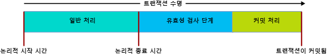

# <a name="transactions-with-memory-optimized-tables"></a>메모리 액세스에 최적화된 테이블의 트랜잭션
[!INCLUDE[appliesto-ss-asdb-xxxx-xxx-md](../../includes/appliesto-ss-asdb-xxxx-xxx-md.md)]

  
이 문서에서는 메모리 최적화 테이블 및 고유하게 컴파일된 저장 프로시저에 관련된 트랜잭션의 모든 측면을 설명합니다.  
  
SQL Server의 트랜잭션 격리 수준은 메모리 최적화 테이블과 디스크 기반 테이블에 서로 다르게 적용되며 기본 메커니즘이 서로 다릅니다. 이러한 차이점을 이해하면 프로그래머가 처리량이 높은 시스템을 디자인하는 데 도움이 됩니다. 트랜잭션 무결성의 목표는 모든 경우에서 공유됩니다.  

메모리 최적화 테이블의 트랜잭션에 대한 오류 조건을 보려면 [충돌 검색 및 다시 시도 논리](#confdetretry34ni)섹션을 참조하세요.
  
일반적인 정보는 [SET TRANSACTION ISOLATION LEVEL(Transact-SQL)](../../t-sql/statements/set-transaction-isolation-level-transact-sql.md)을 참조하세요.  
  
  
<a name="pessvoptim22ni"/>  
  
## <a name="pessimistic-versus-optimistic"></a>비관적 및 낙관적  
  
기능 차이는 트랜잭션 무결성에 대한 비관적 접근 방식과 낙관적 접근 방식으로 인해 발생합니다. 메모리 액세스에 최적화된 테이블은 낙관적 접근 방식을 사용합니다.  
  
- 비관적 접근 방식에서는 잠금을 사용하여 잠재적 충돌을 사전에 차단합니다. 문을 실행할 때 잠금이 설정되고 트랜잭션이 커밋될 때 해제됩니다.  
  
- 커밋 시 유효성 검사가 발생하고 수행되면 낙관적 접근 방식에서 충돌을 감지합니다.  
  - 오류 1205 교착 상태는 메모리 최적화 테이블에 발생할 수 없습니다.  
  
낙관적 접근 방식은 오버헤드가 적고 일반적으로 보다 효율적입니다. 대부분의 응용 프로그램에서 트랜잭션 충돌이 거의 발생하지 않기 때문입니다. 낙관적 접근 방식과 비관적 접근 방식 간의 주요 기능 차이점은 충돌이 발생할 경우 비관적 접근 방식에서는 대기하고 낙관적 접근 방식에서는 트랜잭션 중 하나가 실패하므로 클라이언트에서 다시 시도해야 한다는 점입니다. 기능 차이는 REPEATABLE READ 격리 수준이 적용되는 경우에 더 크고 SERIALIZABLE 수준에서 가장 큽니다.  
  
<a name="txninitmodes24ni"/>  
  
## <a name="transaction-initiation-modes"></a>트랜잭션 시작 모드  
  
SQL Server에는 다음과 같은 트랜잭션 시작 모드가 있습니다.  
  
- **자동 커밋** - 단순 쿼리 또는 DML 문의 시작 시 암시적으로 트랜잭션이 열리고 문 종료 시 암시적으로 트랜잭션이 커밋됩니다. **자동 커밋**이 기본값입니다.  
  - 자동 커밋 모드에서는 일반적으로 FROM 절에서 메모리 최적화 테이블의 트랜잭션 격리 수준에 대한 테이블 힌트를 코딩할 필요가 없습니다.  
  
- **명시적** - TRANSACT-SQL에는 최종 COMMIT TRANSACTION과 함께 BEGIN TRANSACTION 코드가 포함됩니다. 둘 이상의 문을 동일한 트랜잭션에 포함할 수 있습니다.  
  - 명시적 모드에서는 데이터베이스 옵션 MEMORY_OPTIMIZED_ELEVATE_TO_SNAPSHOT을 사용하거나 FROM 절에서 메모리 최적화 테이블의 트랜잭션 격리 수준에 대한 테이블 힌트를 코딩해야 합니다.  
  
- **암시적** - SET IMPLICIT_TRANSACTION ON이 적용되는 경우입니다. 이 옵션은 모두 0 = @@trancount인 경우 각 UPDATE 문 전에 명시적 BEGIN TRANSACTION에 해당하는 작업을 암시적으로 수행하기 때문에 IMPLICIT_BEGIN_TRANSACTION이 더 나은 이름일 수 있습니다. 따라서 최종적으로 명시적 COMMIT TRANSACTION을 실행하는 것은 사용자의 T-SQL 코드에 달려 있습니다.   
  
- **Atomic 블록** - Atomic 블록의 모든 문은 항상 단일 트랜잭션의 일부로 실행됩니다. Atomic 블록의 작업은 각각 전체로써 성공 시 커밋되거나 오류가 발생할 때 모두 롤백됩니다. 고유하게 컴파일된 저장 프로시저에는 각각 Atomic 블록이 필요합니다.  
  
<a name="codeexamexpmode25ni"/>  
  
### <a name="code-example-with-explicit-mode"></a>명시적 모드의 코드 예제  
  
다음 해석된 TRANSACT-SQL 스크립트에서는 아래 항목을 사용합니다.  
  
- 명시적 트랜잭션
- dbo.Order_mo라는 메모리 최적화 테이블
- READ COMMITTED 트랜잭션 격리 수준 컨텍스트  
  
따라서 메모리 최적화 테이블에 대한 테이블 힌트가 필요합니다. 힌트는 SNAPSHOT에 대한 것이거나 보다 더 격리된 수준이어야 합니다. 코드 예제의 경우 힌트는 WITH(SNAPSHOT)입니다. 이 힌트를 제거하면 스크립트에서 41368 오류가 발생하며 이 경우 자동화된 다시 시도는 적합하지 않습니다.  

#### <a name="error-41368"></a>오류 41368

READ COMMITTED 격리 수준을 사용한 메모리 액세스에 최적화된 테이블 액세스는 자동 커밋 트랜잭션에서만 지원됩니다. 명시적 또는 암시적 트랜잭션에서는 지원되지 않습니다. WITH(SNAPSHOT) 같은 테이블 힌트를 사용하여 메모리 최적화 테이블에 대해 지원되는 격리 수준을 제공합니다.

```sql
SET TRANSACTION ISOLATION LEVEL READ COMMITTED;  
GO  

BEGIN TRANSACTION;  -- Explicit transaction.  

-- Order_mo  is a memory-optimized table.  
SELECT * FROM  
           dbo.Order_mo  as o  WITH (SNAPSHOT)  -- Table hint.  
      JOIN dbo.Customer  as c  on c.CustomerId = o.CustomerId;  
     
COMMIT TRANSACTION;
```
  
데이터베이스 옵션 `MEMORY_OPTIMIZED_ELEVATE_TO_SNAPSHOT`을 사용할 경우 `WITH (SNAPSHOT)` 힌트를 사용하지 않아도 됩니다. 이 옵션이 `ON`으로 설정되면 더 낮은 격리 수준에서 메모리 최적화 테이블의 격리 수준이 자동으로 SNAPSHOT 격리로 승격됩니다.  

```sql
ALTER DATABASE CURRENT
    SET MEMORY_OPTIMIZED_ELEVATE_TO_SNAPSHOT = ON;
```

<a name="rowver28ni"/>  
  
## <a name="row-versioning"></a>행 버전 관리  
  
메모리 액세스에 최적화된 테이블에서는 가장 엄격한 격리 수준(SERIALIZABLE)에서도 난관적 접근 방식이 효율적인 매우 정교한 행 버전 관리 시스템을 사용합니다. 자세한 내용은 [메모리 액세스에 최적화된 테이블 소개](../../relational-databases/in-memory-oltp/introduction-to-memory-optimized-tables.md)를 참조하세요.  
  
디스크 기반 테이블에서는 READ_COMMITTED_SNAPSHOT 또는 SNAPSHOT 격리 수준이 적용되는 경우 행 버전 관리 시스템이 간접적으로 적용됩니다. 효율성을 최대로 하기 위해 이 시스템은 tempdb를 기반으로 하는 반면 메모리 최적화 데이터 구조에는 행 버전 관리가 기본 적용됩니다.  
  
<a name="confdegreeiso30ni"/>  
  
## <a name="isolation-levels"></a>격리 수준 
  
다음 표에는 가능한 트랜잭션 격리 수준이 오름차순으로 나열되어 있습니다. 발생할 수 있는 충돌 및 이러한 충돌을 처리하는 재시도 논리에 대한 자세한 내용은 [충돌 검색 및 다시 시도 논리](#confdetretry34ni)를 참조하세요. 
  
| 격리 수준 | Description |   
| :-- | :-- |   
| READ UNCOMMITTED | 사용할 수 없음: 커밋되지 않은 격리에서는 메모리 최적화 테이블에 액세스할 수 없습니다. 세션 수준 TRANSACTION ISOLATION LEVEL이 READ UNCOMMITTED로 설정된 경우 WITH (SNAPSHOT) 테이블 힌트를 사용하거나 데이터베이스 설정 MEMORY_OPTIMIZED_ELEVATE_TO_SNAPSHOT을 ON으로 설정하여 SNAPSHOT 격리의 메모리 최적화 테이블에 액세스할 수 있습니다. | 
| READ COMMITTED | 자동 커밋 모드가 적용되는 경우에만 메모리 최적화 테이블에 지원됩니다. 세션 수준 TRANSACTION ISOLATION LEVEL이 READ COMMITTED로 설정된 경우 WITH (SNAPSHOT) 테이블 힌트를 사용하거나 데이터베이스 설정 MEMORY_OPTIMIZED_ELEVATE_TO_SNAPSHOT을 ON으로 설정하여 SNAPSHOT 격리의 메모리 최적화 테이블에 액세스할 수 있습니다.<br/><br/>데이터베이스 옵션 READ_COMMITTED_SNAPSHOT이 켜기로 설정된 경우 동일한 문에서 READ COMMITTED 격리 하의 메모리 최적화 테이블 및 디스크 기반 테이블에 액세스할 수 없습니다. |  
| SNAPSHOT | 메모리 최적화 테이블에 지원됩니다. <br/><br/> 내부적으로 SNAPSHOT은 메모리 최적화 테이블에 가장 덜 까다로운 트랜잭션 격리 수준입니다. <br/><br/> SNAPSHOT은 REPEATABLE READ 또는 SERIALIZABLE보다 더 적은 시스템 리소스를 사용합니다. |  
| REPEATABLE READ | 메모리 최적화 테이블에 지원됩니다. REPEATABLE READ 격리를 사용하면 커밋 시 동시 트랜잭션이 이 트랜잭션에서 읽은 행을 업데이트하지 않습니다. <br/><br/> 낙관적 모델로 인해 동시 트랜잭션이 이 트랜잭션에서 읽은 행을 업데이트하는 것을 방지할 수 없습니다. 대신, 이 트랜잭션은 커밋 시 REPEATABLE READ 격리를 위반하지 않는지 확인합니다. REPEATABLE READ 격리를 위반하는 경우 이 트랜잭션이 롤백되므로 다시 시도해야 합니다. | 
| SERIALIZABLE | 메모리 최적화 테이블에 지원됩니다. <br/><br/> *Serializable* 이라고 명명된 것은 트랜잭션이 동시에 실행되는 것이 아니라 연속적으로 실행되는 것과 유사할 정도로 격리가 엄격하기 때문입니다. | 


<a name="txnphaslife32ni"/>  
  
## <a name="transaction-phases-and-lifetime"></a>트랜잭션 단계 및 수명  
  
메모리 최적화 테이블이 포함된 경우 트랜잭션 수명은 다음 이미지에 표시된 단계를 거칩니다.
  
  
  
단계에 대한 설명은 다음과 같습니다.  
  
#### <a name="regular-processing-phase-1-of-3"></a>일반 처리: 1/3단계  
  
- 이 단계는 모든 쿼리 및 쿼리의 DML 문 실행으로 구성됩니다.  
- 이 단계에서 문은 메모리 최적화 테이블 버전을 트랜잭션의 논리적 시작 시간으로 간주합니다.  
  
#### <a name="validation-phase-2-of-3"></a>유효성 검사: 2/3단계  
  
- 끝 시간이 지정되어 트랜잭션이 논리적으로 완료된 것으로 표시되면 유효성 검사 단계가 시작됩니다. 이 작업을 완성하면 트랜잭션의 모든 변경 내용을 이 트랜잭션에 의존하는 다른 트랜잭션에 표시하게 됩니다. 이 트랜잭션이 성공적으로 커밋될 때까지 종속 트랜잭션을 커밋할 수 없습니다. 또한 이러한 종속성을 갖는 트랜잭션에서는 결과 집합을 클라이언트로 반환할 수 없고 클라이언트에서는 데이터베이스에 성공적으로 커밋된 데이터만을 확인할 수 있습니다.  
- 이 단계는 반복 읽기 및 직렬화 유효성 검사로 구성됩니다. 반복 읽기 유효성 검사에서는 트랜잭션에 의한 행 읽기가 업데이트되었는지 검사합니다. 직렬화 유효성 검사에서는 이 트랜잭션에 의해 스캔된 데이터 범위로 행이 삽입되었는지 검사합니다. 스냅샷 격리를 사용할 경우 [격리 수준 및 충돌](#confdegreeiso30ni)의 테이블당 반복 읽기 및 직렬화 유효성 검사가 발생하여 고유 및 외래 키 제약 조건의 일관성을 검사할 수 있습니다.  
  
#### <a name="commit-processing-phase-3-of-3"></a>커밋 처리: 3/3단계  
  
- 이 커밋 단계 중에는 지속형 테이블의 변경 내용이 로그에 기록되고 로그는 디스크에 기록됩니다. 그런 다음 제어 권한이 클라이언트에 반환됩니다.  
- 커밋 처리가 완료되면 모든 종속 트랜잭션에 커밋이 가능하다는 알림이 전달됩니다.  
  
항상 작업의 트랜잭션 단위를 데이터 요구 사항에 유효한 최소 단위로 간략하게 유지해야 합니다.  
  
<a name="confdetretry34ni"/>  
  
## <a name="conflict-detection-and-retry-logic"></a>충돌 검색 및 다시 시도 논리 

트랜잭션 실패 및 롤백이 발생할 수 있는 트랜잭션 관련 오류 조건은 두 가지입니다. 대부분의 경우 이러한 오류가 발생하면 교착 상태가 발생할 때와 마찬가지로 트랜잭션을 다시 시도해야 합니다.
- 동시 트랜잭션 간 충돌. 이는 업데이트 충돌 및 유효성 검사 실패이며 트랜잭션 격리 수준 위반 또는 제약 조건 위반이 원인일 수 있습니다.
- 종속성 오류. 종속된 트랜잭션의 커밋이 실패하거나 종속 수가 너무 많이 늘어나서 발생하는 오류입니다.

메모리 최적화 테이블에 액세스할 때 트랜잭션이 실패할 수 있는 오류 조건은 다음과 같습니다.

| 오류 코드 | Description | 원인 |
| :-- | :-- | :-- |
| **41302** | 현재 트랜잭션이 시작된 이후 다른 트랜잭션에서 업데이트된 행을 업데이트하려고 했습니다. | 이 오류 조건은 두 개의 동시 트랜잭션에서 같은 행을 동시에 업데이트 또는 삭제하려고 할 때 발생합니다. 두 개의 트랜잭션 중 하나에 이 오류 메시지가 전달되며 다시 시도해야 합니다. <br/><br/>  | 
| **41305**| 반복 가능한 읽기 유효성 검사 오류. 메모리 최적화 테이블에서 행을 읽었는데 이 트랜잭션을 커밋하기 전에 커밋된 다른 트랜잭션에 의해 이 트랜잭션이 업데이트되었습니다. | 이 오류는 REPEATABLE READ 또는 SERIALIZABLE 격리를 사용하거나 동시 트랜잭션의 작업으로 인해 FOREIGN KEY 제약 조건의 위반이 발생하는 경우에도 발생할 수 있습니다. <br/><br/>이러한 외래 키 제약 조건의 동시 위반은 드물게 발생하며 일반적으로 응용 프로그램 논리 또는 데이터 입력에 문제가 있다는 것을 나타냅니다. 그러나 FOREIGN KEY 제약 조건과 관련된 열에 인덱스가 없는 경우에도 오류가 발생할 수 있습니다. 따라서 항상 메모리 최적화 테이블의 외래 키 열에 인덱스를 만들어야 합니다. <br/><br/> 외래 키 위반으로 인해 발생한 유효성 검사 오류에 대한 자세한 고려 사항은 SQL Server 고객 자문 팀의 [이 블로그 게시물](https://blogs.msdn.microsoft.com/sqlcat/2016/03/24/considerations-around-validation-errors-41305-and-41325-on-memory-optimized-tables-with-foreign-keys/) 을 참조하세요. |  
| **41325** | 직렬화 유효성 검사 오류. 현재 트랜잭션에서 이전에 검색한 범위에 새 행을 삽입했습니다. 이를 가상 행이라고 합니다. | 이 오류는 SERIALIZABLE 격리를 사용하거나 동시 트랜잭션의 작업으로 인해 PRIMARY KEY, UNIQUE 또는 FOREIGN KEY 제약 조건의 위반이 발생하는 경우 발생할 수 있습니다. <br/><br/> 이러한 동시 제약 조건의 위반은 드물게 발생하며 일반적으로 응용 프로그램 논리 또는 데이터 입력에 문제가 있다는 것을 의미합니다. 그러나 이 오류는 반복 읽기 유효성 검사 오류와 마찬가지로 관련 열에 인덱스가 없는 FOREIGN KEY 제약 조건이 있는 경우에도 발생할 수 있습니다. |  
| **41301** | 종속성 오류: 나중에 커밋이 실패한 다른 트랜잭션에 종속되어 있습니다. | 이 트랜잭션(Tx1)은 다른 트랜잭션(Tx2)에 종속되어 있는데 해당 트랜잭션(Tx2)이 Tx2에서 쓰여진 데이터를 읽어 유효성 검사 또는 커밋 처리 단계였습니다. 이후에 Tx2 커밋에 실패했습니다. Tx2가 커밋에 실패하는 가장 일반적인 원인은 반복 읽기(41305) 및 직렬화(41325) 유효성 검사 실패이며 그 외에 로그 IO 실패 등이 있습니다. |
| **41823** 및 **41840** | 메모리 최적화 테이블 및 테이블 변수의 사용자 데이터 할당량에 도달했습니다. | 오류 41823은 [!INCLUDE[sssdsfull](../../includes/sssdsfull-md.md)]의 독립 실행형 데이터베이스뿐만 아니라 SQL Server Express/Web/Standard Edition에도 적용됩니다. 오류 41840은 [!INCLUDE[sssdsfull](../../includes/sssdsfull-md.md)]의 탄력적 풀에 적용됩니다. <br/><br/> 대부분의 경우 이러한 오류는 최대 사용자 데이터 크기에 도달했음을 나타내며, 오류를 해결하는 방법은 메모리 최적화 테이블에서 데이터를 삭제하는 것입니다. 그러나 이 오류가 일시적인 경우는 거의 없습니다. 따라서 이러한 오류가 처음 발생할 때 다시 시도하는 것이 좋습니다.<br/><br/> 이 목록의 다른 오류와 같이 오류 41823 및 41840은 활성 트랜잭션을 중단시킵니다. |
| **41839** | 트랜잭션이 최대 커밋 종속성 수를 초과했습니다. |**적용 대상:** [!INCLUDE[ssSQL15](../../includes/sssql15-md.md)]을 참조하세요. [!INCLUDE[ssnoversion](../../includes/ssnoversion-md.md)] 및 [!INCLUDE[sssdsfull](../../includes/sssdsfull-md.md)]의 이후 버전에는 커밋 종속성 수에 제한이 없습니다.<br/><br/> 지정된 트랜잭션(Tx1)이 종속될 수 있는 트랜잭션 수는 제한됩니다. 이러한 트랜잭션은 보내는 종속성입니다. 또한 지정된 트랜잭션(Tx1)에 종속될 수 있는 트랜잭션 수도 제한됩니다. 이러한 트랜잭션은 들어오는 종속성입니다. 두 제한 모두 8입니다. <br/><br/> 이 오류는 일반적으로 단일 쓰기 트랜잭션에서 쓴 데이터에 액세스하는 읽기 트랜잭션 수가 많은 경우 발생합니다. 읽기 트랜잭션이 모두 동일한 데이터의 대량 스캔을 수행하고 쓰기 트랜잭션의 커밋 처리 또는 유효성 검사 시간이 긴 경우 이 조건을 만족시킬 가능성이 높아집니다. 예를 들어 쓰기 트랜잭션이 직렬화 격리에서 많은 스캔을 수행하거나(유효성 검사 단계의 길이가 늘어남) 트랜잭션 로그가 속도가 느린 로그 IO 장치에 저장될 때(커밋 처리 길이가 길어짐) 발생합니다. 읽기 트랜잭션이 대량 스캔을 수행하고 몇 개의 행에만 액세스해야 하는 경우 인덱스가 누락될 수 있습니다. 마찬가지로 쓰기 트랜잭션에서 직렬화 격리를 사용하고 대량 스캔을 수행하지만 몇 개의 행만 액세스해야 하는 경우에도 인덱스 누락을 의미할 수 있습니다. <br/><br/> 커밋 종속성 수에 대한 제한은 추적 플래그 **9926**을 사용하여 늘릴 수 있습니다. 위에서 언급한 경우에서 이러한 문제를 마스킹할 수 있으므로 이 추적 플래그는 인덱스 누락이 없는 것을 확인한 후 이 오류 조건을 만족하는 경우에만 사용합니다. 또 다른 주의 사항은 복잡한 종속성 그래프입니다. 각 트랜잭션에 들어오는 종속성과 나가는 종속성이 많고 개별 트랜잭션에 많은 종속성 계층이 있으면 시스템의 효율성이 저하될 수 있습니다.  |
 
  
### <a name="retry-logic"></a>재시도 논리 

위에서 언급한 조건으로 인해 트랜잭션이 실패하면 트랜잭션이 재시도되어야 합니다.
  
클라이언트 또는 서버 쪽에서 재시도 논리를 구현할 수 있습니다. 일반적인 권장 사항은 클라이언트 쪽에서 재시도 논리를 구현하는 것입니다. 이 방법이 더 효율적이며 실패가 발생하기 전에 트랜잭션에서 반환된 결과 집합을 처리할 수 있기 때문입니다.  
  
<a name="retrytsqlcodeexam35ni"/>  
  
#### <a name="retry-t-sql-code-example"></a>다시 시도 T-SQL 코드 예제  
  
T-SQL을 사용하는 서버 쪽 재시도 논리는 클라이언트에 결과 집합을 반환하지 않는 트랜잭션에만 사용되어야 합니다. 그렇지 않은 경우 재시도를 통해 잠재적으로 예상한 것 이상의 추가 결과 집합이 클라이언트에 반환될 수 있습니다.  
  
다음 해석된 T-SQL 스크립트는 메모리 최적화 테이블을 포함하는 트랜잭션 충돌과 관련된 오류에 대한 다시 시도 논리를 보여 줍니다.

```sql
-- Retry logic, in Transact-SQL.
DROP PROCEDURE If Exists usp_update_salesorder_dates;
GO

CREATE PROCEDURE usp_update_salesorder_dates
AS
BEGIN
    DECLARE @retry INT = 10;

    WHILE (@retry > 0)
    BEGIN
        BEGIN TRY
            BEGIN TRANSACTION;

            UPDATE dbo.SalesOrder_mo WITH (SNAPSHOT)
                set OrderDate = GetUtcDate()
                where CustomerId = 42;

            UPDATE dbo.SalesOrder_mo WITH (SNAPSHOT)
                set OrderDate = GetUtcDate()
                where CustomerId = 43;

            COMMIT TRANSACTION;

            SET @retry = 0;  -- //Stops the loop.
        END TRY

        BEGIN CATCH
            SET @retry -= 1;

            IF (@retry > 0 AND
                ERROR_NUMBER() in (41302, 41305, 41325, 41301, 41823, 41840, 41839, 1205)
                )
            BEGIN
                IF XACT_STATE() = -1
                    ROLLBACK TRANSACTION;

                WAITFOR DELAY '00:00:00.001';
            END
            ELSE
            BEGIN
                PRINT 'Suffered an error for which Retry is inappropriate.';
                THROW;
            END
        END CATCH

    END -- //While loop
END;
GO

--  EXECUTE usp_update_salesorder_dates;
```


<a name="crossconttxn38ni"/>  
  
## <a name="cross-container-transaction"></a>크로스 컨테이너 트랜잭션  
  
  
트랜잭션이 다음을 수행하는 경우 크로스 컨테이너 트랜잭션이라고 합니다.  
  
- 해석된 Transact-SQL에서 메모리 최적화 테이블에 액세스하는 경우  
- 트랜잭션이 이미 열려 있을 때 기본 프로시저를 실행하는 경우(XACT_STATE() = 1)  
  
"크로스 컨테이너"라는 용어는 트랜잭션이 두 트랜잭션 관리 컨테이너(디스크 기반 테이블용과 메모리 최적화 테이블용)에서 실행된다는 팩트에서 파생된 것입니다.  
  
단일 크로스 컨테이너 트랜잭션 내에서 디스크 기반 및 메모리 최적화 테이블에 액세스하기 위해 다른 격리 수준이 사용될 수 있습니다. 이 차이점은 WITH (SERIALIZABLE) 등의 명시적 테이블 힌트 또는 데이터베이스 옵션 MEMORY_OPTIMIZED_ELEVATE_TO_SNAPSHOT을 통해 표현됩니다. 이렇게 하면 TRANSACTION ISOLATION LEVEL이 READ COMMITTED 또는 READ UNCOMMITTED로 구성된 경우 메모리 최적화 테이블의 격리 수준이 명시적으로 스냅샷 수준으로 상승됩니다.  
  
다음 Transact-SQL 코드 예제에서  
  
- 디스크 기반 테이블 Table_D1은 READ COMMITTED 격리 수준을 사용하여 액세스됩니다.  
- 메모리 최적화 테이블 Table_MO7은 SERIALIZABLE 격리 수준을 사용하여 액세스됩니다. 삽입이 항상 일관적이고 직렬화 격리에서 기본적으로 실행되므로 Table_MO6에는 특정 관련 격리 수준이 없습니다.  


```sql
-- Different isolation levels for
-- disk-based tables versus memory-optimized tables,
-- within one explicit transaction.

SET TRANSACTION ISOLATION LEVEL READ COMMITTED;
go

BEGIN TRANSACTION;

    -- Table_D1 is a traditional disk-based table, accessed using READ COMMITTED isolation.

    SELECT * FROM Table_D1;


    -- Table_MO6 and Table_MO7 are memory-optimized tables.
    -- Table_MO7 is accessed using SERIALIZABLE isolation,
    --   while Table_MO6 does not have a specific isolation level.

    INSERT Table_MO6
        SELECT * FROM Table_MO7 WITH (SERIALIZABLE);

COMMIT TRANSACTION;
go
```


<a name="limitations40ni"/>  
  
## <a name="limitations"></a>제한 사항  
  
  
- 데이터베이스간 트랜잭션은 메모리 최적화 테이블에 지원되지 않습니다. 트랜잭션이 메모리 최적화 테이블에 액세스하는 경우 다음을 제외하고는 다른 데이터베이스에 액세스할 수 없습니다.  
  - tempdb 데이터베이스  
  - 마스터 데이터베이스에서 읽기 전용  
  
- 분산 트랜잭션은 지원되지 않습니다. BEGIN DISTRIBUTED TRANSACTION이 사용되는 경우 트랜잭션은 메모리 최적화 테이블에 액세스할 수 없습니다.  
  
  
<a name="natcompstorprocs42ni"/>  
  
## <a name="natively-compiled-stored-procedures"></a>Natively Compiled Stored Procedures  
  
- 기본 프로시저에서 ATOMIC 블록은 다음과 같이 전체 블록에 대한 트랜잭션 격리 수준을 선언해야 합니다.  
  - `... BEGIN ATOMIC WITH (TRANSACTION ISOLATION LEVEL = SNAPSHOT, ...) ...`  
  
- 기본 프로시저 본문에는 명시적 트랜잭션 제어 문을 사용할 수 없습니다. BEGIN TRANSACTION, ROLLBACK TRANSACTION 등은 모두 허용되지 않습니다.  
  
- Atomic 블록을 사용한 트랜잭션 제어에 대한 자세한 내용은 [Atomic 블록](atomic-blocks-in-native-procedures.md)을 참조하세요.  
  
<a name="othertxnlinks44ni"/>  
  
## <a name="other-transaction-links"></a>다른 트랜잭션 링크  
  
- [SET IMPLICIT_TRANSACTIONS](../../t-sql/statements/set-implicit-transactions-transact-sql.md)  
  
- [sp_getapplock(Transact-SQL)](../../relational-databases/system-stored-procedures/sp-getapplock-transact-sql.md)  
  
- [데이터베이스 엔진의 행 버전 관리 기반 격리 수준](http://msdn.microsoft.com/library/ms177404.aspx)  
  
- [트랜잭션 내구성 제어](../../relational-databases/logs/control-transaction-durability.md)   
