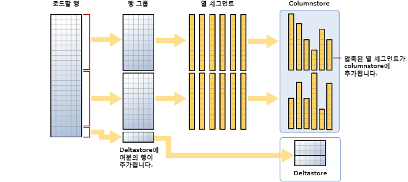

# <a name="columnstore-indexes---data-loading-guidance"></a>Columnstore 인덱스 - 데이터 로드 지침
[!INCLUDE[tsql-appliesto-ss2012-all_md](../../includes/tsql-appliesto-ss2012-all-md.md)]

표준 SQL 대량 로드와 trickle insert 메서드를 사용하여 columnstore 인덱스에 데이터를 로드하는 작업에 대한 옵션 및 권장 사항입니다. 분석을 위한 준비 과정으로 데이터를 인덱스로 이동하기 때문에 columnstore 인덱스에 데이터를 로드하는 작업은 데이터 웨어하우징 프로세스의 필수 요소입니다.
  
 columnstore 인덱스를 처음 사용하십니까? [Columnstore 인덱스 - 개요](../../relational-databases/indexes/columnstore-indexes-overview.md) 및 [Columnstore 인덱스 - 아키텍처](../../relational-databases/indexes/columnstore-indexes-architecture.md)를 참조하세요.
  

## <a name="what-is-bulk-loading"></a>대량 로드란 무엇인가요?
*대량 로드*는 많은 행이 데이터 저장소에 추가되는 방식을 가리킵니다. 행 일괄 처리로 작동하기 때문에 데이터를 columnstore 인덱스로 이동하는 가장 성능 효과적인 방법입니다. 대량 로드는 최대 용량까지 행 그룹을 채우고 columnstore에 직접 압축합니다. 행 그룹당 102,400개의 최소 행 수를 충족하지 않는, 로드의 끝에 있는 행만 deltastore로 이동합니다.  
대량 로드를 수행하려면 [bcp 유틸리티](../../tools/bcp-utility.md) 또는 [Integration Services](../../integration-services/sql-server-integration-services.md)를 사용하거나 준비 테이블에서 행을 선택합니다.

  
  
 다이어그램에서 알 수 있듯이 대량 로드::  
  
* 데이터를 미리 정렬하지 않습니다. 수신하는 순서대로 데이터가 행 그룹으로 삽입됩니다.
* 일괄 처리 크기가 102400 이상인 경우 행은 압축된 행 그룹으로 바로 삽입됩니다. 백그라운드 스레드, 튜플 이동기(TM)에 의해 행이 결과적으로 압축된 행 그룹으로 이동되기 전에 데이터 행을 델타 행 그룹으로 이동하는 것을 방지할 수 있으므로 효율적인 대량 가져오기를 위해 102400 이상의 일괄 처리 크기를 선택하는 것이 좋습니다.
* 일괄 처리 크기가 102400 미만이거나 남은 행이 102400인 경우 행은 델타 행 그룹으로 로드됩니다.

>![참고] 비클러스터형 columnstore 인덱스 데이터가 있는 rowstore 테이블에서 [!INCLUDE[ssNoVersion](../../includes/ssnoversion-md.md)]은 항상 데이터를 기본 테이블에 삽입합니다. 데이터는 columnstore 인덱스에 직접 삽입되지 않습니다.  

대량 로드에는 다음과 같은 기본 제공 성능 최적화 기능이 있습니다.
 
-   병렬 로드. 각각 데이터 파일을 로드하는 여러 개의 동시 대량 로드(bcp 또는 대량 삽입)를 수행할 수 있습니다. SQL Server에 대한 rowstore 대량 로드와 달리, 각 대량 가져오기 스레드가 배타적 잠금 상태의 별도 행 그룹(압축 또는 델타 행 그룹)으로 배타적으로 로드되므로 TABLOCK을 지정할 필요가 없습니다. TABLOCK을 사용하면 테이블에 대한 배타적 잠금이 강제 적용되어 데이터를 병렬로 가져올 수 없게 됩니다.  
  
-   최소 로깅. 대량 로드는 압축된 행 그룹으로 바로 이동하는 데이터에 대해 최소 로깅을 사용합니다. 델타 행 그룹으로 이동하는 데이터는 자세히 로깅됩니다. 여기에는 102,400개의 행보다 작은 모든 일괄 처리 크기가 포함됩니다. 그러나 대량 로드의 목표는 대부분의 데이터가 델타 행 그룹을 우회하도록 하는 것입니다.  
  
-   잠금 최적화.  압축된 행 그룹으로 로드 시 행 그룹에 대한 X 잠금이 획득됩니다. 그러나 델타 행 그룹으로 대량 로드 시 행 그룹에서 X 잠금이 획득되지만 SQL Server는 X 행 그룹 잠금이 잠금 계층 구조의 일부가 아니므로, 잠금 PAGE/EXTENT를 그대로 잠급니다.  
  
columnstore 인덱스에 비클러스터형 btree 인덱스가 있는 경우 인덱스 자체에 대한 잠금 또는 로깅 최적화는 없지만 위의 설명대로 클러스터형 columnstore 인덱스에 대한 최적화는 여전히 남아 있습니다.  


  
## <a name="plan-bulk-load-sizes-to-minimize-delta-rowgroups"></a>델타 행 그룹을 최소화하는 대량 로드 크기 계획
columnstore 인덱스는 대부분의 행이 columnstore로 압축되고 델타 행 그룹에 저장되지 않을 때 성능이 최적화됩니다. 행이 columnstore로 바로 이동하고 최대한 deltastore를 우회하도록 로드 크기를 지정하는 것이 좋습니다.

다음 시나리오에서는 로드된 행이 언제 columnstore로 곧바로 이동하거나 deltastore로 이동하는지를 설명합니다. 예를 들어, 각 행 그룹에는 행 그룹당 102,400-1,048,576행이 있을 수 있습니다. 실제로 행 그룹의 최대 크기는 메모리 압박이 있는 경우 1,048,576개 행보다 적을 수 있습니다.  
  
|대량 로드할 행|압축된 행 그룹에 추가된 행|델타 행 그룹에 추가된 행|  
|-----------------------|-------------------------------------------|--------------------------------------|  
|102,000|0|102,000|  
|145,000|145,000<br /><br /> 행 그룹 크기: 145,000|0|  
|1,048,577|1,048,576<br /><br /> 행 그룹 크기: 1,048,576|1|  
|2,252,152|2,252,152<br /><br /> 행 그룹 크기: 1,048,576, 1,048,576, 155,000|0|  
  
 다음 예제에서는 1,048,577개 행을 테이블로 로드하는 결과를 보여 줍니다. 결과에는 columnstore에 COMPRESSED 행 그룹이 하나 있고(열 세그먼트로 압축됨) deltastore에 행이 1개 있습니다.  
  
```  
SELECT object_id, index_id, partition_number, row_group_id, delta_store_hobt_id, state state_desc, total_rows, deleted_rows, size_in_bytes   
FROM sys.dm_db_column_store_row_group_physical_stats  
```  
  
   
  
## <a name="use-a-staging-table-to-improve-performance"></a>준비 테이블을 사용하여 성능 향상
추가 변환을 실행하기 전의 준비 과정으로만 데이터를 로드하는 경우 힙 테이블에 테이블을 로드하는 것이 클러스터형 columnstore 테이블에 데이터를 로드하는 것보다 훨씬 더 빠릅니다. 또한 [임시 테이블][Temporary]에 데이터를 로드하는 것이 영구 저장소에 테이블을 로드하는 것보다 훨씬 더 빠르게 로드됩니다.  

 데이터 로드에 대한 일반적인 패턴은 데이터를 준비 테이블로 로드하고 일부 변형을 수행한 후 다음 명령을 사용하여 대상 테이블로 로드하는 것입니다.  
  
```  
INSERT INTO <columnstore index>  SELECT <list of columns> FROM <Staging Table>  
  
```  
  
 이 명령은 BCP 또는 Bulk Insert와 유사한 방식이지만, 단일 일괄 처리로 columnstore 인덱스에 데이터를 로드합니다. 준비 테이블의 행 수가 102400 미만인 경우 행은 델타 행 그룹으로 로드됩니다. 그렇지 않으면, 행은 압축된 행 그룹으로 바로 로드됩니다.  한 가지 주요 제한 사항은 이 INSERT 작업이 단일 스레드라는 것입니다. 병렬로 데이터를 로드하려면 여러 준비 테이블을 만들거나 준비 테이블에서 행의 범위가 겹치지 않는 INSERT/SELECT를 실행할 수 있습니다.  이 제한 사항은 SQL Server 2016에서 사라집니다. 아래 명령은 준비 테이블에서 데이터를 병렬로 로드하지만 TABLOCK을 지정해야 합니다.  
  
```  
INSERT INTO <columnstore index>  WITH (TABLOCK)  SELECT <list of columns> FROM <Staging Table>  
```  
  
 준비 테이블에서 클러스터형 columnstore 인덱스로 대량 로드 시 사용 가능한 최적화는 다음과 같습니다.  
  
-   로그 최적화: 데이터가 압축된 행 그룹으로 로드될 때 둘 다 최소로 기록됩니다. 데이터가 델타 행 그룹으로 로드되는 경우 최소 로깅은 없습니다.  
  
-   잠금 최적화: 압축된 행 그룹으로 로드 시 행 그룹에 대한 X 잠금이 획득됩니다. 그러나 델타 행 그룹을 통해 X 잠금이 행 그룹에서 획득되지만 SQL Server는 X 행 그룹 잠금이 잠금 계층 구조의 일부가 아니므로, 잠금 PAGE/EXTENT를 그대로 잠급니다.  
  
 하나 이상의 비클러스터형 인덱스가 있는 경우 인덱스 자체에 대한 잠금 또는 로깅 최적화는 없지만 위의 설명대로 클러스터형 columnstore 인덱스에 대한 최적화는 여전히 남아 있습니다.  
  
## <a name="what-is-trickle-insert"></a>trickle insert란 무엇인가요?

*trickle insert*는 개별 행이 columnstore 인덱스로 이동하는 방식을 가리킵니다. trickle insert는 [INSERT INTO](../../t-sql/statements/insert-transact-sql.md) 문을 사용합니다. trickle insert를 사용할 경우 모든 행이 deltastore로 이동합니다. 이 기능은 행 수가 적은 경우에 유용하며 대규모 로드에는 적합하지 않습니다.
  
```  
INSERT INTO <table-name> VALUES (<set of values>)  
```  
  
 단, 클러스터형 columnstore 인덱스로 값을 삽입하기 위해 INSERT INTO를 사용하는 동시 스레드는 행을 동일한 deltastore 행 그룹에 삽입할 수 있습니다.  
  
 행 그룹에 1,048,576개 행이 포함되면 델타 행 그룹은 closed(닫힘)로 표시해도 쿼리와 업데이트/삭제 작업은 할 수 있지만 새로 삽입된 행은 기존 또는 새롭게 만든 deltastore 행 그룹으로 이동됩니다. 닫힌 델타 행 그룹을 5분 간격으로 압축하는 백그라운드 스레드 *TM(튜플 이동기)* 가 있습니다. 닫힌 델타 행 그룹을 압축하기 위해 다음 명령을 명시적으로 호출할 수 있습니다.  
  
```  
ALTER INDEX <index-name> on <table-name> REORGANIZE  
```  
  
 델타 행 그룹에 닫힘 및 압축을 강제 적용하려는 경우 다음 명령을 실행할 수 있습니다. 행 로드를 완료하고 새로운 행을 원하지 않을 경우 이 명령을 실행할 수 있습니다. 델타 행 그룹을 명시적으로 닫고 압축하면 저장 공간을 추가로 절약하고 분석 쿼리 성능을 개선할 수 있습니다. 새 행의 삽입을 원하지 않는 경우 이 명령을 호출하는 것이 가장 좋은 방법입니다.  
  
```  
ALTER INDEX <index-name> on <table-name> REORGANIZE with (COMPRESS_ALL_ROW_GROUPS = ON)  
```  
  
## <a name="how-loading-into-a-partitioned-table-works"></a>분할된 테이블로 로드의 작동 방식  
 분할된 데이터에 대해 [!INCLUDE[ssNoVersion](../../includes/ssnoversion-md.md)] 에서는 먼저 각 행을 파티션에 할당한 다음 파티션 내에서 데이터에 columnstore 작업을 수행합니다. 각 파티션에는 고유한 행 그룹과 하나 이상의 델타 행 그룹이 있습니다.  
  

 ## <a name="next-steps"></a>다음 단계
 로드 방법에 대한 자세한 내용은 이 [블로그 게시물](http://blogs.msdn.com/b/sqlcat/archive/2015/03/11/data-loading-performance-considerations-on-tables-with-clustered-columnstore-index.aspx)을 참조하세요.  

