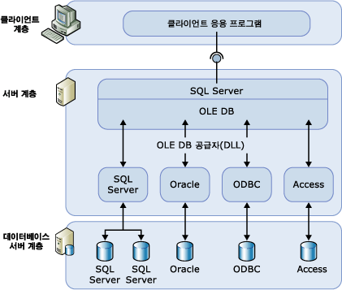

# 연결된 서버(데이터베이스 엔진)

[!INCLUDE[appliesto-ss-asdbmi-xxxx-xxx-md](../../includes/appliesto-ss-asdbmi-xxxx-xxx-md.md)]

  연결된 서버를 사용하면 [!INCLUDE[ssDEnoversion](../../includes/ssdenoversion-md.md)] 및 [Azure SQL Database Managed Instance](https://docs.microsoft.com/azure/sql-database/sql-database-managed-instance-index)가 원격 데이터 원본에서 데이터를 읽고 [!INCLUDE[ssNoVersion](../../includes/ssnoversion-md.md)] 인스턴스 외부에서 원격 데이터베이스 서버(예: OLE DB 데이터 원본)에 대해 명령을 실행할 수 있습니다. 일반적으로 연결된 서버는 [!INCLUDE[ssDE](../../includes/ssde-md.md)] 에서 [!INCLUDE[tsql](../../includes/tsql-md.md)] 의 다른 인스턴스 또는 Oracle과 같은 다른 데이터베이스 제품에 있는 테이블이 포함된 [!INCLUDE[ssNoVersion](../../includes/ssnoversion-md.md)]문을 실행할 수 있도록 구성됩니다. [!INCLUDE[msCoName](../../includes/msconame-md.md)] Access, Excel 및 Azure CosmosDB를 포함한 많은 유형의 OLE DB 데이터 원본을 연결된 서버로 구성할 수 있습니다.

> [!NOTE]
> 연결된 서버는 [!INCLUDE[ssDEnoversion](../../includes/ssdenoversion-md.md)] 및 Azure SQL Database Managed Instance에서 사용할 수 있습니다. Azure SQL 데이터베이스 싱글톤 및 탄력적 풀에서는 사용되지 않습니다. [Managed Instance에서의 몇 가지 제약 조건은 여기에서](https://docs.microsoft.com/azure/sql-database/sql-database-managed-instance-transact-sql-information#linked-servers) 확인할 수 있습니다. 

## 연결된 서버를 사용하는 경우

  연결된 서버를 사용하면 다른 데이터베이스의 데이터를 가져오고 업데이트할 수 있는 분산 데이터베이스를 구현할 수 있습니다. 사용자 지정 애플리케이션 코드를 만들거나 원격 데이터 원본에서 직접 로드하지 않고 분할된 데이터베이스를 구현해야 하는 시나리오에서 좋은 솔루션이 됩니다. 연결된 서버에는 다음과 같은 이점이 있습니다.  
  
-   [!INCLUDE[ssNoVersion](../../includes/ssnoversion-md.md)]외부에서 데이터에 액세스할 수 있습니다.  
  
-   기업 전체에 걸쳐 유형이 다른 데이터 원본에 대해 분산 쿼리, 업데이트, 명령, 트랜잭션 등을 수행할 수 있습니다.  
  
-   다양한 데이터 원본을 유사하게 처리할 수 있습니다.  
  
[!INCLUDE[ssManStudioFull](../../includes/ssmanstudiofull-md.md)] 를 사용하거나 [sp_addlinkedserver &#40;Transact-SQL&#41;](../../relational-databases/system-stored-procedures/sp-addlinkedserver-transact-sql.md) 문을 사용하여 연결된 서버를 구성할 수 있습니다. OLE DB Provider에 따라 필요한 매개 변수의 유형과 개수가 크게 다릅니다. 예를 들어 일부 공급자는 [sp_addlinkedsrvlogin&#40;Transact-SQL&#41;](../../relational-databases/system-stored-procedures/sp-addlinkedsrvlogin-transact-sql.md)인스턴스 외부의 OLE DB 데이터 원본에 대해 명령을 실행할 수 있도록 연결된 서버를 구성합니다. 일부 OLE DB Provider는 [!INCLUDE[ssNoVersion](../../includes/ssnoversion-md.md)] 를 통해 OLE DB 원본에서 데이터를 업데이트하도록 허용합니다. 다른 일부 공급자는 읽기 전용 데이터 액세스만 제공합니다. 각 OLE DB Provider에 대한 자세한 내용은 해당 OLE DB Provider에 대한 설명서를 참조하십시오.  
  
## 연결된 서버 구성 요소  
 연결된 서버 정의는 다음과 같은 개체를 지정합니다.  
  
-   OLE DB Provider  
  
-   OLE DB 데이터 원본  
  
*OLE DB Provider* 는 특정 데이터 원본과 상호 작용하고 관리하는 DLL입니다. *OLE DB 데이터 원본* 은 OLE DB를 통해 액세스할 수 있는 특정 데이터베이스를 식별합니다. 연결된 서버 정의를 통해 쿼리되는 데이터 원본은 일반적으로 데이터베이스이지만 OLE DB Provider에는 여러 파일 및 파일 형식이 존재합니다. 여기에는 텍스트 파일, 스프레드시트 데이터 및 전체 텍스트 내용의 검색 결과가 포함됩니다.  
  
[!INCLUDE[msCoName](../../includes/msconame-md.md)] [!INCLUDE[ssNoVersion](../../includes/ssnoversion-md.md)] Native Client OLE DB 공급자(PROGID: SQLNCLI11)는 공식 [!INCLUDE[ssNoVersion](../../includes/ssnoversion-md.md)]용 OLE DB 공급자입니다.  
  
> [!NOTE]  
> [!INCLUDE[ssNoVersion](../../includes/ssnoversion-md.md)] 분산 쿼리는 필수 OLE DB 인터페이스를 구현하는 모든 OLE DB Provider에서 실행되도록 디자인되었습니다. 그러나 [!INCLUDE[ssNoVersion](../../includes/ssnoversion-md.md)] 는 [!INCLUDE[ssNoVersion](../../includes/ssnoversion-md.md)] Native Client OLE DB Provider와 다른 특정 공급자에 대해서만 테스트되었습니다.  
  
## 연결된 서버 정보  
 다음 그림은 연결된 서버 구성의 기본 사항을 보여 줍니다.  
  
   
  
연결된 서버는 일반적으로 분산 쿼리를 처리하는 데 사용됩니다. 클라이언트 애플리케이션이 연결된 서버를 통해 분산 쿼리를 실행할 때 [!INCLUDE[ssNoVersion](../../includes/ssnoversion-md.md)] 는 명령을 구문 분석하고 OLE DB로 요청을 보냅니다. 행 집합 요청은 공급자에 대해 쿼리를 실행하거나 공급자로부터 기본 테이블을 여는 형식일 수 있습니다.  

> [!NOTE]
> 연결된 서버를 통해 데이터를 반환하는 데이터 원본의 경우 해당 데이터 원본에 대한 OLE DB Provider(DLL)는 [!INCLUDE[ssNoVersion](../../includes/ssnoversion-md.md)]인스턴스와 같은 서버에 있어야 합니다.  
 
> [!IMPORTANT]
> OLE DB Provider를 사용하는 경우 [!INCLUDE[ssNoVersion](../../includes/ssnoversion-md.md)] 서비스가 실행되는 계정에는 공급자가 설치된 디렉터리 및 모든 하위 디렉터리에 대한 읽기 및 실행 권한이 있어야 합니다. 여기에는 Microsoft 릴리스 공급자 및 모든 타사 공급자가 포함됩니다.

> [!NOTE]
> 연결된 서버는 완전 위임을 사용할 때 Active Directory 통과 인증을 지원합니다. SQL Server 2017 CU17부터 제한된 위임을 사용하는 통과 인증도 지원되지만 [리소스 기반 제한된 위임](https://docs.microsoft.com/windows-server/security/kerberos/kerberos-constrained-delegation-overview)은 지원되지 않습니다.

## 공급자 관리  
일련의 옵션을 사용하여 [!INCLUDE[ssNoVersion](../../includes/ssnoversion-md.md)] 에서 레지스트리에 지정된 OLE DB Provider를 로드하고 사용하는 방법을 제어할 수 있습니다.  
  
## 연결된 서버 정의 관리  
연결된 서버를 설정할 때 연결 정보와 데이터 원본 정보를 [!INCLUDE[ssNoVersion](../../includes/ssnoversion-md.md)]에 등록합니다. 등록한 후에는 단일 논리적 이름으로 데이터 원본을 참조할 수 있습니다.  
  
저장 프로시저와 카탈로그 뷰를 사용하여 연결된 서버 정의를 다음과 같이 관리할 수 있습니다.  
  
-   **sp_addlinkedserver**를 실행하여 연결된 서버 정의를 만듭니다.  
  
-   [!INCLUDE[ssNoVersion](../../includes/ssnoversion-md.md)] sys.servers **시스템 카탈로그 뷰에 대해 쿼리를 실행하여 특정** 인스턴스에 정의된 연결된 서버에 대한 정보를 봅니다.  
  
-   **sp_dropserver**를 실행하여 연결된 서버 정의를 삭제합니다. 사용자는 이 저장 프로시저를 사용하여 원격 서버를 제거할 수 있습니다.  
  
또한 [!INCLUDE[ssManStudioFull](../../includes/ssmanstudiofull-md.md)]를 사용하여 연결된 서버를 정의할 수 있습니다. 개체 탐색기에서 **서버 개체**를 마우스 오른쪽 단추로 클릭하고 **새로 만들기**를 선택하고 **연결된 서버**를 선택합니다. 연결된 서버 이름을 마우스 오른쪽 단추로 클릭하고 **삭제**를 선택하면 연결된 서버 정의를 삭제할 수 있습니다.  
  
 연결된 서버에 대해 분산 쿼리를 실행할 경우 각 데이터 원본에서 쿼리할 정식 이름인, 네 부분으로 된 테이블 이름이 포함됩니다. 네 부분으로 된 이 이름은 _linked\_server\_name.catalog_ **.** _schema_ **.** _object\_name_ 형식이어야 합니다.  
  
> [!NOTE]  
> 연결된 서버는 이 서버가 정의된 서버의 포인트 백(루프백)에 정의될 수 있습니다. 단일 서버 네트워크에서 분산 쿼리를 사용하는 애플리케이션을 테스트할 때 루프백 서버를 유용하게 사용할 수 있습니다. 루프백 연결된 서버는 테스트를 위한 것이며 분산 트랜잭션과 같은 많은 작업에 지원되지 않습니다.  
  
## 관련 작업  
 [연결된 서버 만들기&#40;SQL Server 데이터베이스 엔진&#41;](../../relational-databases/linked-servers/create-linked-servers-sql-server-database-engine.md)  
  
 [sp_addlinkedserver&#40;Transact-SQL&#41;](../../relational-databases/system-stored-procedures/sp-addlinkedserver-transact-sql.md)  
  
 [sp_addlinkedsrvlogin&#40;Transact-SQL&#41;](../../relational-databases/system-stored-procedures/sp-addlinkedsrvlogin-transact-sql.md)  
  
 [sp_dropserver&#40;Transact-SQL&#41;](../../relational-databases/system-stored-procedures/sp-dropserver-transact-sql.md)  
  
## 관련 내용  
 [sys.servers&#40;Transact-SQL&#41;](../../relational-databases/system-catalog-views/sys-servers-transact-sql.md)  
  
 [sp_linkedservers&#40;Transact-SQL&#41;](../../relational-databases/system-stored-procedures/sp-linkedservers-transact-sql.md)  
  
  
