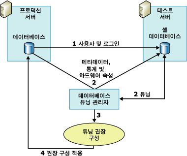

# <a name="reduce-the-production-server-tuning-load"></a>프로덕션 서버 튜닝 로드 줄이기
[!INCLUDE[appliesto-ss-asdb-xxxx-xxx-md](../../includes/appliesto-ss-asdb-xxxx-xxx-md.md)]
  [!INCLUDE[ssDE](../../includes/ssde-md.md)] 튜닝 관리자는 쿼리 최적화 프로그램을 사용하여 작업을 분석하고 튜닝 권장 사항을 작성합니다. 프로덕션 서버에서 이러한 분석을 수행하면 서버 부하가 가중되어 튜닝 세션 중에 서버 성능이 저하될 수 있습니다. 프로덕션 서버 외에 추가로 테스트 서버를 사용하면 튜닝 세션 중에 서버 부하에 미치는 영향을 줄일 수 있습니다.  
  
## <a name="how-database-engine-tuning-advisor-uses-a-test-server"></a>데이터베이스 엔진 튜닝 관리자가 테스트 서버를 사용하는 방법  
 테스트 서버를 사용하는 일반적인 방법은 프로덕션 서버에서 테스트 서버로 데이터를 모두 복사하고 테스트 서버를 튜닝한 다음 프로덕션 서버에 권장 사항을 구현하는 것입니다. 이 작업으로 프로덕션 서버의 성능에 미치는 영향을 없앨 수는 있지만 최적의 방법은 아닙니다. 예를 들어 프로덕션 서버에서 테스트 서버로 많은 양의 데이터를 복사하는 데 상당한 시간과 리소스가 소비될 수 있습니다. 또한 테스트 서버 하드웨어의 성능은 프로덕션 서버 하드웨어 보다 뒤쳐지는 것이 보통입니다. 튜닝 프로세스는 쿼리 최적화 프로그램에 의존하며 이 프로세스에서 생성하는 권장 사항의 일부는 기반 하드웨어를 바탕으로 계산됩니다. 테스트 서버와 프로덕션 서버 하드웨어가 동일하지 않은 경우 [!INCLUDE[ssDE](../../includes/ssde-md.md)] 튜닝 관리자의 권장 사항은 정확성이 떨어집니다.  
  
 이러한 문제를 피하기 위해 [!INCLUDE[ssDE](../../includes/ssde-md.md)] 튜닝 관리자는 대부분의 튜닝 부하를 테스트 서버로 오프로드하여 프로덕션 서버의 데이터베이스를 튜닝합니다. 이 작업은 실제로 프로덕션 서버에서 테스트 서버로 데이터를 복사하지 않고 프로덕션 서버의 하드웨어 구성 정보를 이용해 이루어집니다. [!INCLUDE[ssDE](../../includes/ssde-md.md)] 튜닝 관리자는 실제로 데이터를 프로덕션 서버에서 테스트 서버로 복사하지 않고 메타데이터와 필요한 통계만 복사합니다.  
  
 다음 절차는 테스트 서버에서 프로덕션 서버를 튜닝하는 프로세스를 개략적으로 설명한 것입니다.  
  
1.  테스트 서버를 사용하려는 사용자가 양쪽 서버에 존재하는지 확인합니다.  
  
     시작하기 전에 프로덕션 서버의 데이터베이스를 테스트 서버에서 튜닝하려는 사용자가 양쪽 서버에 존재하는지 확인하십시오. 이를 위해서는 테스트 서버에 사용자와 사용자 로그인을 만들어야 합니다. 사용자가 양쪽 컴퓨터에서 **sysadmin** 고정 서버 역할의 멤버인 경우 이 단계는 필요하지 않습니다.  
  
2.  테스트 서버에서 작업을 튜닝합니다.  
  
     테스트 서버에서 작업을 튜닝하려면 **dta** 명령줄 유틸리티가 있는 XML 입력 파일을 사용해야 합니다. XML 입력 파일에서 **TuningOptions** 부모 요소의 **TestServer** 하위 요소에 테스트 서버의 이름을 지정하고 기타 다른 하위 요소에 대해서도 값을 지정합니다.  
  
     튜닝 프로세스 중에 데이터베이스 엔진 튜닝 관리자가 테스트 서버에 셸 데이터베이스를 만듭니다. 셸 데이터베이스를 만들고 튜닝하기 위해 데이터베이스 엔진 튜닝 관리자는 프로덕션 서버를 호출하여 다음과 같은 작업을 수행합니다.  
  
    1.  [!INCLUDE[ssDE](../../includes/ssde-md.md)] 튜닝 관리자가 프로덕션 데이터베이스에서 테스트 서버 셸 데이터베이스로 메타데이터를 가져옵니다. 이 메타데이터에는 빈 테이블, 인덱스, 뷰, 저장 프로시저, 트리거 등이 포함됩니다. 이 메타데이터를 이용하면 작업 쿼리를 프로덕션 데이터베이스가 아닌 테스트 서버 셸 데이터베이스에 대해 실행할 수 있습니다.  
  
    2.  [!INCLUDE[ssDE](../../includes/ssde-md.md)] 튜닝 관리자가 프로덕션 서버에서 통계를 가져와 쿼리 최적화 프로그램이 테스트 서버에서 쿼리를 정확하게 최적화할 수 있도록 합니다.  
  
    3.  [!INCLUDE[ssDE](../../includes/ssde-md.md)] 튜닝 관리자가 프로덕션 서버의 프로세서 수와 사용 가능한 메모리를 지정하는 하드웨어 매개 변수를 가져와 쿼리 최적화 프로그램에 쿼리 계획을 생성하는 데 필요한 정보를 제공합니다.  
  
3.  [!INCLUDE[ssDE](../../includes/ssde-md.md)] 튜닝 관리자가 테스트 서버 셸 데이터베이스 튜닝을 완료한 후 튜닝 권장 사항을 생성합니다.  
  
4.  테스트 서버를 튜닝하여 얻은 권장 사항을 프로덕션 서버에 적용합니다.  
  
 다음 그림은 테스트 서버 및 프로덕션 서버 시나리오를 보여 줍니다.  
  
   
  
> [!NOTE]  
>  [!INCLUDE[ssDE](../../includes/ssde-md.md)] 튜닝 관리자 GUI(그래픽 사용자 인터페이스)에서는 테스트 서버 튜닝 기능이 지원되지 않습니다.  
  
## <a name="example"></a>예제  
 우선 튜닝 작업을 수행하려는 사용자가 테스트 서버와 프로덕션 서버에 모두 존재하는지 확인합니다.  
  
 사용자 정보를 테스트 서버로 복사한 후 [!INCLUDE[ssDE](../../includes/ssde-md.md)] 튜닝 관리자 XML 입력 파일에 테스트 서버 튜닝 세션을 정의할 수 있습니다. 다음 XML 입력 파일 예에서는 [!INCLUDE[ssDE](../../includes/ssde-md.md)] 튜닝 관리자로 데이터베이스를 튜닝하도록 테스트 서버를 지정하는 방법을 보여 줍니다.  
  
 이 예에서는 `MyDatabaseName` 에서 `MyServerName`데이터베이스가 튜닝되고 있습니다. [!INCLUDE[tsql](../../includes/tsql-md.md)] 스크립트인 `MyWorkloadScript.sql`이 작업으로 사용됩니다. 이 작업에는 `MyDatabaseName`에 대해 실행되는 이벤트가 포함되어 있습니다. 튜닝 프로세스의 일부로 발생하는 이 데이터베이스에 대한 쿼리 최적화 프로그램 호출 중 대부분은 `MyTestServerName`에 있는 셸 데이터베이스에 의해 처리됩니다. 셸 데이터베이스는 메타데이터와 통계로 구성됩니다. 이 작업 결과로 튜닝 오버헤드가 테스트 서버로 오프로드됩니다. [!INCLUDE[ssDE](../../includes/ssde-md.md)] 튜닝 관리자가 이 XML 입력 파일을 사용하여 튜닝 권장 사항을 생성할 때는 분할에 대해 고려하거나`<FeatureSet>IDX</FeatureSet>`의 기존 물리적 디자인 구조를 유지할 필요 없이 인덱스( `MyDatabaseName`)만 고려하면 됩니다.  
  
```  
<?xml version="1.0" encoding="utf-16" ?>  
<DTAXML xmlns:xsi="https://www.w3.org/2001/XMLSchema-instance" xmlns="https://schemas.microsoft.com/sqlserver/2004/07/dta">  
  <DTAInput>  
    <Server>  
      <Name>MyServerName</Name>  
      <Database>  
        <Name>MyDatabaseName</Name>  
      </Database>  
    </Server>  
    <Workload>  
      <File>MyWorkloadScript.sql</File>  
    </Workload>  
    <TuningOptions>  
      <TestServer>MyTestServerName</TestServer>  
      <FeatureSet>IDX</FeatureSet>  
      <Partitioning>NONE</Partitioning>  
      <KeepExisting>NONE</KeepExisting>  
    </TuningOptions>  
  </DTAInput>  
</DTAXML>  
```  
  
## <a name="see-also"></a>참고 항목  
 [테스트 서버 사용 시 고려 사항](../../relational-databases/performance/considerations-for-using-test-servers.md)   
 [XML 입력 파일 참조&#40;데이터베이스 엔진 튜닝 관리자&#41;](../../tools/dta/xml-input-file-reference-database-engine-tuning-advisor.md)  
  
  
