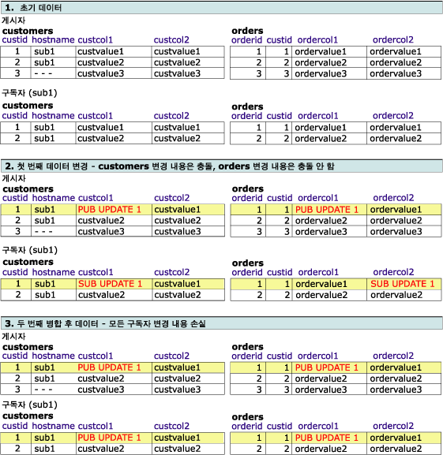
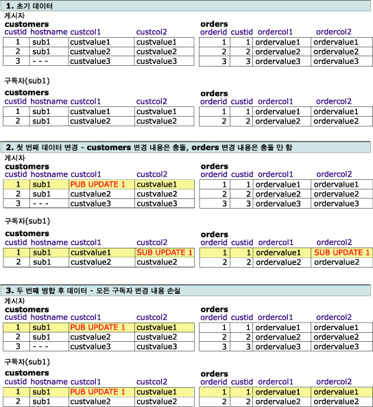
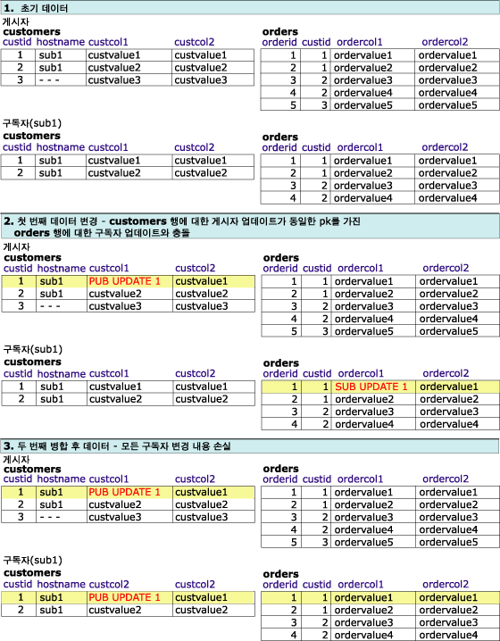

# 고급 병합 복제 충돌 - 논리적 레코드에서 해결
[!INCLUDE[appliesto-ss-xxxx-xxxx-xxx-md](../../../includes/appliesto-ss-xxxx-xxxx-xxx-md.md)]
  이 항목에서는 논리적 레코드에서 충돌을 감지하고 해결하는 다양한 방법을 설명합니다. 두 개 이상의 노드에서 동일한 데이터를 변경할 때 병합 복제에서 충돌이 발생하거나 병합 복제에서 변경 내용을 복제할 때 제약 조건 위반과 같은 특정 오류 유형이 발생합니다. 충돌 감지 및 해결에 대한 자세한 내용은 [Advanced Merge Replication Conflict Detection and Resolution](../../../relational-databases/replication/merge/advanced-merge-replication-conflict-detection-and-resolution.md)을 참조하십시오.  
  
 문서의 충돌 추적 및 해결 수준을 지정하려면 [병합 복제 옵션 수정](../../../relational-databases/replication/merge/specify-merge-replication-properties.md)을 참조하세요.  
  
## 충돌 감지  
 논리적 레코드에 대한 충돌을 감지하는 방법은 두 가지 아티클 속성인 **column_tracking** 및 **logical_record_level_conflict_detection**을 확인하는 것입니다. [!INCLUDE[ssVersion2005](../../../includes/ssversion2005-md.md)] 이상 버전에서는 논리적 레코드 수준 감지도 지원합니다.  
  
 **logical_record_level_conflict_detection** 아티클 속성은 TRUE 또는 FALSE로 설정할 수 있습니다. 이 값은 최상위 부모 아티클에 대해서만 설정해야 하며 자식 아티클에서는 무시됩니다. 이 값이 FALSE이면 병합 복제에서는 이전 버전의 [!INCLUDE[ssNoVersion](../../../includes/ssnoversion-md.md)]에서처럼 아티클에 대한 **column_tracking** 속성 값만 기반으로 하여 충돌을 감지합니다. 이 값이 TRUE이면 병합 복제에서는 아티클의 **column_tracking** 속성을 무시하고 논리적 레코드가 변경된 경우 충돌을 감지합니다. 예를 들어 다음과 같은 시나리오를 고려할 수 있습니다.  
  
   
  
 두 명의 사용자가 **Customers**, **Orders**또는 **OrderItems** 테이블에서 Customer2 논리적 레코드에 대한 값을 변경하는 경우 충돌이 감지됩니다. 이 예제에서는 주로 UPDATE 문을 통해 값을 변경한 경우를 다루지만 INSERT 또는 DELETE 문을 통해 변경한 경우에도 충돌이 감지될 수 있습니다.  
  
## 충돌 해결  
 기본적으로 병합 복제는 우선 순위 기반 논리를 사용하여 충돌을 해결합니다. 두 구독자 데이터베이스에서 변경 내용이 충돌하는 경우 구독 우선 순위가 높은 구독자에 대한 변경 내용이 우선 적용되고 우선 순위가 같으면 게시자에 첫 번째로 도달하는 변경 내용이 우선 적용됩니다. 행 수준 감지와 열 수준 감지에서는 전체 적용되는 행이 무시되는 행을 항상 덮어씁니다.  
  
 **logical_record_level_conflict_resolution** 아티클 속성은 TRUE 또는 FALSE로 설정할 수 있습니다. 이 값은 최상위 부모 아티클에 대해서만 설정해야 하며 자식 아티클에서는 무시됩니다. 값이 TRUE이면 전체 적용되는 논리적 레코드가 무시되는 논리적 레코드를 덮어씁니다. 값이 FALSE이면 행별로 다른 구독자나 게시자의 내용이 적용될 수 있습니다. 예를 들어 충돌 시 **Orders** 테이블의 행에서는 구독자 A 내용이 적용되고 **OrderItems** 테이블의 관련 행에서는 구독자 B 내용이 적용될 수 있습니다. 그 결과 논리적 레코드의 **Orders** 행에는 구독자 A의 내용이, **OrderItems** 행에는 구독자 B의 내용이 적용됩니다.  
  
## 충돌 해결 설정과 충돌 감지 설정 간의 상호 작용  
 충돌 결과는 충돌 감지 설정과 충돌 해결 설정 간의 상호 작용에 따라 달라집니다. 아래 예에서는 우선 순위 기반 충돌 해결이 사용된다고 가정합니다. 논리적 레코드 사용 시 이 두 설정을 다음과 같이 조합하여 지정할 수 있습니다.  
  
-   행 또는 열 수준 감지, 행 수준 해결  
  
-   열 수준 감지, 논리적 레코드 해결  
  
-   행 수준 감지, 논리적 레코드 해결  
  
-   논리적 레코드 감지, 논리적 레코드 해결  
  
### 행 또는 열 수준 감지, 행 수준 해결  
 이 예에서는 다음과 같이 게시가 구성됩니다.  
  
-   **column_tracking** 을 TRUE 또는 FALSE로 설정  
  
-   **logical_record_level_conflict_detection** 을 FALSE로 설정  
  
-   **logical_record_level_conflict_resolution** 을 FALSE로 설정  
  
 이러한 경우 감지는 행 또는 열 수준에서 수행되고 해결은 행 수준에서 수행됩니다. 이렇게 설정하면 논리적 레코드에 대한 모든 변경 내용을 한 단위로 복제할 수 있지만 논리적 레코드 수준에서 충돌을 감지하거나 해결할 수 없습니다.  
  
### 열 수준 감지, 논리적 레코드 해결  
 이 예에서는 다음과 같이 게시가 구성됩니다.  
  
-   **column_tracking** 을 TRUE로 설정  
  
-   **logical_record_level_conflict_detection** 을 FALSE로 설정  
  
-   **logical_record_level_conflict_resolution** 을 TRUE로 설정  
  
 게시자와 구독자가 동일한 데이터 집합으로 시작하고 **orders** 테이블과 **customers** 테이블 사이에 논리적 레코드가 정의되어 있습니다. 게시자는 **customers** 테이블에서 **custcol1** 열을 변경하고 **orders** 테이블에서 **ordercol1** 열을 변경합니다. 구독자는 **customers** 테이블의 동일한 행에서 **custcol1** 열을 변경하고 **orders** 테이블의 동일한 행에서 **ordercol2** 열을 변경합니다. **customer** 테이블의 동일한 열을 변경하면 충돌이 발생하지만 **orders** 테이블을 변경하면 충돌이 발생하지 않습니다.  
  
 논리적 레코드 수준에서 충돌이 해결되므로 복제 처리 중 게시자에서 적용되는 변경 내용이 구독자 테이블에서의 변경 내용을 바꿉니다.  
  
   
  
### 행 수준 감지, 논리적 레코드 해결  
 이 예에서는 다음과 같이 게시가 구성됩니다.  
  
-   **column_tracking** 을 FALSE로 설정  
  
-   **logical_record_level_conflict_detection** 을 FALSE로 설정  
  
-   **logical_record_level_conflict_resolution** 을 TRUE로 설정  
  
 게시자 및 구독자는 동일한 데이터 집합으로 시작됩니다. 게시자는 **customers** 테이블에서 **custcol1** 열을 변경합니다. 구독자는 **customers** 테이블에서 **custcol2** 열을 변경하고 **orders** 테이블에서 **ordercol2** 열을 변경합니다. **customers** 테이블의 동일한 행을 변경하면 충돌이 발생하지만 구독자가 **orders** 테이블을 변경하는 경우 충돌이 발생하지 않습니다.  
  
 논리적 레코드 수준에서 충돌이 해결되므로 동기화 중 게시자에서 적용되는 변경 내용이 구독자 테이블에서의 변경 내용을 바꿉니다.  
  
   
  
### 논리적 레코드 감지, 논리적 레코드 해결  
 이 예에서는 다음과 같이 게시가 구성됩니다.  
  
-   **logical_record_level_conflict_detection** 을 TRUE로 설정  
  
-   **logical_record_level_conflict_resolution** 을 TRUE로 설정  
  
 게시자 및 구독자는 동일한 데이터 집합으로 시작됩니다. 게시자는 **customers** 테이블에서 **custcol1** 열을 변경합니다. 구독자는 **orders** 테이블에서 **ordercol1** 열을 변경합니다. 동일한 행 또는 열이 변경되지 않았지만 **custid**=1에 대한 동일한 논리적 레코드가 변경되었으므로 논리적 레코드 수준에서 변경 내용이 충돌로 감지됩니다.  
  
 또한 논리적 레코드 수준에서 충돌이 해결되므로 동기화 중 게시자에서 적용되는 변경 내용이 구독자 테이블에서의 변경 내용을 바꿉니다.  
  
   
  
## 참고 항목  
 [논리적 레코드를 사용하여 관련된 행의 변경 내용 그룹화](../../../relational-databases/replication/merge/group-changes-to-related-rows-with-logical-records.md)  
  
  
