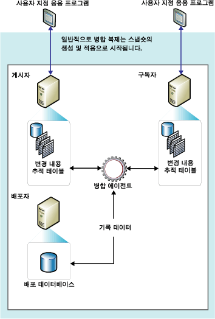

# 병합 복제
[!INCLUDE[appliesto-ss-xxxx-xxxx-xxx-md](../../../includes/appliesto-ss-xxxx-xxxx-xxx-md.md)]
  병합 복제는 트랜잭션 복제와 마찬가지로 일반적으로 게시 데이터베이스 개체 및 데이터의 스냅숏으로 시작합니다. 게시자 및 구독자에서 발생한 후속 데이터 변경 및 스키마 수정은 트리거로 추적합니다. 구독자는 네트워크에 연결될 때 게시자와 동기화하여 마지막 동기화 이후 게시자와 구독자 간에 변경된 모든 행을 교환합니다.  
  
 병합 복제는 일반적으로 서버-클라이언트 간 환경에 사용됩니다. 병합 복제는 다음 상황에 적합합니다.  
  
-   여러 구독자가 다양한 시간에 동일한 데이터를 업데이트하고 그 변경 내용을 게시자 및 다른 구독자에 전파할 수 있습니다.  
  
-   구독자는 데이터를 받아 오프라인 상태에서 변경하여 나중에 게시자 및 다른 구독자와 변경 내용을 동기화해야 합니다.  
  
-   각 구독자에 서로 다른 데이터 파티션이 필요합니다.  
  
-   충돌이 발생할 수 있으며 충돌이 발생하면 충돌을 감지하여 해결할 수 있어야 합니다.  
  
-   애플리케이션이 중간 데이터 상태가 아닌 순수한 데이터 변경 내용만 필요로 합니다. 예를 들어 구독자가 게시자와 동기화하기 전에 구독자에서 행이 5번 변경된 경우 게시자에서는 행이 한 번만 변경되어 최종 데이터 변경 내용(5번째 값)을 반영합니다.  
  
 병합 복제를 사용하면 여러 사이트에서 자율적으로 작업한 후 나중에 하나의 균일한 결과로 업데이트를 병합할 수 있습니다. 업데이트는 둘 이상의 노드에서 수행되므로 게시자 및 둘 이상의 구독자가 같은 데이터를 업데이트할 수 있습니다. 따라서 업데이트가 병합될 때 충돌이 발생할 수 있으며 병합 복제는 충돌을 처리하는 다양한 방법을 제공합니다.  
  
 [!INCLUDE[ssNoVersion](../../../includes/ssnoversion-md.md)] 스냅숏 에이전트와 병합 에이전트가 병합 복제를 구현합니다. 게시가 필터링되지 않거나 정적 필터를 사용하면 스냅숏 에이전트는 단일 스냅숏을 만듭니다. 게시에서 매개 변수가 있는 필터를 사용하면 스냅숏 에이전트는 각 데이터 파티션에 대한 스냅숏을 만듭니다. 병합 에이전트는 초기 스냅숏을 구독자에 적용합니다. 또한 초기 스냅숏이 만들어진 후 게시자 또는 구독자에서 발생한 증분 데이터 변경 내용을 병합하고 사용자가 구성한 규칙에 따라 충돌을 감지하고 해결합니다.  
  
 변경 내용을 추적하기 위해 병합 복제와 지연 업데이트 구독이 있는 트랜잭션 복제는 게시된 모든 테이블에 있는 모든 행을 고유하게 식별할 수 있어야 합니다. 이 병합 복제를 위해서는 테이블에 이미 **rowguid** 속성이 설정된 **uniqueidentifier** 데이터 형식의 열(이 열이 사용되는 경우)이 포함되지 않은 한 모든 테이블에 **ROWGUIDCOL** 열을 추가합니다. 게시에서 테이블이 삭제되면 **rowguid** 열이 제거됩니다. 추적 작업에 기존 열이 사용되면 해당 열은 제거되지 않습니다. 필터는 행 식별을 위해 복제에 사용된 **rowguidcol** 을 포함하지 않아야 합니다. **newid()** 함수가 **rowguid** 열에 대한 기본값으로 제공되지만 고객은 필요에 따라 각 행에 대한 GUID를 제공할 수 있습니다. 그러나 00000000-0000-0000-0000-000000000000 값은 제공하지 마세요.  
  
 다음 다이어그램에서는 병합 복제에 사용되는 구성 요소를 보여 줍니다.  
  
   
  
  
