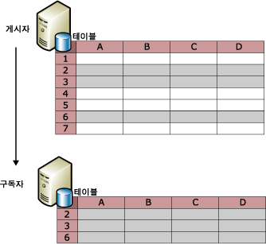
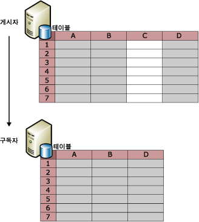
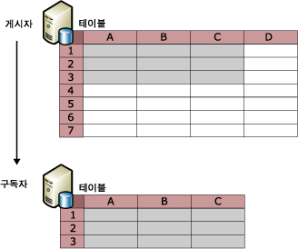

# 게시된 데이터 필터링
[!INCLUDE[appliesto-ss-xxxx-xxxx-xxx-md](../../../includes/appliesto-ss-xxxx-xxxx-xxx-md.md)]
  테이블 아티클을 필터링하여 게시할 데이터 파티션을 만들 수 있습니다. 게시된 데이터를 필터링하여 다음 작업을 수행할 수 있습니다.  
  
-   네트워크로 보내지는 데이터 양을 최소화합니다.  
  
-   구독자에 필요한 저장소 공간을 줄입니다.  
  
-   개별 구독자 요구 사항에 기초하여 게시 및 응용 프로그램을 사용자 지정합니다.  
  
-   서로 다른 구독자에 서로 다른 데이터 파티션을 보낼 수 있으므로 구독자가 데이터를 업데이트할 때 충돌을 방지하거나 충돌 횟수를 줄일 수 있습니다. 즉, 두 개의 구독자가 같은 데이터 값을 업데이트하지 않게 됩니다.  
  
-   중요한 데이터를 전송하지 못하게 할 수 있습니다. 행 필터와 열 필터를 사용하여 구독자의 데이터 액세스를 제한할 수 있습니다. 병합 복제에서 HOST_NAME()을 포함하는 매개 변수가 있는 필터를 사용할 경우 보안 고려 사항이 있습니다. 자세한 내용은 [Parameterized Row Filters](../../../relational-databases/replication/merge/parameterized-filters-parameterized-row-filters.md)의 "HOST_NAME()으로 필터링" 섹션을 참조하십시오.  
  
 복제는 다음 4가지 형식의 필터를 제공합니다.  
  
-   정적 행 필터 - 모든 복제 유형에 사용할 수 있음  
  
     정적 행 필터를 사용하여 게시할 행의 하위 집합을 선택할 수 있습니다. 필터링된 게시에 대한 모든 구독자는 필터링된 테이블 행의 동일한 하위 집합을 받습니다. 자세한 내용은 이 항목의 "정적 행 필터" 섹션을 참조하십시오.  
  
-   열 필터 - 모든 복제 유형에 사용할 수 있음  
  
     열 필터를 사용하여 게시할 열의 하위 집합을 선택할 수 있습니다. 자세한 내용은 이 항목의 "열 필터" 섹션을 참조하십시오.  
  
-   매개 변수가 있는 행 필터 - 병합 복제에만 사용할 수 있음  
  
     매개 변수가 있는 행 필터를 사용하여 게시할 행의 하위 집합을 선택할 수 있습니다. 모든 구독자에게 행의 동일한 하위 집합을 보내는 정적 필터와 달리 매개 변수가 있는 행 필터는 구독자가 제공한 데이터 값을 사용하여 구독자에게 행의 다른 하위 집합을 보냅니다. 자세한 내용은 [Parameterized Row Filters](../../../relational-databases/replication/merge/parameterized-filters-parameterized-row-filters.md)을 참조하세요.  
  
-   조인 필터 - 병합 복제에만 사용할 수 있음  
  
     조인 필터를 사용하여 다른 게시된 테이블로 행 필터를 확장할 수 있습니다. 자세한 내용은 [Join Filters](../../../relational-databases/replication/merge/join-filters.md)을 참조하세요.  
  
## 정적 행 필터  
 다음 그림에서는 2행, 3행, 6행만 게시에 포함되도록 필터링된 게시된 테이블을 보여 줍니다.  
  
   
  
 정적 행 필터는 WHERE 절을 사용하여 게시에 적합한 데이터를 선택합니다. WHERE 절의 마지막 부분은 사용자가 지정합니다. **ProductLine** 열이 포함된 Adventure Works 예제 데이터베이스의 **Product 테이블**을 참조하십시오. 산악 자전거 관련 제품에 대한 데이터가 있는 행만 게시하려면 `ProductLine = 'M'`을 지정합니다.  
  
 정적 행 필터를 사용하면 각 게시에 대해 단일 데이터 집합이 생성됩니다. 위의 예에서는 모든 구독자가 산악 자전거 관련 제품에 대한 데이터가 있는 행만 받게 됩니다. 일반 자전거 관련 제품에 대한 데이터가 있는 행만을 필요로 하는 다른 구독자가 있는 경우 다음을 수행하십시오.  
  
-   스냅숏 또는 트랜잭션 복제를 사용하여 다른 게시를 만들고 두 게시에 해당 테이블을 포함시킵니다. 해당 게시에 있는 아티클에 대한 필터 절에는 `ProductLine = 'R')`을 지정합니다.  
  
    > [!NOTE]  
    >  행을 복제해야 하는지 여부를 결정하도록 게시된 테이블에 대해 기록된 각 로그 행에 대해 아티클 필터 절이 평가되기 때문에 행 필터는 트랜잭션 게시에서 중요한 오버헤드를 추가할 수 있습니다. 각 복제 노드가 전체 데이터 로드를 지원할 수 있고 데이터 집합의 크기가 전체적으로 작은 경우 트랜잭션 게시에 행 필터를 사용하지 않아야 합니다.  
  
-   병합 복제의 경우 정적 행 필터가 있는 여러 게시를 만드는 대신 매개 변수가 있는 행 필터를 사용합니다. 자세한 내용은 [Parameterized Row Filters](../../../relational-databases/replication/merge/parameterized-filters-parameterized-row-filters.md)을 참조하세요.  
  
 정적 행 필터를 정의하거나 수정하려면 [Define and Modify a Static Row Filter](../../../relational-databases/replication/publish/define-and-modify-a-static-row-filter.md)를 참조하십시오.  
  
## 열 필터  
 다음 그림에서는 C 열을 필터링하여 제외하는 게시를 보여 줍니다.  
  
   
  
 다음 그림처럼 행 필터링과 열 필터링을 함께 사용할 수도 있습니다.  
  
   
  
 게시가 생성된 다음에는 열 필터링을 사용하여 열을 기존 게시에서는 삭제하고 게시자에서는 테이블에 유지할 수 있고 게시에 기존 열을 포함시킬 수 있습니다. 테이블에 새 열을 추가한 다음 이 열을 게시된 아티클에 추가하는 것과 같은 다른 변경에 대해서는 스키마 변경 복제를 사용합니다. 자세한 내용은 [게시 데이터베이스의 스키마 변경](../../../relational-databases/replication/publish/make-schema-changes-on-publication-databases.md) 항목의 "열 추가" 및 "열 삭제" 섹션을 참조하세요.  
  
 다음 표에 나열된 특정 게시의 특정 열 유형은 필터링하여 제외시킬 수 없습니다.  
  
|열 유형|게시 유형 및 옵션|  
|-----------------|-------------------------------------|  
|기본 키 열|기본 키 열은 트랜잭션 게시의 모든 테이블에 필요합니다. 기본 키는 병합 게시의 테이블에 필요하지 않지만 기본 키 열이 있는 경우 필터링할 수 없습니다.|  
|외래 키 열|새 게시 마법사를 사용하여 생성된 모든 게시입니다. Transact-SQL 저장 프로시저를 사용하여 외래 키 열을 필터링할 수 있습니다. 자세한 내용은 [Define and Modify a Column Filter](../../../relational-databases/replication/publish/define-and-modify-a-column-filter.md)을 참조하십시오.|  
|**rowguid** 열|병합 게시*|  
|**msrepl_tran_version** 열|업데이트할 수 있는 구독을 허용하는 스냅숏 게시나 트랜잭션 게시|  
|NULL을 허용하지 않고 기본값 또는 IDENTITY 속성 설정이 없는 열|업데이트할 수 있는 구독을 허용하는 스냅숏 게시나 트랜잭션 게시|  
|UNIQUE 제약 조건 또는 인덱스가 있는 열|업데이트할 수 있는 구독을 허용하는 스냅숏 게시나 트랜잭션 게시|  
|SQL Server 7.0 병합 게시의 모든 열|SQL Server 7.0 병합 게시에서는 열을 필터링할 수 없습니다.|  
|타임스탬프|업데이트할 수 있는 구독을 허용하는 SQL Server 7.0 스냅숏 또는 트랜잭션 게시|  
  
 \*병합 게시에서 테이블을 게시하고 이 테이블에 이미 **ROWGUIDCOL** 속성이 설정된 **uniqueidentifier** 데이터 형식의 열이 있는 경우 복제는 **rowguid**라는 추가 열을 만들지 않고 복제에 이 열을 사용할 수 있습니다. 이 경우 기존 열을 게시해야 합니다.  
  
 열 필터를 정의하거나 수정하려면 [Define and Modify a Column Filter](../../../relational-databases/replication/publish/define-and-modify-a-column-filter.md)의 "HOST_NAME()으로 필터링" 섹션을 참조하십시오.  
  
## 필터링 고려 사항  
 데이터 필터링 시 다음 사항을 고려하십시오.  
  
-   행 필터에 참조되는 모든 열은 게시에 포함되어야 합니다. 즉, 열 필터를 사용하여 행 필터에 사용되는 열을 제외할 수 없습니다.  
  
-   구독이 초기화된 후 필터를 추가하거나 변경한 경우에는 구독을 다시 초기화해야 합니다.  
  
-   필터에 사용되는 열에 허용되는 최대 바이트 수는 병합 게시의 아티클의 경우에는1024, 트랜잭션 게시의 아티클의 경우에는 8000입니다.  
  
-   다음과 같은 데이터 형식이 있는 열은 행 필터나 조인 필터에 참조될 수 없습니다.  
  
    -   **varchar(max) 및 nvarchar(max)**  
  
    -   **varbinary(max)**  
  
    -   **text 및 ntext**  
  
    -   **image**  
  
    -   **XML**  
  
    -   **UDT**  
  
-   트랜잭션 복제를 사용하면 인덱싱된 뷰를 뷰나 테이블로 복제할 수 있습니다. 뷰를 테이블로 복제하면 테이블의 열을 필터링할 수 없습니다.  
  
 행 필터는 데이터베이스에서 작동하도록 설계되지 않았습니다. [!INCLUDE[ssNoVersion](../../../includes/ssnoversion-md.md)] 는 **sp_replcmds** 실행(필터 실행 대상)을 의도적으로 데이터베이스 소유자(**dbo**)로 제한합니다. **dbo** 에는 데이터베이스 간 권한이 없습니다. **sp_replcmds** 논리는 [!INCLUDE[ssKatmai](../../../includes/sskatmai-md.md)]에 CDC(변경 데이터 캡처)를 추가하여 변경 내용 추적 테이블을 사용자가 반환하고 쿼리할 수 있는 정보로 채웁니다. [!INCLUDE[ssNoVersion](../../../includes/ssnoversion-md.md)]는 보안을 위해 악성 **dbo**가 이 실행 경로를 가로채지 못하도록 이 논리의 실행을 제한합니다. 예를 들어, 악성 **dbo** 는 **sp_replcmds**를 호출하는 사용자의 컨텍스트에서 실행될 수 있는 트리거를 CDC 테이블에 추가할 수 있으며, 이 경우 logreader 에이전트입니다.  에이전트가 실행 중인 계정의 권한이 더 높은 경우 악성 **dbo** 가 자신의 권한을 에스컬레이션할 수 있습니다.  
  
## 참고 항목  
 [데이터 및 데이터베이스 개체 게시](../../../relational-databases/replication/publish/publish-data-and-database-objects.md)  
  
  
