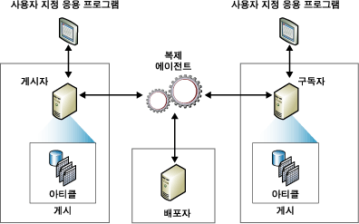

# 복제 게시 모델 개요
  복제는 복제 토폴로지의 구성 요소를 나타내는 데 게시자, 배포자, 구독자, 게시, 아티클 및 구독을 포함하는 게시 관련 산업의 메타포를 사용합니다.  [!INCLUDE[msCoName](../../../includes/msconame-md.md)] [!INCLUDE[ssNoVersion](../../../includes/ssnoversion-md.md)] 복제를 잡지의 개념으로 생각하면 이해가 쉽습니다.  
  
-   잡지사(게시자)에서는 하나 이상의 출판물(게시)을 생산합니다.  
  
-   출판물(게시)에는 기사(아티클)가 있습니다.  
  
-   잡지사(게시자)에서는 잡지를 직접 배포하거나 배급업자(배포자)를 사용합니다.  
  
-   구독자는 각자가 구독하는 출판물(게시)을 받아 봅니다.  
  
 복제를 이해하는 데 잡지 메타포가 도움이 되기는 하지만 [!INCLUDE[ssNoVersion](../../../includes/ssnoversion-md.md)] 복제에는 이 메타포에 나타나지 않은 기능, 특히 구독자가 업데이트를 하고 게시자가 게시의 아티클에 대해 증분 변경 내용을 보낼 수 있는 기능이 포함되어 있습니다.  
  
 *복제 토폴로지* 는 서버와 데이터 복사본 간의 관계를 정의하고 서버 간 데이터 흐름 방식을 결정하는 논리를 명확히 합니다. 게시자와 구독자 간 데이터 복사 및 이동을 담당하는 여러 복제 프로세스(*에이전트*)가 있습니다. 다음 그림에서는 복제와 관련된 구성 요소 및 프로세스를 간략하게 설명합니다.  
  
   
  
## 게시자  
 게시자는 복제를 통해 데이터를 다른 위치에서 사용할 수 있도록 만드는 데이터베이스 인스턴스입니다. 게시자는 각각 논리적으로 관련된 개체 집합 및 복제할 데이터를 정의하는 게시를 하나 이상 가질 수 있습니다.  
  
## 배포자  
 배포자는 하나 이상의 게시자와 연결된 복제별 데이터에 대한 저장소 역할을 하는 데이터베이스 인스턴스입니다. 각 게시자는 배포자에서 단일 데이터베이스(배포 데이터베이스)와 연결되어 있습니다. 배포 데이터베이스는 복제 상태 데이터와 게시에 대한 메타데이터를 저장하고 경우에 따라서는 게시자에서 구독자로 이동하는 데이터에 대한 큐 역할을 합니다. 대부분의 경우 단일 데이터베이스 서버 인스턴스는 게시자와 배포자 역할을 모두 합니다. 이를 *로컬 배포자*라고 합니다. 게시자 및 배포자가 서로 다른 데이터베이스 서버 인스턴스에 구성되어 있는 경우에는 배포자를 *원격 배포자*라고 합니다.  
  
## 구독자  
 구독자는 복제된 데이터를 수신하는 데이터베이스 인스턴스입니다. 구독자는 여러 게시자 및 게시로부터 데이터를 수신할 수 있습니다. 선택한 복제 유형에 따라 구독자는 데이터 변경 내용을 게시자에 다시 전달하거나 데이터를 다른 구독자로 다시 게시할 수도 있습니다.  
  
## 아티클  
 아티클은 게시에 포함된 데이터베이스 개체를 식별합니다. 게시는 테이블, 뷰, 저장 프로시저 및 기타 개체를 포함한 여러 유형의 아티클을 포함할 수 있습니다. 테이블이 아티클로 게시되면 필터를 사용하여 구독자로 보낼 데이터의 열 및 행을 제한할 수 있습니다.  
  
## 게시  
 게시는 하나의 데이터베이스에서 하나 이상의 아티클을 모은 것입니다. 여러 아티클을 게시로 그룹화하면 논리적으로 관련된 데이터베이스 개체 집합 및 단위로 복제된 데이터를 쉽게 지정할 수 있습니다.  
  
## 구독  
 구독은 구독자에게 게시 복사본을 배달해 줄 것을 요청하는 것입니다. 구독은 어떤 게시를 언제 어디서 받을 것인지를 정의합니다. 밀어넣기와 끌어오기의 두 가지 구독 유형이 있습니다. 밀어넣기 및 끌어오기 구독에 대한 자세한 내용은 [게시 구독](../../../relational-databases/replication/subscribe-to-publications.md)을 참조하세요.  
  
## 관련 항목:  
 [복제 에이전트 개요](../../../relational-databases/replication/agents/replication-agents-overview.md)   
 [복제 유형](../../../relational-databases/replication/types-of-replication.md)   
 [Always On 가용성 그룹에 대한 복제 구성(SQL Server)](../../../database-engine/availability-groups/windows/configure-replication-for-always-on-availability-groups-sql-server.md)   
 [Always On 게시 데이터베이스 유지 관리(SQL Server)](../../../database-engine/availability-groups/windows/maintaining-an-always-on-publication-database-sql-server.md)  
  
  