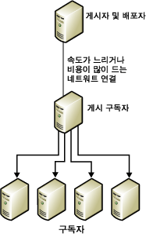
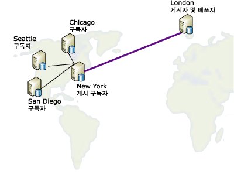

# 데이터 다시 게시
  재게시 모델에서 게시자는 구독자로 데이터를 보내고 구독자는 다른 모든 구독자에 데이터를 다시 게시합니다. 이 방법은 게시자가 속도가 느리거나 비용이 많이 드는 통신 연결로 데이터를 구독자에 보내야 할 경우 유용합니다. 연결 끝 쪽에 다수의 구독자가 있을 경우 재게시자를 사용하면 대량의 배포 로드가 해당 연결 쪽으로 이동합니다.  
  
 데이터 재게시 과정은 다음과 같습니다.  
  
1.  게시자에서 게시를 만듭니다.  
  
2.  재게시 구독자에 대해 게시에 대한 구독을 만듭니다.  
  
3.  구독을 초기화합니다. 재게시 구독자에서 게시를 만들기 전에 구독을 초기화하지 않으면 복제가 실패합니다.  
  
4.  재게시 구독자의 구독 데이터베이스에 게시를 만듭니다.  
  
5.  다른 구독자에 대해 재게시 구독자에서 게시에 대한 구독을 만듭니다.  
  
6.  구독을 초기화합니다.  
  
> [!NOTE]  
>  재게시 토폴로지에서 병합 복제를 사용하는 경우 모든 재게시 구독자에서 서버 구독을 사용해야 합니다. 구독 유형에 대한 자세한 내용은 [게시 구독](../../relational-databases/replication/subscribe-to-publications.md)을 참조하세요.  
  
 다음 그림에서 게시자와 재게시자는 모두 자체 로컬 배포자로 동작합니다. 여기에 원격 배포자를 설정하면 각 배포자는 속도가 느리거나 비용이 많이 드는 통신 연결의 같은 쪽에 게시자로 있어야 합니다. 게시자는 안정적인 고속 통신 연결로 배포자에 연결되어야 합니다.  
  
   
  
 모든 서버는 게시자인 동시에 구독자로 작동할 수 있습니다. 예를 들어 다음 다이어그램에서 런던에 존재하며 미국의 다른 4개 도시인 시카고, 뉴욕, 샌디에고 및 시애틀과 같은 4개 도시에 배포해야 하는 테이블 게시를 고려합니다. 이 경우 다음과 같이 뉴욕 사이트가 조건에 맞기 때문에 뉴욕에 있는 서버를 런던에서 시작된 게시된 테이블로 구독하도록 선택합니다.  
  
-   런던으로 돌아가는 네트워크 연결이 상대적으로 안정적입니다.  
  
-   런던 및 뉴욕 간 통신 비용이 적당합니다.  
  
-   뉴욕에서 미국의 다른 모든 구독자 사이트 간 네트워크 통신 회선이 양호합니다.  
  
       
  
 복제는 다음 표에 나와 있는 재게시 시나리오를 지원합니다.  
  
|게시자|게시 구독자|구독자|  
|---------------|---------------------------|----------------|  
|트랜잭션 게시|트랜잭션 구독/트랜잭션 게시|트랜잭션 구독|  
|트랜잭션 게시|트랜잭션 구독/병합 게시*|병합 구독|  
|병합 게시|병합 구독/병합 게시|병합 구독|  
|병합 게시|병합 구독/트랜잭션 게시|트랜잭션 구독|  
  
 \*병합 게시에 **@published_in_tran_pub** 속성을 설정해야 합니다. 기본적으로 트랜잭션 복제에서 구독자의 테이블은 읽기 전용으로 처리됩니다. 병합 복제에서 트랜잭션 구독의 테이블 데이터를 변경하는 경우 데이터가 일치하지 않을 수 있습니다. 이렇게 되지 않도록 하려면 병합 게시에서 이러한 테이블을 다운로드 전용으로 지정하는 것이 좋습니다. 그러면 병합 구독자가 테이블에 데이터 변경을 업로드하지 않게 됩니다. 자세한 내용은 [다운로드 전용 아티클로 병합 복제 성능 최적화](../../relational-databases/replication/merge/optimize-merge-replication-performance-with-download-only-articles.md)를 참조하세요.  
  
## 관련 항목:  
 [배포 구성](../../relational-databases/replication/configure-distribution.md)   
 [데이터 및 데이터베이스 개체 게시](../../relational-databases/replication/publish/publish-data-and-database-objects.md)   
 [게시 구독](../../relational-databases/replication/subscribe-to-publications.md)   
 [구독 초기화](../../relational-databases/replication/initialize-a-subscription.md)   
 [데이터 동기화](../../relational-databases/replication/synchronize-data.md)  
  
  
