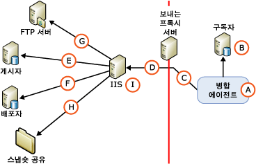

# 웹 동기화를 위한 보안 아키텍처
[!INCLUDE [SQL Server](../../../includes/applies-to-version/sqlserver.md)]
  [!INCLUDE[msCoName](../../../includes/msconame-md.md)] [!INCLUDE[ssNoVersion](../../../includes/ssnoversion-md.md)]를 사용하여 웹 동기화 보안 구성을 세밀하게 제어할 수 있습니다. 이 항목에서는 웹 동기화 구성에 포함할 수 있는 포괄적인 구성 요소 목록과 구성 요소 간 연결에 대한 정보를 제공합니다. [!INCLUDE[ssNoteWinAuthentication](../../../includes/ssnotewinauthentication-md.md)]  
  
 다음 그림에서는 가능한 모든 연결을 보여 주지만 특정 토폴로지에서는 일부 연결이 필요하지 않을 수 있습니다. 예를 들어 FTP 서버 연결은 FTP를 사용하여 스냅샷을 배달하는 경우에만 필요합니다.  
  
   
  
 다음 표에서는 그림에 표시된 구성 요소와 연결에 대해 설명합니다.  
  
## A. 병합 에이전트를 실행하는 Windows 사용자  
 동기화를 수행하는 동안 구독자에서 병합 에이전트(A)가 시작됩니다. 병합 에이전트는 [!INCLUDE[ssNoVersion](../../../includes/ssnoversion-md.md)] 에이전트 작업 단계에서 시작하거나 독립 실행형 사용자 지정 애플리케이션에서 시작할 수 있습니다. 병합 에이전트를 [!INCLUDE[ssNoVersion](../../../includes/ssnoversion-md.md)] 에이전트 작업 단계에서 시작하면 사용자가 지정하는 Windows 사용자의 컨텍스트에서 병합 에이전트가 실행됩니다. Windows 사용자를 지정하지 않으면 [!INCLUDE[ssNoVersion](../../../includes/ssnoversion-md.md)] 에이전트의 Windows 서비스 계정 컨텍스트에서 병합 에이전트가 실행됩니다.  
  
|계정 유형|계정 지정 위치|  
|---------------------|------------------------------------|  
|Windows 사용자|[!INCLUDE[tsql](../../../includes/tsql-md.md)]: [sp_addmergepullsubscription_agent](../../../relational-databases/system-stored-procedures/sp-addmergepullsubscription-agent-transact-sql.md)의 `@job_login` 및 `@job_password` 매개 변수   RMO(복제 관리 개체): <xref:Microsoft.SqlServer.Replication.IProcessSecurityContext.Login%2A> 에 대한 <xref:Microsoft.SqlServer.Replication.IProcessSecurityContext.Password%2A> 및 <xref:Microsoft.SqlServer.Replication.PullSubscription.SynchronizationAgentProcessSecurity%2A>의 속성|  
|[!INCLUDE[ssNoVersion](../../../includes/ssnoversion-md.md)] 에이전트의 Windows 서비스 계정|[!INCLUDE[ssNoVersion](../../../includes/ssnoversion-md.md)] 구성 관리자|  
|독립 실행형 애플리케이션|애플리케이션을 실행하는 Windows 사용자의 컨텍스트에서 병합 에이전트가 실행됩니다.|  
  
## B. 구독자 연결  
 병합 에이전트는 Windows 인증 또는 [!INCLUDE[ssNoVersion](../../../includes/ssnoversion-md.md)] 인증을 사용하여 구독자에 연결합니다. 지정하는 Windows 사용자 또는 [!INCLUDE[ssNoVersion](../../../includes/ssnoversion-md.md)] 로그인은 구독 데이터베이스에서 **dbowner** 고정 데이터베이스 역할의 멤버인 데이터베이스 사용자와 연결되어야 합니다.  
  
> [!NOTE]  
>  병합 에이전트가 [!INCLUDE[ssNoVersion](../../../includes/ssnoversion-md.md)] 에이전트 작업에서 시작되는 경우 언제나 Windows 인증이 사용됩니다. 병합 에이전트가 프로그래밍 방식으로 시작되는 경우에도 [!INCLUDE[ssNoVersion](../../../includes/ssnoversion-md.md)] 인증을 명시적으로 지정하지 않으면 Windows 인증이 사용됩니다.  
  
|인증 유형|인증 지정 위치|  
|----------------------------|-------------------------------------------|  
|-   Windows 인증|병합 에이전트(A)에 대해 지정된 Windows 사용자의 컨텍스트에서 병합 에이전트가 연결을 설정합니다.|  
|다음이 지정된 경우에만[!INCLUDE[ssNoVersion](../../../includes/ssnoversion-md.md)] 인증이 사용됩니다.   -   RMO: <xref:Microsoft.SqlServer.Replication.MergeSynchronizationAgent.SubscriberSecurityMode%2A>에 대한 <xref:Microsoft.SqlServer.Replication.SecurityMode.Standard>의 값 -   병합 에이전트 명령줄: **SubscriberSecurityMode**에 대해 값 **0**|RMO: <xref:Microsoft.SqlServer.Replication.MergeSynchronizationAgent.SubscriberLogin%2A> 및 <xref:Microsoft.SqlServer.Replication.MergeSynchronizationAgent.SubscriberPassword%2A>   병합 에이전트 명령줄: **-SubscriberLogin** 및 **-SubscriberLogin**|  
  
## C. 보내는 프록시 서버 연결  
 구독자의 내부 네트워크에 대한 액세스를 제한하는 보내는 프록시 서버가 있는 경우에만 이 연결에 대해 Windows 사용자를 지정합니다.  
  
|인증 유형|인증 지정 위치|  
|----------------------------|-------------------------------------------|  
|Windows 인증|RMO: <xref:Microsoft.SqlServer.Replication.MergeSynchronizationAgent.InternetProxyLogin%2A> 에 <xref:Microsoft.SqlServer.Replication.MergeSynchronizationAgent.InternetProxyPassword%2A> 및 <xref:Microsoft.SqlServer.Replication.MergeSynchronizationAgent.InternetProxyServer%2A>   병합 에이전트 명령줄: **-InternetProxyServer** 에 **-InternetProxyLogin** 및 **-InternetProxyPassword**|  
  
## D. IIS 연결  
 병합 에이전트는 구독자에 연결하고 구독 데이터베이스에서 변경 내용을 추출한 다음 [!INCLUDE[msCoName](../../../includes/msconame-md.md)] 인터넷 정보 서비스(IIS)에 HTTPS 요청을 보내고 데이터 변경 내용을 XML 메시지로 업로드합니다. 병합 에이전트에는 IIS에 대한 로그온 권한이 있어야 합니다.  
  
|인증 유형|인증 지정 위치|  
|----------------------------|-------------------------------------------|  
|다음 중 하나가 지정된 경우에는 기본 인증이 사용됩니다.   -   [!INCLUDE[tsql](../../../includes/tsql-md.md)]: [sp_addmergepullsubscription_agent](../../../relational-databases/system-stored-procedures/sp-addmergepullsubscription-agent-transact-sql.md)의 `@internet_security_mode` 매개 변수에 **0** 값 지정 -   RMO: <xref:Microsoft.SqlServer.Replication.MergeSynchronizationAgent.InternetSecurityMode%2A>에 대한 <xref:Microsoft.SqlServer.Replication.SecurityMode.Standard>의 값 -   병합 에이전트 명령줄: **-InternetSecurityMode**에 대해 값 **0**|[!INCLUDE[tsql](../../../includes/tsql-md.md)]: [sp_addmergepullsubscription_agent](../../../relational-databases/system-stored-procedures/sp-addmergepullsubscription-agent-transact-sql.md)의 `@internet_login` 및 `@internet_password` 매개 변수   RMO: <xref:Microsoft.SqlServer.Replication.MergeSynchronizationAgent.InternetLogin%2A> 및 <xref:Microsoft.SqlServer.Replication.MergeSynchronizationAgent.InternetPassword%2A>   병합 에이전트 명령줄: **-InternetLogin** 및 **-InternetPassword**|  
|다음 중 하나가 지정된 경우 통합 인증1 이 사용됩니다.   -   [!INCLUDE[tsql](../../../includes/tsql-md.md)]: [sp_addmergepullsubscription_agent](../../../relational-databases/system-stored-procedures/sp-addmergepullsubscription-agent-transact-sql.md)의 `@internet_security_mode` 매개 변수에 **1** 값 지정 -   RMO: <xref:Microsoft.SqlServer.Replication.MergeSynchronizationAgent.InternetSecurityMode%2A>에 대한 <xref:Microsoft.SqlServer.Replication.SecurityMode.Integrated>의 값 -   병합 에이전트 명령줄: **-InternetSecurityMode**에 대해 값 **1**|병합 에이전트(A)에 대해 지정된 Windows 사용자의 컨텍스트에서 병합 에이전트가 연결을 설정합니다.|  
  
 1 통합 인증은 모든 컴퓨터가 같은 도메인에 있는 경우나 여러 도메인에 있더라도 서로 트러스트 관계에 있는 경우에만 사용할 수 있습니다.  
  
> [!NOTE]  
>  통합 인증을 사용하는 경우에는 위임이 필요합니다. 구독자에서 IIS로 연결하는 경우에는 기본 인증 및 TLS를 사용하는 것이 좋습니다.  
  
## E. 게시자 연결  
 [!INCLUDE[ssNoVersion](../../../includes/ssnoversion-md.md)] 복제 수신기 및 병합 복제 조정자 구성 요소는 IIS를 실행하는 컴퓨터에 호스팅됩니다. 이러한 구성 요소는 다음 동작을 수행합니다.  
  
-   "4. IIS 연결" 섹션에서 설명한 HTTPS 요청을 수신합니다.  
  
-   게시 데이터베이스에 대해 SQL 연결을 설정하고 업로드한 변경 내용을 게시 데이터베이스에 적용합니다.  
  
-   다운로드한 변경 내용을 추출한 다음 병합 에이전트에 HTTPS 응답을 보냅니다.  
  
 병합 복제 조정자는 Windows 인증 또는 [!INCLUDE[ssNoVersion](../../../includes/ssnoversion-md.md)] 인증 중 하나를 사용하여 게시자에 연결합니다. 사용자가 지정하는 Windows 사용자 또는 [!INCLUDE[ssNoVersion](../../../includes/ssnoversion-md.md)] 로그인은 다음 사항을 따라야 합니다.  
  
-   PAL(게시 액세스 목록)에 있어야 합니다. 자세한 내용은 [게시자 보안 설정](../../../relational-databases/replication/security/secure-the-publisher.md)을 참조하세요.  
  
-   게시 데이터베이스의 사용자와 연결되어야 합니다.  
  
|인증 유형|인증 지정 위치|  
|----------------------------|-------------------------------------------|  
|Windows 인증은 다음 중 하나가 지정된 경우 사용됩니다.   -   [!INCLUDE[tsql](../../../includes/tsql-md.md)]: [sp_addmergepullsubscription_agent](../../../relational-databases/system-stored-procedures/sp-addmergepullsubscription-agent-transact-sql.md)의 `@publisher_security_mode` 매개 변수에 **1** 값 지정 -   RMO: <xref:Microsoft.SqlServer.Replication.MergeSynchronizationAgent.PublisherSecurityMode%2A>에 대한 <xref:Microsoft.SqlServer.Replication.SecurityMode.Integrated>의 값 -   병합 에이전트 명령줄: **-PublisherSecurityMode**에 대해 **1** 값|IIS 연결(D)에 대해 지정된 Windows 사용자의 컨텍스트에서 병합 에이전트가 게시자에 연결합니다. 게시자와 IIS가 서로 다른 컴퓨터에 있고 연결(D)에 통합 인증을 사용하는 경우 IIS를 실행하는 컴퓨터에서 Kerberos 위임을 사용해야 합니다. 자세한 내용은 Windows 설명서를 참조하십시오.|  
|[!INCLUDE[ssNoVersion](../../../includes/ssnoversion-md.md)] 인증은 다음 중 하나가 지정된 경우 사용됩니다.   -   [!INCLUDE[tsql](../../../includes/tsql-md.md)]: [sp_addmergepullsubscription_agent](../../../relational-databases/system-stored-procedures/sp-addmergepullsubscription-agent-transact-sql.md)의 `@publisher_security_mode` 매개 변수에 **0** 값 지정 -   RMO: <xref:Microsoft.SqlServer.Replication.MergeSynchronizationAgent.PublisherSecurityMode%2A>에 대한 <xref:Microsoft.SqlServer.Replication.SecurityMode.Standard>의 값 -   병합 에이전트 명령줄: **-PublisherSecurityMode**에 대해 **0** 값|[!INCLUDE[tsql](../../../includes/tsql-md.md)]: [sp_addmergepullsubscription_agent](../../../relational-databases/system-stored-procedures/sp-addmergepullsubscription-agent-transact-sql.md)의 `@publisher_login` 및 `@publisher_password` 매개 변수   RMO: <xref:Microsoft.SqlServer.Replication.MergeSynchronizationAgent.PublisherLogin%2A> 및 <xref:Microsoft.SqlServer.Replication.MergeSynchronizationAgent.PublisherPassword%2A>   병합 에이전트 명령줄: **-PublisherLogin** 및 **-PublisherPassword**|  
  
## F. 배포자 연결  
 IIS를 실행하는 컴퓨터에 호스팅되는 병합 복제 조정자는 배포자에도 연결합니다. 병합 복제 조정자는 Windows 인증 또는 [!INCLUDE[ssNoVersion](../../../includes/ssnoversion-md.md)] 인증 중 하나를 사용하여 배포자에 연결합니다. 사용자가 지정하는 Windows 사용자 또는 [!INCLUDE[ssNoVersion](../../../includes/ssnoversion-md.md)] 로그인은 다음 사항을 따라야 합니다.  
  
-   PAL(게시 액세스 목록)에 있어야 합니다. 자세한 내용은 [게시자 보안 설정](../../../relational-databases/replication/security/secure-the-publisher.md)을 참조하세요.  
  
-   배포 데이터베이스의 데이터베이스 사용자와 연결되어야 합니다. 이 사용자는 **Guest** 사용자일 수 있습니다.  
  
 스냅샷 공유는 일반적으로 배포자에 있습니다. 스냅샷 공유에 대한 자세한 내용은 이 항목의 뒷부분에 나오는 "8. 스냅샷 공유에 대한 액세스" 섹션을 참조하십시오.  
  
|-   인증 유형|인증 지정 위치|  
|-------------------------------|-------------------------------------------|  
|Windows 인증은 다음 중 하나가 지정된 경우 사용됩니다.   -   [!INCLUDE[tsql](../../../includes/tsql-md.md)]: [sp_addmergepullsubscription_agent](../../../relational-databases/system-stored-procedures/sp-addmergepullsubscription-agent-transact-sql.md)의 `@distributor_security_mode` 매개 변수에 **1** 값 지정 -   RMO: <xref:Microsoft.SqlServer.Replication.MergeSynchronizationAgent.DistributorSecurityMode%2A>에 대한 <xref:Microsoft.SqlServer.Replication.SecurityMode.Integrated>의 값 -   병합 에이전트 명령줄: **-DistributorSecurityMode**에 대해 **1** 값|IIS 연결(D)에 대해 지정된 Windows 사용자의 컨텍스트에서 병합 에이전트가 배포자에 연결합니다. 배포자와 IIS가 서로 다른 컴퓨터에 있고 연결(D)에 통합 인증을 사용하는 경우 IIS를 실행하는 컴퓨터에서 Kerberos 위임을 사용해야 합니다. 자세한 내용은 Windows 설명서를 참조하십시오.|  
|[!INCLUDE[ssNoVersion](../../../includes/ssnoversion-md.md)] 인증은 다음 중 하나가 지정된 경우 사용됩니다.   -   [!INCLUDE[tsql](../../../includes/tsql-md.md)]: [sp_addmergepullsubscription_agent](../../../relational-databases/system-stored-procedures/sp-addmergepullsubscription-agent-transact-sql.md)의 `@distributor_security_mode` 매개 변수에 **0** 값 지정 -   RMO: <xref:Microsoft.SqlServer.Replication.MergeSynchronizationAgent.DistributorSecurityMode%2A>에 대한 <xref:Microsoft.SqlServer.Replication.SecurityMode.Standard>의 값 -   병합 에이전트 명령줄: **-DistributorSecurityMode**에 대해 **0** 값|[!INCLUDE[tsql](../../../includes/tsql-md.md)]: [sp_addmergepullsubscription_agent](../../../relational-databases/system-stored-procedures/sp-addmergepullsubscription-agent-transact-sql.md)의 `@distributor_login` 및 `@distributor_password` 매개 변수   RMO: <xref:Microsoft.SqlServer.Replication.MergeSynchronizationAgent.DistributorLogin%2A> 및 <xref:Microsoft.SqlServer.Replication.MergeSynchronizationAgent.DistributorPassword%2A>   병합 에이전트 명령줄: **-DistributorLogin** 및 **-DistributorPassword**|  
  
## G. FTP 서버 연결  
 구독자에 스냅샷을 적용하기 전에 UNC 위치가 아닌 FTP 서버에서 IIS를 실행하는 컴퓨터로 스냅샷 파일을 다운로드하려는 경우에만 이 연결에 대해 Windows 사용자를 지정합니다. 자세한 내용은 [FTP를 통해 스냅샷 전송](../../../relational-databases/replication//publish/deliver-a-snapshot-through-ftp.md)을 참조하세요.  
  
|인증 유형|인증 지정 위치|  
|----------------------------|-------------------------------------------|  
|Windows 인증|[!INCLUDE[tsql](../../../includes/tsql-md.md)]: [sp_addmergepublication](../../../relational-databases/system-stored-procedures/sp-addmergepublication-transact-sql.md)의 `@ftp_login` 및 `@ftp_password` 매개 변수   RMO: <xref:Microsoft.SqlServer.Replication.Publication.FtpLogin%2A> 및 <xref:Microsoft.SqlServer.Replication.Publication.FtpPassword%2A>|  
  
## H. 스냅샷 공유에 대한 액세스  
 스냅샷 공유는 IIS를 실행하는 컴퓨터에 호스팅되는 병합 복제 조정자에 의해 액세스됩니다.  
  
|인증 유형|인증 지정 위치|  
|----------------------------|-------------------------------------------|  
|Windows 인증|IIS 연결(D)에 대해 지정된 Windows 사용자의 컨텍스트에서 병합 에이전트가 스냅샷 공유에 액세스합니다. 스냅샷 공유와 IIS가 서로 다른 컴퓨터에 있고 연결(D)에 통합 인증을 사용하는 경우 IIS를 실행하는 컴퓨터에서 Kerberos 위임을 사용해야 합니다. 자세한 내용은 Windows 설명서를 참조하십시오.|  
  
## 9\. IIS의 애플리케이션 풀 계정  
 이 계정은 IIS를 실행하는 컴퓨터에서 [!INCLUDE[winxpsvr](../../../includes/winxpsvr-md.md)] 에 대해 W3wp.exe 프로세스를 시작하거나 [!INCLUDE[win2kfamily](../../../includes/win2kfamily-md.md)]에서 Dllhost.exe 프로세스를 시작하는 데 사용됩니다. 이러한 프로세스는 [!INCLUDE[ssNoVersion](../../../includes/ssnoversion-md.md)] 복제 수신기 및 병합 복제 조정자와 같이 IIS를 실행하는 컴퓨터에 애플리케이션을 호스팅합니다. 이 계정에는 IIS를 실행하는 컴퓨터에서 다음 복제 DLL에 대한 읽기 및 실행 권한이 있어야 합니다.  
  
-   Replisapi  
  
-   Replrec  
  
-   Replprov  
  
-   Msgprox  
  
-   Xmlsub  
  
 또한 이 계정은 IIS_WPG 그룹의 일부여야 합니다. 자세한 내용은 [웹 동기화를 위한 IIS 구성](../configure-iis-7-for-web-synchronization.md)의 "[!INCLUDE[ssNoVersion](../../../includes/ssnoversion-md.md)] 복제 수신기에 대한 사용 권한 설정" 섹션을 참조하세요.  
  
|계정 유형|계정 지정 위치|  
|---------------------|------------------------------------|  
|필요한 사용 권한이 있는 모든 Windows 사용자|인터넷 정보 서비스(IIS) 관리자 |  
  
## 참고 항목  
 [Configure Web Synchronization](../../../relational-databases/replication/configure-web-synchronization.md)   
 [Replication Merge Agent](../../../relational-databases/replication/agents/replication-merge-agent.md)  
  
