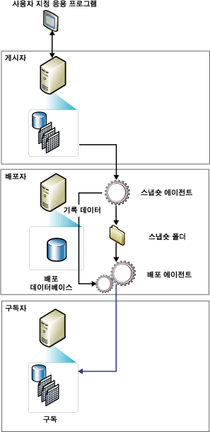

# 스냅숏 복제
  스냅숏 복제는 특정 시간에 나타나는 그대로 데이터를 배포하고 데이터 업데이트를 모니터링하지 않습니다. 동기화가 일어나면 전체 스냅숏이 생성되어 구독자에게 전송됩니다.  
  
> [!NOTE]  
>  스냅숏 복제는 단독으로 사용할 수 있지만 게시에서 지정한 모든 개체 및 데이터의 복사본을 만드는 스냅숏 프로세스는 일반적으로 트랜잭션 및 병합 게시에 대한 초기 데이터 및 데이터베이스 개체 집합을 제공하는 데에도 사용됩니다.  
  
 다음 조건 중 하나 이상이 해당될 경우 스냅숏 복제를 단독으로 사용하는 것이 좋습니다.  
  
-   데이터가 자주 변경되지 않습니다.  
  
-   게시자 측에서 최신이 아닌 데이터 복사본을 일정 기간 동안 보유할 수 있습니다.  
  
-   소량의 데이터를 복제합니다.  
  
-   짧은 기간 동안 많은 양의 데이터가 변경됩니다.  
  
 스냅숏 복제는 많은 양의 데이터가 변경되지만 자주 변경되지는 않을 때 가장 적합합니다. 예를 들어 한 판매 조직이 제품 가격 목록을 유지 관리하면서 일년에 한 번이나 두 번 가격을 동시에 업데이트한다면 데이터 전체 스냅숏이 변경된 후 복제하는 것이 좋습니다. 특정 유형의 데이터에 대해서는 스냅숏을 더 자주 복제하는 것이 적합할 수도 있습니다. 예를 들어 게시자에서 비교적 작은 테이블이 낮에 업데이트되었지만 어느 정도의 대기 시간이 허용되는 경우에는 변경 내용을 밤마다 스냅숏으로 배달할 수 있습니다.  
  
 증분 변경 내용은 추적되지 않으므로 스냅숏 복제에는 게시자에 트랜잭션 복제보다 낮은 연속 오버헤드가 있습니다. 그러나 복제 중인 데이터 집합이 아주 큰 경우에는 스냅숏을 생성하고 적용하는 데 상당히 많은 리소스가 필요합니다. 그러므로 스냅숏 복제 사용 여부를 평가할 때 전체 데이터 집합의 크기와 데이터 변경 빈도를 고려하세요.  
  
 **항목 내용**  
  
 [스냅숏 복제 작동 방법](#HowWorks)  
  
 [스냅숏 에이전트](#SnapshotAgent)  
  
 [배포 및 병합 에이전트](#DistAgent)  
  
##   스냅숏 복제 작동 방법  
 기본적으로 3가지 복제 유형은 모두 스냅숏을 사용하여 구독자를 초기화합니다. [!INCLUDE[ssNoVersion](../../includes/ssnoversion-md.md)] 스냅숏 에이전트는 항상 스냅숏 파일을 생성하지만 이 파일을 배달하는 에이전트는 사용하는 복제 유형에 따라 다릅니다. 스냅숏 복제 및 트랜잭션 복제는 배포 에이전트를 사용하여 파일을 배달하지만 병합 복제는 [!INCLUDE[ssNoVersion](../../includes/ssnoversion-md.md)] 병합 에이전트를 사용합니다. 배포자에서 스냅숏 에이전트를 실행합니다. 배포 에이전트와 병합 에이전트는 밀어넣기 구독을 위한 배포자에서 실행되거나 끌어오기 구독을 위한 구독자에서 실행됩니다.  
  
 구독을 만든 즉시 또는 게시를 만들 때 설정한 일정에 따라 스냅숏을 생성하고 적용할 수 있습니다. 스냅숏 에이전트는 게시된 테이블 및 데이터베이스 개체의 스키마 및 데이터를 포함하는 스냅숏 파일을 준비하여 게시자의 스냅숏 폴더에 저장하고 배포자의 배포 데이터베이스에 추적 정보를 기록합니다. 배포자를 구성할 때 기본 스냅숏 폴더를 지정하지만 기본 위치 대신 또는 기본 위치에 추가로 게시에 대한 대체 위치를 지정할 수 있습니다.  
  
 이 항목에 설명된 표준 스냅숏 프로세스 외에도 매개 변수가 있는 필터가 포함된 병합 게시에 대해 두 부분으로 구성된 스냅숏 프로세스가 사용됩니다.  
  
 다음 그림에서는 스냅숏 복제의 주요 구성 요소를 보여 줍니다.  
  
   
  
##   스냅숏 에이전트  
 병합 복제의 경우 스냅숏 에이전트가 실행될 때마다 스냅숏이 생성됩니다. 트랜잭션 복제의 경우 게시 속성 **immediate_sync**의 설정에 따라 스냅숏 생성이 달라집니다. 이 속성을 TRUE(새 게시 마법사 사용 시 기본 설정)로 설정하면 스냅숏 에이전트가 실행될 때마다 스냅숏이 생성되고 언제든지 스냅숏을 구독자에 적용할 수 있습니다. 이 속성을 FALSE( **sp_addpublication**사용 시 기본 설정)로 설정하면 스냅숏 에이전트가 마지막으로 실행된 후에 새 구독이 추가된 경우에만 스냅숏이 생성됩니다. 구독자는 동기화하기 위해 스냅숏 에이전트가 완료될 때까지 기다려야 합니다.  
  
 스냅숏 에이전트는 다음 단계를 수행하세요.  
  
1.  배포자에서 게시자로 연결을 설정한 다음 필요한 경우 게시된 테이블에 잠금을 수행합니다.  
  
    -   병합 게시의 경우 스냅숏 에이전트는 잠금을 수행하지 않습니다.  
  
    -   트랜잭션 게시의 경우 기본적으로 스냅숏 에이전트는 스냅숏 생성의 초기 단계에서만 잠금을 수행합니다.  
  
    -   스냅숏 게시의 경우 잠금은 전체 스냅숏 생성 프로세스 동안 유지됩니다.  
  
2.  각 아티클에 대한 테이블 스키마 복사본을 .sch 파일에 씁니다. 인덱스, 제약 조건, 저장 프로시저, 뷰, 사용자 정의 함수 등과 같은 다른 데이터베이스 개체가 게시되면 추가 스크립트 파일이 생성됩니다.  
  
3.  게시자에서 게시된 테이블의 데이터를 복사하고 이 데이터를 스냅숏 폴더에 기록합니다. 스냅숏은 BCP(대량 복사 프로그램) 파일의 집합으로 생성됩니다.  
  
4.  스냅숏 및 트랜잭션 게시의 경우 스냅숏 에이전트는 행을 배포 데이터베이스의 **MSrepl_commands** 및 **MSrepl_transactions** 테이블에 추가합니다. **MSrepl_commands** 테이블의 항목은 .sch 및 .bcp 파일, 다른 스냅숏 파일, 프리 스냅숏 및 포스트 스냅숏 스크립트에 대한 참조 위치를 나타내는 명령입니다. **MSrepl_transactions** 테이블의 항목은 구독자 동기화와 관련된 명령입니다.  
  
     병합 게시의 경우 스냅숏 에이전트는 추가 단계를 수행합니다.  
  
5.  게시된 테이블에서 모든 잠금을 해제합니다.  
  
 스냅숏을 생성하는 동안에는 게시된 테이블에서 스키마를 변경할 수 없습니다. 스냅숏 파일을 생성한 후에는 Windows 탐색기를 사용하여 스냅숏 폴더에서 해당 파일을 볼 수 있습니다.  
  
##   배포 에이전트 및 병합 에이전트  
 스냅숏 게시의 경우 배포 에이전트가 게시에 대해 실행될 때마다 아직 동기화되지 않았거나, 다시 초기화로 표시되었거나, 새 아티클을 포함하는 각 구독자로 새 스냅숏을 이동합니다.  
  
 스냅숏 및 트랜잭션 복제의 경우 배포 에이전트는 다음 단계를 수행하세요.  
  
1.  배포자에 연결합니다.  
  
2.  배포자의 배포 데이터베이스에서 **MSrepl_commands** 및 **MSrepl_transactions** 테이블을 검사합니다. 에이전트는 첫 번째 테이블에서 스냅숏 파일의 위치를 읽고 두 테이블 모두에서 구독자 동기화 명령을 읽습니다.  
  
3.  스키마 및 명령을 구독 데이터베이스로 적용합니다.  
  
 필터링되지 않은 병합 복제 게시의 경우 병합 에이전트는 다음 단계를 수행하세요.  
  
1.  게시자에 연결합니다.  
  
2.  게시자의 **sysmergeschemachange** 테이블을 검사하고 구독자에 적용해야 하는 새 스냅숏이 있는지 여부를 확인합니다.  
  
3.  새 스냅숏이 있는 경우 병합 에이전트는 **sysmergeschemachange**에 지정된 위치에 있는 스냅숏 파일을 구독 데이터베이스에 적용합니다.  
  
  
