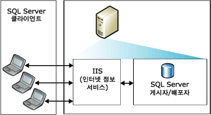
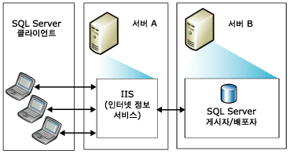
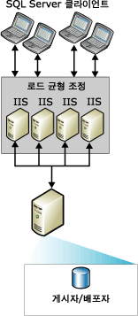

# Topologies for Web Synchronization
[!INCLUDE[appliesto-ss-xxxx-xxxx-xxx-md](../../includes/appliesto-ss-xxxx-xxxx-xxx-md.md)]
  다양한 [!INCLUDE[msCoName](../../includes/msconame-md.md)] [!INCLUDE[ssNoVersion](../../includes/ssnoversion-md.md)] 웹 동기화 복제 토폴로지를 선택할 수 있습니다. 웹 동기화를 구성하는 일반적인 방법은 다음과 같습니다.  
  
-   단일 서버  
  
-   두 대의 서버  
  
-   여러 [!INCLUDE[msCoName](../../includes/msconame-md.md)] 인터넷 정보 서비스(IIS) 시스템 및 [!INCLUDE[ssNoVersion](../../includes/ssnoversion-md.md)] 재게시  
  
 웹 동기화를 구성하는 방법은 [웹 동기화 구성](../../relational-databases/replication/configure-web-synchronization.md)을 참조하세요.  
  
## 단일 서버  
 가장 간단한 토폴로지에서 IIS, [!INCLUDE[ssNoVersion](../../includes/ssnoversion-md.md)] 게시자 및 [!INCLUDE[ssNoVersion](../../includes/ssnoversion-md.md)] 배포자는 모두 단일 서버에 상주합니다. 구독자는 게시자의 IIS에 연결하여 동기화합니다. 게시자는 방화벽 뒤에 있습니다.  
  
> [!NOTE]  
>  이 구성은 인트라넷 시나리오에만 사용하는 것이 좋습니다. 다른 시나리오에서는 IIS 서버와 [!INCLUDE[ssNoVersion](../../includes/ssnoversion-md.md)] 게시자/배포자를 별도의 컴퓨터에 두는 것이 좋습니다.  
  
   
  
## 두 대의 서버  
 한 서버에는 IIS를 두고 다른 서버에는 [!INCLUDE[ssNoVersion](../../includes/ssnoversion-md.md)] 게시자와 배포자를 구성할 수 있습니다. IIS를 실행하는 서버는 방화벽에 의해 인터넷에서 격리될 수 있습니다. 구독자는 IIS에 연결하여 동기화합니다.  
  
   
  
## 여러 IIS 시스템 및 SQL Server 재게시  
 동시에 동기화하는 많은 수의 구독자를 지원해야 하는 경우 IIS를 실행하는 여러 개의 컴퓨터에 작업을 분할할 수 있습니다.  
  
   
  
 [!INCLUDE[ssNoVersion](../../includes/ssnoversion-md.md)]를 실행하는 컴퓨터에서 로드 균형 조정이 필요한 경우 여러 컴퓨터에 재게시 계층을 만들 수 있습니다. 최상위 게시자에서 데이터를 구독자에 게시하면 구독자에서는 데이터를 다시 게시하고 최상위 게시자에서는 구독자의 로드 균형 조정 요청을 게시합니다.  
  
> [!NOTE]  
>  구독자는 특정 게시자하고만 동기화될 수 있습니다. 예를 들어 재게시자 A의 구독자는 A를 사용할 수 없는 경우 재게시자 B와도 동기화될 수 없습니다.  
  
   
  
## 참고 항목  
 [웹 동기화 구성](../../relational-databases/replication/configure-web-synchronization.md)   
 [병합 복제에 대한 웹 동기화](../../relational-databases/replication/web-synchronization-for-merge-replication.md)  
  
  
