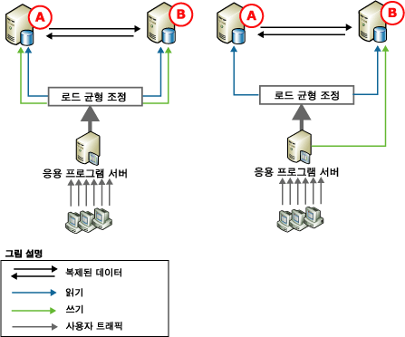
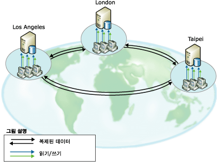
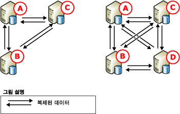

# 피어 투 피어 - 트랜잭션 복제
[!INCLUDE[appliesto-ss-xxxx-xxxx-xxx-md](../../../includes/appliesto-ss-xxxx-xxxx-xxx-md.md)]

  피어 투 피어 복제는 *노드*라고도 하는 여러 서버 인스턴스에 걸쳐 데이터 복사본을 유지 관리함으로써 확장성 및 고가용성 솔루션을 제공합니다. 트랜잭션 복제를 기반으로 구축된 피어 투 피어 복제는 트랜잭션 측면에서 일관적인 변경 내용을 거의 실시간으로 전파합니다. 따라서 읽기 작업을 확장해야 하는 애플리케이션은 클라이언트의 읽기 작업을 여러 노드에 배포할 수 있습니다. 여러 노드의 데이터가 거의 실시간으로 유지 관리되므로 피어 투 피어 복제는 데이터 중복을 제공하며 이러한 중복은 데이터의 가용성을 높여 줍니다.  
  
 웹 애플리케이션의 경우를 살펴 보겠습니다. 피어 투 피어 복제를 사용하는 웹 응용 프로그램은 다음과 같은 이점이 있습니다.  
  
-   카탈로그 쿼리 및 그 밖의 읽기 작업이 여러 노드에 분산되므로 읽기 작업이 증가해도 성능이 일정하게 유지됩니다.  
  
-   시스템의 노드 중 하나에 오류가 발생하는 경우 애플리케이션 계층에서 해당 노드에 대한 쓰기 작업을 다른 노드로 리디렉션할 수 있으므로 가용성이 유지됩니다.  
  
-   노드를 유지 관리해야 하거나 전체 시스템을 업그레이드해야 하는 경우 애플리케이션의 가용성에 영향을 주지 않고 각 노드를 오프라인 상태로 만들었다가 다시 시스템에 추가할 수 있습니다.  
  
 피어 투 피어 복제를 사용하면 읽기 작업을 확장할 수 있지만 토폴로지에 대한 쓰기 성능은 단일 노드의 경우와 유사합니다. 이는 모든 삽입, 업데이트 및 삭제가 모든 노드에 전파되기 때문입니다. 변경 내용이 지정된 노드에 적용되면 복제에서 이를 인식하여 변경 내용이 두 번 이상 노드에서 순환되지 않도록 합니다. 다음과 같은 이유로 인해 각 행에 대한 쓰기 작업은 하나의 노드에서만 수행하는 것이 좋습니다.  
  
-   두 개 이상의 노드에서 행이 수정되면 이 행이 다른 노드에 전파될 때 충돌이 발생하거나 업데이트가 손실될 수 있습니다.  
  
-   변경 내용이 복제될 때에는 항상 약간의 지연이 발생합니다. 최신 변경 내용을 즉시 확인해야 하는 애플리케이션에서는 여러 노드에 걸쳐 동적으로 애플리케이션 부하를 분산할 경우 문제가 발생할 수 있습니다.  
  
 피어 투 피어 복제에는 피어 투 피어 토폴로지에서 충돌을 검색할 수 있는 옵션이 포함됩니다. 이 옵션을 사용하면 일관성 없는 애플리케이션 동작, 업데이트 손실과 같은 검색되지 않는 충돌로 인해 발생하는 문제를 방지할 수 있습니다. 이 옵션을 설정하면 기본적으로 충돌을 일으키는 변경이 배포 에이전트 오류를 유발하는 치명적 오류로 취급됩니다. 충돌이 발생하면 충돌이 수동으로 해결되고 데이터가 토폴로지 전체에서 일관성을 가질 때까지 토폴로지가 일관성 없는 상태로 유지됩니다. 자세한 내용은 [Conflict Detection in Peer-to-Peer Replication](../../../relational-databases/replication/transactional/peer-to-peer-conflict-detection-in-peer-to-peer-replication.md)을 참조하세요.  
  
> [!NOTE]  
>  데이터 불일치의 가능성을 배제하려면 충돌 검색이 설정되어 있는 경우라도 피어 투 피어 토폴로지에서 충돌이 발생하지 않도록 해야 합니다. 특정 행에 대한 쓰기 작업이 하나의 노드에서만 수행되도록 하려면 데이터에 액세스하여 변경하는 애플리케이션에서 삽입, 업데이트 및 삭제 작업을 분할해야 합니다. 이렇게 분할하면 한 노드에서 발생한 지정된 행에 대한 수정이 다른 노드에서 해당 행을 수정하기 전에 토폴로지의 모든 노드와 동기화됩니다. 애플리케이션에 정교한 충돌 검색 및 해결 기능이 필요한 경우 병합 복제를 사용하세요. 자세한 내용은 [병합 복제](../../../relational-databases/replication/merge/merge-replication.md) 및 [병합 복제 충돌 감지 및 해결](../../../relational-databases/replication/merge/advanced-merge-replication-conflict-detection-and-resolution.md)을 참조하세요.  
  
## 피어 투 피어 토폴로지  
 다음 시나리오에서는 피어 투 피어 복제의 일반적 사용을 설명합니다.  
  
### 참여하는 데이터베이스가 두 개인 토폴로지  
   
  
 위의 두 그림에서는 참여하는 두 데이터베이스를 보여 주며 여기에서는 사용자 트래픽이 애플리케이션 서버를 통해 데이터베이스로 전송됩니다. 이러한 구성은 웹 사이트에서 작업 그룹 애플리케이션에 이르기까지 다양한 애플리케이션에 사용할 수 있으며 다음과 같은 이점을 제공합니다.  
  
-   두 개 이상의 서버에서 분산하여 읽게 되므로 읽기 성능이 향상됩니다.  
  
-   유지 관리가 필요하거나 한 노드에서 오류가 발생하는 경우에도 가용성이 높습니다.  
  
 두 그림에서는 참여하는 데이터베이스 간에 읽기 작업 로드의 균형이 조정되지만 업데이트는 다르게 처리됩니다.  
  
-   왼쪽 그림에서 업데이트는 두 서버 사이에 분할됩니다. 예를 들어 데이터베이스에 제품 카탈로그가 포함된 경우 사용자 지정 애플리케이션을 지정하여 A-M으로 시작하는 제품 이름에 대해서는 노드 **A** 로, N-Z로 시작하는 제품 이름에 대해서는 노드 **B** 로 업데이트를 전송하도록 할 수 있습니다. 그러면 이후 업데이트가 노드 간에 상호 복제됩니다.  
  
-   오른쪽 그림에서는 업데이트 내용이 모두 노드 **B**로 전송된 다음 여기에서 노드 **A**로 복제됩니다. **B**가 유지 관리 등의 이유로 오프라인 상태인 경우 애플리케이션 서버는 모든 작업을 **A**로 전달할 수 있습니다. **B**가 다시 온라인 상태가 되면 업데이트 내용을 이동할 수 있으며, 애플리케이션 서버는 모든 업데이트 내용을 다시 **B**로 옮기거나 계속해서 **A**로 전송할 수 있습니다.  
  
 피어 투 피어 복제에는 두 가지 방법이 모두 지원되지만 표준 트랜잭션 복제에서는 오른쪽의 중앙 업데이트 예가 주로 사용됩니다.  
  
### 참여하는 데이터베이스가 3개 이상인 토폴로지  
   
  
 위의 그림에서는 LA, 런던 및 타이베이에 지사가 있는 전세계적 소프트웨어 기술 지원 업체에 데이터를 제공하는 3개의 참여 데이터베이스를 보여 줍니다. 각 지사의 기술 지원 엔지니어는 고객의 전화를 받으며 각 통화에 대한 정보를 입력하고 업데이트합니다. 세 지사의 표준 시간대는 8시간씩 차이가 나므로 업무 시간이 중복되지 않습니다. 타이베이 지사가 업무를 마감하면 런던 지사가 업무를 시작합니다. 한 지사가 업무를 마감할 때 진행 중인 통화가 있으면 해당 통화는 다음으로 업무가 시작되는 지사의 담당자에게 전송됩니다.  
  
 각 위치에는 데이터베이스와 애플리케이션 서버가 있어 기술 지원 엔지니어가 고객 통화에 대한 정보를 입력하고 업데이트할 때 사용할 수 있습니다. 토폴로지는 시간별로 분할되므로 현재 업무를 진행 중인 노드에서만 업데이트가 발생하며 이후 다른 참여 데이터베이스로 업데이트 내용이 이동됩니다. 이러한 토폴로지를 사용하면 다음과 같은 이점이 있습니다.  
  
-   격리하지 않아도 독립적으로 운영될 수 있습니다. 각 지사에서는 데이터를 독립적으로 삽입, 업데이트 또는 삭제할 수 있지만 참여하는 다른 모든 데이터베이스에 데이터가 복제되므로 데이터를 공유할 수 있습니다.  
  
-   참여하는 데이터베이스 중 하나 이상에서 오류가 발생하거나 유지 관리가 필요한 경우에도 높은 가용성을 제공합니다.  
  
       
  
 위의 그림에서는 3노드 토폴로지에 노드를 하나 더 추가하는 것을 보여 줍니다. 이 시나리오에서는 다음과 같은 이유로 노드를 추가할 수 있습니다.  
  
-   다른 지사가 개설되었습니다.  
  
-   디스크 오류나 그 밖의 주요한 오류 발생 시 내결함성을 높이기 위해 또는 유지 관리를 지원하기 위해 더 높은 가용성을 제공하려고 합니다.  
  
 3노드 토폴로지와 4노드 토폴로지에서는 모든 데이터베이스가 다른 데이터베이스에 게시하고 다른 데이터베이스를 구독합니다. 따라서 하나 이상의 노드에 오류가 발생하거나 유지 관리가 필요한 경우 최대 가용성이 제공됩니다. 노드를 추가한 다음에는 성능과 배포 및 관리의 복잡성과 가용성 및 확장성 요구 사이에서 균형을 유지해야 합니다.  
  
## 피어 투 피어 복제 구성  
 피어 투 피어 복제 토폴로지의 구성은 일련의 표준 트랜잭션 게시 및 구독을 구성하는 것과 매우 유사합니다. 다음 항목에서 설명하는 단계에서는 피어 투 피어 토폴로지를 보여 주는 이전 그림의 왼쪽 구성과 유사한, 3개의 노드로 이루어진 시스템 구성을 보여 줍니다.  
  
## 피어 투 피어 복제 사용 시 고려 사항  
 이 섹션에서는 피어 투 피어 복제를 사용할 때 고려해야 할 정보와 지침을 제공합니다.  
  
### 일반적인 고려 사항  
  
-   피어 투 피어 복제는 [!INCLUDE[ssNoVersion](../../../includes/ssnoversion-md.md)]의 엔터프라이즈 버전에서만 사용할 수 있습니다.  
  
-   피어 투 피어 복제에 참여하는 모든 데이터베이스에는 동일한 스키마 및 데이터가 있어야 합니다.  
  
    -   개체 이름, 개체 스키마 및 게시 이름이 동일해야 합니다.  
  
    -   게시에서 스키마 변경 내용의 복제를 허용해야 합니다(게시 속성 **replicate_ddl**에 대해 기본값인 **1** 설정. 자세한 내용은 [게시 데이터베이스의 스키마 변경](../../../relational-databases/replication/publish/make-schema-changes-on-publication-databases.md)을 참조하세요.  
  
    -   행 및 열 필터링은 지원되지 않습니다.  
  
-   각 노드가 고유한 배포 데이터베이스를 사용하는 것이 좋습니다. 이렇게 하면 단일 지점에서 오류가 발생할 가능성이 없어집니다.  
  
-   테이블 및 기타 개체는 단일 게시 데이터베이스 내의 여러 피어 투 피어 게시에 포함될 수 없습니다.  
  
-   구독을 만들려면 먼저 게시에 피어 투 피어 복제를 사용할 수 있도록 설정해야 합니다.  
  
-   백업이나 **'replication support only'** 옵션을 사용하여 구독을 초기화해야 합니다. 자세한 내용은 [스냅샷 없이 트랜잭션 구독 초기화](../../../relational-databases/replication/initialize-a-transactional-subscription-without-a-snapshot.md)에서 수동으로 구독을 초기화하는 방법에 대해 설명합니다.  
  
-   ID 열은 사용하지 않는 것이 좋습니다. ID를 사용하는 경우 참여하는 각 데이터베이스에서 테이블에 할당된 범위를 수동으로 관리해야 합니다. 자세한 내용은 [ID 열 복제](../../../relational-databases/replication/publish/replicate-identity-columns.md)에서 "ID 범위 수동 관리를 위한 범위 할당" 섹션을 참조하세요.  
  
### 기능 제한  
 피어 투 피어 복제는 트랜잭션 복제의 주요 기능을 지원하지만 다음 옵션은 지원하지 않습니다.  
  
-   스냅샷을 사용하여 초기화 및 다시 초기화  
  
-   행 및 열 필터  
  
-   타임스탬프 열  
  
-   [!INCLUDE[ssNoVersion](../../../includes/ssnoversion-md.md)] 이외 게시자 및 구독자  
  
-   즉시 업데이트 구독 및 지연 업데이트 구독  
  
-   익명 구독  
  
-   부분 구독  
  
-   연결 가능한 구독 및 변환 가능한 구독 (두 옵션 모두 [!INCLUDE[ssVersion2005](../../../includes/ssversion2005-md.md)]에서 사용되지 않습니다.)  
  
-   공유 배포 에이전트  
  
-   배포 에이전트 매개 변수 **-SubscriptionStreams** 및 로그 판독기 에이전트 매개 변수 **-MaxCmdsInTran**  
  
-   아티클 속성 `@destination_owner` 및 `@destination_table`

-   피어 투 피어 트랜잭션 복제에서는 피어 투 피어 게시에 대한 단방향 트랜잭션 구독을 만들 수 없습니다.   
  
 다음 속성에는 특별히 고려할 사항이 있습니다.  
  
-   게시 속성 `@allow_initialize_from_backup`의 값은 **true**여야 합니다.  
  
-   아티클 속성 `@replicate_ddl`의 값은 **true**, `@identityrangemanagementoption`의 값은 **manual**이어야 하고 `@status`에 옵션 **24**를 설정해야 합니다.  
  
-   아티클 속성 `@ins_cmd`, `@del_cmd` 및 `@upd_cmd`의 값을 **SQL**로 설정할 수 없습니다.  
  
-   구독 속성 `@sync_type`의 값은 **none** 또는 **automatic**이어야 합니다.  
  
### 유지 관리 고려 사항  
 시스템을 정지해야 수행할 수 있는 작업도 있습니다. 즉, 모든 노드에서 게시된 테이블에 대한 작업을 중지하고 각 노드가 다른 모든 노드의 변경 내용을 모두 받았는지 확인해야 합니다.  
  
||SQL Server 2005 피어 전용 또는 SQL Server 2005 피어와 SQL Server 2008 이상 피어 혼합|SQL Server 2005 피어 전용 또는 SQL Server 2005 피어와 SQL Server 2008 이상 피어 혼합|SQL 2008 이상 피어|SQL 2008 이상 피어|  
|-|------------------------------------------------------------------------------------------------------|------------------------------------------------------------------------------------------------------|------------------------------|------------------------------|  
|토폴로지에 노드 추가|전체 토폴로지의 2개 노드: 정지 필요 없음. 대신 `sync_type = 'initialize with backup'`를|2개 노드 초과: 정지 필요.|`sync_type = 'replication support only'`: 정지 필요.|`sync_type = 'initialize with backup'` 및 `'initialize from lsn'`: 정지 필요 없음.|  
  
 토폴로지 스키마 변경(아티클 추가 또는 삭제) 시에는 시스템을 정지해야 합니다. 자세한 내용은 [피어 투 피어 토폴로지 관리&#40;복제 Transact-SQL 프로그래밍&#41;](../../../relational-databases/replication/administration/administer-a-peer-to-peer-topology-replication-transact-sql-programming.md)를 참조하세요.  
  
 토폴로지에서 노드를 제거할 때는 시스템을 정지할 필요가 없습니다.  
  
 [sp_changearticle](../../../relational-databases/system-stored-procedures/sp-changearticle-transact-sql.md) 을 사용하여 아티클 속성을 변경할 때는 시스템을 정지할 필요가 없습니다. P2P의 경우 변경 가능한 항목은 `description`, `ins_cmd`, `upd_cmd`및 `del_cmd` 속성입니다.  
  
 아티클 스키마 변경(열 추가/삭제) 시에는 시스템을 정지할 필요가 없습니다.  
  
-   아티클 추가: 기존 구성에 아티클을 추가하는 경우에는 시스템을 정지하고 CREATE TABLE 문을 실행하여 토폴로지의 각 노드에서 초기 데이터를 로드하고 토폴로지의 각 노드에서 새 아티클을 추가해야 합니다.  
  
-   아티클 삭제: 모든 노드의 상태를 일관되게 유지하려면 토폴로지를 정지해야 합니다.  
  
 자세한 내용은 [복제 토폴로지 정지&#40;복제 Transact-SQL 프로그래밍&#41;](../../../relational-databases/replication/administration/quiesce-a-replication-topology-replication-transact-sql-programming.md) 및 [피어 투 피어 토폴로지 관리&#40;복제 Transact-SQL 프로그래밍&#41;](../../../relational-databases/replication/administration/administer-a-peer-to-peer-topology-replication-transact-sql-programming.md)를 참조하세요.  
  
-   피어 투 피어 토폴로지에 새 노드를 추가하는 경우 새 노드가 추가된 후 만들어진 백업에서만 복원해야 합니다.  
  
-   피어 투 피어 토폴로지에서 구독을 다시 초기화할 수 없습니다. 노드에 새로운 데이터 복사본을 유지하려면 해당 노드에서 백업을 복원합니다.  
  
## 참고 항목  
 [피어 투 피어 토폴로지 관리&#40;복제 Transact-SQL 프로그래밍&#41;](../../../relational-databases/replication/administration/administer-a-peer-to-peer-topology-replication-transact-sql-programming.md)   
 [스냅샷 및 트랜잭션 복제의 백업 및 복원을 위한 전략](../../../relational-databases/replication/administration/strategies-for-backing-up-and-restoring-snapshot-and-transactional-replication.md)   
 [트랜잭션 복제](../../../relational-databases/replication/transactional/transactional-replication.md)  
  
  
