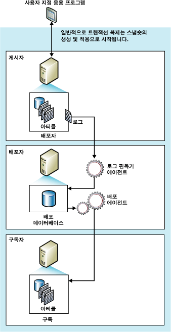

# 트랜잭션 복제
  트랜잭션 복제는 일반적으로 게시 데이터베이스 개체 및 데이터의 스냅숏으로 시작됩니다. 일반적으로 초기 스냅숏이 사용되자마자 게시자에서의 후속 데이터 변경 내용 및 스키마 수정 내용이 구독자로 배달됩니다. 이러한 작업은 거의 실시간으로 수행됩니다. 데이터 변경 내용은 게시자에서 발생한 것과 같은 순서 및 같은 트랜잭션 경계 내에서 구독자에 적용되므로 게시 내에서는 트랜잭션 일관성이 보장됩니다.  
  
 트랜잭션 복제는 일반적으로 서버 간 환경에 사용되며 다음과 같은 경우에 적합합니다.  
  
-   증분 변경 내용을 발생과 동시에 구독자로 전파하려고 합니다.  
  
-   응용 프로그램이 게시자에서 변경이 수행된 시점과 해당 변경 내용이 구독자에 도달한 시점 간의 짧은 대기 시간이 필요합니다.  
  
-   응용 프로그램이 중간 데이터 상태에 액세스해야 합니다. 예를 들어 한 행이 5번 변경될 경우 트랜잭션 복제를 사용하면 응용 프로그램은 행의 실질적인 데이터 변경만이 아닌 모든 변경(예: 트리거 실행)에 응답할 수 있습니다.  
  
-   게시자가 많은 양의 삽입, 업데이트 및 삭제 작업을 수행합니다.  
  
-   게시자 또는 구독자가 Oracle과 같은[!INCLUDE[ssNoVersion](../../../includes/ssnoversion-md.md)] 이외의 데이터베이스입니다.  
  
 기본적으로 변경 내용은 게시자로 다시 전파되지 않기 때문에 트랜잭션 게시에 대한 구독자는 읽기 전용으로 취급됩니다. 그러나 트랜잭션 복제는 구독자의 업데이트를 허용하는 다양한 옵션을 제공합니다.  
  
 **항목 내용**  
  
 [트랜잭션 복제 작동 방법](#HowWorks)  
  
 [초기 데이터 집합](#Dataset)  
  
 [스냅숏 에이전트](#SnapshotAgent)  
  
 [로그 판독기 에이전트](#LogReaderAgent)  
  
 [배포 에이전트](#DistributionAgent)  
  
##   트랜잭션 복제 작동 방법  
 [!INCLUDE[ssNoVersion](../../../includes/ssnoversion-md.md)] 스냅숏 에이전트, 로그 판독기 에이전트 및 배포 에이전트가 트랜잭션 복제를 구현합니다. 스냅숏 에이전트는 게시된 테이블과 데이터베이스 개체의 스키마 및 데이터를 포함하는 스냅숏 파일을 준비하여 스냅숏 폴더에 저장하고 배포자의 배포 데이터베이스에 동기화 작업을 기록합니다.  
  
 로그 판독기 에이전트는 트랜잭션 복제를 위해 구성한 각 데이터베이스의 트랜잭션 로그를 모니터링하고 복제용으로 표시된 트랜잭션을 트랜잭션 로그에서 배포 데이터베이스로 복사하여 안정적인 저장 후 전달 큐 역할을 합니다. 배포 에이전트는 스냅숏 폴더의 초기 스냅숏 파일과 배포 데이터베이스 테이블의 트랜잭션을 구독자로 복사합니다.  
  
 게시자에서 적용한 증분 변경 내용은 최소한의 대기 시간을 위해 계속 실행하거나 예약된 간격마다 실행할 수 있는 배포 에이전트의 일정에 따라 구독자로 이동할 수 있습니다. 즉시 업데이트 또는 지연 업데이트 옵션 없이 트랜잭션 복제를 사용하는 경우 게시자에서 데이터를 변경해야 하기 때문에 업데이트 충돌이 방지됩니다. 최종적으로 모든 구독자는 게시자와 같은 값을 갖게 됩니다. 즉시 업데이트 또는 지연 업데이트 옵션을 트랜잭션 복제와 함께 사용하면 구독자에서 업데이트를 할 수 있고 지연 업데이트의 경우에는 충돌이 발생할 수 있습니다.  
  
 다음 그림에서는 트랜잭션 복제의 주요 구성 요소를 보여 줍니다.  
  
   
  
##   초기 데이터 집합  
 새 트랜잭션 복제 구독자가 게시자에서 증분 변경 내용을 받으려면 구독자의 테이블에 게시자의 테이블과 같은 스키마 및 데이터가 포함되어야 합니다. 초기 데이터 집합은 일반적으로 스냅숏 에이전트에서 만들고 배포 에이전트에서 배포 및 적용한 스냅숏입니다. 초기 데이터 집합은 백업이나 [!INCLUDE[ssNoVersion](../../../includes/ssnoversion-md.md)] Integration Services와 같은 다른 방법으로 지정할 수도 있습니다.  
  
 스냅숏을 구독자에게 배포 및 적용한 경우 초기 스냅숏을 기다리는 구독자만 영향을 받습니다. 해당 게시에 대한 다른 구독자(이미 초기화된 구독자)는 영향을 받지 않습니다.  
  
## 동시 스냅숏 처리  
 스냅숏 복제는 스냅숏을 생성하는 동안 복제의 일부로 게시된 모든 테이블에 공유 잠금을 배치합니다. 이렇게 하면 업데이트가 게시 중인 테이블에서 이루어지는 것을 방지할 수 있습니다. 트랜잭션 복제의 기본값인 동시 스냅숏 처리는 전체 스냅숏 생성 과정 동안 공유 잠금을 보유하지 않기 때문에 복제에서 초기 스냅숏 파일을 만드는 동안 사용자는 중단 없이 작업을 계속할 수 있습니다.  
  
##   스냅숏 에이전트  
 스냅숏 에이전트가 트랜잭션 복제에서 초기 스냅숏을 구현하는 프로시저는 스냅숏 복제에서 사용하는 프로시저와 같습니다. 앞에서 설명한 것처럼 동시 스냅숏 처리에 대해서는 제외합니다.  
  
 스냅숏 파일을 만든 후 [!INCLUDE[msCoName](../../../includes/msconame-md.md)] Windows 탐색기를 사용하여 스냅숏 폴더에서 해당 파일을 볼 수 있습니다.  
  
##   데이터 수정 및 로그 판독기 에이전트  
 로그 판독기 에이전트는 배포자에서 실행됩니다. 일반적으로 로그 판독기 에이전트는 계속해서 실행되지만 사용자가 설정한 일정에 따라 실행할 수도 있습니다. 로그 판독기 에이전트는 실행 시 먼저 게시의 트랜잭션 로그(일반 [!INCLUDE[ssNoVersion](../../../includes/ssnoversion-md.md)] 데이터베이스 엔진 작업 중 트랜잭션 추적 및 복구에 사용되는 것과 같은 데이터베이스 로그)를 읽고 INSERT, UPDATE 및 DELETE 문 또는 복제용으로 표시된 트랜잭션의 데이터에 대한 다른 수정 사항을 식별합니다. 그 다음 에이전트는 일괄 작업으로 이러한 트랜잭션을 배포자의 배포 데이터베이스로 복사합니다. 로그 판독기 에이전트는 **sp_replcmds** 내부 저장 프로시저를 사용하여 복제용으로 표시된 다음 명령 집합을 로그에서 가져옵니다. 그 다음 배포 데이터베이스는 변경 내용을 구독자로 전달하는 저장 후 전달 큐가 됩니다. 커밋된 트랜잭션만 배포 데이터베이스로 전달됩니다.  
  
 전체 트랜잭션 일괄 처리는 배포 데이터베이스로 성공적으로 기록된 다음 커밋됩니다. 배포자에 대한 각 명령 일괄 처리가 커밋되면 로그 판독기 에이전트는 **sp_repldone** 을 호출하여 복제가 마지막으로 완료된 곳을 표시합니다. 마지막으로 이 에이전트는 트랜잭션 로그에서 제거할 행을 표시합니다. 복제되기를 계속 기다리는 행은 제거되지 않습니다.  
  
 트랜잭션 명령은 모든 구독자에게 전파되거나 최대 배포 보존 기간에 도달할 때까지 배포 데이터베이스에 저장됩니다. 게시자에서 적용된 것과 같은 순서로 구독자는 트랜잭션을 받습니다.  
  
##   배포 에이전트  
 배포 에이전트는 밀어넣기 구독을 위한 배포자 또는 끌어오기 구독을 위한 구독자에서 실행됩니다. 이 에이전트는 트랜잭션을 배포 데이터베이스에서 구독자로 이동합니다. 구독이 유효성 검사용으로 표시된 경우에 배포 에이전트는 게시자와 구독자의 데이터가 일치하는지 확인하는 작업도 수행합니다.  
  
  
