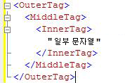
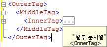

# <a name="code-outlining"></a>코드 개요
  [!INCLUDE[ssManStudioFull](../../includes/ssmanstudiofull-md.md)] 쿼리 편집기에서 쿼리를 편집할 때 개요 기능을 사용하여 코드를 필요에 따라 숨길 수 있습니다. 이 기능을 사용하면 특히 큰 쿼리 파일에서 작업 중인 코드를 쉽게 볼 수 있습니다.  
  
## <a name="outlining-overview"></a>개요 기능 개요  
 기본적으로 쿼리 편집기 창을 열 때 모든 코드가 표시되지만 필요에 따라 코드 영역을 축소하여 코드를 숨길 수 있습니다. 편집기 창 왼쪽 가장자리의 세로선에서 빼기 기호(-)가 있는 사각형은 축소 가능한 각 코드 영역의 시작 부분을 나타냅니다. 빼기 기호를 클릭하면 코드 영역의 텍스트는 3개의 마침표( )가 포함된 상자로 바뀌고 빼기 기호는 더하기 기호(+)로 변합니다. 더하기 기호를 클릭하면 축소된 코드가 나타나고 더하기 기호가 빼기 기호로 변합니다. 포인터를 3개의 마침표가 있는 상자 위로 이동하면 축소된 섹션의 코드를 보여 주는 도구 설명이 나타납니다.  
  
## <a name="system-outline-regions"></a>시스템 개요 영역  
 각 [!INCLUDE[ssManStudioFull](../../includes/ssmanstudiofull-md.md)] 편집기에서는 기본 시스템 정의 개요 영역 집합을 생성합니다.  
  
 MDX 및 DMX 코드 편집기는 여러 줄로 된 각 문에 대한 개요 영역을 만듭니다. 이것이 이러한 편집기에서 지원하는 유일한 개요 수준입니다.  
  
### <a name="analysis-services-xmla-query-editor-regions"></a>Analysis Services XMLA 쿼리 편집기 영역  
 [!INCLUDE[ssASnoversion](../../includes/ssasnoversion-md.md)] XMLA 쿼리 편집기는 여러 줄로 된 각 XML 특성에 대한 개요 영역을 생성합니다. 중첩 태그에 대한 개요 영역은 중첩됩니다. 예를 들어 XMLA 편집기는 다음 문서에 대해 3개의 개요 영역을 만듭니다.  
  
   
  
 \<InnerTag> 줄의 빼기 기호를 클릭하면 다음 그림과 같이 InnerTag만 축소됩니다.  
  
   
  
 포인터를 3개의 마침표(...)가 있는 상자 위로 이동하면 다음 그림과 같이 축소된 영역의 코드가 도구 설명에 나타납니다.  
  
   
  
 \<MiddleTag> 줄의 빼기 기호를 클릭하면 다음 그림과 같이 MiddleTag 및 InnerTag가 모두 축소됩니다.  
  
   
  
 \<OuterTag> 줄의 빼기 기호를 클릭하면 다음 그림과 같이 3개의 줄이 모두 축소됩니다.  
  
   
  
### <a name="database-engine-query-editor-regions"></a>데이터베이스 엔진 쿼리 편집기 영역  
 [!INCLUDE[ssDE](../../includes/ssde-md.md)] 쿼리 편집기는 다음 계층의 각 요소에 대한 개요 영역을 생성합니다.  
  
1.  일괄 처리. 첫 번째 일괄 처리는 파일의 시작 부분과 첫 번째 GO 명령 사이에 있는 코드입니다. GO 명령이 없는 경우에는 파일의 시작 부분과 파일의 끝 부분 사이에 있는 코드입니다. 첫 번째 GO 다음에는 각 GO 명령과 다음 GO 명령 또는 파일의 끝 부분 사이에 하나의 일괄 처리가 있습니다.  
  
2.  다음 키워드로 구분된 블록  
  
    -   BEGIN - END  
  
    -   BEGIN TRY - END TRY  
  
    -   BEGIN CATCH - END CATCH  
  
3.  여러 줄로 된 문  
  
 예를 들어 [!INCLUDE[ssDE](../../includes/ssde-md.md)] 쿼리 편집기는 다음 쿼리에 대해 3개의 개요 영역을 만듭니다.  
  
```  
CREATE PROCEDURE Sales.SampleProc --Outline region 1  
AS  
BEGIN --Outline region 2   
  SELECT GETDATE() AS TimeOfQuery;  
  SELECT * --Outline region 3  
  FROM sys.transmission_queue;  
  SELECT @@VERSION;  
END;  
GO  
```  
  
 `SELECT *` 줄의 빼기 기호를 클릭하여 해당 `SELECT` 문만 축소할 수 있습니다. 전체 `BEGIN - END` 블록을 축소하려면 `BEGIN` 줄의 빼기 기호를 클릭합니다. 전체 일괄 처리를 `GO` 명령으로 축소하려면 `CREATE PROCEDURE` 줄의 빼기 기호를 클릭합니다. `SELECT GETDATE()` 또는 `SELECT @@VERSION` 줄은 한 줄로 된 문이고 개요 영역이 없기 때문에 개별적으로 축소할 수 없습니다.  
  
  
