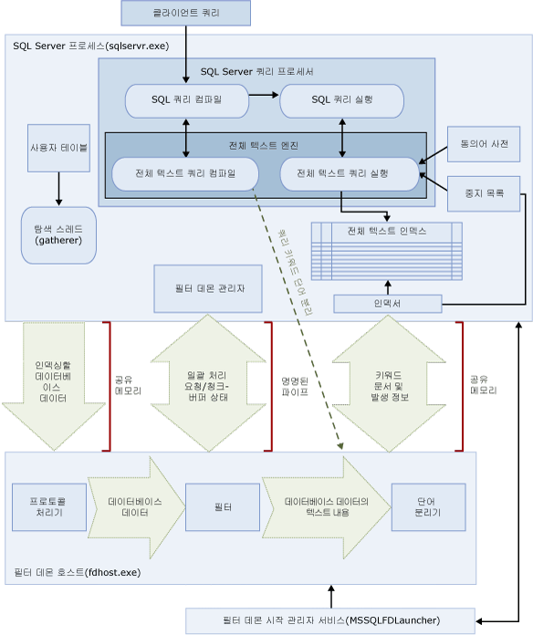

# <a name="full-text-search"></a>전체 텍스트 검색
[!INCLUDE [SQL Server Azure SQL Database](../../includes/applies-to-version/sql-asdb.md)]

[!INCLUDE[ssNoVersion](../../includes/ssnoversion-md.md)] 및 [!INCLUDE[ssSDSFull](../../includes/sssdsfull-md.md)] 의 전체 텍스트 검색을 사용하면 사용자와 애플리케이션이 [!INCLUDE[ssNoVersion](../../includes/ssnoversion-md.md)] 테이블의 문자 기반 데이터에 대해 전체 텍스트 쿼리를 실행할 수 있습니다.
  
## <a name="basic-tasks"></a>기본 태스크
이 항목에서는 전체 텍스트 검색의 개요를 제공하고 해당 구성 요소 및 아키텍처에 대해 설명합니다. 지금 바로 시작하려면 기본 태스크는 다음과 같습니다.
-   [전체 텍스트 검색 시작](../../relational-databases/search/get-started-with-full-text-search.md)
-   [전체 텍스트 카탈로그 만들기 및 관리](../../relational-databases/search/create-and-manage-full-text-catalogs.md)
-   [전체 텍스트 인덱스 만들기 및 관리](../../relational-databases/search/create-and-manage-full-text-indexes.md)
-   [전체 텍스트 인덱스 채우기](../../relational-databases/search/populate-full-text-indexes.md)
-   [전체 텍스트 검색을 사용한 쿼리](../../relational-databases/search/query-with-full-text-search.md)

> [!NOTE]
> Full-Text Search is an optional component of the [!INCLUDE[ssNoVersion](../../includes/ssnoversion-md.md)] 데이터베이스 엔진의 선택적 구성 요소입니다. SQL Server를 설치할 때 전체 텍스트 검색을 선택하지 않은 경우 SQL Server 설치 프로그램을 다시 실행하여 검색을 추가합니다.

## <a name="overview"></a>개요
전체 텍스트 인덱스에는 테이블에 있는 하나 이상의 문자 기반 열이 포함됩니다. 이러한 열의 데이터 형식은 **char**, **varchar**, **nchar**, **nvarchar**, **text**, **ntext**, **image**, **xml** 또는 **varbinary(max)** 및 **FILESTREAM** 중 하나일 수 있습니다. 각 전체 텍스트 인덱스는 테이블의 열을 하나 이상 인덱싱하며, 각 열은 특정 언어를 사용할 수 있습니다.  
  
 전체 텍스트 쿼리는 영어와 일본어 같은 특정 언어의 규칙을 기준으로 단어와 구에 적용되어 전체 텍스트 인덱스의 텍스트 데이터에 대해 언어 검색을 수행합니다. 전체 텍스트 쿼리에는 간단한 단어와 구 또는 여러 형식의 단어나 구가 포함될 수 있습니다. 전체 텍스트 쿼리는 일치 항목( *적중*이라고도 함)이 하나 이상 있는 문서를 모두 반환합니다. 대상 문서가 전체 텍스트 쿼리에 지정된 모든 용어를 포함하며 일치하는 용어 사이의 거리와 같이 다른 모든 검색 조건과 일치할 때 일치 항목이 발생합니다.    
  
##  <a name="full-text-search-queries"></a><a name="queries"></a> 전체 텍스트 검색 쿼리  
 전체 텍스트 인덱스에 열을 추가한 후에는 사용자와 애플리케이션이 해당 열의 텍스트에 대해 전체 텍스트 쿼리를 실행할 수 있습니다. 이러한 쿼리는 다음 중 하나를 검색할 수 있습니다.  
  
-   하나 이상의 특정 단어 또는 구(*단순 단어*)  
  
-   특정 텍스트로 시작하는 단어 또는 그러한 단어를 포함하는 구(*접두사 단어*)  
  
-   특정 단어의 굴절형(*생성 단어*)  
  
-   다른 단어나 구와 근접한 단어나 구(*근접 단어*)  
  
-   특정 단어의 동의어 형태(*동의어 사전*)  
  
-   가중치를 사용하는 단어나 구(*가중치 단어*)  
  
 전체 텍스트 쿼리는 대/소문자를 구분하지 않습니다. 예를 들어 "Aluminum" 또는 "aluminum"을 검색하면 동일한 결과가 반환됩니다.  
  
 전체 텍스트 쿼리는 일부 [!INCLUDE[tsql](../../includes/tsql-md.md)] 조건자(CONTAINS 및 FREETEXT) 및 함수(CONTAINSTABLE 및 FREETEXTTABLE) 집합을 사용합니다. 그러나 전체 텍스트 쿼리의 구조는 지정된 비즈니스 시나리오의 검색 목표에 따라 달라집니다. 예를 들면 다음과 같습니다.  
  
-   e-비즈니스 - 웹 사이트에서 제품 검색  
  
    ```  
    SELECT product_id   
    FROM products   
    WHERE CONTAINS(product_description, "Snap Happy 100EZ" OR FORMSOF(THESAURUS,'Snap Happy') OR '100EZ')   
    AND product_cost < 200 ;  
    ```  
  
-   채용 시나리오 - [!INCLUDE[ssNoVersion](../../includes/ssnoversion-md.md)]를 사용한 경험이 있는 지원자 검색  
  
    ```  
    SELECT candidate_name,SSN   
    FROM candidates   
    WHERE CONTAINS(candidate_resume,"SQL Server") AND candidate_division = 'DBA';  
    ```  
  
 자세한 내용은 [전체 텍스트 검색을 사용한 쿼리](../../relational-databases/search/query-with-full-text-search.md)를 참조하세요.  
  
##  <a name="compare-full-text-search-queries-to-the-like-predicate"></a><a name="like"></a> LIKE 조건자와 전체 텍스트 검색 쿼리 비교
 전체 텍스트 검색과 달리 [LIKE](../../t-sql/language-elements/like-transact-sql.md) [!INCLUDE[tsql](../../includes/tsql-md.md)] 조건자는 문자 패턴에 대해서만 적용됩니다. 또한 LIKE 조건자는 서식 있는 이진 데이터를 쿼리하는 데 사용할 수도 없습니다. 특히 구조화되지 않은 많은 텍스트 데이터에 대한 LIKE 쿼리는 동일한 데이터에 대한 전체 텍스트 쿼리보다 훨씬 느립니다. 수백만 개의 텍스트 데이터 행에 대해 LIKE 쿼리를 실행하면 결과가 반환되기까지 몇 분이 걸릴 수 있지만 같은 데이터에 대해 전체 텍스트 쿼리를 실행하면 반환되는 행 수에 따라 몇 초 내에 완료됩니다.  
  
##  <a name="full-text-search-architecture"></a><a name="architecture"></a> 전체 텍스트 검색 아키텍처
 전체 텍스트 검색 아키텍처는 다음과 같은 프로세스로 구성됩니다.  
  
-   [!INCLUDE[ssNoVersion](../../includes/ssnoversion-md.md)] 프로세스(sqlservr.exe).  
  
-   필터 데몬 호스트 프로세스(fdhost.exe).  
  
     보안상의 이유로 필터가 필터 데몬 호스트라는 개별 프로세스에 의해 로드됩니다. fdhost.exe 프로세스는 FDHOST Launcher 서비스(MSSQLFDLauncher)에 의해 만들어지고 FDHOST Launcher 서버 계정의 보안 자격 증명을 사용하여 실행됩니다. 따라서 전체 텍스트 인덱싱과 전체 텍스트 쿼리를 수행하려면 FDHOST Launcher 서비스를 실행해야 합니다. 이 서비스에 대한 서비스 계정을 설정하는 방법은 [전체 텍스트 필터 데몬 시작 관리자 서비스 계정 설정](../../relational-databases/search/set-the-service-account-for-the-full-text-filter-daemon-launcher.md)을 참조하세요.  
  
 이러한 두 프로세스에는 전체 텍스트 검색 아키텍처의 구성 요소가 포함됩니다. 이러한 구성 요소 및 이들의 관계는 다음 그림에 요약되어 있습니다. 구성 요소는 이 그림 다음에 설명되어 있습니다.  
  
   

###  <a name="sql-server-process"></a><a name="sqlprocess"></a> SQL Server 프로세스  
 [!INCLUDE[ssNoVersion](../../includes/ssnoversion-md.md)] 프로세스는 전체 텍스트 검색에 다음 구성 요소를 사용합니다.  
  
-   **사용자 테이블.** 이 테이블은 전체 텍스트 인덱싱할 데이터를 포함합니다.  
  
-   **전체 텍스트 Gatherer.** 전체 텍스트 Gatherer는 전체 텍스트 탐색 스레드와 함께 작동합니다. 이 구성 요소는 전체 텍스트 카탈로그를 모니터링하고 전체 텍스트 인덱스 채우기를 예약 및 수행합니다.  
  
-   **동의어 사전 파일.** 이 파일은 검색어의 동의어를 포함합니다. 자세한 내용은 [전체 텍스트 검색에 사용할 동의어 사전 파일 구성 및 관리](../../relational-databases/search/configure-and-manage-thesaurus-files-for-full-text-search.md)를 참조하세요.  
  
-   **중지 목록 개체.** Stoplist 개체는 검색에 유용하지 않은 일반적인 단어의 목록을 포함합니다. 자세한 내용은 [전체 텍스트 검색에 사용할 중지 단어와 중지 목록 구성 및 관리](../../relational-databases/search/configure-and-manage-stopwords-and-stoplists-for-full-text-search.md)를 참조하세요.  
  
-   **[!INCLUDE[ssNoVersion](../../includes/ssnoversion-md.md)] 쿼리 프로세서.** 쿼리 프로세서는 SQL 쿼리를 컴파일하고 실행합니다. SQL 쿼리에 전체 텍스트 검색 쿼리가 포함된 경우 해당 쿼리는 컴파일 및 실행 중에 전체 텍스트 엔진으로 전송됩니다. 쿼리 결과는 전체 텍스트 인덱스와 일치합니다.  
  
-   **전체 텍스트 엔진.** [!INCLUDE[ssNoVersion](../../includes/ssnoversion-md.md)] 의 전체 텍스트 엔진은 쿼리 프로세서와 완전히 통합됩니다. 전체 텍스트 엔진은 전체 텍스트 쿼리를 컴파일하고 실행합니다. 쿼리 실행의 일부로 전체 텍스트 엔진은 동의어 사전 및 중지 목록에서 입력을 받을 수 있습니다.  

    >[!NOTE]  
    >  [!INCLUDE[ssKatmai](../../includes/sskatmai-md.md)] 이상 버전에서는 전체 텍스트 엔진이 별도의 서비스가 아닌 [!INCLUDE[ssNoVersion](../../includes/ssnoversion-md.md)] 프로세스에 있습니다. 전체 텍스트 엔진을 데이터베이스 엔진에 통합하면 전체 텍스트 관리 효율성, 혼합 쿼리의 최적화 및 전체 성능이 향상됩니다.  

-   **인덱스 기록기(인덱서).** 인덱스 기록기는 인덱싱된 토큰을 저장하는 데 사용되는 구조를 만듭니다.  
  
-   **필터 데몬 관리자.** 필터 데몬 관리자는 전체 텍스트 엔진 필터 데몬 호스트의 상태를 모니터링합니다.  
  
###  <a name="filter-daemon-host-process"></a><a name="fdhostprocess"></a> Filter Daemon Host process  
 필터 데몬 호스트는 전체 텍스트 엔진에 의해 시작되는 프로세스로, 테이블 데이터의 액세스, 필터링 및 단어 분리, 그리고 쿼리 입력의 단어 분리 및 형태소 분석을 담당하는 다음과 같은 전체 텍스트 검색 구성 요소를 실행합니다.  
  
 필터 데몬 호스트의 구성 요소는 다음과 같습니다.  
  
-   **프로토콜 처리기.** 이 구성 요소는 부가적인 처리를 위해 메모리에서 데이터를 가져오며 지정된 데이터베이스의 사용자 테이블에 있는 데이터에 액세스합니다. 프로토콜 처리기가 수행해야 하는 기능 중 하나는 전체 텍스트 인덱싱되는 열에서 데이터를 수집하고 필요에 따라 필터링과 단어 분리기를 적용하는 필터 데몬 호스트에 이 데이터를 전달하는 것입니다.  
  
-   **필터.** 일부 데이터 형식은 필터링을 적용해야 **varbinary**, **varbinary(max)** , **image**또는 **xml** 열의 데이터를 포함하여 문서의 데이터를 전체 텍스트 인덱싱할 수 있습니다. 지정된 문서에 사용되는 필터는 해당 문서 유형에 따라 다릅니다. 예를 들어 Microsoft Word(.doc) 문서, Microsoft Excel(.xls) 문서 및 XML(.xml) 문서에는 서로 다른 필터가 사용됩니다. 그러면 필터는 포함된 서식을 제거하고 텍스트와 텍스트 위치에 대한 정보를 유지하여 문서에서 텍스트 청크를 추출합니다. 결과는 텍스트 정보의 스트림입니다. 자세한 내용은 [고급 분석 확장 구성 및 관리](../../relational-databases/search/configure-and-manage-filters-for-search.md)를 참조하세요.  
  
-   **단어 분리기 및 형태소 분석기.** 단어 분리기는 지정된 언어의 어휘 규칙을 기준으로 단어 경계(*단어 분리*)를 찾는 언어별 구성 요소입니다. 각 단어 분리기는 동사를 변화시키고 활용 형태상의 확장을 수행하는 언어별 형태소 분석기 구성 요소와 연결됩니다. 인덱싱할 때 필터 데몬 호스트는 단어 분리기와 형태소 분석기를 사용하여 지정된 테이블 열의 텍스트 데이터에 대해 언어 분석을 수행합니다. 전체 텍스트 인덱스의 테이블 열과 연결된 언어에 따라 열을 인덱싱하는 데 사용되는 단어 분리기와 형태소 분석기가 결정됩니다. 자세한 내용은 [검색을 위해 단어 분리기와 형태소 분석기 구성 및 관리](../../relational-databases/search/configure-and-manage-word-breakers-and-stemmers-for-search.md)를 참조하세요.  
  
##  <a name="full-text-search-processing"></a><a name="processing"></a> 전체 텍스트 검색 처리  
 전체 텍스트 검색은 전체 텍스트 엔진을 통해 수행됩니다. 전체 텍스트 엔진은 인덱싱 지원과 쿼리 지원의 두 가지 역할을 수행합니다.  
  
###  <a name="full-text-indexing-process"></a><a name="indexing"></a> 전체 텍스트 인덱싱 프로세스  
 탐색이라고도 하는 전체 텍스트 채우기가 시작되면 전체 텍스트 엔진은 대용량 데이터 일괄 처리를 메모리에 밀어 넣고 필터 데몬 호스트에 알립니다. 호스트가 데이터를 필터링하고 데이터의 단어를 분리하며 변환된 데이터를 반전된 단어 목록으로 변환합니다. 그런 다음 전체 텍스트 검색은 변환된 데이터를 단어 목록에서 끌어오고 데이터를 처리하여 중지 단어를 제거하며 하나의 일괄 처리에 대한 단어 목록을 하나 이상의 반전된 인덱스를 통해 유지합니다.  
  
 인덱싱 데이터가 **varbinary(max)** 또는 **image** 열에 저장되어 있으면 **IFilter** 인터페이스를 구현하는 필터는 해당 데이터에 지정된 파일 형식(예: [!INCLUDE[msCoName](../../includes/msconame-md.md)] Word)을 기준으로 텍스트를 추출합니다. 필터 구성 요소에서 **varbinary(max)** 또는 **image** 데이터를 메모리에 밀어넣는 대신 filterdata 폴더에 기록해야 하는 경우도 있습니다.  
  
 수집된 텍스트 데이터는 처리 중에 단어 분리기를 통과하여 텍스트가 개별 토큰 또는 키워드로 분리됩니다. 토큰화에 사용되는 언어는 열 수준에서 지정되거나 필터 구성 요소로 **varbinary(max)** , **image**또는 **xml** 데이터 내에서 식별할 수 있습니다.  
  
 추가 처리를 수행하여 중지 단어를 제거하고 전체 텍스트 인덱스나 인덱스 조각에 저장되기 전에 토큰을 정규화할 수도 있습니다.  
  
 채우기가 완료되면 인덱스 조각을 하나의 마스터 전체 텍스트 인덱스로 병합하는 최종 병합 프로세스가 실행됩니다. 이렇게 하면 많은 인덱스 조각 대신 마스터 인덱스만 쿼리하면 되기 때문에 쿼리 성능이 향상되며 개선된 평가 통계를 사용하여 관련성 등급을 지정할 수 있습니다.  
  
###  <a name="full-text-querying-process"></a><a name="querying"></a> 전체 텍스트 쿼리 프로세스  
 쿼리 프로세서는 쿼리의 전체 텍스트 부분을 처리하기 위해 전체 텍스트 엔진에 전달합니다. 전체 텍스트 엔진은 단어 분리를 수행하고 필요에 따라 동의어 사전 확장, 형태소 분석 및 중지 단어(의미 없는 단어) 처리도 수행합니다. 그러면 쿼리의 전체 텍스트 부분은 SQL 연산자 형식, 주로 STVF(스트리밍 테이블 반환 함수)로 표시됩니다. 쿼리를 실행하는 동안 이러한 STVF는 반전된 인덱스에 액세스하여 올바른 결과를 검색합니다. 결과는 이 시점에서 클라이언트에 반환되거나 추가로 처리된 후 클라이언트에 반환됩니다.  

## <a name="full-text-index-architecture"></a>전체 텍스트 인덱스 아키텍처
  전체 텍스트 인덱스의 정보는 전체 텍스트 엔진이 테이블에서 특정 단어나 단어 조합을 빠르게 검색할 수 있는 전체 텍스트 쿼리를 컴파일하는 데 사용됩니다. 전체 텍스트 인덱스는 하나 이상의 데이터베이스 테이블 열에 중요한 단어와 그 위치에 대한 정보를 저장합니다. 전체 텍스트 인덱스는 [!INCLUDE[ssNoVersion](../../includes/ssnoversion-md.md)]용 전체 텍스트 엔진이 작성하고 유지 관리하는 특수한 유형의 토큰 기반 인덱스입니다. 전체 텍스트 인덱스의 작성 과정은 다른 유형의 인덱스를 작성하는 것과 다릅니다. 특정 행에 저장된 값을 기준으로 B-트리 구조를 생성하는 대신 전체 텍스트 엔진은 인덱싱되는 텍스트의 개별 토큰을 기준으로 반전된 누적 압축 인덱스 구조를 작성합니다.  전체 텍스트 인덱스 크기는 [!INCLUDE[ssNoVersion](../../includes/ssnoversion-md.md)] 인스턴스가 실행되는 컴퓨터의 사용 가능한 메모리 리소스에 의해서만 제한됩니다.  
  
 전체 텍스트 인덱스는 이전 버전의 [!INCLUDE[ssKatmai](../../includes/sskatmai-md.md)]에서 파일 시스템에 있었던 것과는 달리 [!INCLUDE[ssNoVersion](../../includes/ssnoversion-md.md)]부터는 데이터베이스 엔진과 통합됩니다. 새 데이터베이스에서 전체 텍스트 카탈로그는 어떤 파일 그룹에도 속하지 않는 가상 개체이며, 전체 텍스트 인덱스의 그룹을 나타내는 논리적인 개념일 뿐입니다. 그러나 데이터 파일이 들어 있는 전체 텍스트 카탈로그인 [!INCLUDE[ssVersion2005](../../includes/ssversion2005-md.md)] 데이터베이스를 업그레이드하는 동안에는 새 파일 그룹이 만들어집니다. 자세한 내용은 [전체 텍스트 검색 업그레이드](../../relational-databases/search/upgrade-full-text-search.md)를 참조하세요.  
  
테이블당 한 개의 전체 텍스트 인덱스만 허용합니다. 테이블에 대한 전체 텍스트 인덱스를 만들려면 해당 테이블에 Null이 아닌 고유한 단일 열이 있어야 합니다. **char**, **varchar**, **nchar**, **nvarchar**, **text**, **ntext**, **image**, **xml**, **varbinary**형식의 열에 대해 전체 텍스트 인덱스를 만들 수 있으며 **varbinary(max)** 를 전체 텍스트 검색의 인덱스로 사용할 수도 있습니다. 데이터 형식이  **varbinary**, **varbinary(max)** , **image**또는 **xml** 인 열에 대한 전체 텍스트 인덱스를 만들려면 유형 열을 지정해야 합니다. *유형 열* 은 각 행에 있는 문서의 파일 확장명(.doc, .pdf, .xls 등)이 저장되는 테이블 열입니다.  

###  <a name="full-text-index-structure"></a><a name="structure"></a> 전체 텍스트 인덱스 구조  
 전체 텍스트 인덱스의 구조를 잘 알게 되면 전체 텍스트 엔진의 작동 원리를 이해하는 데 도움이 됩니다. 이 항목에서 예제 테이블로 사용하는 테이블은 **의** Document [!INCLUDE[ssSampleDBCoShort](../../includes/sssampledbcoshort-md.md)] 테이블에서 발췌한 것입니다. 이 테이블에는 **DocumentID** 열 및 **Title** 열의 2개 열과 테이블의 3개 행만 표시됩니다.  
  
 이 예에서는 **Title** 열에 대해 전체 텍스트 인덱스를 만들었다고 가정합니다.  
  
|DocumentID|제목|  
|----------------|-----------|  
|1|Crank Arm and Tire Maintenance|  
|2|Front Reflector Bracket and Reflector Assembly 3|  
|3|Front Reflector Bracket Installation|  
  
 예를 들어 조각 1을 보여 주는 아래 표에서는 **Document** 테이블의 **Title** 열에 생성된 전체 텍스트 인덱스의 내용을 설명합니다. 전체 텍스트 인덱스에는 이 표에 표시되어 있는 것보다 많은 정보가 포함되어 있습니다. 이 표는 전체 텍스트 인덱스를 논리적으로 표현한 것이며 설명 목적으로만 제공됩니다. 행은 디스크 사용률을 최적화하기 위해 압축된 형식으로 저장됩니다.  
  
 데이터는 원래 문서와 다르게 반전되었습니다. 왜냐하면 키워드가 문서 ID로 매핑되기 때문입니다. 따라서 전체 텍스트 인덱스를 반전된 인덱스라고 부르기도 합니다.  
  
 또한 전체 텍스트 인덱스에서 "and" 키워드가 제거되었습니다. 왜냐하면 "and"가 중지 단어이고 전체 텍스트 인덱스에서 중지 단어를 제거하면 디스크 공간이 크게 절약되어 쿼리 성능을 높일 수 있기 때문입니다. 중지 단어에 대한 자세한 내용은 [전체 텍스트 검색에 사용할 중지 단어와 중지 목록 구성 및 관리](../../relational-databases/search/configure-and-manage-stopwords-and-stoplists-for-full-text-search.md)를 참조하세요.  
  
 **조각 1**  
  
|키워드|ColId|DocId|발생 빈도|  
|-------------|-----------|-----------|----------------|  
|Crank|1|1|1|  
|Arm|1|1|2|  
|Tire|1|1|4|  
|유지 관리|1|1|5|  
|Front|1|2|1|  
|Front|1|3|1|  
|Reflector|1|2|2|  
|Reflector|1|2|5|  
|Reflector|1|3|2|  
|Bracket|1|2|3|  
|Bracket|1|3|3|  
|어셈블리|1|2|6|  
|3|1|2|7|  
|설치|1|3|4|  
  
 **Keyword** 열에는 인덱싱할 때 추출한 단일 토큰이 표시됩니다. 토큰을 구성하는 요소는 단어 분리기에 의해 결정됩니다.  
  
 **ColId** 열에는 전체 텍스트 인덱싱된 특정 열에 해당하는 값이 포함됩니다.  
  
 **Docld** 열에는 전체 텍스트 인덱싱된 테이블의 특정 전체 텍스트 키 값으로 매핑되는 8바이트 정수 값이 포함됩니다. 이 매핑은 전체 텍스트 키가 정수 데이터 형식이 아닌 경우에만 필요합니다. 이러한 경우 전체 텍스트 키 값과 **Docld** 값 사이의 매핑은 DocId Mapping 테이블이라는 개별 테이블에서 유지됩니다. 이러한 매핑을 쿼리하려면 [sp_fulltext_keymappings](../../relational-databases/system-stored-procedures/sp-fulltext-keymappings-transact-sql.md) 시스템 저장 프로시저를 사용합니다. 검색 조건을 충족하려면 위 테이블의 DocId 값이 쿼리 중인 기본 테이블에서 행을 검색할 수 있도록 DocId Mapping 테이블과 조인되어야 합니다. 기본 테이블의 전체 텍스트 키 값이 정수 형식인 경우 값은 DocId로 직접 사용되며 매핑이 필요하지 않습니다. 따라서 정수 전체 텍스트 키 값을 사용하면 전체 텍스트 쿼리 최적화에 도움이 될 수 있습니다.  
  
 **Occurrence** 열에는 정수 값이 포함됩니다. 각 DocId 값에는 해당 DocId 내의 특정 키워드에 대한 상대적 단어 오프셋에 해당하는 발생 빈도 값의 목록이 있습니다. 발행 빈도 값은 구 또는 근접 단어 일치를 확인하는 데 유용합니다. 예를 들어 구는 발생 빈도 값의 숫자가 서로 인접해 있습니다. 발생 빈도 값은 관련성을 평가하는 데에도 유용합니다. 예를 들어 DocId의 키워드 발생 빈도를 평가 시 사용할 수 있습니다.   
  
###  <a name="full-text-index-fragments"></a><a name="fragments"></a> 전체 텍스트 인덱스 조각  
 논리적 전체 텍스트 인덱스는 일반적으로 여러 개의 내부 테이블로 분할됩니다. 이러한 각 내부 테이블을 전체 텍스트 인덱스 조각이라고 부릅니다. 이러한 조각 중 일부는 비교적 최신의 데이터를 포함할 수도 있습니다. 예를 들어 사용자가 DocId가 3인 다음 행을 업데이트하고 테이블에서 자동으로 변경 내용이 추적되는 경우 새로운 조각이 만들어집니다.  
  
|DocumentID|제목|  
|----------------|-----------|  
|3|Rear Reflector|  
  
 다음 예제에서 조각 2에 포함된 DocId 3 관련 데이터는 조각 1에 포함된 데이터에 비해 새로운 데이터입니다. 따라서 사용자가 "Rear Reflector"를 쿼리하면 조각 2의 데이터가 DocId 3에 대해 사용됩니다. 각 조각은 생성 타임스탬프로 구분되며 이 타임스탬프는 [sys.fulltext_index_fragments](../../relational-databases/system-catalog-views/sys-fulltext-index-fragments-transact-sql.md) 카탈로그 뷰를 사용하여 쿼리할 수 있습니다.  
  
 **조각 2**  
  
|키워드|ColId|DocId|Occ|  
|-------------|-----------|-----------|---------|  
|Rear|1|3|1|  
|Reflector|1|3|2|  
  
 조각 2에서 볼 수 있듯이 전체 텍스트 쿼리에서는 각 조각을 내부적으로 쿼리하고 이전 항목을 무시해야 합니다. 따라서 전체 텍스트 인덱스에 전체 텍스트 인덱스 조각이 너무 많으면 쿼리 성능이 크게 저하될 수 있습니다. 조각 수를 줄이려면 [ALTER FULLTEXT CATALOG](../../t-sql/statements/alter-fulltext-catalog-transact-sql.md)[!INCLUDE[tsql](../../includes/tsql-md.md)] 문의 REORGANIZE 옵션을 사용하여 전체 텍스트 카탈로그를 다시 구성합니다. 이 문은 *마스터 병합*을 수행하고 이 병합에서는 여러 조각을 하나의 큰 조각으로 병합하고 전체 텍스트 인덱스에서 사용되지 않는 항목을 모두 제거합니다.  
  
 다시 구성 작업 후 예제 인덱스에는 다음과 같은 행이 포함됩니다.  
  
|키워드|ColId|DocId|Occ|  
|-------------|-----------|-----------|---------|  
|Crank|1|1|1|  
|Arm|1|1|2|  
|Tire|1|1|4|  
|유지 관리|1|1|5|  
|Front|1|2|1|  
|Rear|1|3|1|  
|Reflector|1|2|2|  
|Reflector|1|2|5|  
|Reflector|1|3|2|  
|Bracket|1|2|3|  
|어셈블리|1|2|6|  
|3|1|2|7|  

### <a name="differences-between-full-text-indexes-and-regular-sql-server-indexes"></a>전체 텍스트 인덱스와 일반 SQL Server 인덱스 간의 차이점:  
  
|전체 텍스트 인덱스|일반 SQL Server 인덱스|  
|------------------------|--------------------------------|  
|테이블당 한 개의 전체 텍스트 인덱스만 허용합니다.|테이블당 여러 개의 일반 인덱스를 허용합니다.|  
|전체 텍스트 인덱스에 데이터를 추가하는 *채우기*는 일정 예약 또는 특정 요청을 통해 수행할 수 있으며 새 데이터를 추가하면 자동으로 수행됩니다.|인덱스의 기초가 되는 데이터가 삽입, 업데이트 또는 삭제되면 인덱스도 자동으로 업데이트됩니다.|  
|같은 데이터베이스 내에서 하나 이상의 전체 텍스트 카탈로그로 그룹화됩니다.|그룹화되지 않습니다.|  

##  <a name="full-text-search-linguistic-components-and-language-support"></a><a name="components"></a> 전체 텍스트 검색의 언어 구성 요소 및 언어 지원
 전체 텍스트 검색에서 영어, 스페인어, 중국어, 일본어, 아랍어, 벵골어 및 힌디어를 포함하여 거의 50개의 언어를 지원합니다. 지원되는 전체 텍스트 언어의 전체 목록은 [sys.fulltext_languages&#40;Transact-SQL&#41;](../../relational-databases/system-catalog-views/sys-fulltext-languages-transact-sql.md)를 참조하세요. 전체 텍스트 인덱스에 있는 각 열은 전체 텍스트 검색에서 지원하는 언어에 해당하는 Windows LCID(로캘 ID)와 연결됩니다. 예를 들어 LCID 1033은 영어(미국)에 해당하고 LCID 2057은 영어(영국)에 해당합니다. 지원되는 각 전체 텍스트 언어에 대해 [!INCLUDE[ssNoVersion](../../includes/ssnoversion-md.md)] 는 해당 언어로 저장되는 전체 텍스트 데이터의 인덱싱 및 쿼리를 지원하는 언어 구성 요소를 제공합니다.  
  
 다음과 같은 언어별 구성 요소가 있습니다.  
  
-   **단어 분리기 및 형태소 분석기.** 단어 분리기는 지정된 언어의 어휘 규칙을 기준으로 단어 경계(*단어 분리*)를 찾습니다. 각 단어 분리기는 동일한 언어의 동사를 변화시키는 형태소 분석기와 연결됩니다. 자세한 내용은 [검색을 위해 단어 분리기와 형태소 분석기 구성 및 관리](../../relational-databases/search/configure-and-manage-word-breakers-and-stemmers-for-search.md)를 참조하세요.  
  
-   **중지 목록.** 중지 단어(의미 없는 단어라고도 함)의 기본 집합이 포함된 시스템 중지 목록이 제공됩니다. *중지 단어* 는 검색에 도움이 되지 않고 전체 텍스트 쿼리에서 무시되는 단어입니다. 예를 들어 영어 로캘의 경우 "a", "and", "is" 및 "the"와 같은 단어는 중지 단어로 간주됩니다. 일반적으로 하나 이상의 동의어 사전 파일과 중지 목록을 구성해야 합니다. 자세한 내용은 [전체 텍스트 검색에 사용할 중지 단어와 중지 목록 구성 및 관리](../../relational-databases/search/configure-and-manage-stopwords-and-stoplists-for-full-text-search.md)를 참조하세요.  
  
-   **동의어 사전 파일.** [!INCLUDE[ssNoVersion](../../includes/ssnoversion-md.md)] 는 또한 각 전체 텍스트 언어에 대한 동의어 사전 파일뿐 아니라 전역 동의어 사전 파일도 설치합니다. 설치된 동의어 사전 파일은 기본적으로 비어 있지만 이러한 동의어 사전 파일을 편집하여 특정 언어 또는 비즈니스 시나리오에 대한 동의어를 정의할 수 있습니다. 전체 텍스트 데이터에 맞게 동의어 사전을 개발하면 해당 데이터에 대한 전체 텍스트 쿼리의 범위를 효과적으로 넓힐 수 있습니다. 자세한 내용은 [전체 텍스트 검색에 사용할 동의어 사전 파일 구성 및 관리](../../relational-databases/search/configure-and-manage-thesaurus-files-for-full-text-search.md)를 참조하세요.  
  
-   **필터(iFilters).**  **varbinary(max)** , **image**또는 **xml** 데이터 형식 열의 문서를 인덱싱하려면 추가 처리를 수행하는 필터가 필요합니다. 필터는 문서 유형(.doc, .pdf, .xls, .xml 등)에 따라 달라야 합니다. 자세한 내용은 [고급 분석 확장 구성 및 관리](../../relational-databases/search/configure-and-manage-filters-for-search.md)를 참조하세요.  
  
 단어 분리기(및 형태소 분석기)와 필터는 필터 데몬 호스트 프로세스(fdhost.exe)에서 실행됩니다.  

[!INCLUDE[tsql-appliesto-ss2008-asdb-xxxx-xxx_md](../../includes/tsql-appliesto-ss2008-asdb-xxxx-xxx-md.md)]
