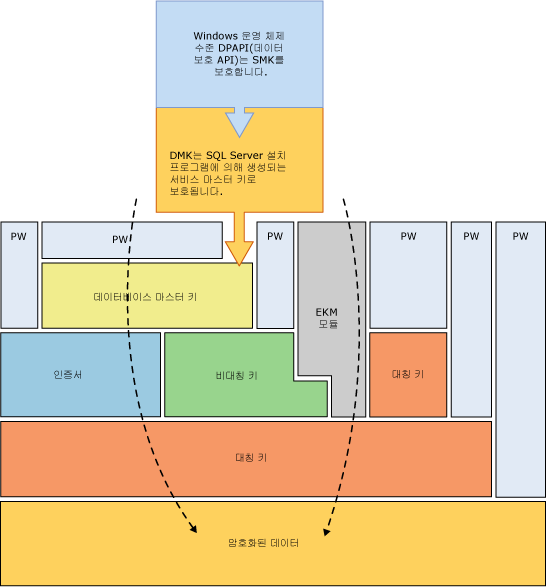
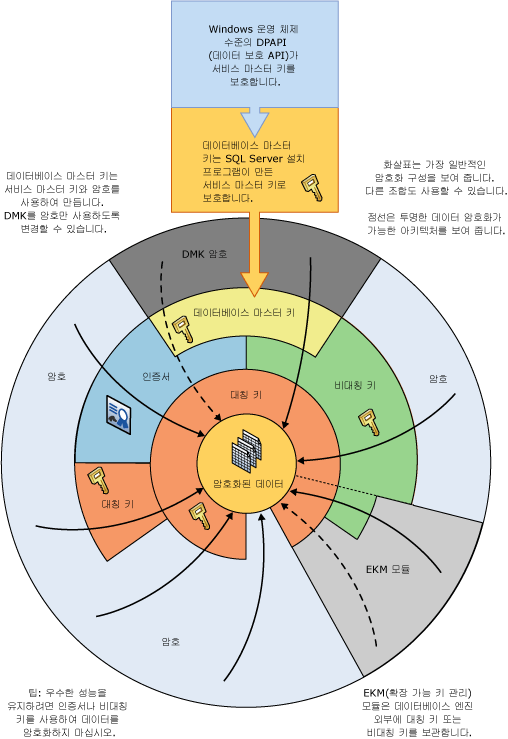

# 암호화 계층
[!INCLUDE[appliesto-ss-asdb-xxxx-xxx-md](../../../includes/appliesto-ss-asdb-xxxx-xxx-md.md)]
  [!INCLUDE[ssNoVersion](../../../includes/ssnoversion-md.md)] 는 계층적 암호화 및 키 관리 인프라로 데이터를 암호화합니다. 각 계층은 인증서, 비대칭 키 및 대칭 키 조합을 사용하여 해당 계층의 하위 계층을 암호화합니다. 비대칭 키 및 대칭 키는 [!INCLUDE[ssNoVersion](../../../includes/ssnoversion-md.md)] 외부의 EKM(확장 가능 키 관리) 모듈에 저장할 수 있습니다.  
  
 다음 그림에서는 암호화 계층의 각 계층이 그 아래의 계층을 암호화하는 모습과 가장 일반적인 암호화 구성을 보여 줍니다. 계층의 시작 부분에 대한 액세스는 일반적으로 암호로 보호됩니다.  
  
   
  
 다음과 같은 개념을 염두에 두어야 합니다.  
  
-   최상의 성능을 위해 인증서 또는 비대칭 키 대신 대칭 키를 사용하여 데이터를 암호화하십시오.  
  
-   데이터베이스 마스터 키는 서비스 마스터 키로 보호됩니다. 서비스 마스터 키는 [!INCLUDE[ssNoVersion](../../../includes/ssnoversion-md.md)] 설치 프로그램에 의해 생성되며 Windows DPAPI(데이터 보호 API)를 사용하여 암호화됩니다.  
  
-   추가 계층을 쌓는 다른 암호화 계층도 가능합니다.  
  
-   EKM(확장 가능 키 관리) 모듈은 SQL Server 외부에 대칭 키나 비대칭 키를 보유하고 있습니다.  
  
-   TDE(투명한 데이터 암호화)에서는 데이터베이스 암호화 키라는 대칭 키를 사용해야 합니다. 이 키는 master 데이터베이스의 데이터베이스 마스터 키로 보호되는 인증서 또는 EKM에 저장된 비대칭 키로 보호됩니다.  
  
-   서비스 마스터 키 및 모든 데이터베이스 마스터 키는 대칭 키입니다.  
  
 다음 그림에서는 같은 정보를 서로 다른 방법으로 보여 줍니다.  
  
   
  
 이 다이어그램에서는 다음과 같은 추가 개념을 보여 줍니다.  
  
-   이 그림에서 화살표는 일반적인 암호화 계층을 나타냅니다.  
  
-   EKM의 대칭 및 비대칭 키는 [!INCLUDE[ssNoVersion](../../../includes/ssnoversion-md.md)]에 저장된 대칭 키 및 비대칭 키에 대한 액세스를 보호할 수 있습니다. EKM에 연결된 점선은 EKM의 키가 [!INCLUDE[ssNoVersion](../../../includes/ssnoversion-md.md)]에 저장된 대칭 키 및 비대칭 키를 대체할 수 있음을 나타냅니다.  
  
## 암호화 메커니즘  
 [!INCLUDE[ssNoVersion](../../../includes/ssnoversion-md.md)] 는 다음과 같은 암호화 메커니즘을 제공합니다.  
  
-   [!INCLUDE[tsql](../../../includes/tsql-md.md)] 함수  
  
-   비대칭 키  
  
-   대칭 키  
  
-   인증서  
  
-   Transparent Data Encryption  
  
### Transact-SQL 함수  
 개별 항목은 [!INCLUDE[tsql](../../../includes/tsql-md.md)] 함수를 사용하여 삽입 또는 업데이트할 때 암호화할 수 있습니다. 자세한 내용은 [ENCRYPTBYPASSPHRASE&#40;Transact-SQL&#41;](../../../t-sql/functions/encryptbypassphrase-transact-sql.md) 및 [DECRYPTBYPASSPHRASE&#40;Transact-SQL&#41;](../../../t-sql/functions/decryptbypassphrase-transact-sql.md)를 참조하세요.  
  
### 인증서  
 일반적으로 인증서라고도 부르는 공개 키 인증서는 해당 개인 키를 보유하는 사람, 장치 또는 서비스의 ID에 공개 키 값을 바인딩하는 디지털 서명 문입니다. 인증서는 CA(인증 기관)에 의해 발행 및 서명됩니다. CA로부터 인증서를 받는 엔터티는 해당 인증서의 주체입니다. 일반적으로 인증서에는 다음과 같은 정보가 포함됩니다.  
  
-   주체의 공개 키  
  
-   이름 및 전자 메일 주소와 같은 주체에 대한 식별 정보  
  
-   유효 기간. 이 값은 인증서가 유효한 것으로 고려되는 기간입니다.  
  
     인증서는 인증서 내에 지정된 기간 동안만 유효합니다. 모든 인증서에는 **Valid From** 및 **Valid To** 날짜가 포함됩니다. 이러한 날짜는 유효 기간의 범위를 설정합니다. 인증서의 유효 기간이 지난 경우 만료된 인증서의 주체가 새로운 인증서를 요청해야 합니다.  
  
-   발행자 식별자 정보  
  
-   발행자의 디지털 서명  
  
     이 서명은 공개 키와 주체의 식별자 정보 사이의 바인딩에 대한 유효성을 증명합니다. 정보를 디지털로 서명하는 프로세스에는 정보뿐만 아니라 발송자가 보유하고 있는 일부 기밀 정보를 서명이라는 태그로 변환하는 과정이 수반됩니다.  
  
 인증서의 기본 이점은 호스트에서 개별 주체에 대한 일련의 암호를 유지 관리할 필요가 없다는 점입니다. 그 대신 호스트가 인증서 발행자에 대한 트러스트를 설정하기만 하면 인증서 발행자는 인증서를 무제한적으로 서명할 수 있습니다.  
  
 보안 웹 서버와 같은 호스트가 발행자를 트러스트된 루트 기관으로 지명하면 발행자가 발행하는 인증서에 대한 바인딩을 구성하는 데 사용된 정책도 호스트에서 암시적으로 트러스트됩니다. 실제로 호스트는 발행자가 인증서 주체의 ID를 확인한 것으로 트러스트합니다. 호스트는 발행자의 공개 키가 포함된 자체 서명된 발행자의 인증서를 호스트 컴퓨터의 트러스트된 루트 인증 기관 인증서 저장소에 두어 발행자를 트러스트된 루트 기관으로 지정합니다. 중간 또는 종속 인증 기관은 트러스트된 루트 인증 기관으로부터 유효한 인증 경로가 있는 경우에만 트러스트됩니다.  
  
 발행자는 인증서가 만료되기 전에 인증서를 취소할 수 있습니다. 인증서를 취소하면 인증서에 삽입된 ID에 대한 공개 키 바인딩이 취소됩니다. 각 발행자는 특정 인증서의 유효성을 검사할 때 프로그램에서 사용할 수 있는 인증서 취소 목록을 유지 관리합니다.  
  
 [!INCLUDE[ssNoVersion](../../../includes/ssnoversion-md.md)] 에서 만든 자체 서명된 인증서는 X.509 표준을 따르며 X.509 v1 필드를 지원합니다.  
  
### 비대칭 키  
 비대칭 키는 개인 키와 해당 공개 키로 구성됩니다. 각 키는 다른 사람이 암호화한 데이터를 암호 해독할 수 있습니다. 비대칭 암호화 및 암호 해독은 비교적 리소스 소모가 많지만 대칭 암호화보다 높은 보안 수준을 제공합니다. 비대칭 키는 데이터베이스의 저장소에 대한 대칭 키를 암호화하는 데 사용할 수 있습니다.  
  
### 대칭 키  
 대칭 키는 암호화 및 암호 해독에 대해 사용되는 하나의 키입니다. 대칭 키를 사용하면 암호화 및 암호 해독을 빠르게 수행할 수 있으며 데이터베이스의 중요한 데이터를 일상적으로 사용하는 데 적합합니다.  
  
### Transparent Data Encryption  
 TDE(투명한 데이터 암호화)는 대칭 키를 사용한 특수한 암호화 형태입니다. TDE는 데이터베이스 암호화 키라는 대칭 키를 사용하여 전체 데이터베이스를 암호화합니다. 데이터베이스 암호화 키는 데이터베이스 마스터 키 또는 EKM 모듈에 저장된 비대칭 키로 보호되는 다른 키 또는 인증서로 보호됩니다. 자세한 내용은 [TDE&#40;투명한 데이터 암호화&#41;](../../../relational-databases/security/encryption/transparent-data-encryption.md)를 참조하세요.  
  
## 관련 내용  
 [SQL Server 보안 설정](../../../relational-databases/security/securing-sql-server.md)  
  
 [보안 함수&#40;Transact-SQL&#41;](../../../t-sql/functions/security-functions-transact-sql.md)  
  
## 참고 항목  
 [사용 권한 계층&#40;데이터베이스 엔진&#41;](../../../relational-databases/security/permissions-hierarchy-database-engine.md)   
 [보안 개체](../../../relational-databases/security/securables.md)  
  
  
