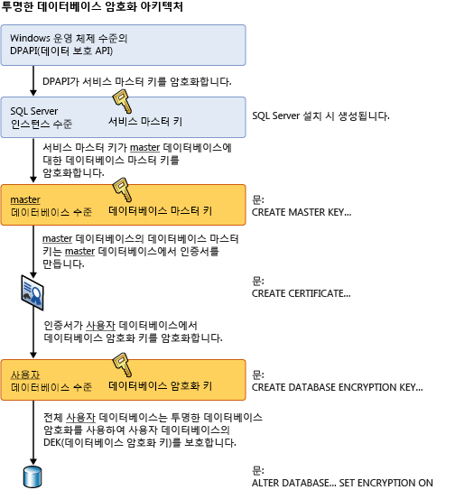

# <a name="transparent-data-encryption-tde"></a>투명한 데이터 암호화
[!INCLUDE[tsql-appliesto-ss2008-all_md](../../../includes/tsql-appliesto-ss2008-all-md.md)]

 > 이전 버전의 SQL Server와 관련된 콘텐츠는 [TDE(투명한 데이터 암호화)](https://msdn.microsoft.com/en-US/library/bb934049(SQL.120).aspx)를 참조하세요.

  *TDE* (투명한 데이터 암호화)는 미사용 데이터 암호화라고 하는 [!INCLUDE[ssNoVersion](../../../includes/ssnoversion-md.md)], [!INCLUDE[ssSDSFull](../../../includes/sssdsfull-md.md)]및 [!INCLUDE[ssSDWfull](../../../includes/sssdwfull-md.md)] 데이터 파일을 암호화합니다. 보안 시스템 디자인, 중요한 자산 암호화 및 데이터베이스 서버에 대한 방화벽 구축과 같은 데이터베이스의 보안을 설정하기 위해 여러 가지 예방 조치를 취할 수 있습니다. 그러나 물리적 미디어(예: 드라이브 또는 백업 테이프)를 도난 당한 경우 악의적인 사용자가 데이터베이스를 복원하거나 연결하여 데이터를 찾아볼 수 있습니다. 한 가지 해결 방법은 데이터베이스의 중요한 데이터를 암호화하고 인증서와 함께 데이터를 암호화하는 데 사용된 키를 보호하는 것입니다. 이 경우 키가 없으면 누구도 데이터를 사용할 수 없지만 이러한 보호 방법은 사전에 계획해야 합니다.  
  
 TDE(투명한 데이터 암호화)를 통해 데이터 및 로그 파일의 실시간 I/O 암호화 및 암호 해독을 수행합니다. 이 암호화에서는 DEK(데이터베이스 암호화 키)를 사용하며 이 키는 복구하는 동안 사용할 수 있도록 데이터베이스 부트 레코드에 저장됩니다. DEK는 서버의 master 데이터베이스에 저장된 인증서 또는 EKM 모듈로 보호되는 비대칭 키를 사용하여 보호되는 대칭 키입니다. TDE는 데이터 및 로그 파일을 의미하는 "유휴" 데이터를 보호하고 다양한 업계에서 확립된 법, 규정 및 지침에 부합하는 기능을 제공합니다. 이를 통해 소프트웨어 개발자는 AES 및 3DES 암호화 알고리즘을 사용하여 기존의 응용 프로그램을 변경하지 않고 데이터를 암호화할 수 있습니다.  
  
> [!IMPORTANT]  
>  TDE에서는 통신 채널을 통한 암호화를 제공하지 않습니다. 통신 채널을 통해 데이터를 암호화하는 방법은 [데이터베이스 엔진에 암호화 연결 사용&#40;SQL Server 구성 관리자&#41;](../../../database-engine/configure-windows/enable-encrypted-connections-to-the-database-engine.md)을 참조하세요.  
>   
>  **관련 항목:**  
>   
>  -   [Azure SQL Database를 사용한 투명한 데이터 암호화](../../../relational-databases/security/encryption/transparent-data-encryption-with-azure-sql-database.md)  
> -   [SQL Data Warehouse에서 TDE(투명한 데이터 암호화) 시작](https://azure.microsoft.com/documentation/articles/sql-data-warehouse-encryption-tde-tsql/)  
> -   [다른 SQL Server로 TDE 보호 데이터베이스 이동](../../../relational-databases/security/encryption/move-a-tde-protected-database-to-another-sql-server.md)  
> -   [EKM을 사용하여 SQL Server에서 TDE를 사용하도록 설정](../../../relational-databases/security/encryption/enable-tde-on-sql-server-using-ekm.md)   
> -   [SQL 암호화 기능을 통해 SQL Server 커넥터 사용](../../../relational-databases/security/encryption/use-sql-server-connector-with-sql-encryption-features.md)
> - [TDE에 대한 SQL Server 보안 블로그(FAQ 포함)](https://blogs.msdn.microsoft.com/sqlsecurity/2016/10/05/feature-spotlight-transparent-data-encryption-tde/)
 
  
## <a name="about-tde"></a>TDE 정보  
 데이터베이스 파일 암호화는 페이지 수준에서 수행됩니다. 암호화된 데이터베이스의 페이지는 암호화된 후 디스크에 작성되고 메모리로 읽어 들일 때 암호가 해독됩니다. TDE로 암호화된 데이터베이스의 크기가 증가되지는 않습니다.  
  
 **[!INCLUDE[ssSDS](../../../includes/sssds-md.md)]에 적용되는 정보**  
  
 [!INCLUDE[sqldbesa](../../../includes/sqldbesa-md.md)] V12에서 TDE를 사용하는 경우, master 데이터베이스에 저장된 서버 수준 인증서가 [!INCLUDE[ssSDS](../../../includes/sssds-md.md)]에 의해 자동으로 생성됩니다. [!INCLUDE[ssSDS](../../../includes/sssds-md.md)] 의 TDE 데이터베이스를 이동하려면 데이터베이스 암호를 해독하고, 데이터베이스를 이동한 후, 대상 [!INCLUDE[ssSDS](../../../includes/sssds-md.md)]에서 TDE를 다시 사용하도록 해야 합니다. [!INCLUDE[ssSDS](../../../includes/sssds-md.md)]의 TDE에 대한 단계별 지침은 [Transparent Data Encryption with Azure SQL Database](../../../relational-databases/security/encryption/transparent-data-encryption-with-azure-sql-database.md)를 참조하십시오.  
  
 **[!INCLUDE[ssNoVersion](../../../includes/ssnoversion-md.md)]에 적용되는 정보**  
  
 보안이 설정된 후 올바른 인증서를 사용하여 데이터베이스를 복원할 수 있습니다. 인증서에 대한 자세한 내용은 [SQL Server Certificates and Asymmetric Keys](../../../relational-databases/security/sql-server-certificates-and-asymmetric-keys.md)를 참조하십시오.  
  
 TDE를 설정할 경우 인증서 및 인증서와 연결된 개인 키를 즉시 백업해야 합니다. 인증서를 사용할 수 없게 되거나 다른 서버에서 데이터베이스를 복원하거나 연결해야 할 경우 인증서와 개인 키의 백업본이 있어야 합니다. 그렇지 않으면 데이터베이스를 열 수 없습니다. 데이터베이스에서 TDE를 해제하더라도 인증서 암호화는 그대로 유지해야 합니다. 데이터베이스가 암호화되지 않더라도 트랜잭션 로그 부분은 그대로 보호될 수 있으며, 일부 작업의 경우 데이터베이스 전체 백업을 수행할 때까지는 인증서가 필요할 수 있습니다. 만료 날짜가 지난 인증서도 여전히 데이터를 TDE로 암호화하고 해독하는 데 사용할 수 있습니다.  
  
 **암호화 계층**  
  
 다음 그림에서는 TDE 암호화의 아키텍처를 보여 줍니다. 데이터베이스 수준 항목만(데이터베이스 암호화 키 및 ALTER DATABASE 부분은 [!INCLUDE[ssSDS](../../../includes/sssds-md.md)]에서 TDE를 사용하는 경우 사용자가 구성활 수 있습니다.  
  
   
  
## <a name="using-transparent-data-encryption"></a>투명한 데이터 암호화 사용  
 TDE를 사용하려면 다음 단계를 수행합니다.  
  
||  
|-|  
|**적용 대상**: [!INCLUDE[ssNoVersion](../../../includes/ssnoversion-md.md)].|  
  
-   마스터 키 만들기  
  
-   마스터 키로 보호되는 인증서를 만들거나 얻기  
  
-   데이터베이스 암호화 키를 만들고 인증서로 키 보호  
  
-   암호화를 사용하도록 데이터베이스 설정  
  
 다음 예에서는 `AdventureWorks2012` 라는 서버에 설치된 인증서를 사용하여 `MyServerCert`데이터베이스를 암호화하고 암호를 해독하는 방법을 보여 줍니다.  
  
```  
USE master;  
GO  
CREATE MASTER KEY ENCRYPTION BY PASSWORD = '<UseStrongPasswordHere>';  
go  
CREATE CERTIFICATE MyServerCert WITH SUBJECT = 'My DEK Certificate';  
go  
USE AdventureWorks2012;  
GO  
CREATE DATABASE ENCRYPTION KEY  
WITH ALGORITHM = AES_128  
ENCRYPTION BY SERVER CERTIFICATE MyServerCert;  
GO  
ALTER DATABASE AdventureWorks2012  
SET ENCRYPTION ON;  
GO  
```  
  
 암호화 및 암호 해독 작업은 [!INCLUDE[ssNoVersion](../../../includes/ssnoversion-md.md)]에 의해 백그라운드 스레드로 예약됩니다. 이 항목의 뒷부분에 나오는 카탈로그 뷰 및 동적 관리 뷰를 사용하여 이러한 작업의 상태를 볼 수 있습니다.  
  
> [!CAUTION]  
>  TDE가 사용된 데이터베이스의 백업 파일도 데이터베이스 암호화 키를 사용하여 암호화됩니다. 따라서 이러한 백업 파일을 복원하려면 데이터베이스 암호화 키를 보호하는 인증서를 사용할 수 있어야 합니다. 즉, 데이터베이스 백업뿐만 아니라 데이터 손실을 방지하기 위해 서버 인증서의 백업도 유지 관리해야 합니다. 인증서를 더 이상 사용할 수 없을 경우 데이터 손실이 발생합니다. 자세한 내용은 [SQL Server Certificates and Asymmetric Keys](../../../relational-databases/security/sql-server-certificates-and-asymmetric-keys.md)을 참조하세요.  
  
## <a name="commands-and-functions"></a>명령 및 함수  
 TDE 인증서는 다음 문에서 수락된 데이터베이스 마스터 키로 암호화되어야 합니다. 이 인증서가 암호만으로 암호화되면 문에서는 암호기로서 이것을 거부합니다.  
  
> [!IMPORTANT]  
>  TDE에서 인증서가 사용된 후 암호로 보호되도록 인증서가 변경되면 다시 시작한 다음에는 데이터베이스에 액세스할 수 없게 됩니다.  
  
 다음 표에서는 TDE 명령 및 함수에 대한 링크와 설명을 제공합니다.  
  
|명령 또는 함수|용도|  
|-------------------------|-------------|  
|[CREATE DATABASE ENCRYPTION KEY&#40;Transact-SQL&#41;](../../../t-sql/statements/create-database-encryption-key-transact-sql.md)|데이터베이스 암호화에 사용할 키를 만듭니다.|  
|[ALTER DATABASE ENCRYPTION KEY&#40;Transact-SQL&#41;](../../../t-sql/statements/alter-database-encryption-key-transact-sql.md)|데이터베이스 암호화에 사용할 키를 변경합니다.|  
|[DROP DATABASE ENCRYPTION KEY&#40;Transact-SQL&#41;](../../../t-sql/statements/drop-database-encryption-key-transact-sql.md)|데이터베이스 암호화에 사용한 키를 제거합니다.|  
|[ALTER DATABASE SET 옵션&#40;Transact-SQL&#41;](../../../t-sql/statements/alter-database-transact-sql-set-options.md)|TDE를 설정하는 데 사용된 **ALTER DATABASE** 옵션에 대해 설명합니다.|  
  
## <a name="catalog-views-and-dynamic-management-views"></a>카탈로그 뷰 및 동적 관리 뷰  
 다음 표에서는 TDE 카탈로그 뷰 및 동적 관리 뷰를 보여 줍니다.  
  
|카탈로그 뷰 또는 동적 관리 뷰|용도|  
|---------------------------------------------|-------------|  
|[sys.databases&#40;Transact-SQL&#41;](../../../relational-databases/system-catalog-views/sys-databases-transact-sql.md)|데이터베이스 정보를 보여 주는 카탈로그 뷰입니다.|  
|[sys.certificates&#40;Transact-SQL&#41;](../../../relational-databases/system-catalog-views/sys-certificates-transact-sql.md)|데이터베이스의 인증서를 보여 주는 카탈로그 뷰입니다.|  
|[sys.dm_database_encryption_keys&#40;Transact-SQL&#41;](../../../relational-databases/system-dynamic-management-views/sys-dm-database-encryption-keys-transact-sql.md)|데이터베이스에 사용된 암호화 키 및 데이터베이스 암호화의 상태에 대한 정보를 보여 주는 동적 관리 뷰입니다.|  
  
## <a name="permissions"></a>사용 권한  
 위에 표시된 표에서 설명한 것처럼 TDE의 기능 및 명령에는 각각의 사용 권한 요구 사항이 있습니다.  
  
 TDE와 관련된 메타데이터를 보려면 인증서에 대한 VIEW DEFINITION 권한이 필요합니다.  
  
## <a name="considerations"></a>고려 사항  
 처리 중인 데이터베이스 암호화 작업에 대해 재암호화를 검색하는 동안에는 데이터베이스에 대한 유지 관리 작업이 비활성화됩니다. 데이터베이스에 단일 사용자 모드 설정을 사용하여 유지 관리 작업을 수행할 수 있습니다. 자세한 내용은 [단일 사용자 모드로 데이터베이스 설정](../../../relational-databases/databases/set-a-database-to-single-user-mode.md)을 참조하세요.  
  
 sys.dm_database_encryption_keys 동적 관리 뷰를 사용하여 데이터베이스 암호화의 상태를 찾을 수 있습니다. 자세한 내용은 이 항목의 앞부분에 나오는 "카탈로그 뷰 및 동적 관리 뷰" 섹션을 참조하세요.  
  
 TDE에서는 데이터베이스의 모든 파일 및 파일 그룹이 암호화됩니다. 데이터베이스에 READ ONLY로 표시된 파일 그룹이 있는 경우 데이터베이스 암호화 작업이 실패합니다.  
  
 데이터베이스가 데이터베이스 미러링이나 로그 전달에 사용되고 있을 경우 두 데이터베이스 모두 암호화됩니다. 로그 트랜잭션은 암호화되어 전송됩니다.  
  
> [!IMPORTANT]  
>  전체 텍스트 인덱스는 데이터베이스에 암호화가 설정될 때 암호화됩니다. SQL Server 2008 이전 버전에서 만든 전체 텍스트 인덱스는 SQL Server 2008 이상으로 업그레이드하는 동안 데이터베이스에 가져와서 TDE로 암호화됩니다.  

> [!TIP]  
>  데이터베이스의 TDE 상태 변경을 모니터링하려면 SQL Server Audit 또는 SQL Database 감사를 사용합니다. SQL Server의 경우 [SQL Server 감사 동작 그룹 및 동작](../../../relational-databases/security/auditing/sql-server-audit-action-groups-and-actions.md)에서 찾을 수 있는 감사 동작 그룹 DATABASE_CHANGE_GROUP에서 TDE가 추적됩니다.
  
### <a name="restrictions"></a>제한 사항  
 초기 데이터베이스 암호화, 키 변경 또는 데이터베이스 암호 해독 중에는 다음 작업을 수행할 수 없습니다.  
  
-   데이터베이스의 파일 그룹에서 파일 삭제  
  
-   데이터베이스 삭제  
  
-   데이터베이스를 오프라인으로 설정  
  
-   데이터베이스 분리  
  
-   데이터베이스 또는 파일 그룹을 READ ONLY 상태로 전환  
  
 CREATE DATABASE ENCRYPTION KEY, ALTER DATABASE ENCRYPTION KEY, DROP DATABASE ENCRYPTION KEY 또는 ALTER DATABASE...SET ENCRYPTION 문 실행 중에는 다음 작업을 수행할 수 없습니다.  
  
-   데이터베이스의 파일 그룹에서 파일 삭제  
  
-   데이터베이스 삭제  
  
-   데이터베이스를 오프라인으로 설정  
  
-   데이터베이스 분리  
  
-   데이터베이스 또는 파일 그룹을 READ ONLY 상태로 전환  
  
-   ALTER DATABASE 명령 사용  
  
-   데이터베이스 또는 데이터베이스 파일 백업 시작  
  
-   데이터베이스 또는 데이터베이스 파일 복원 시작  
  
-   스냅숏 만들기  
  
 다음 작업 또는 상태에서는 CREATE DATABASE ENCRYPTION KEY, ALTER DATABASE ENCRYPTION KEY, DROP DATABASE ENCRYPTION KEY 또는 ALTER DATABASE...SET ENCRYPTION 문을 실행할 수 없습니다.  
  
-   데이터베이스가 읽기 전용이거나 데이터베이스에 읽기 전용 파일 그룹이 포함된 경우  
  
-   ALTER DATABASE 명령이 실행 중인 경우  
  
-   데이터 백업이 실행 중인 경우  
  
-   데이터베이스가 오프라인이거나 복원 상태인 경우  
  
-   스냅숏이 진행 중인 경우  
  
-   데이터베이스 유지 관리 태스크  
  
 데이터베이스 파일을 만들 때 TDE가 사용하도록 설정되어 있으면 즉시 파일 초기화를 사용할 수 없습니다.  
  
 비대칭 키로 데이터베이스 암호화 키를 암호화하려면 비대칭 키가 확장 가능 키 관리 공급자에 있어야 합니다.  
  
### <a name="transparent-data-encryption-and-transaction-logs"></a>투명한 데이터 암호화 및 트랜잭션 로그  
 TDE를 사용하도록 데이터베이스를 설정하면 가상 트랜잭션 로그의 남은 부분을 비우는 효과가 있어서 다음 가상 트랜잭션 로그를 강제로 실행할 수 있습니다. 이렇게 하면 데이터베이스에 암호화가 설정된 후 트랜잭션 로그에 남아 있는 일반 텍스트가 없습니다. 이 예에서와 같이 `encryption_state` 뷰의 `sys.dm_database_encryption_keys` 열을 확인하여 로그 파일 암호화의 상태를 찾을 수 있습니다.  
  
```  
USE AdventureWorks2012;  
GO  
/* The value 3 represents an encrypted state   
   on the database and transaction logs. */  
SELECT *  
FROM sys.dm_database_encryption_keys  
WHERE encryption_state = 3;  
GO  
```  
  
 [!INCLUDE[ssNoVersion](../../../includes/ssnoversion-md.md)] 로그 파일 아키텍처에 대한 자세한 내용은 [트랜잭션 로그&#40;SQL Server&#41;](../../../relational-databases/logs/the-transaction-log-sql-server.md)를 참조하세요.  
  
 데이터베이스 암호화 키를 변경하기 전에 트랜잭션 로그에 작성된 모든 데이터는 이전 데이터베이스 암호화 키를 사용하여 암호화됩니다.  
  
 데이터베이스 암호화 키를 두 번 수정한 후 다시 데이터베이스 암호화 키를 수정하려면 먼저 로그 백업을 수행해야 합니다.  
  
### <a name="transparent-data-encryption-and-the-tempdb-system-database"></a>투명한 데이터 암호화 및 tempdb 시스템 데이터베이스  
 [!INCLUDE[ssNoVersion](../../../includes/ssnoversion-md.md)] 인스턴스에 TDE를 사용하여 암호화된 다른 데이터베이스가 있으면 tempdb 시스템 데이터베이스가 암호화됩니다. 이로 인해 동일한 [!INCLUDE[ssNoVersion](../../../includes/ssnoversion-md.md)]인스턴스의 암호화되지 않은 데이터베이스의 성능에 영향을 미칠 수 있습니다. tempdb 시스템 데이터베이스에 대한 자세한 내용은 [tempdb 데이터베이스](../../../relational-databases/databases/tempdb-database.md)를 참조하세요.  
  
### <a name="transparent-data-encryption-and-replication"></a>투명한 데이터 암호화 및 복제  
 복제를 수행해도 암호화된 형식의 TDE 설정 데이터베이스에 있는 데이터는 자동으로 복제되지 않습니다. 배포 및 구독자 데이터베이스를 보호하려면 TDE를 개별적으로 설정해야 합니다. 트랜잭션 및 병합 복제를 위한 데이터의 초기 배포뿐만 아니라 스냅숏 복제도 암호화되지 않은 중간 파일(예: bcp 파일)에 데이터를 저장할 수 있습니다.  트랜잭션 또는 병합 복제 중에 통신 채널을 보호하도록 암호화를 설정할 수 있습니다. 자세한 내용은 [데이터베이스 엔진에 암호화 연결 사용&#40;SQL Server 구성 관리자&#41;](../../../database-engine/configure-windows/enable-encrypted-connections-to-the-database-engine.md)을 참조하세요.  
  
### <a name="transparent-data-encryption-and-filestream-data"></a>투명한 데이터 암호화 및 FILESTREAM 데이터  
 TDE를 사용하는 경우에도 FILESTREAM 데이터는 암호화되지 않습니다.  
  
## <a name="transparent-data-encryption-and-buffer-pool-extension"></a>투명한 데이터 암호화 및 버퍼 풀 확장  
 TDE를 사용하여 데이터베이스를 암호화한 경우에 BPE(버퍼 풀 확장)와 관련된 파일을 암호화하지 않습니다. Bitlocker와 같은 파일 시스템 수준 암호화 도구 또는 BPE 관련 파일에 대한 EFS를 사용해야 합니다.  
  
## <a name="transparent-data-encryption-and-in-memory-oltp"></a>투명한 데이터 암호화 및 메모리 내 OLTP  
 TDE는 메모리 내 OLTP 개체가 포함된 데이터베이스에서 사용할 수 있습니다. TDE를 사용하는 경우 [!INCLUDE[ssSQL15](../../../includes/sssql15-md.md)] 및 [!INCLUDE[ssSDSfull](../../../includes/sssdsfull-md.md)] 메모리 내 OLTP 로그 레코드와 데이터가 암호화됩니다. TDE를 사용하지만 MEMORY_OPTIMIZED_DATA 파일 그룹의 파일이 암호화되지 않으면 [!INCLUDE[ssSQL14](../../../includes/sssql14-md.md)] 메모리 내 OLTP 로그 레코드와 데이터가 암호화됩니다.  
  
## <a name="related-tasks"></a>관련 태스크  
 [다른 SQL Server로 TDE 보호 데이터베이스 이동](../../../relational-databases/security/encryption/move-a-tde-protected-database-to-another-sql-server.md)  
 [EKM을 사용하여 SQL Server에서 TDE를 사용하도록 설정](../../../relational-databases/security/encryption/enable-tde-on-sql-server-using-ekm.md)  
 [Azure Key Vault를 사용한 확장 가능 키 관리&#40;SQL Server&#41;](../../../relational-databases/security/encryption/extensible-key-management-using-azure-key-vault-sql-server.md)  
  
## <a name="related-content"></a>관련 내용  
 [Azure SQL Database를 사용한 투명한 데이터 암호화](../../../relational-databases/security/encryption/transparent-data-encryption-with-azure-sql-database.md)  
 [SQL Data Warehouse에서 TDE(투명한 데이터 암호화) 시작](https://azure.microsoft.com/documentation/articles/sql-data-warehouse-encryption-tde-tsql/)  
 [SQL Server 암호화](../../../relational-databases/security/encryption/sql-server-encryption.md)  
 [SQL Server 및 데이터베이스 암호화 키&#40;데이터베이스 엔진&#41;](../../../relational-databases/security/encryption/sql-server-and-database-encryption-keys-database-engine.md)  
   
## <a name="see-also"></a>관련 항목:  
 [SQL Server 데이터베이스 엔진 및 Azure SQL Database에 대한 보안 센터](../../../relational-databases/security/security-center-for-sql-server-database-engine-and-azure-sql-database.md)   
 [FILESTREAM&#40;SQL Server&#41;](../../../relational-databases/blob/filestream-sql-server.md)  
  
  

