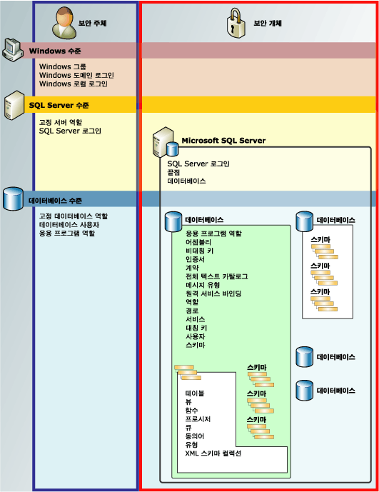

# 사용 권한 계층(데이터베이스 엔진)
[!INCLUDE[appliesto-ss-asdb-asdw-pdw-md](../../includes/appliesto-ss-asdb-asdw-pdw-md.md)]

  [!INCLUDE[ssDE](../../includes/ssde-md.md)] 는 사용 권한으로 보호될 수 있는 엔터티의 계층적 컬렉션을 관리합니다. 이러한 엔터티를 *보안 개체*라고 합니다. 가장 두드러진 보안 개체는 서버와 데이터베이스이지만 별개의 사용 권한을 보다 세부적인 수준으로 설정할 수 있습니다. [!INCLUDE[ssNoVersion](../../includes/ssnoversion-md.md)] 는 적합한 권한이 부여되었는지 확인하여 보안 개체에 대한 보안 주체의 동작을 규제합니다.  
  
 다음 그림에서는 [!INCLUDE[ssDE](../../includes/ssde-md.md)] 사용 권한 계층 간의 관계를 보여 줍니다.  
  
 권한 시스템은 모든 버전의 [!INCLUDE[ssNoVersion](../../includes/ssnoversion-md.md)], [!INCLUDE[ssSDS](../../includes/sssds-md.md)], [!INCLUDE[ssDW](../../includes/ssdw-md.md)], [!INCLUDE[ssAPS](../../includes/ssaps-md.md)]에서 동일하게 작동하지만 일부 기능은 일부 버전에서만 사용할 수 있습니다. 예를 들어 Azure 제품에서 서버 수준 사용 권한을 구성할 수 없습니다.  
  
   
  
## SQL Server 사용 권한 차트  
 pdf 형식의 모든 [!INCLUDE[ssDE](../../includes/ssde-md.md)] 권한에 대한 포스터 크기의 차트를 보려면 [https://aka.ms/sql-permissions-poster](https://aka.ms/sql-permissions-poster)를 참조하세요.  
  
## 사용 권한 작업  
 익숙한 [!INCLUDE[tsql](../../includes/tsql-md.md)] 쿼리인 GRANT, DENY 및 REVOKE를 사용하여 사용 권한을 조작할 수 있습니다. 사용 권한에 대한 정보는 [sys.server_permissions](../../relational-databases/system-catalog-views/sys-server-permissions-transact-sql.md) 및 [sys.database_permissions](../../relational-databases/system-catalog-views/sys-database-permissions-transact-sql.md) 카탈로그 뷰에 표시됩니다. 또한 기본 제공 함수를 사용한 사용 권한 정보 쿼리도 지원됩니다.  
  
 권한 시스템 디자인에 대한 정보는 [Getting Started with Database Engine Permissions](../../relational-databases/security/authentication-access/getting-started-with-database-engine-permissions.md)을(를) 참조하세요.  
  
## 참고 항목  
 [SQL Server 보안 설정](../../relational-databases/security/securing-sql-server.md)   
 [사용 권한&#40;데이터베이스 엔진&#41;](../../relational-databases/security/permissions-database-engine.md)   
 [Securables](../../relational-databases/security/securables.md)   
 [보안 주체&#40;데이터베이스 엔진&#41;](../../relational-databases/security/authentication-access/principals-database-engine.md)   
 [GRANT&#40;Transact-SQL&#41;](../../t-sql/statements/grant-transact-sql.md)   
 [REVOKE&#40;Transact-SQL&#41;](../../t-sql/statements/revoke-transact-sql.md)   
 [DENY&#40;Transact-SQL&#41;](../../t-sql/statements/deny-transact-sql.md)   
 [HAS_PERMS_BY_NAME&#40;Transact-SQL&#41;](../../t-sql/functions/has-perms-by-name-transact-sql.md)   
 [sys.fn_builtin_permissions&#40;Transact-SQL&#41;](../../relational-databases/system-functions/sys-fn-builtin-permissions-transact-sql.md)   
 [sys.server_permissions&#40;Transact-SQL&#41;](../../relational-databases/system-catalog-views/sys-server-permissions-transact-sql.md)   
 [sys.database_permissions&#40;Transact-SQL&#41;](../../relational-databases/system-catalog-views/sys-database-permissions-transact-sql.md)  
  
  
