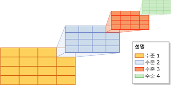
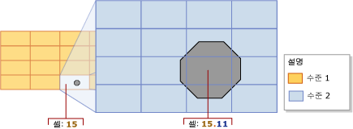
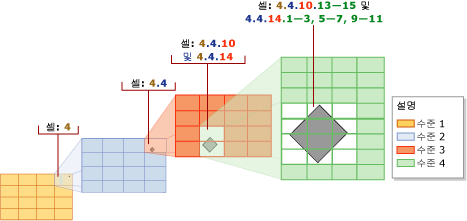
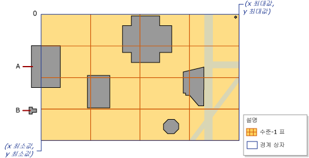
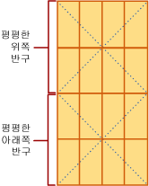

# <a name="spatial-indexes-overview"></a>공간 인덱스 개요
[!INCLUDE[appliesto-ss-asdb-xxxx-xxx-md](../../includes/appliesto-ss-asdb-xxxx-xxx-md.md)]
  [!INCLUDE[ssNoVersion](../../includes/ssnoversion-md.md)] 에서는 공간 데이터 및 공간 인덱스를 지원합니다. *공간 인덱스* 는 공간 열을 인덱싱할 수 있는 확장된 인덱스의 유형입니다. 공간 열은 **기하 도형** 또는 **지리**와 같은 공간 데이터 형식의 데이터를 포함하는 테이블 열입니다.  
  
> [!IMPORTANT]  
>  [!INCLUDE[ssSQL11](../../includes/sssql11-md.md)]에서 도입된 공간 기능에 대한 자세한 설명 및 예와 공간 인덱스에 영향을 주는 기능에 대한 정보를 보려면 [SQL Server 2012의 새로운 공간 기능](https://go.microsoft.com/fwlink/?LinkId=226407)백서를 다운로드하세요.  
  
##  <a name="about"></a> 공간 인덱스 정보  
  
###  <a name="decompose"></a> 인덱싱된 공간을 표 계층 구조로 분해  
 [!INCLUDE[ssNoVersion](../../includes/ssnoversion-md.md)]에서 공간 인덱스는 B-트리를 사용하여 구성됩니다. 즉, 인덱스가 2차원 공간 데이터를 B-트리의 선형 순서로 나타내야 한다는 뜻입니다. 따라서 데이터를 공간 인덱스로 읽기 전에 [!INCLUDE[ssNoVersion](../../includes/ssnoversion-md.md)] 에서는 공간을 계층적으로 균일하게 분해하는 작업을 구현해야 합니다. 인덱스 생성 프로세스에서는 공간을 4-수준 *표 계층 구조* 로 *분해*합니다. 이러한 수준은 *수준 1* (최상위 수준), *수준 2*, *수준 3*및 *수준 4*라고 합니다.  
  
 각각의 연속되는 수준이 이전 수준을 더 분해하므로 각 상위 수준의 셀은 다음 수준에서 완전한 표를 포함하게 됩니다. 지정된 수준에서 모든 표에는 양쪽 축(예: 4x4 또는 8x8)을 따라 동일한 셀 개수가 있으며 셀의 크기는 모두 같습니다.  
  
 다음 그림에서는 표 계층 구조의 각 수준에서 오른쪽 상단의 셀을 4x4 표로 분해하는 것을 보여 줍니다. 실제로 모든 셀이 이러한 방식으로 분해됩니다. 즉, 예를 들어 공간을 4x4 표의 4-수준으로 분해하면 총 65,536수준의 셀 4개가 실제로 생성됩니다.  
  
   
  
> [!NOTE]  
>  공간 인덱스에 대한 공간 분해는 애플리케이션 데이터에서 사용하는 측정 단위의 영향을 받지 않습니다.  
  
 표 계층 구조 셀은 힐베르트 공간 채움 곡선의 변형을 사용하여 선형으로 번호가 매겨집니다. 그러나 이해하기 쉽도록 이 설명에서는 힐베르트 곡선에 따라 실제로 생성되는 번호 매기기 대신 간단한 행 단위 번호 매기기를 사용합니다. 다음 그림에서는 건물을 나타내는 여러 다각형과 도로를 나타내는 선이 이미 4x4, 수준-1 표에 배치되어 있습니다. 수준-1 셀은 상단 왼쪽 셀에서부터 1에서 16까지 번호가 매겨져 있습니다.  
  
   
  
#### <a name="grid-density"></a>표 밀도  
 표의 축에 따른 셀 수로 표의 *밀도*가 결정되며 셀 수가 많을수록 표의 밀도가 높습니다. 예를 들어 8x8 표(64개의 셀을 생성함)는 4x4 표(16개의 셀을 생성함)보다 밀도가 높습니다. 표 밀도는 수준별 기준으로 정의됩니다.  
  
 공간 인덱스의 [CREATE SPATIAL INDEX](../../t-sql/statements/create-spatial-index-transact-sql.md)[!INCLUDE[tsql](../../includes/tsql-md.md)] 문은 각 수준별로 다른 표 밀도를 지정할 수 있는 GRIDS 절을 지원합니다. 다음 키워드 중 하나를 사용하여 지정된 수준의 표 밀도를 지정합니다.  
  
|키워드|표 구성|셀 개수|  
|-------------|------------------------|---------------------|  
|LOW|4X4|16|  
|MEDIUM|8X8|64|  
|HIGH|16X16|256|  
  
 [!INCLUDE[ssNoVersion](../../includes/ssnoversion-md.md)]에서 데이터베이스 호환성 수준이 100 이하로 설정된 경우 모든 수준의 기본값은 MEDIUM입니다. 데이터베이스 호환성 수준이 110 이상으로 설정된 경우에는 기본값이 자동 표 구성표입니다. (자동 그리드는 8가지 수준의 HLLLLLLL 구성 수준을 나타냅니다.) 인덱스 그리드 밀도를 다양하게 하는 대신 힌트에 따라 개체당 셀 수 및 개체당 쿼리 창 셀 수를 변경할 수 있습니다. 
  
 기본값이 아닌 표 밀도를 지정하여 분해 프로세스를 제어할 수 있습니다. 예를 들어 각 수준별로 서로 다른 표 밀도는 인덱싱된 공간의 크기와 공간 열의 개체를 기준으로 인덱스를 미세하게 조정하는 데 유용할 수도 있습니다.  
  
> [!NOTE]  
>  공간 인덱스의 표 밀도는 데이터베이스 호환성 수준이 100 이하로 설정된 경우 [sys.spatial_index_tessellations](../../relational-databases/system-catalog-views/sys-spatial-index-tessellations-transact-sql.md) 카탈로그 뷰의 level_1_grid, level_2_grid, level_3_grid 및 level_4_grid 열에서 볼 수 있습니다. **GEOMETRY_AUTO_GRID**/**GEOGRAPHY_AUTO_GRID** 공간 분할 구성표 옵션은 이러한 열을 채우지 않습니다. 자동 표 옵션이 사용된 경우 sys.spatial_index_tessellations 카탈로그 뷰에서 이러한 열에 대한 값은 **NULL** 입니다.  
  
###  <a name="tessellation"></a> 공간 분할  
 인덱싱된 공간을 표 계층 구조로 분해한 후 공간 인덱스는 공간 열에서 데이터를 한 번에 한 행씩 읽습니다. 공간 개체나 인스턴스의 데이터를 읽은 후 공간 인덱스는 해당 개체에 대해 *공간 분할 프로세스* 를 수행합니다. 공간 분할 프로세스는 개체를 표 형태 셀의 집합과 연결하여(*연결된 셀*) 개체를 표 계층 구조에 맞게 조정합니다. 표 계층 구조의 수준 1에서 시작하면 공간 분할 프로세스는 전체 수준에서 *너비 우선* 으로 진행됩니다. 이 프로세스는 한 번에 한 수준씩 4-수준 전체에서 계속 진행될 수도 있습니다.  
  
 공간 분할 프로세스의 출력은 개체의 공간 인덱스에 기록된 연결된 셀의 집합입니다. 이러한 기록된 셀을 참조함으로써 공간 인덱스는 인덱스에도 저장된 공간 열의 다른 개체와 연관된 공간에 개체를 배치할 수 있습니다.  
  
#### <a name="tessellation-rules"></a>공간 분할 규칙  
 개체에 대해 기록된 연결된 셀 개수를 제한하기 위해 공간 분할 프로세스에서는 여러 가지 공간 분할 규칙을 적용합니다. 이러한 규칙은 공간 분할 프로세스와 인덱스에 기록된 연결된 셀의 깊이를 결정합니다.  
  
 이러한 규칙은 다음과 같습니다.  
  
-   포함 규칙  
  
     개체가 한 셀을 완전히 포함할 경우 해당 셀은 개체에 의해 *포함* 되어 있다고 합니다. 포함된 셀은 개수가 계산되지만 공간 분할이 수행되지는 않습니다. 이 규칙은 표 계층 구조의 모든 수준에 적용됩니다. 포함 규칙은 공간 분할 프로세스를 단순화하고 공간 인덱스에 기록된 데이터의 양을 감소시킵니다.  
  
-   개체당 셀 수 규칙  
  
     이 규칙은 *개체당 셀 수 제한*을 적용하여 각 개체에 대해 계산될 수 있는 최대 셀 수를 결정합니다(수준 1은 제외). 하위 수준에서 개체당 셀 수 규칙은 개체에 대해 기록될 수 있는 정보량을 제어합니다.  
  
-   최하위 셀 규칙  
  
     최하위 셀 규칙은 개체에 대해 공간 분할된 최하위 셀만 기록하여 최적의 개체 근사값을 생성합니다. 부모 셀은 개체당 셀 수 계산에 영향을 주지 않으며 인덱스에 기록되지 않습니다.  
  
 이러한 공간 분할 규칙은 표 수준마다 반복하여 적용됩니다. 이 섹션의 나머지 부분에서는 공간 분할 규칙을 좀 더 자세히 설명합니다.  
  
#### <a name="covering-rule"></a>포함 규칙  
 개체가 한 셀을 완전히 포함할 경우 해당 셀은 개체에 의해 *포함* 되어 있다고 합니다. 예를 들어 다음 그림에서 2-수준 셀 중 하나(15.11)가 팔각형의 가운데 위치에 완전히 포함되어 있습니다.  
  
   
  
 포함된 셀은 개수가 계산되고 인덱스에 기록되지만 더 이상 공간 분할이 수행되지는 않습니다.  
  
#### <a name="cells-per-object-rule"></a>개체당 셀 수 규칙  
 각 개체의 공간 분할 범위는 주로 공간 인덱스의 *개체당 셀 수 제한* 의 영향을 받습니다. 이 제한은 공간 분할에서 개체당 계산할 수 있는 최대 셀 수를 정의합니다. 그러나 개체당 셀 수 규칙은 수준 1에 적용되지 않으므로 이 제한이 초과될 수도 있습니다. 수준-1 개수가 개체당 셀 수 제한에 도달하거나 초과할 경우 하위 수준에서 더 이상의 공간 분할이 발생하지 않습니다.  
  
 해당 개수가 개체당 셀 수보다 적은 한 공간 분할 프로세스는 계속 진행됩니다. 공간 분할하는 셀이 개체당 셀 수 제한을 초과하면 해당 셀은 개수가 계산되고 공간 분할이 수행되지 않습니다. 공간 분할한 셀이 개체당 셀 수 제한을 초과하면 해당 셀은 개수가 계산되지 않고 공간 분할이 수행되지 않습니다. 그렇지 않은 경우 해당 셀은 공간 분할이 수행되고 개체와 연결된 하위 수준 셀의 개수가 계산됩니다. 공간 분할 프로세스는 전체 수준에서 이런 방식으로 계속 진행됩니다. 이 프로세스는 제한에 도달하거나 더 이상 계산할 셀이 없을 때까지 공간 분할이 수행된 셀의 하위 수준 표에 대해 계속 반복됩니다.  
  
 예를 들어 수준-1 표의 셀 15에 꼭 맞는 팔각형을 보여 주는 위의 그림을 검토해 봅니다. 그림에서는 팔각형을 수준-2의 셀 9개로 나누어서 셀 15가 공간 분할되었습니다. 이 그림에서는 개체당 셀 수 제한을 9개 이상으로 가정합니다. 개체당 셀 수 제한이 8개 이하라면 셀 15는 공간 분할되지 않고 해당 셀 15만 개체의 개수로 계산됩니다.  
  
 기본적으로 대부분의 공간 인덱스에 대해 공간과 자릿수 간의 적절한 균형을 이루는 개체당 셀 수 제한은 개체당 셀 16개입니다. 그러나 [CREATE SPATIAL INDEX](../../t-sql/statements/create-spatial-index-transact-sql.md)[!INCLUDE[tsql](../../includes/tsql-md.md)] 문은 CELLS_PER_OBJECT**=**_n_ 절을 지원합니다. 이 절을 사용하면 1과 8192 사이를 포함하는 개체당 셀 수 제한을 지정할 수 있습니다.  
  
> [!NOTE]  
>  공간 인덱스의 **cells_per_object** 설정은 [sys.spatial_index_tessellations](../../relational-databases/system-catalog-views/sys-spatial-index-tessellations-transact-sql.md) 카탈로그 뷰에서 볼 수 있습니다.  
  
#### <a name="deepest-cell-rule"></a>최하위 셀 규칙  
 최하위 셀 규칙은 모든 하위 셀이 상위 셀에 속한다는 사실을 활용합니다. 즉, 수준-4 셀은 수준-3 셀에 속하고, 수준-3 셀은 수준-2 셀에 속하며, 수준-2 셀은 수준-1 셀에 속합니다. 예를 들어 셀 1.1.1.1에 속하는 개체는 셀 1.1.1, 셀 1.1 및 셀 1에도 속합니다. 이러한 셀 계층 관계에 대한 정보는 쿼리 프로세서에 포함됩니다. 따라서 인덱스가 저장해야 하는 정보를 최소화하기 위해 최하위 수준의 셀만 인덱스에 기록해야 합니다.  
  
 다음 그림에서는 비교적 작은 다이아몬드형 다각형이 공간 분할되어 있습니다. 인덱스는 개체당 셀 수로 기본값 16을 사용하며 이 값은 이러한 작은 개체로는 도달되지 않는 값입니다. 따라서 공간 분할은 수준 4까지 계속되며, 다각형은 수준-1에서 수준-3 셀까지 4, 4.4, 4.4.10 및 4.4.14에 위치합니다. 그러나 최하위 셀 규칙을 사용하면 공간 분할에서는 수준-4 셀 12개만(4.4.10.13-15, 4.4.14.1-3, 4.4.14.5-7, 4.4.14.9-11 등) 계산합니다.  
  
   
  
###  <a name="schemes"></a> 공간 분할(Tessellation) 구성표  
 공간 인덱스의 동작은 부분적으로 해당 *공간 분할(tessellation) 구성표*의 영향을 받습니다. 공간 분할(tessellation) 구성표는 데이터 형식에 따라 달라집니다. [!INCLUDE[ssNoVersion](../../includes/ssnoversion-md.md)]에서 공간 인덱스는 두 가지 공간 분할(tessellation) 구성표를 지원합니다.  
  
-   *기하 도형 표 공간 분할*은 **geometry** 데이터 형식에 대한 구성표입니다.  
  
-   *지리 표 공간 분할*은 **geography** 데이터 형식의 열에 적용합니다.  
  
> [!NOTE]  
>  공간 인덱스의 **tessellation_scheme** 설정은 [sys.spatial_index_tessellations](../../relational-databases/system-catalog-views/sys-spatial-index-tessellations-transact-sql.md) 카탈로그 뷰에서 볼 수 있습니다.  
  
#### <a name="geometry-grid-tessellation-scheme"></a>기하 도형 표 공간 분할(tessellation) 구성표  
 GEOMETRY_AUTO_GRID 공간 분할은 **이상에서** geometry [!INCLUDE[ssNoVersion](../../includes/ssnoversion-md.md)] 데이터 형식의 기본 공간 분할(tessellation) 구성표입니다.  GEOMETRY_GRID 공간 분할은 [!INCLUDE[ssNoVersion](../../includes/ssnoversion-md.md)]에서 geometry 데이터 형식에 사용할 수 있는 유일한 공간 분할(tessellation) 구성표입니다. 이 섹션에서는 공간 인덱스 작업과 연관된 기하 도형 표 공간 분할의 측면에서 지원되는 메서드 및 경계 상자에 대해 설명합니다.  
  
> [!NOTE]  
>  [CREATE SPATIAL INDEX](../../t-sql/statements/create-spatial-index-transact-sql.md)[!INCLUDE[tsql](../../includes/tsql-md.md)] 문의 USING (GEOMETRY_AUTO_GRID/GEOMETRY_GRID) 절을 사용하여 이 공간 분할(tessellation) 구성표를 명시적으로 지정할 수 있습니다.  
  
##### <a name="the-bounding-box"></a>경계 상자  
 기하학적 데이터는 무한할 수 있는 평면을 차지합니다. 그러나 [!INCLUDE[ssNoVersion](../../includes/ssnoversion-md.md)]에서 공간 인덱스는 제한된 공간을 필요로 합니다. 분해를 위한 제한된 공간을 설정하려면 기하 도형 표 공간 분할 구성표에는 사각형 *경계 상자*가 필요합니다. 경계 상자는 **(**_x-min_**,**_y-min_**)** 및 **(**_x-max_**,**_y-max_**)** 라는 4개의 좌표로 정의되며 공간 인덱스의 속성으로 저장됩니다. 이러한 좌표는 다음을 나타냅니다.  
  
-   *x-min* 은 경계 상자의 왼쪽 아래 모퉁이의 X 좌표입니다.  
  
-   *y-min* 은 왼쪽 아래 모퉁이의 Y 좌표입니다.  
  
-   *x-max* 는 오른쪽 위 모퉁이의 X 좌표입니다.  
  
-   *y-max* 는 오른쪽 위 모퉁이의 Y 좌표입니다.  
  
> [!NOTE]  
>  이러한 좌표는 [CREATE SPATIAL INDEX](../../t-sql/statements/create-spatial-index-transact-sql.md)[!INCLUDE[tsql](../../includes/tsql-md.md)] 문의 BOUNDING_BOX 절에서 지정됩니다.  
  
 **(**_x-min_**,**_y-min_**)** 및 **(**_x-max_**,**_y-max_**)** 좌표에 따라 경계 상자의 배치 및 차원이 결정됩니다. 경계 상자 외부의 공간은 번호가 0으로 매겨진 단일 셀로 처리됩니다.  
  
 공간 인덱스는 경계 상자 내부의 공간을 분해합니다. 표 계층 구조 수준-1 표가 경계 상자를 채웁니다. 표 계층 구조에서 기하학적 개체를 배치하기 위해 공간 인덱스에서는 개체 좌표와 경계 상자 좌표를 비교합니다.  
  
 다음 그림에서는 경계 상자의 **(**_x-min_**,**_y-min_**)** 및 **(**_x-max_**,**_y-max_**)** 좌표로 정의되는 지점을 보여 줍니다. 표 계층 구조의 최상위 수준이 4x4 표로 표시됩니다. 이해하기 쉽도록 하위 수준은 생략되었습니다. 경계 상자 외부의 공간은 0으로 표시됩니다. 'A' 개체는 부분적으로 상자 밖으로 뻗어 있고 'B' 개체는 완전히 셀 0의 상자 바깥쪽에 있습니다.  
  
   
  
 경계 상자는 애플리케이션 공간 데이터의 일부분에 해당합니다. 인덱스의 경계 상자가 공간 열에 저장된 데이터를 완전히 포함하거나 일부만 포함하는지는 애플리케이션에 따라 좌우됩니다. 전체적으로 경계 상자의 내부에 있는 개체에서 처리되는 작업만 공간 인덱스의 이점을 활용합니다. 따라서 **geometry** 열의 공간 인덱스의 이점을 최대한 활용하려면 개체의 전체 또는 대부분을 포함하는 경계 상자를 지정해야 합니다.  
  
> [!NOTE]  
>  공간 인덱스의 표 밀도는 [sys.spatial_index_tessellations](../../relational-databases/system-catalog-views/sys-spatial-index-tessellations-transact-sql.md) 카탈로그 뷰의 bounding_box_xmin, bounding_box_ymin, bounding_box_xmax 및 bounding_box_ymax 열에서 볼 수 있습니다.  
  
#### <a name="the-geography-grid-tessellation-scheme"></a>지리 표 공간 분할 구성표  
 공간 분할 구성표는 **geography** 열에만 적용합니다. 이 섹션에서는 지리 표 공간 분할에서 지원되는 메서드에 대해 요약하고 측지 공간이 평면에 표시되는 방법에 대해 설명합니다. 이 측지 공간은 표 계층 구조로 분해됩니다.  
  
> [!NOTE]  
>  [CREATE SPATIAL INDEX](../../t-sql/statements/create-spatial-index-transact-sql.md)[!INCLUDE[tsql](../../includes/tsql-md.md)] 문의 USING (GEOGRAPHY_AUTO_GRID/GEOGRAPHY_GRID) 절을 사용하여 이 공간 분할(tessellation) 구성표를 명시적으로 지정할 수 있습니다.  
  
##### <a name="projection-of-the-geodetic-space-onto-a-plane"></a>측지 공간을 평면에 표시  
 **geography** 인스턴스(개체)에서의 계산은 개체를 포함하는 공간을 측지 타원면으로 처리합니다. 이 공간을 분해하기 위해 지리 표 공간 분할 구성표에서는 타원면의 표면을 해당하는 위쪽 반구와 아래쪽 반구로 나눈 후 다음 단계를 수행합니다.  
  
1.  각 반구를 사변형 피라미드의 각 면으로 표시합니다.  
  
2.  두 피라미드를 평평하게 합니다.  
  
3.  평평해진 피라미드를 비유클리드 평면을 구성하도록 조인합니다.  
  
 다음 그림에서는 3단계의 분해 프로세스를 도식 보기로 보여 줍니다. 피라미드에서 점선은 각 피라미드에서 네 면의 경계를 나타냅니다. 1단계와 2단계는 측지 타원면에 대해 설명하며 녹색 가로선을 사용하여 적도 지역 경도 선을 나타내고 녹색 세로선을 사용하여 여러 위도 선을 나타냅니다. 1단계에서는 양쪽 반구로 표시되는 피라미드를 보여 줍니다. 2단계에서는 평평해지는 피라미드를 보여 줍니다. 3단계에서는 평평해진 피라미드가 평면을 구성하도록 결합된 후의 모양을 보여 줍니다. 여기에는 표시된 경도가 많이 나타납니다. 이렇게 표시된 선은 직선이며 피라미드에 놓이는 위치에 따라 길이가 다양합니다.  
  
   
  
 일단 공간이 평면으로 표시되면 이 평면은 4-수준의 표 계층 구조로 분해됩니다. 각 수준은 서로 다른 표 밀도를 사용할 수 있습니다. 다음 그림에서는 4x4 수준-1 표로 분해된 후의 평면을 보여 줍니다. 이해하기 쉽도록 하위 수준의 표 계층 구조는 생략됩니다. 실제로 평면은 4-수준 표 계층 구조로 완전히 분해됩니다. 분해 프로세스가 완료된 후 지리 열에서 지리적 데이터를 한 번에 한 행씩 읽고 공간 분할 프로세스를 각 개체에 대해 차례로 수행합니다.  
  
   
  
##  <a name="methods"></a> 공간 인덱스에서 지원되는 메서드  
  
###  <a name="geometry"></a> 공간 인덱스에서 지원되는 기하 도형 메서드  
 공간 인덱스는 특정 조건에서 STContains(), STDistance(), STEquals(), STIntersects(), STOverlaps(), STTouches() 및 STWithin()과 같은 집합 지향 geometry 메서드를 지원합니다. 공간 인덱스의 지원을 받기 위해 이러한 메서드는 쿼리의 WHERE 또는 JOIN ON 절 내에 사용해야 하며 다음 일반 형식의 조건자 내에서 발생해야 합니다.  
  
 *geometry1*.*method_name*(*geometry2*)*comparison_operator**valid_number*  
  
 Null이 아닌 결과를 반환하려면 *geometry1* 및 *geometry2* 에 동일한 [SRID(Spatial Reference Identifier)](../../relational-databases/spatial/spatial-reference-identifiers-srids.md)가 있어야 합니다. 그렇지 않으면 메서드가 NULL을 반환합니다.  
  
 공간 인덱스는 다음 조건자 형식을 지원합니다.  
  
-   *geometry1*.[STContains](../../t-sql/spatial-geometry/stcontains-geometry-data-type.md)(*geometry2*) = 1  
  
-   *geometry1*.[STDistance](../../t-sql/spatial-geometry/stdistance-geometry-data-type.md)(*geometry2*) < *number*  
  
-   *geometry1*.[STDistance](../../t-sql/spatial-geometry/stdistance-geometry-data-type.md)(*geometry2*) <= *number*  
  
-   *geometry1*.[STEquals](../../t-sql/spatial-geometry/stequals-geometry-data-type.md)(*geometry2*)= 1  
  
-   *geometry1*.[STIntersects](../../t-sql/spatial-geometry/stintersects-geometry-data-type.md)(*geometry2*)= 1  
  
-   *geometry1.* [STOverlaps](../../t-sql/spatial-geometry/stoverlaps-geometry-data-type.md) *(geometry2) = 1*  
  
-   *geometry1*.[STTouches](../../t-sql/spatial-geometry/sttouches-geometry-data-type.md)(*geometry2*) = 1  
  
-   *geometry1*.[STWithin](../../t-sql/spatial-geometry/stwithin-geometry-data-type.md)(*geometry2*)= 1  
  
###  <a name="geography"></a> 공간 인덱스에서 지원되는 지리 메서드  
 특정 조건에서 공간 인덱스는 STIntersects(),STEquals() 및 STDistance()와 같은 집합 지향 지리 메서드를 지원합니다. 공간 인덱스의 지원을 받기 위해 이러한 메서드는 쿼리의 WHERE 절 내에 사용해야 하며 다음 일반 형식의 조건자 내에서 발생해야 합니다.  
  
 *geography1*.*method_name*(*geography2*)*comparison_operator**valid_number*  
  
 Null이 아닌 결과를 반환하려면 *geography1* 및 *geography2* 에 동일한 [SRID(Spatial Reference Identifier)](../../relational-databases/spatial/spatial-reference-identifiers-srids.md)가 있어야 합니다. 그렇지 않으면 메서드가 NULL을 반환합니다.  
  
 공간 인덱스는 다음 조건자 형식을 지원합니다.  
  
-   *geography1*.[STIntersects](../../t-sql/spatial-geography/stintersects-geography-data-type.md)(*geography2*)= 1  
  
-   *geography1*.[STEquals](../../t-sql/spatial-geography/stequals-geography-data-type.md)(*geography2*)= 1  
  
-   *geography1*.[STDistance](../../t-sql/spatial-geography/stdistance-geography-data-type.md)(*geography2*) < *number*  
  
-   *geography1*.[STDistance](../../t-sql/spatial-geography/stdistance-geography-data-type.md)(*geography2*) <= *number*  
  
### <a name="queries-that-use-spatial-indexes"></a>공간 인덱스를 사용하는 쿼리  
 공간 인덱스는 **WHERE** 절에서 인덱싱된 공간 연산자를 포함하는 쿼리에서만 지원됩니다. 예를 들어 다음과 같은 예제 구문의 경우  
  
```  
[spatial object].SpatialMethod([reference spatial object]) [ = | < ] [const literal or variable]  
```  
  
 쿼리 최적화 프로그램은 공간 연산의 교환( `@a.STIntersects(@b) = @b.STInterestcs(@a)` )을 인식합니다. 그러나 비교의 시작 부분에 공간 연산자가 포함되어 있지 않은 경우 공간 인덱스가 사용되지 않습니다. 예를 들어 `WHERE 1 = spatial op` 는 공간 인덱스를 사용하지 않습니다. 공간 인덱스를 사용하려면 비교를 다시 씁니다(예: `WHERE spatial op = 1`).  
  
 다른 인덱스를 사용하는 것처럼 공간 인덱스가 지원되는 경우 비용을 기반으로 공간 인덱스가 선택되므로 사용 요구 사항이 모두 충족되는 경우에도 쿼리 최적화 프로그램은 공간 인덱스를 사용하도록 선택하지 않을 수 있습니다. 실행 계획을 사용하여 공간 인덱스를 사용하는지 여부를 확인하고, 필요할 경우 원하는 쿼리 계획을 강제로 수행하도록 쿼리 힌트를 제공하세요.  
  
 가장 인접한 쿼리 유형도 공간 인덱스를 지원하지만 특정 쿼리 구문인 경우에만 쓰여집니다. 적합한 구문은 다음과 같습니다.  
  
```  
SELECT TOP(K) [WITH TIES] *   
FROM <Table> AS T [WITH(INDEX(<SpatialIndex>))]  
WHERE <SpatialColumn>.STDistance(@reference_object) IS NOT NULL  
ORDER BY <SpatialColumn>.STDistance(@reference_object) [;]  
```  
  
## <a name="see-also"></a>참고 항목  
 [공간 데이터&#40;SQL Server&#41;](../../relational-databases/spatial/spatial-data-sql-server.md)  
  
  
