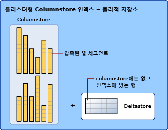

# <a name="sql-server-index-design-guide"></a>SQL Server 인덱스 디자인 가이드
[!INCLUDE[appliesto-ss-asdb-asdw-pdw-md](../includes/appliesto-ss-asdb-asdw-pdw-md.md)]

데이터베이스 응용 프로그램 병목 상태는 주로 잘못 디자인된 인덱스와 인덱스의 부족으로 인해 나타납니다. 최적의 데이터베이스와 최상의 응용 프로그램 성능을 위해서는 효율적인 인덱스를 디자인하는 것이 가장 중요합니다. 이 [!INCLUDE[ssNoVersion](../includes/ssnoversion-md.md)] 인덱스 디자인 가이드에서는 응용 프로그램 요구 사항을 충족하는 효율적인 인덱스를 디자인하는 데 도움이 되는 정보와 최선의 구현 방법을 제공합니다.  
    
이 가이드에서는 사용자가 [!INCLUDE[ssNoVersion](../includes/ssnoversion-md.md)]에서 사용할 수 있는 인덱스 유형에 대한 기본적인 지식이 있다고 가정합니다. 인덱스 형식에 대한 일반적인 설명은 [인덱스 유형](../relational-databases/indexes/indexes.md)을 참조하십시오.  

이 가이드에서는 다음과 같은 유형의 인덱스를 다룹니다.

-   클러스터형
-   비클러스터형 인덱스
-   고유
-   필터링됨
-   columnstore
-   Hash
-   메모리 최적화 비클러스터형

XML 인덱스에 대한 자세한 내용은 [XML 인덱스 개요](../relational-databases/xml/xml-indexes-sql-server.md)를 참조하세요.

공간 인덱스에 대한 자세한 내용은 [공간 인덱스 개요](../relational-databases/spatial/spatial-indexes-overview.md)를 참조하세요.

전체 텍스트 인덱스에 대한 자세한 내용은 [전체 텍스트 인덱스 채우기](../relational-databases/search/populate-full-text-indexes.md)를 참조하세요.
  
##  <a name="Basics"></a> 인덱스 디자인 기본 사항  
 인덱스는 테이블이나 뷰와 관련된 디스크상 또는 메모리 내 구조로서 테이블이나 뷰의 행 검색 속도를 향상시킵니다. 인덱스에는 테이블이나 뷰에 있는 하나 이상의 열로 작성되는 키가 포함됩니다. 디스크상 인덱스의 경우 이러한 키는 SQL Server에서 키 값과 연결된 행을 빠르고 효율적으로 찾을 수 있는 구조(B-트리)에 저장됩니다.  

 인덱스는 행과 열이 있는 테이블로 논리적으로 구성된 데이터를 저장하며, *rowstore*<sup>1</sup>라고 하는 행 단위 데이터 형식에 물리적으로 저장되거나 *[columnstore](#columnstore_index)*라고 하는 열 단위 데이터 형식으로 저장됩니다.  
    
 데이터베이스에 적합한 인덱스를 선택하는 것은 쿼리 속도와 업데이트 비용 간의 균형을 조정해야 하는 복잡한 작업입니다. 좁은 인덱스나 인덱스 키의 열이 적은 인덱스는 디스크 공간과 유지 관리 오버헤드를 덜 요구합니다. 반대로 넓은 인덱스는 더 많은 쿼리를 처리합니다. 가장 효율적인 인덱스를 찾기 위해 여러 디자인을 시험해 봐야 할 수 있습니다. 데이터베이스 스키마나 응용 프로그램에 영향을 주지 않고 인덱스를 추가, 수정 및 삭제할 수 있습니다. 따라서 원하는 대로 여러 인덱스를 시험해 볼 수 있습니다.  
  
 [!INCLUDE[ssNoVersion](../includes/ssnoversion-md.md)] 의 쿼리 최적화 프로그램은 대부분의 경우 가장 효율적인 인덱스를 제대로 찾습니다. 전체 인덱스 디자인 전략에서는 쿼리 최적화 프로그램이 가장 효율적인 인덱스를 찾을 수 있도록 다양한 인덱스를 제공하고 쿼리 최적화 프로그램의 선택을 신뢰해야 합니다. 이렇게 하면 분석 시간이 줄어들고 다양한 상황에서 좋은 성능을 얻을 수 있습니다. 특정 쿼리에 대해 쿼리 최적화 프로그램이 사용하는 인덱스를 확인하려면 [!INCLUDE[ssManStudioFull](../includes/ssmanstudiofull-md.md)]의 **쿼리** 메뉴에서 **실제 실행 계획 포함**을 선택합니다.  
  
 인덱스 사용이 항상 좋은 성능을 의미하지 않으며 마찬가지로 좋은 성능이 항상 효율적인 인덱스 사용을 나타내는 것은 아닙니다. 인덱스 사용이 최상의 성능을 내는 데 항상 도움이 된다면 쿼리 최적화 프로그램의 작업은 간단할 것입니다. 실제로 인덱스를 잘못 선택하면 최상의 성능을 얻지 못할 수 있습니다. 따라서 쿼리 최적화 프로그램에서는 성능을 향상시킬 경우에만 인덱스나 인덱스 조합을 선택하고 성능을 저하시킬 경우에는 인덱싱된 검색을 피해야 합니다.  

 <sup>1</sup> Rowstore는 관계형 테이블 데이터를 저장하는 전통적인 방법이었습니다. [!INCLUDE[ssNoVersion](../includes/ssnoversion-md.md)]에서 rowstore는 기본 데이터 저장소 형식이 힙, B-트리([클러스터형 인덱스](#Clustered)) 또는 메모리 최적화인 테이블을 참조합니다.

### <a name="index-design-tasks"></a>인덱스 디자인 태스크  
 권장되는 인덱스 디자인 전략은 다음과 같은 태스크로 이루어집니다.  
  
1.  데이터베이스의 특징을 이해합니다. 
    * 데이터 수정 작업이 많고 높은 처리량을 유지해야 하는 OLTP(온라인 트랜잭션 처리)를 예로 들 수 있습니다. [!INCLUDE[ssSQL14](../includes/sssql14-md.md)]부터는 래치 없는 디자인을 제공하므로 메모리 최적화 테이블 및 인덱스가 이 시나리오에 가장 적합합니다. 자세한 내용은 본 지침의 [메모리 최적화 테이블에 대한 인덱스](../relational-databases/in-memory-oltp/indexes-for-memory-optimized-tables.md) 또는 [메모리 최적화 테이블에 대한 비클러스터형 인덱스 디자인 지침](#inmem_nonclustered_index) 및 [메모리 최적화 테이블에 대한 해시 인덱스 디자인 지침](#hash_index)을 참조하세요.
    * 또는 대량의 데이터 집합을 신속하게 처리해야 하는 DSS(의사 결정 지원) 또는 OLAP(데이터 웨어하우징) 데이터베이스를 예로 들 수 있습니다. [!INCLUDE[ssSQL11](../includes/sssql11-md.md)]부터 columnstore 인덱스는 일반 데이터 웨어하우징 데이터 집합에 가장 적합합니다. Columnstore 인덱스는 필터링, 집계, 그룹화, 스타 조인 쿼리 등 일반 데이터 웨어하우징 쿼리에 대한 성능을 개선하여 사용자의 데이터 웨어하우징 환경을 바꿀 수 있습니다. 자세한 내용은 본 지침의 [Columnstore 인덱스 개요](../relational-databases/indexes/columnstore-indexes-overview.md) 또는 [Columnstore 인덱스 디자인 지침](#columnstore_index)을 참조하세요.  

2.  가장 자주 사용하는 쿼리의 특성을 이해합니다. 예를 들어 두 개 이상의 테이블을 조인하는 쿼리를 자주 사용한다는 것을 알면 가장 적절한 인덱스 유형을 결정하는 데 도움이 됩니다.  
  
3.  쿼리에 사용되는 열의 특성을 이해합니다. 예를 들어 인덱스는 정수 데이터 형식을 사용하는 고유 열이나 Null이 아닌 열에 이상적입니다. 열에 데이터의 잘 정의된 하위 집합이 있는 경우 [!INCLUDE[ssKatmai](../includes/sskatmai-md.md)] 이상 버전에서 필터링된 인덱스를 사용할 수 있습니다. 자세한 내용은 이 가이드의 [필터링된 인덱스 디자인 지침](#Filtered) 을 참조하십시오.  
  
4.  인덱스를 만들거나 유지 관리할 때 성능을 향상시킬 수 있는 인덱스 옵션을 파악합니다. 예를 들어 기존의 큰 테이블에 클러스터형 인덱스를 만들 때 `ONLINE` 인덱스 옵션을 사용하는 것이 좋습니다. ONLINE 옵션을 사용하면 인덱스를 만들거나 새로 작성하는 동안 기본 데이터를 작업할 수 있습니다. 자세한 내용은 [인덱스 옵션 설정](../relational-databases/indexes/set-index-options.md)을 참조하세요.  
  
5.  인덱스에 가장 적합한 저장 위치를 파악합니다. 비클러스터형 인덱스는 기본 테이블과 같은 파일 그룹이나 다른 파일 그룹에 저장할 수 있습니다. 인덱스의 저장 위치는 디스크 I/O 성능을 높여 쿼리 성능을 향상시킬 수 있습니다. 예를 들어 테이블 파일 그룹과 다른 디스크에 있는 파일 그룹에 비클러스터형 인덱스를 저장하면 동시에 여러 디스크를 읽을 수 있으므로 성능이 향상될 수 있습니다.  
     또는 클러스터형 인덱스와 비클러스터형 인덱스가 여러 파일 그룹에 하나의 파티션 구성표를 사용할 수 있습니다. 분할을 사용하면 데이터 하위 집합을 빠르고 효율적으로 액세스하고 관리하는 동시에 전체 컬렉션의 무결성을 유지할 수 있으므로 큰 테이블이나 인덱스를 보다 쉽게 관리할 수 있습니다. 자세한 내용은 [Partitioned Tables and Indexes](../relational-databases/partitions/partitioned-tables-and-indexes.md)를 참조하세요. 분할을 고려할 때 인덱스를 맞춰야 하는지, 즉 본질적으로 테이블과 같은 방식으로 분할해야 하는지 또는 독립적으로 분할해야 하는지 파악합니다.   

##  <a name="General_Design"></a> 일반 인덱스 디자인 지침  
 경험이 많은 데이터베이스 관리자는 인덱스를 잘 디자인할 수 있습니다. 그러나 데이터베이스와 작업이 조금만 복잡해져도 이 태스크는 복잡하고 시간이 많이 걸리며 오류가 쉽게 발생할 수 있습니다. 데이터베이스, 쿼리 및 데이터 열의 특성을 이해하면 최적의 인덱스를 디자인할 수 있습니다.  
  
### <a name="database-considerations"></a>데이터베이스 고려 사항  
 인덱스를 디자인할 때 다음과 같은 데이터 베이스 지침을 고려합니다.  
  
-   테이블에 대한 인덱스를 많이 만들면 테이블의 데이터가 변경될 경우 인덱스도 모두 적절하게 조정되어야 하므로 `INSERT`, `UPDATE`, `DELETE` 및 `MERGE` 문의 성능이 저하될 수 있습니다. 예를 들어 열이 여러 인덱스에서 사용되고 열 데이터를 수정하는 `UPDATE` 문을 실행하는 경우 열을 포함하는 각 인덱스뿐만 아니라 기본 테이블(힙 또는 클러스터형 인덱스)에 있는 열도 업데이트되어야 합니다.  
  
    -   과도하게 업데이트되는 테이블에 대한 인덱스를 너무 많이 만들지 말고 가능한 열 수가 적은 좁은 인덱스를 만듭니다.  
  
    -   많은 인덱스를 사용하면 업데이트 요구는 적지만 데이터 양이 많은 테이블의 쿼리 성능이 향상될 수 있습니다. 인덱스 수가 많으면 SELECT 문과 같이 데이터를 수정하지 않는 쿼리의 성능이 향상될 수 있습니다. 이는 쿼리 최적화 프로그램이 가장 빠른 액세스 방법을 결정할 때 선택할 수 있는 인덱스가 더 많기 때문입니다.  
  
-   작은 테이블에 대한 인덱스를 만들면 비효율적일 수 있습니다. 이는 쿼리 최적화 프로그램이 간단한 테이블 스캔을 수행하는 시간보다 데이터를 검색하기 위해 인덱스를 통과하는 시간이 더 길 수 있기 때문입니다. 따라서 작은 테이블에 대한 인덱스는 전혀 사용되지 않을 수도 있지만 테이블의 데이터가 변경될 때마다 유지 관리되어야 합니다.  
  
-   뷰에 집계, 테이블 조인 또는 집계와 조인의 조합이 포함되어 있으면 뷰에 대한 인덱스 성능이 크게 향상될 수 있습니다. 쿼리 최적화 프로그램은 뷰를 사용하기 위해 쿼리에 뷰를 명시적으로 참조할 필요가 없습니다.  
  
-   데이터베이스 엔진 튜닝 관리자를 사용하여 데이터베이스를 분석하고 인덱스 권장 구성을 만들 수 있습니다. 자세한 내용은 [Database Engine Tuning Advisor](../relational-databases/performance/database-engine-tuning-advisor.md)을 참조하세요.  
  
### <a name="query-considerations"></a>쿼리 고려 사항  
 인덱스를 디자인할 때 다음과 같은 쿼리 지침을 고려합니다.  
  
-   쿼리의 조건자 및 조인 조건에서 자주 사용되는 열에 대해 비클러스터형 인덱스를 만듭니다. 불필요한 열은 추가하지 마십시오. 인덱스 열을 너무 많이 추가하면 디스크 공간 및 인덱스 유지 관리 성능이 떨어질 수 있습니다.  
  
-   인덱스를 포함하면 쿼리의 요구 사항을 만족시키는 데 필요한 모든 데이터가 인덱스 자체 내에 있기 때문에 쿼리 성능이 향상될 수 있습니다. 즉, 테이블이나 클러스터형 인덱스의 데이터 페이지가 아니라 인덱스 페이지만 있으면 요청된 데이터를 검색할 수 있으므로 전체적인 디스크 I/O가 줄어듭니다. 예를 들어 **a** , **b** 및 **c**열에 대해 만든 복합 인덱스가 포함된 테이블에서 **a**와 **b** 열을 쿼리하면 지정된 데이터를 인덱스 자체에서만 검색할 수 있습니다.  
  
-   여러 개의 쿼리를 사용하여 동일한 여러 행을 업데이트하는 대신 단일 문에 가능한 많은 행을 삽입하거나 수정하는 쿼리를 작성합니다. 문을 하나만 사용하면 최적화된 인덱스 유지 관리가 수행될 수 있습니다.  
  
-   쿼리 유형 및 쿼리에서 열이 사용되는 방법을 평가합니다. 예를 들어 정확히 일치하는 쿼리 유형에서 사용되는 열은 비클러스터형 또는 클러스터형 인덱스로 만들면 좋습니다.
  
### <a name="column-considerations"></a>열 고려 사항  
 인덱스를 디자인할 때 다음과 같은 열 지침을 고려합니다.  
  
-   클러스터형 인덱스의 인덱스 키 길이는 짧게 유지합니다. 또한 클러스터형 인덱스는 고유하거나 Null이 아닌 열에 만들어지는 이점이 있습니다.  
  
-   **ntext**, **text**, **image**, **varchar(max)**, **nvarchar(max)**및 **varbinary(max)** 데이터 형식의 열은 인덱스 키 열로 지정할 수 없습니다. 그러나 **varchar(max)**, **nvarchar(max)**, **varbinary(max)**및 **xml** 데이터 형식은 비클러스터형 인덱스에 키가 아닌 인덱스 열로 참여할 수 있습니다. 자세한 내용은 이 지침에서 ['포괄 열이 있는 인덱스](#Included_Columns)' 섹션을 참조하십시오.  
  
-   **xml** 데이터 형식은 XML 인덱스의 키 열만 될 수 있습니다. 자세한 내용은 [XML 인덱스&#40;SQL Server&#41;](../relational-databases/xml/xml-indexes-sql-server.md)를 참조하세요. SQL Server 2012 SP1에서는 선택적 XML 인덱스라고 하는 새로운 유형의 XML 인덱스를 제공합니다. 이 새 인덱스를 통해 SQL Server에서 XML로 저장된 데이터에 대해 쿼리 성능을 향상시킬 수 있어 대량의 XML 데이터 작업의 인덱싱을 훨씬 빠르게 하고 인덱스 자체의 저장 비용을 감소시켜 확장성을 향상할 수 있습니다. 자세한 내용은 [SXI&#40;선택적 XML 인덱스&#41;](../relational-databases/xml/selective-xml-indexes-sxi.md)를 참조하세요.  
  
-   열이 고유한지 조사합니다. 동일한 열 조합에서 고유하지 않은 인덱스 대신 고유한 인덱스를 만들면 인덱스를 보다 유용하게 만드는 추가 정보가 쿼리 최적화 프로그램에 제공됩니다. 자세한 내용은 이 가이드의 [고유 인덱스 디자인 지침](#Unique) 을 참조하십시오.  
  
-   열의 데이터 분산을 조사합니다. 고유한 값이 거의 없는 열을 인덱싱하거나 그러한 열에 대해 조인을 수행하면 쿼리 실행 시간이 길어지는 경우가 많습니다. 이는 데이터와 쿼리의 근본 문제이므로 일반적으로 이러한 상황을 확인하지 않고는 해결할 수 없습니다. 예를 들어 이름이 알파벳순으로 정렬된 실제 전화 번호부에서 해당 도시의 모든 사람 이름이 Smith 또는 Jones이면 특정 사람을 신속하게 찾을 수 없습니다. 데이터 분산에 대한 자세한 내용은 [Statistics](../relational-databases/statistics/statistics.md)를 참조하십시오.  
  
-   잘 정의된 하위 집합이 포함된 열(예: 스파스 열, 값이 대부분 NULL인 열, 특정 범주의 값이 있는 열 및 특정 범위의 값이 있는 열)에 필터링된 인덱스를 사용해 보십시오. 잘 디자인된 필터링된 인덱스는 쿼리 성능을 개선하고 인덱스 유지 관리 비용과 저장소 비용을 줄일 수 있습니다.  
  
-   인덱스에 여러 개의 열이 포함될 경우 열 순서를 고려합니다. 같음(=), 보다 큼(>), 보다 작음(<) 또는 BETWEEN 검색 조건의 WHERE 절에서 사용되거나 조인에 참여하는 열은 맨 앞에 배치해야 합니다. 추가 열은 고유성 수준에 따라 가장 고유한 열에서 가장 고유하지 않은 열의 순서로 정렬되어야 합니다.  
  
     예를 들어 인덱스가 `LastName`, `FirstName` 으로 정의되는 경우 이 인덱스는 검색 조건이 `WHERE LastName = 'Smith'` 또는 `WHERE LastName = Smith AND FirstName LIKE 'J%'`인 경우 유용합니다. 그러나 쿼리 최적화 프로그램은 `FirstName (WHERE FirstName = 'Jane')`에 대해서만 검색한 쿼리에는 인덱스를 사용하지 않습니다.  
  
-   계산 열의 인덱싱을 고려합니다. 자세한 내용은 [Indexes on Computed Columns](../relational-databases/indexes/indexes-on-computed-columns.md)을 참조하세요.  
  
### <a name="index-characteristics"></a>인덱스 특성  
 인덱스가 쿼리에 적합하다고 판단되면 사용자의 상황에 가장 잘 맞는 인덱스 형식을 선택할 수 있습니다. 인덱스 특성은 다음과 같습니다.  
  
-   클러스터형 인덱스와 비클러스터형 인덱스  
-   고유한 인덱스와 고유하지 않은 인덱스  
-   하나의 열로 구성된 인덱스와 여러 열로 구성된 인덱스  
-   인덱스의 열에서 오름차순 또는 내림차순  
-   전체 테이블과 비클러스터형 인덱스 필터링  
-   columnstore와 rowstore 비교
-   메모리 최적화 테이블을 위한 해시와 비클러스터형의 비교
  
 FILLFACTOR 같은 옵션을 설정하면 인덱스의 초기 저장소 특성을 사용자 지정하여 성능이나 유지 관리를 최적화할 수도 있습니다. 또한 파일 그룹이나 파티션 구성표를 사용하면 인덱스 저장소 위치를 확인하여 성능을 최적화할 수 있습니다.  
  
###  <a name="Index_placement"></a> 파일 그룹의 인덱스 배치 또는 파티션 구성표  
 인덱스 디자인 전략을 개발할 때는 데이터베이스와 관련된 파일 그룹에 인덱스를 배치해야 합니다. 파일 그룹이나 파티션 구성표를 주의 깊게 선택하면 쿼리 성능을 향상시킬 수 있습니다.  
  
 기본적으로 인덱스는 인덱스가 생성된 기본 테이블과 동일한 파일 그룹에 저장됩니다. 분할되지 않은 클러스터형 인덱스와 기본 테이블은 항상 동일한 파일 그룹 내에 위치합니다. 그러나 다음과 같은 작업도 가능합니다.  
  
-   기본 테이블 또는 클러스터형 인덱스의 파일 그룹이 아닌 파일 그룹에 비클러스터형 인덱스를 만듭니다.  
-   여러 파일 그룹에 걸쳐 클러스터형 및 비클러스터형 인덱스를 분할합니다.  
-   클러스터형 인덱스를 삭제한 후 새 파일 그룹이나 파티션 구성표를 DROP INDEX 문의 MOVE TO 절에 지정하거나 CREATE INDEX 문에 DROP_EXISTING 절을 사용하여 한 파일 그룹에서 다른 파일 그룹으로 테이블을 이동합니다.  
  
 다른 파일 그룹에서 자체의 컨트롤러를 가진 여러 개의 물리적 드라이브를 사용하는 경우에는 파일 그룹에 비클러스터형 인덱스를 만들어 성능 향상을 이룰 수 있습니다. 그러면 데이터와 인덱스 정보를 여러 개의 디스크 헤드로 병렬로 읽을 수 있습니다. 예를 들어 `Table_A` 파일 그룹의 `f1` 와 `Index_A` 파일 그룹의 `f2` 가 모두 같은 쿼리에서 사용되는 경우에는 두 파일 그룹이 모두 경합 없이 충분히 활용되므로 성능 향상이 이루어질 수 있습니다. 하지만 `Table_A` 가 쿼리에서 검색되지만 `Index_A` 가 참조되지 않으면 `f1` 파일 그룹만 사용되므로 성능이 향상되지 않습니다.  
  
 앞으로 있을 액세스의 유형과 시점을 정확히 예측할 수는 없으므로 테이블과 인덱스를 모든 파일 그룹에 걸쳐 분산시키는 것이 더 안전합니다. 이렇게 하면 모든 데이터와 인덱스가 모든 디스크에 동일하게 분산되기 때문에 어떤 방식으로 데이터에 액세스하든지 모든 디스크에 액세스할 수 있습니다. 이는 시스템 관리자에게 더욱 간단한 방법이기도 합니다.  
  
#### <a name="partitions-across-multiple-filegroups"></a>여러 파일 그룹에 걸친 파티션  
 여러 파일 그룹에 걸쳐 클러스터형 및 비클러스터형 인덱스를 분할하는 것을 고려할 수도 있습니다. 분할된 인덱스는 파티션 함수를 기준으로 가로 또는 행으로 분할됩니다. 파티션 함수는 분할 열이라는 특정 열의 값을 기준으로 각 행이 파티션 집합에 매핑되는 방식을 정의합니다. 파티션 구성표는 파티션과 파일 그룹 간의 매핑을 지정합니다.  
  
 인덱스를 분할하면 다음 이점이 제공됩니다.  
  
-   큰 인덱스를 보다 잘 관리할 수 있는 확장 가능한 시스템을 제공합니다. 예를 들어 OLTP 시스템에서 파티션을 인식하며 큰 인덱스를 처리하는 응용 프로그램을 구현할 수 있습니다.  
  
-   쿼리가 보다 빠르고 효율적으로 실행됩니다. 쿼리가 인덱스의 여러 파티션을 액세스할 때 쿼리 최적화 프로그램은 동시에 여러 파티션을 처리하고 쿼리의 영향을 받지 않는 파티션을 제외할 수 있습니다.  
  
 자세한 내용은 [Partitioned Tables and Indexes](../relational-databases/partitions/partitioned-tables-and-indexes.md)을 참조하세요.  
  
###  <a name="Sort_Order"></a> 인덱스 정렬 순서 디자인 지침  
 인덱스를 정의할 때 인덱스 키 열의 데이터를 오름차순으로 저장할지 또는 내림차순으로 저장할지 고려해야 합니다. 오름차순이 기본값이며 이전 버전의 [!INCLUDE[ssNoVersion](../includes/ssnoversion-md.md)]와의 호환성을 유지합니다. CREATE INDEX, CREATE TABLE 및 ALTER TABLE 문의 구문은 인덱스와 제약 조건의 개별 열에서 ASC(오름차순) 및 DESC(내림차순) 키워드를 지원합니다.  
  
 인덱스의 키 값 저장 순서를 지정하는 기능은 테이블을 참조하는 쿼리에 해당 인덱스에서 키 열의 다른 방향을 지정하는 ORDER BY 절이 포함된 경우에 유용합니다. 이러한 경우 쿼리 계획에서 SORT 연산자를 사용할 필요가 없어지므로 쿼리의 효율성이 향상됩니다. 예를 들어 [!INCLUDE[ssSampleDBCoFull](../includes/sssampledbcofull-md.md)] 구매 부서의 구매자가 공급업체로부터 구입하는 제품 품질을 평가해야 합니다. 구매자는 대부분 해당 공급업체에서 보낸 제품 중 거부율이 높은 제품을 찾으려고 합니다. 다음 쿼리와 같이 이 조건에 맞는 데이터를 검색하려면 `RejectedQty` 테이블의 `Purchasing.PurchaseOrderDetail` 열을 내림차순(큰 데이터부터 작은 데이터 순서)으로 정렬하고 `ProductID` 열은 오름차순(작은 데이터부터 큰 데이터 순서)으로 정렬해야 합니다.  
  
```sql  
SELECT RejectedQty, ((RejectedQty/OrderQty)*100) AS RejectionRate,  
    ProductID, DueDate  
FROM Purchasing.PurchaseOrderDetail  
ORDER BY RejectedQty DESC, ProductID ASC;  
```  
  
 이 쿼리에 대한 다음 실행 계획은 쿼리 최적화 프로그램에서 SORT 연산자를 사용하여 ORDER BY 절로 지정된 순서로 결과 집합을 반환했음을 보여 줍니다.  
  
 
  
 쿼리의 ORDER BY 절에 있는 것과 일치하는 키 열로 인덱스가 생성되는 경우 쿼리 계획에서 SORT 연산자를 제거하여 쿼리 계획의 효율성을 향상시킬 수 있습니다.  
  
```sql  
CREATE NONCLUSTERED INDEX IX_PurchaseOrderDetail_RejectedQty  
ON Purchasing.PurchaseOrderDetail  
    (RejectedQty DESC, ProductID ASC, DueDate, OrderQty);  
```  
  
 쿼리가 다시 실행된 후 다음 실행 계획은 SORT 연산자가 제거되어 새로 생성된 비클러스터형 인덱스가 사용됨을 보여 줍니다.  
  
 
  
 [!INCLUDE[ssDE](../includes/ssde-md.md)] 은 어느 방향으로든 동일하게 효율적으로 이동할 수 있습니다. ORDER BY 절에 있는 열의 정렬 방향이 반대가 되는 쿼리에도 `(RejectedQty DESC, ProductID ASC)` 로 정의된 인덱스를 사용할 수 있습니다. 예를 들어 ORDER BY 절 `ORDER BY RejectedQty ASC, ProductID DESC` 를 포함하는 쿼리에 인덱스를 사용할 수 있습니다.  
  
 정렬 순서는 키 열에 대해서만 지정할 수 있습니다. [sys.index_columns](../relational-databases/system-catalog-views/sys-index-columns-transact-sql.md) 카탈로그 뷰와 INDEXKEY_PROPERTY 함수는 인덱스 열이 오름차순으로 저장되는지 또는 내림차순으로 저장되는지 보고합니다.  

## <a name="metadata"></a>메타데이터  
이러한 메타데이터 보기를 사용하여 인덱스의 특성을 볼 수 있습니다. 자세한 아키텍처 정보는 이러한 뷰 중 일부에 포함됩니다.

> [!NOTE]
> columnstore 인덱스의 경우 모든 열이 메타데이터에 포괄 열로 저장됩니다. columnstore 인덱스에는 키 열이 없습니다.  

||| 
|-|-|
|[sys.indexes&#40;Transact-SQL&#41;](../relational-databases/system-catalog-views/sys-indexes-transact-sql.md)|[sys.index_columns&#40;Transact-SQL&#41;](../relational-databases/system-catalog-views/sys-index-columns-transact-sql.md)|  
|[sys.partitions&#40;Transact-SQL&#41;](../relational-databases/system-catalog-views/sys-partitions-transact-sql.md)|[sys.internal_partitions &#40;Transact-SQL&#41;](../relational-databases/system-catalog-views/sys-internal-partitions-transact-sql.md)|
[sys.dm_db_index_operational_stats &#40;Transact-SQL&#41;](../relational-databases/system-dynamic-management-views/sys-dm-db-index-operational-stats-transact-sql.md)|[sys.dm_db_index_physical_stats &#40;Transact-SQL&#41;](../relational-databases/system-dynamic-management-views/sys-dm-db-index-physical-stats-transact-sql.md)|  
|[sys.column_store_segments&#40;Transact-SQL&#41;](../relational-databases/system-catalog-views/sys-column-store-segments-transact-sql.md)|[sys.column_store_dictionaries&#40;Transact-SQL&#41;](../relational-databases/system-catalog-views/sys-column-store-dictionaries-transact-sql.md)|  
|[sys.column_store_row_groups&#40;Transact-SQL&#41;](../relational-databases/system-catalog-views/sys-column-store-row-groups-transact-sql.md)|[sys.dm_db_column_store_row_group_operational_stats&#40;Transact-SQL&#41;](../relational-databases/system-dynamic-management-views/sys-dm-db-column-store-row-group-operational-stats-transact-sql.md)|
|[sys.dm_db_column_store_row_group_physical_stats&#40;Transact-SQL&#41;](../relational-databases/system-dynamic-management-views/sys-dm-db-column-store-row-group-physical-stats-transact-sql.md)|[sys.dm_column_store_object_pool&#40;Transact-SQL&#41;](../relational-databases/system-dynamic-management-views/sys-dm-column-store-object-pool-transact-sql.md)|  
|[sys.dm_db_column_store_row_group_operational_stats &#40;Transact-SQL&#41;](../relational-databases/system-dynamic-management-views/sys-dm-db-column-store-row-group-operational-stats-transact-sql.md)|[sys.dm_db_xtp_hash_index_stats &#40;Transact-SQL&#41;](../relational-databases/system-dynamic-management-views/sys-dm-db-xtp-hash-index-stats-transact-sql.md)| 
|[sys.dm_db_xtp_index_stats &#40;Transact-SQL&#41;](../relational-databases/system-dynamic-management-views/sys-dm-db-xtp-index-stats-transact-sql.md)|[sys.dm_db_xtp_object_stats &#40;Transact-SQL&#41;](../relational-databases/system-dynamic-management-views/sys-dm-db-xtp-object-stats-transact-sql.md)|
|[sys.dm_db_xtp_nonclustered_index_stats &#40;Transact-SQL&#41;](../relational-databases/system-dynamic-management-views/sys-dm-db-xtp-nonclustered-index-stats-transact-sql.md)|[sys.dm_db_xtp_table_memory_stats &#40;Transact-SQL&#41;](../relational-databases/system-dynamic-management-views/sys-dm-db-xtp-table-memory-stats-transact-sql.md)|
|[sys.hash_indexes &#40;Transact-SQL&#41;](../relational-databases/system-catalog-views/sys-hash-indexes-transact-sql.md)|[sys.memory_optimized_tables_internal_attributes &#40;Transact-SQL&#41;](../relational-databases/system-catalog-views/sys-memory-optimized-tables-internal-attributes-transact-sql.md)|  

##  <a name="Clustered"></a> 클러스터형 인덱스 디자인 지침  
 클러스터형 인덱스는 그 키 값에 기반하여 테이블에 데이터 행을 정렬하고 저장합니다. 데이터 행은 자체적으로 하나의 순서로만 정렬될 수 있으므로 테이블당 클러스터형 인덱스가 하나만 있을 수 있습니다. 일부 예외를 제외하고는 각 테이블에서 클러스터형 인덱스가 정의된 열은 다음과 같은 특성을 가져야 합니다.  
  
-   자주 사용하는 쿼리에 대해 사용할 수 있습니다.  
  
-   높은 수준의 고유성을 제공합니다.  
  
    > [!NOTE]  
    > PRIMARY KEY 제약 조건을 만들 때는 열에 고유 인덱스가 자동으로 생성됩니다. 기본적으로 이 인덱스는 클러스터링되지만 제약 조건을 만들 때 비클러스터형 인덱스로 지정할 수 있습니다.  
  
-   범위 쿼리에서 사용할 수 있습니다.  
  
 클러스터형 인덱스가 `UNIQUE` 속성으로 생성되지 않는 경우 [!INCLUDE[ssDE](../includes/ssde-md.md)]은 4바이트 고유 식별자 열을 테이블에 자동으로 추가합니다. 필요한 경우 [!INCLUDE[ssDE](../includes/ssde-md.md)] 은 고유 식별자 값을 자동으로 행에 추가하여 각 키를 고유하게 만듭니다. 이 열과 해당 값은 내부적으로 사용되며 사용자는 보거나 액세스할 수 없습니다.  
  
### <a name="clustered-index-architecture"></a>클러스터형 인덱스 아키텍처  
 [!INCLUDE[ssNoVersion](../includes/ssnoversion-md.md)]에서 인덱스는 B-트리로 구성됩니다. 인덱스 B-트리의 각 페이지를 인덱스 노드라고 합니다. B-트리 맨 위 노드를 루트 노드라고 합니다. 인덱스의 최하위 노드를 리프 노드라고 합니다. 루트 노드와 리프 노드 사이의 인덱스 수준을 통틀어 중간 수준이라고 합니다. 클러스터형 인덱스의 리프 노드에는 기본 테이블의 데이터 페이지가 있습니다. 루트 노드와 중간 수준 노드에는 인덱스 행을 포함하는 인덱스 페이지가 있습니다. 각 인덱스 행에는 키 값과 함께 B-트리의 중간 수준 페이지에 대한 포인터나 인덱스 리프 수준의 데이터 행에 대한 포인터가 있습니다. 인덱스의 각 수준의 페이지는 이중 연결 목록에서 연결됩니다.  
  
 클러스터형 인덱스에는 인덱스에서 사용하는 각 파티션에 대해 [index_id](../relational-databases/system-catalog-views/sys-partitions-transact-sql.md)가 1인 **sys.partitions** 행이 하나 있습니다. 기본적으로 클러스터형 인덱스는 단일 파티션을 사용합니다. 클러스터형 인덱스가 다중 파티션을 사용하는 경우 각 파티션은 해당 특정 파티션에 대한 데이터를 포함하는 B-트리 구조를 갖습니다. 예를 들어 클러스터형 인덱스가 4개의 파티션을 사용하면 파티션마다 하나씩 총 4개의 B-트리 구조가 있습니다.  
  
 클러스터형 인덱스의 데이터 형식에 따라 각 클러스터형 인덱스 구조에는 특정 파티션에 대한 데이터를 저장하고 관리하는 할당 단위가 하나 이상 있습니다. 최소한 각 클러스터형 인덱스에는 파티션당 하나의 IN_ROW_DATA 할당 단위가 있습니다. 또한 클러스터형 인덱스에는 LOB(Large Object) 열이 포함된 경우 파티션당 하나의 *LOB_DATA* 할당 단위가 있습니다. 8,060바이트 행 크기 제한을 초과하는 가변 길이 열이 포함된 경우 파티션당 하나의 *ROW_OVERFLOW_DATA* 할당 단위도 있습니다.  
  
 데이터 체인의 페이지와 페이지 행은 클러스터형 인덱스 키의 값에 따라 정렬됩니다. 삽입된 행의 키 값이 기존 행 간의 순서대로 정렬될 때 모든 삽입이 끝납니다.  
  
 이 그림에서는 단일 파티션의 클러스터형 인덱스 구조를 보여 줍니다.  
 
   
  
### <a name="query-considerations"></a>쿼리 고려 사항  
 클러스터형 인덱스를 만들기 전에 데이터가 액세스되는 방식을 이해해야 합니다. 다음을 수행하는 쿼리에는 클러스터형 인덱스를 사용하십시오.  
  
-   `BETWEEN`, >, >=, < 및 <= 등의 연산자를 사용하여 일정한 범위의 값을 반환합니다.  
  
     클러스터형 인덱스를 사용하여 첫 번째 값을 가진 행을 찾으면 다음의 인덱싱된 값은 반드시 물리적으로 인접해 있습니다. 예를 들어 쿼리가 일정한 범위의 판매 주문 번호 간의 레코드를 검색하는 경우 `SalesOrderNumber` 열의 클러스터형 인덱스는 시작 판매 주문 번호가 포함된 행을 빠르게 찾은 후 마지막 판매 주문 번호에 도달할 때까지 테이블의 모든 연속된 행을 검색합니다.  
  
-   큰 결과 집합을 반환합니다.  
  
-   `JOIN` 절을 사용하며 일반적으로 외래 키 열입니다.  
  
-   `ORDER BY` 또는 `GROUP BY` 절을 사용합니다.  
  
     ORDER BY 또는 GROUP BY 절에 지정된 열에서 인덱스를 만들면 행이 이미 정렬되어 있기 때문에 [!INCLUDE[ssDE](../includes/ssde-md.md)] 이 데이터를 정렬할 필요가 없습니다. 따라서 쿼리 성능도 향상됩니다.  
  
### <a name="column-considerations"></a>열 고려 사항  
 특별한 상황이 아니라면 클러스터형 인덱스 키를 가능한 적은 열로 정의해야 합니다. 다음 중 하나 이상의 특성이 있는 열을 고려하십시오.  
  
-   고유한 열이거나 고유한 값이 많음  
  
     예를 들어 직원 ID는 직원을 고유하게 나타냅니다. `EmployeeID` 열에 대한 클러스터형 인덱스 또는 [기본 키](../relational-databases/tables/create-primary-keys.md) 제약 조건은 직원 ID 번호를 기반으로 직원 정보를 검색하는 쿼리 성능을 향상합니다. 또는 `LastName`, `FirstName`, `MiddleName` 에 클러스터형 인덱스를 생성할 수 있는데 이는 직원 레코드가 이러한 방법으로 자주 그룹화 및 쿼리되기 때문이며, 이러한 열을 결합하더라도 높은 수준의 고유성을 제공합니다. 

     > [!TIP]
     > 다르게 지정하지 않을 경우 [기본 키](../relational-databases/tables/create-primary-keys.md) 제약 조건을 만들면 [!INCLUDE[ssNoVersion](../includes/ssnoversion-md.md)]은 해당 제약 조건을 지원하기 위한 [클러스터형 인덱스](#clustered_index)를 만듭니다.
     > *[uniqueidentifier](../t-sql/data-types/uniqueidentifier-transact-sql.md)*를 사용하여 기본 키로써 고유성을 적용할 수 있지만 효율적인 클러스터링 키가 아닙니다.
     > 기본 키로 *uniqueidentifier*를 사용할 경우 비클러스터형 인덱스를 만들고 `IDENTITY` 같은 다른 열을 사용하여 클러스터형 인덱스를 만드는 것이 좋습니다.   
  
-   순차적인 액세스  
  
     예를 들어 `Production.Product` 데이터베이스에서 제품 ID는 [!INCLUDE[ssSampleDBobject](../includes/sssampledbobject-md.md)] 테이블의 제품을 고유하게 나타냅니다. `WHERE ProductID BETWEEN 980 and 999`와 같이 순차 검색이 지정된 쿼리라면 `ProductID`에 클러스터형 인덱스를 사용하는 것이 좋습니다. 이는 해당 키 열에 행이 정렬되어 저장되기 때문입니다.  
  
-   `IDENTITY`로 정의됩니다.  
  
-   테이블에서 검색된 데이터를 정렬하는 데 자주 사용됨  
  
     해당 열의 테이블을 클러스터링, 즉 물리적으로 정렬하면 열을 쿼리할 때마다 정렬 작업 비용을 줄일 수 있습니다.  
  
 다음과 같은 특성에는 클러스터형 인덱스를 사용하지 않는 것이 좋습니다.  
  
-   자주 변경되는 열  
  
     [!INCLUDE[ssDE](../includes/ssde-md.md)] 이 행의 데이터 값을 물리적인 순서로 보관해야 하기 때문에 열이 자주 변경되면 전체 행이 이동됩니다. 다음은 일반적으로 데이터가 불안정한 대량 트랜잭션 처리 시스템에서 고려해야 할 사항입니다.  
  
-   다양한 키  
  
     다양한 키는 여러 열 또는 크기가 큰 여러 열이 합쳐진 것입니다. 클러스터형 인덱스로 구한 키 값은 모든 비클러스터형 인덱스에 의해 조회 키로 사용됩니다. 비클러스터형 인덱스 항목에는 클러스터링 키와 함께 해당 비클러스터형 인덱스에 대해 정의된 키 열도 포함되기 때문에 동일한 테이블에 정의된 비클러스터형 인덱스가 훨씬 큽니다.  
  
##  <a name="Nonclustered"></a> 비클러스터형 인덱스 디자인 지침  
 비클러스터형 인덱스에는 테이블 데이터의 저장 위치를 가리키는 행 로케이터와 인덱스 키 값이 있습니다. 테이블 또는 인덱싱된 뷰에 비클러스터형 인덱스를 여러 개 만들 수 있습니다. 일반적으로 클러스터형 인덱스를 적용할 수 없고 자주 사용되는 쿼리의 성능을 개선하도록 비클러스터형 인덱스를 디자인해야 합니다.  
  
 책에서 색인을 사용하는 것처럼 쿼리 최적화 프로그램은 비클러스터형 인덱스를 검색하여 테이블에서 데이터 값의 위치를 찾고 해당 위치에서 데이터를 직접 검색하는 방식으로 데이터 값을 검색합니다. 비클러스터형 인덱스에는 쿼리에서 검색하는 데이터 값에 대한 테이블의 정확한 위치를 설명하는 항목이 있기 때문에 정확히 일치하는 값을 찾는 쿼리에는 비클러스터형 인덱스가 가장 적합합니다. 예를 들어 `HumanResources. Employee` 테이블에서 특정 관리자에게 보고하는 모든 직원을 쿼리하면 쿼리 최적화 프로그램은 `IX_Employee_ManagerID`가 키 열인 비클러스터형 인덱스 `ManagerID` 를 사용할 수 있습니다. 쿼리 최적화 프로그램은 인덱스에서 지정된 `ManagerID`와 일치하는 모든 항목을 빠르게 찾을 수 있습니다. 각 인덱스 항목은 해당 데이터를 찾을 수 있는 클러스터형 인덱스나 테이블의 정확한 페이지와 행을 가리킵니다. 쿼리 최적화 프로그램은 인덱스에서 모든 항목을 찾은 후 정확한 페이지와 행으로 직접 이동하여 데이터를 검색할 수 있습니다.  
  
### <a name="nonclustered-index-architecture"></a>비클러스터형 인덱스 아키텍처  
 비클러스터형 인덱스는 다음의 두 가지 주요 차이점을 제외하고 클러스터형 인덱스와 동일한 B-트리 구조를 갖습니다.  
  
-   기본 테이블의 데이터 행은 비클러스터형 키 기반의 순서대로 정렬되거나 저장되지 않습니다.  
  
-   비클러스터형 인덱스의 리프 계층은 데이터 페이지 대신 인덱스 페이지로 구성됩니다.  
  
 비클러스터형 인덱스 행의 행 로케이터는 다음과 같이 행에 대한 포인터이거나 행에 대한 클러스터형 인덱스 키입니다.  
  
-   테이블이 힙인 경우, 즉 테이블에 클러스터형 인덱스가 없는 경우 행 로케이터는 행에 대한 포인터입니다. 포인터는 파일 ID, 페이지 번호 및 페이지의 행 번호로 구성됩니다. 전체 포인터를 RID(행 ID)라고 합니다.  
  
-   테이블에 클러스터형 인덱스가 있거나 인덱스가 인덱싱된 뷰에 있는 경우 행 로케이터는 행에 대한 클러스터형 인덱스 키입니다.  
  
 비클러스터형 인덱스에는 인덱스에서 사용하는 각 파티션에 대해 **index_id** > 1인 [sys.partitions](../relational-databases/system-catalog-views/sys-partitions-transact-sql.md) 행이 하나 있습니다. 기본적으로 비클러스터형 인덱스는 단일 파티션을 사용합니다. 비클러스터형 인덱스가 다중 파티션을 사용하는 경우 각 파티션은 해당 특정 파티션에 대한 인덱스 행을 포함하는 B-트리 구조를 갖습니다. 예를 들어 비클러스터형 인덱스가 4개의 파티션을 사용하면 파티션마다 하나씩 총 4개의 B-트리 구조가 있습니다.  
  
 비클러스터형 인덱스의 데이터 형식에 따라 각 비클러스터형 인덱스 구조에는 특정 파티션에 대한 데이터를 저장하고 관리하는 할당 단위가 하나 이상 있습니다. 최소한 각 비클러스터형 인덱스에는 인덱스 B-트리 페이지를 저장하는 파티션당 하나의 *IN_ROW_DATA* 할당 단위가 있습니다. 또한 비클러스터형 인덱스에는 LOB(Large Object) 열이 포함된 경우 파티션당 하나의 *LOB_DATA* 할당 단위가 있습니다. 8,060바이트 행 크기 제한을 초과하는 가변 길이 열이 포함된 경우 파티션당 하나의 *ROW_OVERFLOW_DATA* 할당 단위도 있습니다.  
  
 다음 그림에서는 단일 파티션의 비클러스터형 인덱스 구조를 보여 줍니다.  

  
  
### <a name="database-considerations"></a>데이터베이스 고려 사항  
 비클러스터형 인덱스를 디자인할 때 데이터베이스의 특징을 고려해야 합니다.  
  
-   자주 업데이트하지는 않지만 데이터가 많은 데이터베이스나 테이블의 경우 비클러스터형 인덱스가 많으면 쿼리 성능이 향상될 수 있습니다. 전체 테이블 비클러스터형 인덱스에 비해 인덱스 유지 관리 비용을 줄이고, 인덱스 저장소 비용을 줄이고, 쿼리 성능을 향상시킬 수 있도록 데이터의 잘 정의된 하위 집합에 대한 필터링된 인덱스를 만듭니다.  
  
     읽기 전용 데이터를 주로 포함하는 의사 결정 지원 시스템 응용 프로그램 및 데이터베이스의 경우에도 비클러스터형 인덱스가 많으면 유용할 수 있습니다. 쿼리 최적화 프로그램에서 가장 빠른 액세스 방법을 결정할 때 선택할 수 있는 인덱스가 늘어나며 데이터베이스가 자주 업데이트되지 않으므로 인덱스 유지 관리로 인해 성능이 저하되지 않습니다.  
  
-   자주 업데이트되는 테이블을 포함하는 온라인 트랜잭션 처리 응용 프로그램 및 데이터베이스의 경우에는 너무 많이 인덱싱하지 않아야 합니다. 또한 인덱스는 가능한 적은 수의 열을 포함하는 좁은 인덱스여야 합니다.  
  
     테이블에 대한 인덱스를 많이 만들면 테이블의 데이터가 변경될 경우 인덱스도 모두 적절하게 조정되어야 하므로 INSERT, UPDATE, DELETE 및 MERGE 문의 성능이 저하될 수 있습니다.  
  
### <a name="query-considerations"></a>쿼리 고려 사항  
 비클러스터형 인덱스를 만들기 전에 데이터가 액세스되는 방법을 이해해야 합니다. 다음과 같은 특성이 있는 쿼리의 경우 비클러스터형 인덱스 사용을 고려하십시오.  
  
-   `JOIN` 또는 `GROUP BY` 절을 사용합니다.  
  
     조인 및 그룹화 작업과 관련된 열에는 비클러스터형 인덱스를 여러 개 만들고 외래 키 열에는 클러스터형 인덱스를 만듭니다.  
  
-   큰 결과 집합을 반환하지 않는 쿼리  
  
     대형 테이블에서 행의 잘 정의된 하위 집합을 반환하는 쿼리를 처리하는 필터링된 인덱스를 만듭니다.  
  
-   WHERE 절과 같이 정확히 일치하는 값을 반환하는 쿼리의 검색 조건에 자주 사용되는 열을 포함하는 쿼리  
  
### <a name="column-considerations"></a>열 고려 사항  
 비클러스터형 인덱스를 만들 때 열에 대한 다음 특성을 고려하십시오.  
  
-   쿼리에 사용되는 열 모두 포함  
  
     인덱스에 쿼리의 모든 열이 포함되어 있으면 성능이 향상됩니다. 쿼리 최적화 프로그램이 인덱스에서 모든 열 값을 찾을 수 있으므로 테이블이나 클러스터형 인덱스에 액세스하지 않아 디스크 I/O 작업이 줄어듭니다. 넓은 인덱스 키를 만드는 대신 포괄 열이 있는 인덱스를 사용하여 인덱스 범위에 해당하는 열을 늘립니다.  
  
     테이블에 클러스터형 인덱스가 있으면 클러스터형 인덱스에 정의된 열이 자동으로 테이블의 각 비클러스터형 인덱스 끝에 추가됩니다. 이를 통해 비클러스터형 인덱스 정의에 클러스터형 인덱스 열을 지정하지 않고도 쿼리에 사용되는 열이 모두 포함될 수 있습니다. 예를 들어 테이블 `C`열에 대한 클러스터형 인덱스가 있을 경우 `B` 및 `A` 열에 대한 비클러스터형 인덱스의 키 값 열은 `B`, `A`, 및 `C`가 됩니다.  
  
-   클러스터형 인덱스가 다른 열에 사용되는 경우 성과 이름의 조합 같은 고유 값 많이 포함  
  
     1과 0만으로 구성되는 경우와 같이 고유 값이 매우 적으면 대개 테이블 검색이 더 효율적이므로 대부분의 쿼리에서 인덱스를 사용하지 않습니다. 이 데이터 형식의 경우 적은 수의 행에서만 발생하는 고유 값에 필터링된 인덱스를 만듭니다. 예를 들어 대부분의 값이 0인 경우 쿼리 최적화 프로그램에서는 1을 포함하는 데이터 행에 대해 필터링된 인덱스를 사용합니다.  
  
####  <a name="Included_Columns"></a> 포괄 열을 사용하여 비클러스터형 인덱스 확장  
 비클러스터형 인덱스의 리프 수준에 키가 아닌 열을 추가하여 비클러스터형 인덱스의 기능을 확장할 수 있습니다. 키가 아닌 열을 포함하여 여러 쿼리를 처리하는 비클러스터형 인덱스를 만들 수 있습니다. 이는 키가 아닌 열에 다음과 같은 장점이 있기 때문입니다.  
  
-   키가 아닌 열은 인덱스 키 열로 사용할 수 없는 데이터 형식입니다.  
  
-   인덱스 키 열의 수 또는 인덱스 키 크기를 계산할 때 [!INCLUDE[ssDE](../includes/ssde-md.md)] 은 키가 아닌 열을 고려하지 않습니다.  
  
 쿼리의 모든 열이 키 또는 키가 아닌 열로 인덱스에 포함될 때 키가 아닌 포괄 열이 있는 인덱스는 쿼리 성능을 상당히 향상시킬 수 있습니다. 성능이 향상되는 이유는 쿼리 최적화 프로그램이 테이블 또는 클러스터형 인덱스 데이터에 액세스하지 않고 인덱스 내에서 모든 열 값을 찾을 수 있으므로 디스크 I/O 작업을 줄어들기 때문입니다.  
  
> [!NOTE]  
> 인덱스에 쿼리가 참조하는 모든 열이 들어 있으면 일반적으로 이 인덱스는 쿼리를 포함한다고 합니다.  
  
 키 열은 모든 수준의 인덱스에 저장되지만 키가 아닌 열은 리프 수준에만 저장됩니다.  
  
##### <a name="using-included-columns-to-avoid-size-limits"></a>크기 제한을 피하기 위한 포괄 열 사용  
 비클러스터형 인덱스에 키가 아닌 열을 포함시키면 현재 인덱스 크기 제한인 최대 16개의 키 열 및 최대 900바이트의 인덱스 키 크기가 초과되는 것을 피할 수 있습니다. 인덱스 키 열의 수 또는 인덱스 키 크기를 계산할 때 [!INCLUDE[ssDE](../includes/ssde-md.md)] 은 키가 아닌 열은 계산하지 않습니다.   
 예를 들어 `Document` 테이블에서 다음 열을 인덱싱하려는 경우를 가정해 봅니다.  
 *  `Title nvarchar(50)`  
 *  `Revision nchar(5)`  
 *  `FileName nvarchar(400)`  
  
 **nchar** 및 **nvarchar** 데이터 형식은 각 문자에 대해 2바이트가 필요하므로 위의 3열이 포함된 인덱스는 900바이트의 크기 제한을 10바이트 초과하게 됩니다(455 * 2). `INCLUDE` 문의 `CREATE INDEX` 절을 사용하면 인덱스 키는 (`Title, Revision`)으로 정의되고 `FileName` 은 키가 아닌 열로 정의됩니다. 이 방법으로 인덱스 키 크기는 110바이트(55 \* 2)가 되며 인덱스는 필요한 모든 열을 포함합니다. 다음 문은 이와 같은 인덱스를 만듭니다.  
  
```sql  
CREATE INDEX IX_Document_Title   
ON Production.Document (Title, Revision)   
INCLUDE (FileName);   
```  
  
##### <a name="index-with-included-columns-guidelines"></a>포괄 열이 있는 인덱스 지침  
 포괄 열이 있는 비클러스터형 인덱스를 디자인하는 경우 다음 지침을 고려합니다.  
  
-   키가 아닌 열은 CREATE INDEX 문의 INCLUDE 절에서 정의됩니다.  
  
-   키가 아닌 열은 테이블 또는 인덱싱된 뷰의 비클러스터형 인덱스에서만 정의될 수 있습니다.  
  
-   **text**, **ntext**및 **image**를 제외한 모든 데이터 형식을 사용할 수 있습니다.  
  
-   결정적이면서 정확하거나 정확하지 않은 계산 열은 포괄 열이 될 수 있습니다. 자세한 내용은 [Indexes on Computed Columns](../relational-databases/indexes/indexes-on-computed-columns.md)을 참조하세요.  
  
-   키 열과 마찬가지로 **image**, **ntext**및 **text** 데이터 형식에서 파생된 계산 열은 계산 열 데이터 형식이 키가 아닌 인덱스 열로 허용되는 동안 키가 아닌 포괄 열이 될 수 있습니다.  
  
-   열 이름은 INCLUDE 목록 및 키 열 목록 모두에서 지정될 수 없습니다.  
  
-   열 이름은 INCLUDE 목록에서 반복될 수 없습니다.  
  
##### <a name="column-size-guidelines"></a>열 크기 지침  
  
-   적어도 하나의 키 열을 정의해야 합니다. 키가 아닌 열의 최대 수는 1023입니다. 이 값은 테이블 열의 최대 수보다 1이 적습니다.  
  
-   키가 아닌 열을 제외한 인덱스 키 열은 최대 16개의 키 열 및 최대 900바이트의 전체 인덱스 키 크기인 기존 인덱스 크기 제한을 따라야 합니다.  
  
-   키가 아닌 모든 열의 전체 크기는 INCLUDE 절에 지정된 열의 크기에 의해서만 제한됩니다. 예를 들어 **varchar(max)** 열은 2GB로 제한됩니다.  
  
##### <a name="column-modification-guidelines"></a>열 수정 지침  
 포괄 열로 정의된 테이블 열을 수정하는 경우 다음 제한 사항이 적용됩니다.  
  
-   인덱스를 먼저 삭제하지 않으면 키가 아닌 열을 테이블에서 삭제할 수 없습니다.  
  
-   다음 경우를 제외하고 키가 아닌 열은 변경할 수 없습니다.  
  
    -   열의 Null 허용 여부를 NOT NULL에서 NULL로 변경합니다.  
  
    -   **varchar**, **nvarchar**또는 **varbinary** 열의 길이를 늘립니다.  
  
        > [!NOTE]  
        >  이러한 열 수정 제한도 인덱스 키 열에 적용됩니다.  
  
##### <a name="design-recommendations"></a>디자인 권장 구성  
 검색 및 조회에 사용된 열만 키 열이 되도록 인덱스 키 크기가 큰 비클러스터형 인덱스를 다시 디자인합니다. 쿼리를 포함한 다른 모든 열을 키가 아닌 포괄 열로 만듭니다. 이 방법을 통해 쿼리를 포함하는 데 필요한 모든 열을 가지게 되지만 인덱스 키 자체는 작으며 효과적입니다.  
  
 예를 들어 다음 쿼리를 포함하는 인덱스를 디자인하려는 경우를 가정해 봅니다.  
  
```sql  
SELECT AddressLine1, AddressLine2, City, StateProvinceID, PostalCode  
FROM Person.Address  
WHERE PostalCode BETWEEN N'98000' and N'99999';  
```  
  
 쿼리를 포함하려면 인덱스에서 각 열을 정의해야 합니다. 모든 열을 키 열로 정의할 수 있지만 키 크기는 334바이트가 됩니다. 실제 검색 조건으로 사용된 유일한 열은 길이가 30바이트인 `PostalCode` 열이므로 더 나은 인덱스 디자인은 `PostalCode` 를 키 열로 정의하고 다른 모든 열을 키가 아닌 열로 포함시킵니다.  
  
 다음 문은 포괄 열이 있는 인덱스를 만들어 쿼리를 포함합니다.  
  
```sql  
CREATE INDEX IX_Address_PostalCode  
ON Person.Address (PostalCode)  
INCLUDE (AddressLine1, AddressLine2, City, StateProvinceID);  
```  
  
##### <a name="performance-considerations"></a>성능 고려 사항  
 불필요한 열은 추가하지 마십시오. 키 또는 키가 아닌 인덱스 열을 너무 많이 추가하면 다음과 같이 성능에 영향을 줍니다.  
  
-   인덱스 행을 줄이면 한 페이지에 표시됩니다. 이로 인해 I/O가 증가되고 캐시 효율성이 떨어집니다.  
  
-   인덱스를 저장할 디스크 공간이 더 필요합니다. 특히 **varchar(max)**, **nvarchar(max)**, **varbinary(max)**또는 **xml** 데이터 형식을 키가 아닌 인덱스 열로 추가하면 상당히 많은 디스크 공간이 필요할 수 있습니다. 이는 열 값이 인덱스 리프 수준으로 복사되기 때문입니다. 따라서 열 값은 인덱스 및 기본 테이블 모두에 존재합니다.  
  
-   인덱스 유지 관리를 위해 기본 테이블 또는 인덱싱된 뷰에 대해 수정, 삽입, 업데이트 또는 삭제하는 시간이 늘어납니다.  
  
 데이터를 수정해야 할지, 디스크 공간을 추가할지 결정할 때 성능에 미치는 영향과 쿼리 성능 향상 중 어느 것이 더 중요한지를 결정해야 합니다.  
  
##  <a name="Unique"></a> 고유 인덱스 디자인 지침  
 고유 인덱스는 인덱스 키에 중복 값을 포함할 수 없으므로 테이블의 모든 행이 고유합니다. 고유 인덱스를 지정하는 것은 데이터 자체가 고유하다는 특성이 있을 때만 의미가 있습니다. 예를 들어 기본 키가 `NationalIDNumber` 인 경우 `HumanResources.Employee` 테이블의 `EmployeeID`열 값이 고유하도록 하려면 `NationalIDNumber` 열에 대해 UNIQUE 제약 조건을 만듭니다. 사용자가 이 열에서 두 명 이상의 직원에 대해 동일한 값을 입력하면 오류 메시지가 표시되고 중복된 값이 입력되지 않습니다.  
  
 여러 열로 구성된 고유 인덱스를 사용하면 인덱스 키의 각 값 조합이 고유합니다. 예를 들어 `LastName`, `FirstName`및 `MiddleName` 열의 조합에 대해 고유 인덱스를 만들면 테이블에 있는 각 행에서 이러한 열의 값 조합이 모두 서로 다릅니다.  
  
 클러스터형 인덱스와 비클러스터형 인덱스 모두 고유 인덱스가 될 수 있습니다. 따라서 열의 데이터가 고유하면 같은 테이블에서 하나의 고유 클러스터형 인덱스와 여러 개의 고유 비클러스터형 인덱스를 만들 수 있습니다.  
  
 고유 인덱스의 장점은 다음과 같습니다.  
  
-   정의된 열의 데이터 무결성이 보장됩니다.  
  
-   쿼리 최적화 프로그램에 유용한 추가 정보가 제공됩니다.  
  
 PRIMARY KEY 또는 UNIQUE 제약 조건을 만들면 지정된 열에서 고유 인덱스가 자동으로 생성됩니다. UNIQUE 제약 조건을 만드는 것과 제약 조건의 영향을 받지 않는 고유 인덱스를 만드는 것에는 큰 차이가 없습니다. 데이터 유효성 검사가 동일한 방식으로 수행되고 쿼리 최적화 프로그램에서는 제약 조건에 의해 생성된 고유 인덱스와 수동으로 만든 고유 인덱스를 동일하게 취급합니다. 그러나 데이터 무결성을 유지하는 것이 목적일 때는 열에 UNIQUE 또는 PRIMARY KEY 제약 조건을 만들어야 합니다. 그렇게 함으로써 인덱스의 용도가 명확해집니다.  
  
### <a name="considerations"></a>고려 사항  
  
-   데이터에 중복된 키 값이 있으면 고유 인덱스, UNIQUE 제약 조건 또는 PRIMARY KEY 제약 조건을 만들 수 없습니다.  
  
-   데이터가 고유한 경우 고유성을 강제로 적용하려면 같은 열 조합에 고유하지 않은 인덱스 대신 고유 인덱스를 만들면 쿼리 최적화 프로그램에 추가 정보가 제공되어 실행 계획의 효율성이 향상됩니다. 이 경우 가급적 UNIQUE 제약 조건을 만들어 고유 인덱스를 만드는 것이 좋습니다.  
  
-   고유 비클러스터형 인덱스에는 키가 아닌 포괄 열이 포함될 수 있습니다. 자세한 내용은 [포괄 열이 있는 인덱스](#Included_Columns)를 참조하십시오.  
  
  
##  <a name="Filtered"></a> 필터링된 인덱스 디자인 지침  
 필터링된 인덱스는 특히 데이터의 잘 정의된 하위 집합에서 선택하는 쿼리를 처리하는 데 적합한 최적화된 비클러스터형 인덱스입니다. 이 인덱스에서는 필터 조건자를 사용하여 테이블의 일부 행을 인덱싱합니다. 잘 디자인된 필터링된 인덱스는 전체 테이블 인덱스에 비해 쿼리 성능을 개선하고 인덱스 유지 관리 비용과 인덱스 저장소 비용을 줄일 수 있습니다.  
  
**적용 대상**: [!INCLUDE[ssKatmai](../includes/sskatmai-md.md)] 부터 [!INCLUDE[ssCurrent](../includes/sscurrent-md.md)]까지  
  
 필터링된 인덱스는 전체 테이블 인덱스에 비해 다음과 같은 이점이 있습니다.  
  
-   **향상된 쿼리 성능 및 계획 품질**  
  
     잘 디자인된 필터링된 인덱스는 전체 테이블 비클러스터형 인덱스보다 크기가 작고 필터링된 통계가 있기 때문에 쿼리 성능 및 실행 계획 품질이 향상됩니다. 필터링된 통계는 필터링된 인덱스의 행만 처리하기 때문에 전체 테이블 통계보다 정확합니다.  
  
-   **줄어든 인덱스 유지 관리 비용**  
  
     인덱스의 DML(데이터 조작 언어) 문이 데이터에 영향을 줄 때에만 인덱스가 유지 관리됩니다. 필터링된 인덱스는 크기가 더 작고 인덱스의 데이터가 영향을 받을 때에만 유지 관리되기 때문에 전체 테이블 비클러스터형 인덱스에 비해 인덱스 유지 관리 비용이 줄어듭니다. 특히 영향을 자주 받지 않는 데이터를 포함하는 경우에는 수많은 필터링된 인덱스가 있을 수 있습니다. 마찬가지로 필터링된 인덱스에는 자주 영향을 받는 데이터만 들어 있을 경우 보다 작은 크기의 인덱스가 통계를 업데이트하는 비용을 줄입니다.  
  
-   **줄어든 인덱스 저장소 비용**  
  
     필터링된 인덱스를 만들면 전체 테이블 인덱스가 필요하지 않은 경우 비클러스터형 인덱스의 디스크 저장소를 줄일 수 있습니다. 저장소 요구 사항을 크게 증가시키지 않고 전체 테이블 비클러스터형 인덱스를 여러 필터링된 인덱스로 바꿀 수 있습니다.  
  
 필터링된 인덱스는 쿼리가 SELECT 문에서 참조하는 데이터의 잘 정의된 하위 집합이 열에 포함되는 경우 유용합니다. 예는 다음과 같습니다.  
  
-   몇 개의 NULL이 아닌 값만 포함하는 스파스 열  
  
-   포함하는 데이터의 범주가 서로 다른 열  
  
-   달러 금액, 시간 및 날짜와 같은 값의 범위를 포함하는 열  
  
-   열 값에 대해 간단한 비교 논리로 정의되는 테이블 파티션  
  
 필터링된 인덱스에 대해 줄어든 유지 관리 비용은 인덱스의 행 수가 전체 테이블 인덱스에 비해 적을 때 가장 분명하게 드러납니다. 필터링된 인덱스에 테이블의 열이 대부분 포함되어 있을 경우 전체 테이블 인덱스보다 유지 관리 비용이 더 들 수 있습니다. 이런 경우 필터링된 인덱스 대신 전체 테이블 인덱스를 사용해야 합니다.  
  
 필터링된 인덱스는 하나의 테이블에서 정의되고 간단한 비교 논리만 지원합니다. 여러 테이블을 참조하거나 복잡한 논리를 사용하는 필터 식이 필요할 경우 뷰를 만들어야 합니다.  
  
### <a name="design-considerations"></a>디자인 고려 사항  
 효과적인 필터링된 인덱스를 디자인하려면 응용 프로그램이 사용하는 쿼리와 이 쿼리가 데이터의 하위 집합과 어떻게 연결되는지를 이해하는 것이 중요합니다. 잘 정의된 하위 집합이 있는 데이터의 몇 가지 예로는 대개 NULL 값이 있는 열, 범주가 다른 값이 있는 열 및 특정 범위의 값이 있는 열이 있습니다. 다음의 디자인 고려 사항은 전체 테이블 인덱스에 비해 필터링된 인덱스가 이점이 있을 경우에 다양한 시나리오를 제공해 줍니다.  
 
> [!TIP] 
> 비클러스터형 [columnstore 인덱스](#columnstore_index) 정의는 필터링된 조건 사용을 지원합니다. OLTP 테이블에 columnstore 인덱스를 추가할 경우 성능에 미치는 영향을 최소화하려면 필터링된 조건을 사용하여 운영 워크로드의 콜드 데이터에 대해서만 비클러스터형 columnstore 인덱스를 만듭니다. 
  
#### <a name="filtered-indexes-for-subsets-of-data"></a>데이터의 하위 집합에 대한 필터링된 인덱스  
열에 적은 수의 쿼리 관련 값만 있는 경우 값의 하위 집합에 필터링된 인덱스를 만들 수 있습니다. 예를 들어 열에 있는 값이 대부분 NULL이고 쿼리는 NULL이 아닌 값에서만 선택하는 경우 NULL이 아닌 데이터 행에 대한 필터링된 인덱스를 만들 수 잇습니다. 결과 인덱스는 같은 키 열에서 정의된 전체 테이블 비클러스터형 인덱스에 비해 크기가 더 작고 유지 관리하는 비용이 더 적게 듭니다.  
  
예를 들어 `AdventureWorks2012` 데이터베이스에는 2,679개의 행이 있는 `Production.BillOfMaterials` 테이블이 있습니다. `EndDate` 열에는 199개의 행만 NULL이 아닌 값이 들어 있고 나머지 2,480개의 행에는 NULL이 들어 있습니다. 다음 필터링된 인덱스는 이 인덱스에서 정의된 열을 반환하고 `EndDate`에 필요한 NULL이 아닌 값이 있는 행만 선택하는 쿼리를 처리합니다.  
  
```sql  
CREATE NONCLUSTERED INDEX FIBillOfMaterialsWithEndDate  
    ON Production.BillOfMaterials (ComponentID, StartDate)  
    WHERE EndDate IS NOT NULL ;  
GO  
```  
  
필터링된 인덱스 `FIBillOfMaterialsWithEndDate` 는 다음 쿼리에 적합합니다. 이 필터링된 인덱스가 쿼리 최적화 프로그램에서 사용되는지 확인하기 위해 쿼리 실행 계획을 표시할 수 있습니다.  
  
```sql  
SELECT ProductAssemblyID, ComponentID, StartDate   
FROM Production.BillOfMaterials  
WHERE EndDate IS NOT NULL   
    AND ComponentID = 5   
    AND StartDate > '20080101' ;  
```  
  
필터링된 인덱스를 만드는 방법 및 필터링된 인덱스 조건자 식을 정의하는 방법은 [Create Filtered Indexes](../relational-databases/indexes/create-filtered-indexes.md)를 참조하십시오.  
  
#### <a name="filtered-indexes-for-heterogeneous-data"></a>서로 다른 데이터에 대한 필터링된 인덱스  
 테이블에 다른 유형의 데이터 행이 있는 경우 하나 이상의 데이터 범주에 대한 필터링된 인덱스를 만들 수 있습니다.  
  
 예를 들어 `Production.Product` 테이블에 나열된 제품은 각각 `ProductSubcategoryID`에 지정된 다음 제품 범주 Bikes, Components, Clothing 또는 Accessories 같은 제품 범주와 연결됩니다. `Production.Product` 테이블에 있는 해당 열 값이 서로 유사하지 않기 때문에 이러한 범주는 서로 다릅니다. 예를 들어 `Color`, `ReorderPoint`, `ListPrice`, `Weight`, `Class`및 `Style` 열에는 각 제품 범주에 대한 고유한 특징이 있습니다. 27개에서 36개의 하위 범주가 있는 Accessories에 쿼리가 자주 수행된다고 가정해 봅니다. 다음 예와 같이 Accessories 하위 범주에 필터링된 인덱스를 만들어 Accessories에 대한 쿼리의 성능을 향상시킬 수 있습니다.  
  
```sql  
CREATE NONCLUSTERED INDEX FIProductAccessories  
    ON Production.Product (ProductSubcategoryID, ListPrice)   
        Include (Name)  
WHERE ProductSubcategoryID >= 27 AND ProductSubcategoryID <= 36;  
```  
  
 쿼리 결과는 인덱스에 포함되고 기본 테이블 조회는 쿼리 계획에 포함되지 않으므로 필터링된 인덱스 `FIProductAccessories` 는  
  
 필터링된 인덱스 FIProductAccessories는 다음 쿼리에 사용할 수 있습니다. 예를 들어 쿼리 조건자 식 `ProductSubcategoryID = 33` 은 필터링된 인덱스 조건자 `ProductSubcategoryID >= 27` 및 `ProductSubcategoryID <= 36`의 하위 집합이고 쿼리 조건자의 `ProductSubcategoryID` 및 `ListPrice` 열은 모두 인덱스의 키 열이며 이름은 인덱스의 리프 수준에 포괄 열로 저장됩니다.  
  
```sql  
SELECT Name, ProductSubcategoryID, ListPrice  
FROM Production.Product  
WHERE ProductSubcategoryID = 33 AND ListPrice > 25.00 ;  
```  
  
#### <a name="key-columns"></a>키 열  
 적은 수의 키 또는 포괄 열을 필터링된 인덱스 정의에 포함하고 쿼리 최적화 프로그램에 필요한 열만 통합하여 쿼리 실행 계획에 대한 필터링된 인덱스를 선택하는 것이 가장 좋습니다. 쿼리 최적화 프로그램에서는 필터링된 인덱스의 쿼리 처리 여부에 상관없이 쿼리에 대한 필터링된 인덱스를 선택할 수 있습니다. 그러나 쿼리 최적화 프로그램에서는 필터링된 인덱스가 쿼리를 처리할 경우 필터링된 인덱스를 선택할 가능성이 커집니다.  
  
 경우에 따라 필터링된 인덱스는 필터링된 인덱스 식에 필터링된 인덱스 정의의 포괄 열 또는 키로 열을 포함하지 않고 쿼리를 처리합니다. 다음 지침은 필터링된 인덱스 식의 열이 필터링된 인덱스 정의의 포괄 열 또는 키여야 하는 경우에 대해 설명합니다. 이 예에서는 앞에서 만든 필터링된 인덱스 `FIBillOfMaterialsWithEndDate` 를 참조합니다.  
  
 필터링된 인덱스 식이 쿼리 조건자와 같고 쿼리가 쿼리 결과로 필터링된 인덱스 식의 열을 반환하지 않는다면 필터링된 인덱스 식의 열이 필터링된 인덱스 정의의 포괄 열 또는 키여야 할 필요는 없습니다. 예를 들어 다음 쿼리 조건자가 필터 식과 같고 `FIBillOfMaterialsWithEndDate` 가 쿼리 결과로 반환되지 않기 때문에 `EndDate` 는 이 쿼리를 처리합니다. `FIBillOfMaterialsWithEndDate` 는 필터링된 인덱스 정의의 포괄 열 또는 키로 `EndDate` 가 필요하지 않습니다.  
  
```sql  
SELECT ComponentID, StartDate FROM Production.BillOfMaterials  
WHERE EndDate IS NOT NULL;   
```  
  
 쿼리 조건자가 필터링된 인덱스 식과 다른 비교에 필터링된 인덱스 식의 열을 사용하면 해당 열은 필터링된 인덱스 정의의 포괄 열 또는 키여야 합니다. 예를 들어 다음 쿼리는 필터링된 인덱스에서 행의 하위 집합을 선택하기 때문에 `FIBillOfMaterialsWithEndDate` 는 이 쿼리에 적합합니다. 그러나 `EndDate` 가 필터링된 인덱스 식과 다른 `EndDate > '20040101'`비교에 사용되기 때문에 다음 쿼리를 처리하지는 못합니다. 쿼리 프로세서는 `EndDate`값을 조회하지 않고 이 쿼리를 실행할 수 없습니다. 따라서 `EndDate` 는 필터링된 인덱스 정의의 포괄 열 또는 키여야 합니다.  
  
```sql  
SELECT ComponentID, StartDate FROM Production.BillOfMaterials  
WHERE EndDate > '20040101';   
```  
  
 필터링된 인덱스 식의 열이 쿼리 결과 집합에 있으면 해당 열은 필터링된 인덱스 정의의 포괄 열 또는 키여야 합니다. 예를 들어 다음 쿼리가 쿼리 결과에 `FIBillOfMaterialsWithEndDate` 열을 반환하기 때문에 `EndDate` 는 다음 쿼리를 처리하지 않습니다. 따라서 `EndDate` 는 필터링된 인덱스 정의의 포괄 열 또는 키여야 합니다.  
  
```sql  
SELECT ComponentID, StartDate, EndDate FROM Production.BillOfMaterials  
WHERE EndDate IS NOT NULL;  
```  
  
 테이블의 클러스터형 인덱스 키가 필터링된 인덱스 정의의 포괄 열 또는 키여야 할 필요는 없습니다. 클러스터형 인덱스 키는 필터링된 인덱스를 비롯하여 모든 비클러스터형 인덱스에 자동으로 포함됩니다.  
  
#### <a name="data-conversion-operators-in-the-filter-predicate"></a>필터 조건자의 데이터 변환 연산자  
 필터링된 인덱스의 필터링된 인덱스 식에 지정된 비교 연산자로 인해 암시적 또는 명시적 데이터 변환이 발생할 경우 비교 연산자의 왼쪽에서 변환이 일어나면 오류가 발생합니다. 이에 대한 해결 방법은 비교 연산자의 오른쪽에 데이터 변환 연산자(CAST 또는 CONVERT)를 사용하여 필터링된 인덱스 식을 작성하는 것입니다.  
  
 다음 예에서는 여러 가지 데이터 형식이 있는 테이블을 만듭니다.  
  
```sql  
USE AdventureWorks2012;  
GO  
CREATE TABLE dbo.TestTable (a int, b varbinary(4));  
```  
  
 다음 필터링된 인덱스 정의에서 상수 1과 비교하기 위해 `b` 열이 정수 데이터 형식으로 암시적으로 변환됩니다. 이로 인해 오류 메시지 10611이 생성되며 그 이유는 필터링된 조건자에 있는 연산자의 왼쪽에서 변환이 발생하기 때문입니다.  
  
```sql  
CREATE NONCLUSTERED INDEX TestTabIndex ON dbo.TestTable(a,b)  
WHERE b = 1;  
```  
  
 해결 방법은 다음 예에서와 같이 `b`열과 동일한 유형이 되도록 오른쪽에 있는 상수를 변환하는 것입니다.  
  
```sql  
CREATE INDEX TestTabIndex ON dbo.TestTable(a,b)  
WHERE b = CONVERT(Varbinary(4), 1);  
```  
  
 데이터 변환을 비교 연산자의 왼쪽에서 오른쪽으로 이동하면 변환 방법이 변경될 수 있습니다. 위의 예에서 CONVERT 연산자가 오른쪽에 추가될 때 정수 비교에서 **varbinary** 비교로 비교가 변경되었습니다.  
  
## <a name="columnstore_index"></a> Columnstore 인덱스 디자인 지침

*columnstore index* 는 columnstore라는 칼럼 데이터 형식을 사용하여 데이터를 저장, 검색 및 관리하는 기술입니다. 자세한 내용은 [Columnstore 인덱스 개요](../relational-databases/indexes/columnstore-indexes-overview.md)를 참조하세요. 

**적용 대상**: [!INCLUDE[ssSQL11](../includes/sssql11-md.md)] 부터 [!INCLUDE[ssCurrent](../includes/sscurrent-md.md)]까지

### <a name="columnstore-index-architecture"></a>Columnstore 인덱스 아키텍처

이러한 기본 사항을 알면 효과적인 사용 방법을 설명하는 다른 columnstore 문서를 더 쉽게 이해할 수 있습니다.

#### <a name="data-storage-uses-columnstore-and-rowstore-compression"></a>데이터 저장소는 columnstore 및 rowstore 압축을 사용함
columnstore 인덱스에 대해 살펴볼 때 데이터 저장소에 대한 형식을 강조하기 위해 *rowstore* 및 *columnstore* 라는 용어가 사용됩니다. Columnstore 인덱스는 두 가지 유형의 저장소를 사용합니다.

 

- **columnstore** 는 열과 행이 있는 테이블로 논리적으로 구성되고 열 데이터 형식으로 물리적으로 저장되는 데이터입니다.
  
columnstore 인덱스는 물리적으로 대부분의 데이터를 columnstore 형식으로 저장합니다. columnstore 형식에서는 데이터가 열로 압축되고 압축 해제됩니다. 쿼리에서 요청되지 않은 다른 값은 각 행에 압축을 풀지 않아도 됩니다. 이렇게 하면 큰 테이블의 전체 열을 빠르게 검색할 수 있습니다. 

- **rowstore** 는 열과 행이 있는 테이블로 논리적으로 구성되고 행 데이터 형식으로 물리적으로 저장되는 데이터입니다. 이는 힙 또는 클러스터형 B-트리 인덱스와 같은 관계형 테이블 데이터를 저장하는 기존 방법이었습니다.

또한 columnstore 인덱스는 물리적으로 일부 행을 deltastore라는 rowstore 형식으로 저장합니다. 델타 행 그룹이라고도 하는 deltastore는 개수가 너무 적어서 columnstore로 압축할 수 없는 행을 보관하는 장소입니다. 각 델타 행 그룹은 클러스터형 B-트리 인덱스로 구현됩니다. 

- **deltastore**는 개수가 너무 적어서 columnstore로 압축할 수 없는 행을 보관하는 장소입니다. deltastore는 rowstore입니다. 
  
#### <a name="operations-are-performed-on-rowgroups-and-column-segments"></a>행 그룹 및 열 세그먼트에서 작업이 수행됨

columnstore 인덱스는 행을 관리할 수 있는 단위로 그룹화합니다. 이러한 각 단위를 행 그룹이라고 합니다. 성능을 최적화하려면 행 그룹의 행 수가 압축률을 높일 만큼 크고, 메모리 내 작업을 활용할 만큼 작아야 합니다.

* **행 그룹**은 columnstore 인덱스가 관리 및 압축 작업을 수행하는 행 그룹입니다. 

예를 들어 columnstore 인덱스는 행 그룹에서 다음 작업을 수행합니다.

* 행 그룹을 columnstore로 압축합니다. 압축은 행 그룹 내의 각 열 세그먼트에서 수행됩니다.
* ALTER INDEX REORGANIZE 작업 중에 행 그룹을 병합합니다.
* ALTER INDEX REBUILD 작업 중에 새 행 그룹을 만듭니다.
* DMV(동적 관리 뷰)에서 행 그룹 상태 및 조각화를 보고합니다.

deltastore는 델타 행 그룹이라는 하나 이상의 행 그룹으로 구성됩니다. 각 델타 행 그룹은 개수가 너무 적어서 columnstore로 압축할 수 없는 경우 행을 저장하는 클러스터형 B-트리 인덱스입니다.  

* **델타 행 그룹**은 행 그룹에 1,048,576개의 행이 포함되거나 인덱스가 다시 작성될 때까지 작은 대량 로드 및 삽입을 저장하는 클러스터형 B-트리 인덱스입니다.  델타 행 그룹에 1,048,576개의 행이 포함된 경우 닫힘으로 표시되고 tuple-mover라는 프로세스가 columnstore로 압축할 때까지 기다립니다. 

행 그룹마다 각 열의 일부 값이 있습니다. 이러한 값을 열 세그먼트라고 합니다. columnstore 인덱스는 행 그룹을 압축할 때 각 열 세그먼트를 개별적으로 압축합니다. 전체 열의 압축을 풀려면 columnstore 인덱스가 각 행 그룹에서 하나의 열 세그먼트 압축만 풀면 됩니다.

* **열 세그먼트**는 행 그룹에 포함된 열 값의 일부입니다. 각 행 그룹에는 테이블의 모든 열에 대해 각각 하나의 열 세그먼트가 포함됩니다. 행 그룹마다 각 열의 열 세그먼트 하나가 있습니다.| 
  
   
 
#### <a name="small-loads-and-inserts-go-to-the-deltastore"></a>작은 로드 및 삽입은 deltastore로 이동함
columnstore 인덱스는 한 번에 102,400개 이상의 행을 columnstore 인덱스로 압축하여 columnstore 압축 및 성능을 향상합니다. 행을 대량으로 압축하기 위해 columnstore 인덱스는 작은 로드 및 삽입을 deltastore에 누적합니다. deltastore 작업은 백그라운드에서 처리됩니다. 정확한 쿼리 결과를 반환하기 위해 클러스터형 columnstore 인덱스는 columnstore와 deltastore의 쿼리 결과를 모두 결합합니다. 

다음과 같은 경우 행이 deltastore로 이동함
* `INSERT INTO ... VALUES` 문을 통해 삽입된 경우.
* 대량 로드가 끝나고 개수가 102,400개보다 적은 경우
* 업데이트된 경우. 각 업데이트는 삭제와 삽입으로 구현됩니다.

deltastore는 삭제된 것으로 표시되었지만 columnstore에서 물리적으로 삭제되지 않은 삭제된 행의 ID 목록도 저장합니다. 

#### <a name="when-delta-rowgroups-are-full-they-get-compressed-into-the-columnstore"></a>델타 행 그룹이 꽉 차면 columnstore로 압축됨

클러스터형 columnstore 인덱스는 행 그룹을 columnstore로 압축하기 전에 각 델타 행 그룹에 최대 1,048,576개의 행을 수집합니다. 이를 통해 columnstore 인덱스의 압축이 개선됩니다. 델타 행 그룹에 1,048,576개의 행이 포함되면 columnstore 인덱스가 행 그룹을 닫힘으로 표시합니다. *tuple-mover*라는 백그라운드 프로세스가 각 닫힌 행 그룹을 발견하고 columnstore로 압축합니다. 

[ALTER INDEX](../t-sql/statements/alter-index-transact-sql.md)를 사용하여 인덱스를 다시 작성하거나 다시 구성하면 델타 행 그룹을 columnstore로 강제로 보낼 수 있습니다.  압축하는 동안 메모리 압력이 있을 경우 columnstore 인덱스가 압축된 행 그룹의 행 수를 줄일 수도 있습니다.

#### <a name="each-table-partition-has-its-own-rowgroups-and-delta-rowgroups"></a>각 테이블 파티션에 고유한 행 그룹과 델타 행 그룹이 있음

분할 개념은 클러스터형 인덱스, 힙, columnstore 인덱스에서 모두 동일합니다. 테이블을 분할하면 열 값의 범위에 따라 테이블이 더 작은 행 그룹으로 나뉩니다. 데이터 관리를 위해 자주 사용됩니다. 예를 들어 각 연도의 데이터에 대한 파티션을 만들고 파티션 전환을 사용하여 더 저렴한 저장소에 데이터를 보관할 수 있습니다. 파티션 전환은 columnstore 인덱스에서 수행되며 데이터 파티션을 다른 위치로 쉽게 이동할 수 있게 합니다.

행 그룹은 항상 테이블 파티션 내에서 정의됩니다. columnstore 인덱스를 분할하는 경우 각 파티션에 압축된 행 그룹과 델타 행 그룹이 있습니다.

##### <a name="each-partition-can-have-multiple-delta-rowgroups"></a>각 파티션에 델타 행 그룹이 여러 개 있을 수 있습니다.
각 파티션에 델타 행 그룹이 둘 이상 포함될 수 있습니다. columnstore 인덱스가 델타 행 그룹에 데이터를 추가해야 하고 델타 행 그룹이 잠겨 있는 경우 columnstore 인덱스는 다른 델타 행 그룹에 대한 잠금을 획득하려고 합니다. 사용할 수 있는 델타 행 그룹이 없으면 columnstore 인덱스에서 새 델타 행 그룹을 만듭니다.  예를 들어 10개의 파티션이 있는 테이블에 20개 이상의 델타 행 그룹이 쉽게 포함될 수 있습니다. 

#### <a name="you-can-combine-columnstore-and-rowstore-indexes-on-the-same-table"></a>동일한 테이블에서 columnstore 및 rowstore 인덱스를 결합할 수 있습니다.
비클러스터형 인덱스는 기본 테이블에 있는 행과 열의 전체 또는 일부에 대한 복사본을 포함합니다. 이 인덱스는 테이블의 하나 이상의 열로 정의되며 행을 필터링하는 선택적 조건이 있습니다. 

[!INCLUDE[ssSQL15](../includes/sssql15-md.md)]부터 **rowstore 테이블에서 업데이트 가능한 비클러스터형 columnstore 인덱스를 만들 수 있습니다**. columnstore 인덱스는 데이터 복사본을 저장하므로 추가 저장소가 필요합니다. 그러나 columnstore 인덱스의 데이터는 rowstore 테이블보다 작은 크기로 압축됩니다.  따라서 columnstore 인덱스에서 분석을 실행하고 이와 동시에 rowstore 인덱스에서 트랜잭션을 실행할 수 있습니다. rowstore 테이블의 데이터가 변경되면 columnstore가 업데이트되므로 두 인덱스 모두 동일한 데이터에 대해 작동합니다.  
  
[!INCLUDE[ssSQL15](../includes/sssql15-md.md)]부터 **하나의 클러스터형 columnstore 인덱스에서 하나 이상의 비클러스터형 rowstore 인덱스를 사용할 수 있습니다**. 따라서 기본 columnstore에서 효율적인 테이블 찾기를 수행할 수 있습니다. 다른 옵션도 사용할 수 있습니다. 예를 들어 rowstore 테이블에서 UNIQUE 제약 조건을 사용하여 기본 키 제약 조건을 적용할 수 있습니다. 고유하지 않은 값은 rowstore 테이블에 삽입하지 못하므로 SQL Server에서 columnstore에 값을 삽입할 수 없습니다.  
 
### <a name="performance-considerations"></a>성능 고려 사항 

-   비클러스터형 columnstore 인덱스 정의는 필터링된 조건 사용을 지원합니다. OLTP 테이블에 columnstore 인덱스를 추가할 경우 성능에 미치는 영향을 최소화하려면 필터링된 조건을 사용하여 운영 워크로드의 콜드 데이터에 대해서만 비클러스터형 columnstore 인덱스를 만듭니다. 
  
-   메모리 내 테이블에는 columnstore 인덱스가 한 개만 있을 수 있습니다. 테이블을 만들 때 이 인덱스를 만들거나 나중에 [ALTER TABLE&#40;Transact-SQL&#41;](../t-sql/statements/alter-table-transact-sql.md)을 사용하여 추가할 수 있습니다. [!INCLUDE[ssSQL15](../includes/sssql15-md.md)] 전에는 디스크 기반 테이블만 columnstore 인덱스를 사용할 수 있었습니다. 

자세한 내용은 [Columnstore 인덱스 - 쿼리 성능](../relational-databases/indexes/columnstore-indexes-query-performance.md)을 참조하세요.

### <a name="design-guidance"></a>디자인 지침 

-   Rowstore 테이블에는 업데이트할 수 있는 비클러스터형 columnstore 인덱스 한 개가 있을 수 있습니다. [!INCLUDE[ssSQL14](../includes/sssql14-md.md)] 전에는 비클러스터형 columnstore 인덱스가 읽기 전용이었습니다.  
 
자세한 내용은 [Columnstore 인덱스 - 디자인 지침](../relational-databases/indexes/columnstore-indexes-design-guidance.md)을 참조하세요.

##  <a name="hash_index"></a> 해시 인덱스 디자인 지침 

행을 함께 연결하는 인덱스이므로 모든 메모리 최적화 테이블에는 하나 이상의 인덱스가 있어야 합니다. 메모리 최적화 테이블에서는 모든 인덱스 또한 메모리 최적화되어 있습니다. 해시 인덱스는 메모리 최적화 테이블에 사용할 수 있는 인덱스 유형 중 하나입니다. 자세한 내용은 [메모리 최적화 테이블에 대한 인덱스](../relational-databases/in-memory-oltp/indexes-for-memory-optimized-tables.md)를 참조하세요.

**적용 대상**: [!INCLUDE[ssSQL14](../includes/sssql14-md.md)] 부터 [!INCLUDE[ssCurrent](../includes/sscurrent-md.md)]까지  

### <a name="hash-index-architecture"></a>해시 인덱스 아키텍처
해시 인덱스는 포인터 배열로 구성되며, 각 배열 요소를 해시 버킷이라고 합니다.
- 각 버킷은 8바이트이며, 키 항목의 링크 목록의 메모리 주소를 저장하는 데 사용됩니다.  
- 각 항목은 인덱스 키와, 기본 메모리 최적화 테이블에서 해당 행의 주소에 대한 값입니다.  
- 각 항목은 항목의 링크 목록에서 현재 버킷에 연결된 그 다음 항목을 가리킵니다.  

인덱스 정의 시 버킷 수를 지정해야 합니다.
- 테이블 행 또는 고유 값에 대한 버킷 비율이 낮을 수록 평균 버킷 링크 목록이 길어집니다.  
- 링크 목록이 짧을 경우 성능 속도가 훨씬 빠릅니다.
- 해시 인덱스의 최대 버킷 수는 1,073,741,824입니다.

> [!TIP]
> 사용 중인 데이터의 `BUCKET_COUNT` 가 올바른지 확인하려면 [해시 인덱스 버킷 수 구성](#configuring_bucket_count)을 참조하세요.

해시 함수는 인덱스 키 열에 적용되며 함수의 결과에 따라 해당 키가 속하는 버킷이 결정됩니다. 각 버킷에는 행에 대한 포인터가 있으며 해시된 키 값이 해당 버킷에 매핑됩니다.

해시 인덱스에 사용되는 해시 함수의 특징은 다음과 같습니다.
- [!INCLUDE[ssNoVersion](../includes/ssnoversion-md.md)] 에는 모든 해시 인덱스에 사용되는 하나의 해시 함수가 있습니다.
- 해시 함수는 결정적입니다. 동일한 입력 키 값이 항상 해시 인덱스의 동일한 버킷에 매핑됩니다.
- 여러 인덱스 키를 동일한 해시 버킷에 매핑할 수 있습니다.
- 해시 함수는 균형을 이룹니다. 즉, 해시 버킷에 대한 인덱스 키 값의 분포는 일반적으로 평평한 선형 분포가 아닌 포아송 분포 또는 종형 곡선 분포를 따릅니다.
- 포아송 분포는 균등한 분포가 아닙니다. 인덱스 키 값은 해시 버킷에 균등하게 분포되지 않습니다.
- 두 인덱스 키가 동일한 해시 버킷에 매핑되면 *해시 충돌*이 발생합니다. 대부분의 해시 충돌은 읽기 작업의 성능에 영향을 줍니다. 현실적인 목표는 버킷의 30%에 2개의 서로 다른 키 값을 포함하는 것입니다.
  
해시 인덱스와 버킷의 상호 작용은 다음 그림에 요약되어 있습니다.  
  
  

### <a name="configuring_bucket_count"></a> 해시 인덱스 버킷 수 구성
해시 인덱스 버킷 수는 인덱스를 만들 때 지정되며, `ALTER TABLE...ALTER INDEX REBUILD` 구문을 사용하여 변경할 수 있습니다.  
  
대부분의 경우 버킷 수는 인덱스 키에 있는 고유한 값 수의 1~2배 사이여야 합니다.   
특정 인덱스 키에 얼마나 많은 값이 지정될지 항상 예측할 수 있는 것은 아닙니다. 성능은 일반적으로 **BUCKET_COUNT** 값이 실제 키 값 수의 10배 이내인 경우에 적절하게 유지되며 과대 평가하는 것이 과소 평가하는 것보다 더 좋습니다.  
  
버킷이 너무 **적으면** 다음과 같은 단점이 있습니다.  
  
- 고유 키 값의 해시 충돌이 더 많아 집니다.  
- 각 고유 값에서 다른 고유 값과 동일한 버킷을 강제로 공유합니다.  
- 버킷 당 평균 체인 길이가 증가합니다.  
- 버킷 체인이 길어질수록 인덱스에서 같음 조회 속도는 느려집니다.  
  
버킷이 너무 **많으면** 다음과 같은 단점이 있습니다.  
  
- 버킷 수가 너무 높으면 빈 버킷이 더 많이 생성될 수 있습니다.  
- 빈 버킷은 전체 인덱스 검색 성능에 영향을 줍니다. 전체 인덱스 검색을 정기적으로 수행하는 경우 고유한 인덱스 키 값의 수에 가까운 버킷 수를 선택하는 것이 좋습니다.  
- 각 버킷은 8바이트만 사용하지만 빈 버킷도 메모리를 사용합니다.  
  
> [!NOTE]
> 버킷을 더 많이 추가한다고 해서 중복 값을 공유하는 항목 연결이 줄어들지는 않습니다. 값 중복 속도는 버킷 수를 계산하기 위함이 아니라 해시가 적절한 인덱스 유형인지 결정하는 데 사용됩니다.  

### <a name="performance-considerations"></a>성능 고려 사항  
  
해시 인덱스의 성능은 다음과 같습니다.  
  
- `WHERE` 절의 조건자에서 해시 인덱스 키의 각 열에 대한 **정확한** 값을 지정할 때 뛰어난 성능을 보입니다. 해시 인덱스는 같지 않음 조건자가 주어진 경우 검색으로 되돌아갑니다. 
- `WHERE` 절의 조건자에서 인덱스 키에 있는 값 **범위**를 찾을 때에는 성능이 저하됩니다.  
- `WHERE` 절의 조건자가 두 열로 된 해시 인덱스 키에서 **첫 번째** 열에 특정 값을 지정하지만 키의 **두 번째** 열에 값을 지정하지 않으면 성능이 저하됩니다.  

> [!TIP]
> 조건자에는 해시 인덱스 키의 모든 열이 포함되어야 합니다. 해시 인덱스는 인덱스를 검색하기 위해 해시할 키를 필요로 합니다. 인덱스 키가 두 열로 구성되어 있고 `WHERE` 절이 첫 번째 열만 제공하는 경우 [!INCLUDE[ssNoVersion](../includes/ssnoversion-md.md)]는 해시할 완전한 키를 갖추지 못합니다. 이 때문에 인덱스 검색 쿼리 계획이 만들어집니다.

해시 인덱스가 사용되고 고유한 인덱스 키의 수가 행 수보다 100배 이상 많은 경우 행 체인이 커지지 않도록 버킷 수를 늘리거나 [비클러스터형 인덱스](#inmem_nonclustered_index)를 사용하는 방법을 고려해 봅니다.

### <a name="h3-b2-declaration-limitations"></a> 선언 시 고려 사항  
해시 인덱스는 메모리 최적화 테이블에 대해서만 존재할 수 있습니다. 디스크 기반 테이블에는 있을 수 없습니다.  
  
해시 인덱스를 다음으로 선언할 수 있습니다.  
  
- UNIQUE(또는 Non-Unique를 기본값으로 설정할 수 있음).  
- NONCLUSTERED, 기본값입니다.   
  
다음은 CREATE TABLE 문 외부에 해시 인덱스를 만드는 구문의 예입니다.  
  
    ```sql
    ALTER TABLE MyTable_memop  
    ADD INDEX ix_hash_Column2 UNIQUE  
    HASH (Column2) WITH (BUCKET_COUNT = 64);
    ``` 

### <a name="row-versions-and-garbage-collection"></a>행 버전 및 가비지 수집  
메모리 최적화 테이블에서 행이 `UPDATE`의 영향을 받을 경우 테이블에서는 행의 업데이트된 버전을 만듭니다. 업데이트 트랜잭션 동안 다른 세션에서는 이전 버전의 행을 읽을 수 있어 행 잠금과 관련 있는 성능 속도가 느려지는 것을 방지할 수 있습니다.  
  
해시 인덱스에는 업데이트를 수용하기 위해 서로 다른 버전의 항목이 있을 수도 있습니다.  
  
나중에 이전 버전이 더 이상 필요 없게 되면 GC(가비지 수집) 스레드가 버킷과 링크 목록을 트래버스하여 이전 항목을 정리합니다. 링크 목록 체인 길이가 짧은 경우 GC 스레드 성능은 향상됩니다. 자세한 내용은 [메모리 내 OLTP 가비지 수집](../relational-databases/in-memory-oltp/in-memory-oltp-garbage-collection.md)을 참조하세요. 

##  <a name="inmem_nonclustered_index"></a> 메모리 최적화 비클러스터형 인덱스 디자인 지침 

비클러스터형 인덱스는 메모리 최적화 테이블에 사용할 수 있는 인덱스 유형 중 하나입니다. 자세한 내용은 [메모리 최적화 테이블에 대한 인덱스](../relational-databases/in-memory-oltp/indexes-for-memory-optimized-tables.md)를 참조하세요.

**적용 대상**: [!INCLUDE[ssSQL14](../includes/sssql14-md.md)] 부터 [!INCLUDE[ssCurrent](../includes/sscurrent-md.md)]까지  

### <a name="in-memory-nonclustered-index-architecture"></a>메모리 내 비클러스터형 인덱스 아키텍처

메모리 내 비클러스터형 인덱스는 Bw-트리라고 하는 데이터 구조를 사용하여 구현되며, 2011에 Microsoft Research를 통해 처음으로 고안 및 설명되었습니다. Bw-트리는 잠금 및 래치 없는 B-트리의 변형입니다. 자세한 내용은 [Bw-트리: 새 하드웨어 플랫폼을 위한 B-트리](http://www.microsoft.com/research/publication/the-bw-tree-a-b-tree-for-new-hardware/)를 참조하세요. 

상위 수준에서 살펴보자면, Bw-트리는 페이지 ID를 통해 구성되는 페이지 맵(PidMap)이자, 페이지 ID를 할당 및 재사용하기 위한 기능(PidAlloc)이자, 페이지 맵에서 연결된 그리고 서로 연결된 페이지 집합으로 이해할 수 있습니다. 이러한 세 가지 상위 수준의 하위 구성 요소가 Bw-트리의 기본 내부 구조를 구성합니다.

이 구조는 각 페이지에 정렬된 키 값 집합이 있고 인덱스에 여러 수준이 있으며 각각이 하위 수준을 가리키고 리프 수준이 데이터 행을 가리킨다는 점에서 일반적인 B-트리와 비슷합니다. 하지만 여러 가지 차이점이 있습니다.

해시 인덱스와 마찬가지로, 여러 데이터 행을 서로 연결할 수 있습니다(버전). 수준 사이의 페이지 포인터는 논리 페이지 ID로, 페이지 매핑 테이블의 오프셋이며 차례로 각 페이지에 대한 실제 주소를 갖습니다.

현재 제공되는 인덱스 페이지 업데이트는 없습니다. 이 목적을 위해 새로운 델타 페이지가 도입되었습니다.
-  페이지를 업데이트하기 위해 래치 또는 잠금을 수행할 필요가 없습니다.
-  인덱스 페이지의 크기는 고정적이지 않았습니다.

표시된 각 비-리프 수준 페이지의 키 값은 해당 페이지가 가리키는 자식이 포함하고 있는 가장 높은 값이며 각 행은 해당 페이지의 논리 페이지 ID를 포함합니다. 리프 수준 페이지에서 키 값과 함께 데이터 행의 실제 주소를 포함합니다.

페이지가 한 방향으로만 연결되기 때문에 [!INCLUDE[ssDEnoversion](../includes/ssdenoversion-md.md)]가 오른쪽 페이지 포인터를 따르고 각 비-리프 페이지는 가장 낮은 값을 갖는 B-트리와는 달리 자식의 가장 높은 값을 갖는다는 점을 제외하면 B-트리와 비슷합니다.

리프 수준 페이지를 변경해야 하는 경우 [!INCLUDE[ssDEnoversion](../includes/ssdenoversion-md.md)]에서 페이지 자체를 수정하지는 않습니다. 그 대신, [!INCLUDE[ssDEnoversion](../includes/ssdenoversion-md.md)]에서는 변경 내용을 설명하는 델타 레코드를 만들어서 이전 페이지에 추가합니다. 그런 다음 해당 이전 페이지의 페이지 맵 테이블 주소를 이제 이 페이지의 실제 주소가 되는 델타 레코드의 주소로 업데이트합니다.

Bw-트리 구조를 관리하기 위해 통합, 분할, 병합의 세 가지 작업이 필요할 수 있습니다.

#### <a name="delta-consolidation"></a>델타 통합
델타 레코드 체인의 길이가 길다는 것은 인덱스를 검색할 때 긴 체인을 트래버스한다는 의미가 될 수 있으므로 결국 검색 성능이 저하될 수 있습니다. 이미 16개 요소가 있는 체인에 새 델타 레코드가 추가되면 델타 레코드의 변경 내용이 참조 인덱스 페이지에 통합되고, 통합을 트리거한 새 델타 레코드가 가리키는 변경 내용을 포함하여 페이지가 다시 작성됩니다. 새로 작성된 페이지의 페이지 ID는 동일하지만 새 메모리 주소를 갖습니다. 


#### <a name="split-page"></a>페이지 분할
Bw-트리의 인덱스 페이지는 단일 행부터 최대 8KB까지 저장하는 용량에 따라 확장됩니다. 인덱스 페이지가 8KB로 확장된 후 단일 행이 새로 삽입되면 인덱스 페이지가 분할됩니다. 이는 내부 페이지의 경우 다른 키 값 및 포인터를 추가할 공간이 없다는 뜻이고, 리프 페이지의 경우 모든 델타 레코드를 통합하면 행이 너무 커서 페이지와 맞지 않는다는 의미입니다. 리프 페이지의 페이지 헤더에 있는 통계 정보는 델타 레코드를 통합하는 데 필요한 공간의 양을 추적하며, 각 새 델타 레코드가 추가되면 이 정보가 조정됩니다. 

분할 작업은 두 원자성 단계로 수행됩니다. 아래 그림에서는 값이 5인 키가 삽입되고 현재 리프 수준 페이지(키 값 4)의 끝부분을 가리키는 비-리프 페이지가 존재하므로 리프 페이지가 강제 분할을 적용하는 것으로 가정합니다.


**1단계:** 새 페이지 P1 및 P2를 할당하고, 새로 삽입된 행을 포함하여 기존 P1 페이지의 행을 새 페이지로 분할합니다. 페이지 매핑 테이블의 새 슬롯은 페이지 P2의 실제 주소를 저장하는 데 사용됩니다. 이러한 P1 및 P2 페이지는 아직 동시 작업에 액세스할 수 없습니다. 또한 P1에서 P2로 논리 포인터가 설정됩니다. 그런 다음 한 원자성 단계에서 페이지 매핑 테이블을 업데이트하여 포인터를 기존 P1에서 새 P1으로 변경합니다. 

**2단계:** 비-리프 페이지는 P1을 가리키지만 비-리프 페이지에서 P2로 이어지는 직접 포인터는 없습니다. P2는 P1을 통해서만 도달할 수 있습니다. 비-리프 페이지에서 P2로 이어지는 포인터를 만들려면 새로운 비-리프 페이지(내부 인덱스 페이지)를 할당하고, 이전 비-리프 페이지의 모든 행을 복사하고, P2를 가리키는 새 행을 추가합니다. 이 작업이 완료되면 한 원자성 단계에서 페이지 매핑 테이블을 업데이트하여 기존 비-리프 페이지에서 새 비-리프 페이지로 포인터를 변경합니다.

#### <a name="merge-page"></a>페이지 병합
`DELETE` 작업의 결과로 최대 페이지 크기의 10% 미만인 페이지(현재 8KB) 또는 단일 행이 포함된 페이지가 생성되는 경우 해당 페이지는 인접한 페이지와 병합됩니다.

페이지에서 행이 삭제되면 해당 삭제에 대한 델타 레코드가 추가됩니다. 또한 인덱스 페이지(비-리프 페이지)가 병합 대상인지 확인하는 검사가 수행됩니다. 이 검사는 행을 삭제한 후 나머지 공간이 최대 페이지 크기의 10% 미만인지 확인합니다. 병합 대상인 경우 세 원자성 단계를 통해 병합이 수행됩니다.

아래 그림에서는 `DELETE` 작업이 키 값 10을 삭제하는 것으로 가정합니다. 


**1단계:** 키 값 10을 나타내는 델타 페이지(파란색 삼각형)가 생성되고, 비-리프 페이지 Pp1의 포인터는 새로운 델타 페이지로 설정됩니다. 또한 특수 병합 델타 페이지(녹색 삼각형)가 생성되고, 델타 페이지를 가리키도록 연결됩니다. 이 단계에서 두 페이지(델타 페이지 및 병합-델타 페이지)는 동시 트랜잭션에 표시되지 않습니다. 한 원자성 단계에서 페이지 매핑 테이블의 리프 수준 페이지 P1을 가리키는 포인터는 병합-델타 페이지를 가리키도록 업데이트됩니다. 이 단계가 지나면 Pp1의 키 값 10에 대한 항목이 이제는 병합-델타 페이지를 가리킵니다. 

**2단계:** 비-리프 페이지 Pp1에서 키 값 7을 나타내는 행을 제거해야 하며, 키 값 10에 대한 항목을 P1을 가리키도록 업데이트해야 합니다. 이 작업을 수행하기 위해 새로운 비-리프 페이지 Pp2가 할당되고, 키 값 7을 나타내는 행을 제외한 Pp1의 모든 행이 복사되고, 키 값 10의 행은 P1 페이지를 가리키도록 업데이트됩니다. 이 작업이 완료되면 한 원자성 단계에서 Pp1을 가리키는 페이지 매핑 테이블 항목이 Pp2를 가리키도록 업데이트됩니다. 더 이상 Pp1에 연결할 수 없습니다. 

**3단계:** 리프 수준 페이지 P2 및 P1을 병합하고 델타 페이지를 제거합니다. 이렇게 하기 위해 새 페이지 P3가 할당되고, P2 및 P1의 행이 병합되고, 델타 페이지 변경 내용이 새 P3에 포함됩니다. 그런 다음 한 원자성 단계에서 페이지 P1을 가리키는 페이지 매핑 테이블 항목이 페이지 P3를 가리키도록 업데이트됩니다. 

### <a name="performance-considerations"></a>성능 고려 사항

같지 않음 조건자를 사용하여 메모리 최적화 테이블을 쿼리하는 경우 비클러스터형 인덱스는 비클러스터형 해시 인덱스보다 성능이 우수합니다.

> [!NOTE]
> 메모리 최적화 테이블의 열은 해시 인덱스와 비클러스터형 인덱스 둘 다에 포함될 수 있습니다.

> [!TIP]
> 비클러스터형 인덱스 키 열에 중복 값이 여러 개 있는 경우 업데이트, 삽입 및 삭제 성능이 저하될 수 있습니다. 이 상황에서 성능을 향상시키는 한 가지 방법은 비클러스터형 인덱스에 다른 열을 추가하는 것입니다.

##  <a name="Additional_Reading"></a> 더 보기  
[SQL Server 2008 인덱싱된 뷰를 통해 성능 향상](http://msdn.microsoft.com/library/dd171921(v=sql.100).aspx)  
[Partitioned Tables and Indexes](../relational-databases/partitions/partitioned-tables-and-indexes.md)  
[기본 키를 만들기](../relational-databases/tables/create-primary-keys.md)    
[메모리 액세스에 최적화된 테이블의 인덱스](../relational-databases/in-memory-oltp/indexes-for-memory-optimized-tables.md)  
[Columnstore 인덱스 개요](../relational-databases/indexes/columnstore-indexes-overview.md)  
[메모리 최적화 테이블의 해시 인덱스 문제 해결](../relational-databases/in-memory-oltp/hash-indexes-for-memory-optimized-tables.md)    
[메모리 최적화 테이블 동적 관리 뷰 &#40;Transact-SQL&#41;](../relational-databases/system-dynamic-management-views/memory-optimized-table-dynamic-management-views-transact-sql.md)   
[인덱스 관련 동적 관리 뷰 및 함수 &#40;Transact-SQL&#41;](../relational-databases/system-dynamic-management-views/index-related-dynamic-management-views-and-functions-transact-sql.md)       
[계산 열의 인덱스](../relational-databases/indexes/indexes-on-computed-columns.md)   
[인덱스 및 ALTER TABLE](../t-sql/statements/alter-table-transact-sql.md#indexes-and-alter-table)   
[CREATE INDEX&#40;Transact-SQL&#41;](../t-sql/statements/create-index-transact-sql.md)    
[ALTER INDEX&#40;Transact-SQL&#41;](../t-sql/statements/alter-index-transact-sql.md)   
[CREATE XML INDEX &#40;Transact-SQL&#41;](../t-sql/statements/create-xml-index-transact-sql.md)  
[CREATE SPATIAL INDEX&#40;Transact-SQL&#41;](../t-sql/statements/create-spatial-index-transact-sql.md)  
