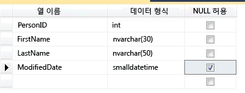
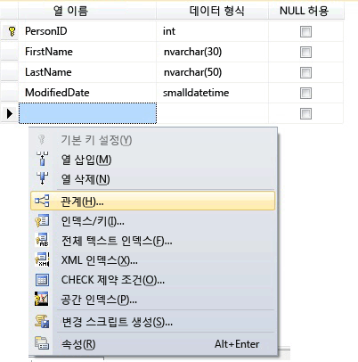
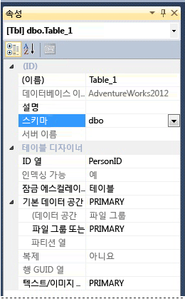

# <a name="create-tables-database-engine"></a>테이블 만들기(데이터베이스 엔진)
[!INCLUDE[tsql-appliesto-ss2016-all_md](../../includes/tsql-appliesto-ss2016-all-md.md)]

  [!INCLUDE[ssManStudioFull](../../includes/ssmanstudiofull-md.md)] 또는 [!INCLUDE[tsql](../../includes/tsql-md.md)]을 사용하여 새 테이블을 만들고, 테이블 이름을 지정하고, 이 테이블을 기존 데이터베이스에 추가할 수 있습니다.  
  

  
##  <a name="Permissions"></a> 먼저 권한을 확인하세요.  
이 작업을 수행하려면 데이터베이스에는 CREATE TABLE 권한이 필요하고 테이블을 만들 구성표에는 ALTER 권한이 필요합니다.  
  
 CREATE TABLE 문에 있는 열을 CLR 사용자 정의 형식으로 정의하는 경우 해당 유형의 소유권이나 이에 대한 REFERENCES 권한이 필요합니다.  
  
 CREATE TABLE 문의 열에 연관된 XML 스키마 컬렉션이 있는 경우 XML 스키마 컬렉션의 소유권이나 이에 대한 REFERENCES 권한이 필요합니다.  
  
 
## <a name="using-table-designer"></a>테이블 디자이너 사용  
  
1.  SSMS의 **개체 탐색기**에서 수정할 데이터베이스를 포함하는 [!INCLUDE[ssDE](../../includes/ssde-md.md)] 인스턴스에 연결합니다.  
  
2.  **개체 탐색기**에서 **데이터베이스** 노드를 확장한 후 새 테이블을 포함할 데이터베이스를 확장합니다.  
  
3.  개체 탐색기에서 데이터베이스의 **테이블** 노드를 마우스 오른쪽 단추로 클릭한 다음 **새 테이블**을 클릭합니다.  
  
4.  다음 그림과 같이 각 열에 대해 열 이름을 입력하고, 데이터 형식을 선택하고, null 허용 여부를 선택합니다.  
  
       
  
5.  ID 또는 계산 열 값 등 열의 더 많은 속성을 지정하려면 열을 클릭하고 열 속성 탭에서 적절한 속성을 선택합니다. 열 속성에 대한 자세한 내용은 [테이블 열 속성&#40;SQL Server Management Studio&#41;](../../relational-databases/tables/table-column-properties-sql-server-management-studio.md)을 참조하세요.  
  
6.  열을 기본 키로 지정하려면 열을 마우스 오른쪽 단추로 클릭하고 **기본 키 설정**을 선택합니다. 자세한 내용은 [Create Primary Keys](../../relational-databases/tables/create-primary-keys.md)을 참조하세요.  
  
7.  외래 키 관계를 만들려면 제약 조건 또는 인덱스를 확인하고 테이블 디자이너 창에서 마우스 오른쪽 단추로 클릭하고 다음 그림과 같이 목록에서 개체를 선택합니다.  
  
       
  
     이러한 개체에 대한 자세한 내용은 [Create Foreign Key Relationships](../../relational-databases/tables/create-foreign-key-relationships.md), [Create Check Constraints](../../relational-databases/tables/create-check-constraints.md) 및 [Indexes](../../relational-databases/indexes/indexes.md)를 참조하세요.  
  
8.  기본적으로 테이블은 **dbo** 스키마에 포함되어 있습니다. 테이블에 다른 스키마를 지정하려면 다음 그림과 같이 테이블 디자이너 창에서 마우스 오른쪽 단추로 클릭하고 **속성** 을 선택합니다. **스키마** 드롭다운 목록에서 적절한 스키마를 선택합니다.  
  
       
  
     스키마에 대한 자세한 내용은 [Create a Database Schema](../../relational-databases/security/authentication-access/create-a-database-schema.md)를 참조하세요.  
  
9. **파일** 메뉴에서 **저장** *table name*을 선택합니다.  
  
10. **이름 선택** 대화 상자에서 테이블의 이름을 입력하고 **확인**을 클릭합니다.  
  
11. 새 테이블을 보려면 **개체 탐색기**에서 **테이블** 노드를 확장하고 **F5** 를 눌러 개체 목록을 새로 고칩니다. 테이블 목록에 새 테이블이 표시됩니다.  
  
##  <a name="TsqlProcedure"></a> Transact-SQL 사용  
  
## <a name="using-query-editor"></a>쿼리 편집기 사용  
  
1.  **개체 탐색기**에서 [!INCLUDE[ssDE](../../includes/ssde-md.md)]인스턴스에 연결합니다.  
  
2.  표준 도구 모음에서 **새 쿼리**를 클릭합니다.  
  
3.  다음 예를 복사하여 쿼리 창에 붙여 넣고 **실행**을 클릭합니다.  
  
    ```  
    CREATE TABLE dbo.PurchaseOrderDetail  
    (  
        PurchaseOrderID int NOT NULL  
        ,LineNumber smallint NOT NULL  
        ,ProductID int NULL  
        ,UnitPrice money NULL  
        ,OrderQty smallint NULL  
        ,ReceivedQty float NULL  
        ,RejectedQty float NULL  
        ,DueDate datetime NULL  
    );  
    ```  
  
 더 많은 예제를 보려면 [CREATE TABLE&#40;Transact-SQL&#41;](../../t-sql/statements/create-table-transact-sql.md)을 참조하세요.  
  
  

