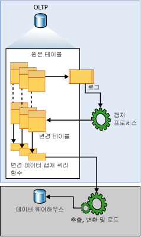

# 변경 데이터 캡처 정보(SQL Server)
  변경 데이터 캡처는 [!INCLUDE[ssNoVersion](../../includes/ssnoversion-md.md)] 테이블에 적용되는 삽입, 업데이트 및 삭제 작업을 기록합니다. 이로 인해 변경 세부 정보가 쉽게 사용할 수 있는 관계형 형식으로 제공됩니다. 대상 환경에 변경 내용을 적용하는 데 필요한 열 정보 및 메타데이터가 수정된 행에 대해 캡처되고 추적된 원본 테이블의 열 구조를 반영하는 변경 테이블에 저장됩니다. 소비자가 변경 데이터에 체계적으로 액세스할 수 있도록 테이블 반환 함수가 제공됩니다.  
  
 이 기술의 대상이 될 수 있는 좋은 데이터 소비자 예로 ETL(추출, 변환 및 로드) 응용 프로그램을 들 수 있습니다. ETL 응용 프로그램은 증분식으로 [!INCLUDE[ssNoVersion](../../includes/ssnoversion-md.md)] 원본 테이블의 변경 데이터를 데이터 웨어하우스 또는 데이터 마트로 로드합니다. 데이터 웨어하우스 내에서 원본 테이블의 표현은 해당 원본 테이블의 변경 내용을 반영해야 하지만 원본 복제본을 새로 고치는 종단 간 기술은 적합하지 않습니다. 대신 소비자가 다른 종류의 데이터 대상 표현에 적용할 수 있도록 구조화된 안정적인 변경 데이터 스트림이 필요합니다. [!INCLUDE[ssNoVersion](../../includes/ssnoversion-md.md)] 변경 데이터 캡처는 이러한 기술을 제공합니다.  
  
## 변경 데이터 캡처 데이터 흐름  
 다음 그림에서는 변경 데이터 캡처의 주요 데이터 흐름을 보여 줍니다.  
  
   
  
 변경 데이터 캡처에 대한 변경 데이터 원본은 [!INCLUDE[ssNoVersion](../../includes/ssnoversion-md.md)] 트랜잭션 로그입니다. 추적된 원본 테이블에 삽입, 업데이트 및 삭제가 적용되면 이러한 변경을 설명하는 항목이 로그에 추가됩니다. 로그는 캡처 프로세스에 대한 입력으로 사용됩니다. 이 프로세스는 로그를 읽고 변경에 대한 정보를 추적된 테이블의 관련 변경 테이블에 추가합니다. 지정된 범위에서 변경 테이블에 나타나는 변경을 열거하여 해당 정보를 필터링된 결과 집합의 형태로 반환하는 함수가 제공됩니다. 필터링된 결과 집합은 일반적으로 일부 외부 환경의 원본 표현을 업데이트하는 응용 프로그램 프로세스에서 사용됩니다.  
  
## 변경 데이터 캡처 및 캡처 인스턴스 이해  
 데이터베이스 내에 있는 개별 테이블에 대한 변경 내용을 추적하려면 먼저 해당 데이터베이스에 변경 데이터 캡처를 사용하도록 명시적으로 설정해야 합니다. 이 작업은 저장 프로시저 [sys.sp_cdc_enable_db](../../relational-databases/system-stored-procedures/sys-sp-cdc-enable-db-transact-sql.md)를 사용하여 수행합니다. 데이터베이스에 변경 데이터 캡처를 사용하도록 설정하면 저장 프로시저 [sys.sp_cdc_enable_table](../../relational-databases/system-stored-procedures/sys-sp-cdc-enable-table-transact-sql.md)을 사용하여 원본 테이블을 추적된 테이블로 식별할 수 있습니다. 테이블에 변경 데이터 캡처를 사용하도록 설정하면 관련 캡처 인스턴스가 만들어져 원본 테이블에서의 변경 데이터 배포가 지원됩니다. 캡처 인스턴스는 변경 테이블과 최대 두 개의 쿼리 함수로 구성됩니다. 캡처 인스턴스의 구성 세부 정보를 설명하는 메타데이터는 변경 데이터 캡처 메타데이터 테이블인 **cdc.change_tables**, **cdc.index_columns** 및 **cdc.captured_columns**에 보존됩니다. 이 정보는 저장 프로시저 [sys.sp_cdc_help_change_data_capture](../../relational-databases/system-stored-procedures/sys-sp-cdc-help-change-data-capture-transact-sql.md)를 사용하여 검색할 수 있습니다.  
  
 캡처 인스턴스와 관련된 모든 개체는 변경 데이터 캡처를 사용하도록 설정된 데이터베이스의 변경 데이터 캡처 스키마에 만들어집니다. 캡처 인스턴스 이름은 올바른 개체 이름이어야 하며 데이터베이스 캡처 인스턴스 전체에서 고유해야 합니다. 기본적으로 이름은 원본 테이블의 \<*스키마 이름*_*테이블 이름*>입니다. 관련 변경 테이블의 이름은 캡처 인스턴스 이름에 **_CT**를 추가하여 지정됩니다. 모든 변경 내용을 쿼리하는 데 사용되는 함수의 이름은 캡처 인스턴스 이름 앞에 **fn_cdc_get_all_changes_**를 추가하여 지정됩니다. 캡처 인스턴스가 **순 변경**을 지원하도록 구성된 경우 **net_changes** 쿼리 함수도 만들어지며 해당 이름은 캡처 인스턴스 이름 앞에 **fn_cdc_get_net_changes\_**를 추가하여 지정됩니다.  
  
## 변경 테이블  
 변경 데이터 캡처 변경 테이블의 처음 5개 열은 메타데이터 열입니다. 이러한 열은 기록된 변경 내용과 관련된 추가 정보를 제공합니다. 나머지 열은 원본 테이블에서 이름 및 유형(일반적으로 사용됨)으로 식별된 캡처된 열을 반영합니다. 이러한 열은 원본 테이블에서 수집된 캡처된 열을 보유합니다.  
  
 원본 테이블에 적용되는 각 삽입 또는 삭제 작업은 변경 테이블 내에 단일 행으로 나타납니다. 삽입 작업의 결과로 생성되는 행의 데이터 열에는 삽입 이후의 열 값이 포함되며 삭제 작업의 결과로 생성되는 행의 데이터 열에는 삭제 이전의 열 값이 포함됩니다. 업데이트 작업의 경우 하나의 행 항목에서 업데이트 이전의 열 값을 식별하고 다른 행 항목에서 업데이트 이후의 열 값을 식별해야 합니다.  
  
 변경 테이블의 각 행에는 변경 작업을 해석할 수 있도록 추가 메타데이터도 포함됩니다. 열 __$start_lsn은 변경 내용에 할당된 커밋 LSN(로그 시퀀스 번호)을 식별합니다. 커밋 LSN은 동일한 트랜잭션 내에서 커밋된 변경 내용을 식별할 뿐만 아니라 해당 트랜잭션을 정렬합니다. 열 \_\_$seqval을 사용하여 동일한 트랜잭션 내에서 발생하는 추가 변경 내용을 정렬할 수 있습니다. 열 \_\_$operation은 변경 내용과 연결된 작업을 기록합니다. 1 = 삭제, 2 = 삽입, 3 = 업데이트(이미지 이전) 및 4 = 업데이트(이미지 이후)입니다. 열 \_\_$update_mask는 캡처된 각 열에 대해 1비트가 정의된 가변 비트 마스크입니다. 삽입 및 삭제 항목의 경우 업데이트 마스크에는 항상 모든 비트가 설정됩니다. 그러나 업데이트 행의 경우에는 변경된 열에 해당하는 비트만 설정됩니다.  
  
## 데이터베이스에 대한 변경 데이터 캡처 유효성 간격  
 데이터베이스에 대한 변경 데이터 캡처 유효성 간격은 캡처 인스턴스에 변경 데이터를 사용할 수 있는 시간입니다. 유효성 간격은 데이터베이스 테이블에 대한 첫 번째 캡처 인스턴스가 만들어질 때 시작되어 현재 시간까지 지속됩니다.  
  
 변경 테이블에 보관되어 있는 데이터는 주기적이며 체계적으로 정리하지 않으면 관리할 수 없을 정도로 커집니다. 변경 데이터 캡처 정리 프로세스는 보존을 기반으로 하는 정리 정책을 적용합니다. 먼저 이 프로세스는 시간 제한에 따라 유효성 간격의 하위 끝점으로 이동한 다음 만료된 변경 테이블 항목을 제거합니다. 기본적으로 3일 분량의 데이터가 보존됩니다.  
  
 높은 끝점에서 캡처 프로세스가 각각의 새 변경 데이터 일괄 처리를 커밋하면 변경 테이블 항목을 포함하는 각 트랜잭션에 대해 새 항목이 **cdc.lsn_time_mapping**에 추가됩니다. 매핑 테이블 내에서 커밋 LSN(로그 시퀀스 번호)과 트랜잭션 커밋 시간(각각 start_lsn 열 및 tran_end_time 열)은 모두 보존됩니다. **cdc.lsn_time_mapping**에 있는 최대 LSN 값은 데이터베이스 유효성 기간의 상위 워터마크를 나타냅니다. 이 값의 해당 커밋 시간은 보존 기반 정리에서 새 하위 워터마크를 계산하는 기반으로 사용됩니다.  
  
 캡처 프로세스에서 트랜잭션 로그의 변경 데이터를 추출하기 때문에 변경 내용이 원본 테이블에 커밋되는 시간과 변경 내용이 관련 변경 테이블 내에 나타나는 시간 사이에는 기본적으로 대기 시간이 있게 됩니다. 이러한 대기 시간은 일반적으로 짧지만, 캡처 프로세스에서 관련 로그 항목을 처리할 때까지 변경 데이터를 사용할 수 없다는 점을 알아두는 것이 중요합니다.  
  
## 캡처 인스턴스에 대한 변경 데이터 캡처 유효성 간격  
 일반적으로 데이터베이스 유효성 간격과 개별 캡처 인스턴스의 유효성 간격은 일치하지만 그렇지 않은 경우도 있습니다. 캡처 인스턴스의 유효성 간격은 캡처 프로세스에서 캡처 인스턴스를 인식하여 해당 변경 테이블에 대한 관련 변경 내용을 기록하기 시작할 때 시작합니다. 따라서 여러 캡처 인스턴스가 서로 다른 시간에 만들어지는 경우 각 인스턴스는 처음에 서로 다른 하위 끝점을 포함하게 됩니다. [sys.sp_cdc_help_change_data_capture](../../relational-databases/system-stored-procedures/sys-sp-cdc-help-change-data-capture-transact-sql.md)에서 반환되는 결과 집합의 start_lsn 열은 정의된 각 캡처 인스턴스의 현재 하위 끝점을 보여 줍니다. 정리 프로세스는 변경 테이블 항목을 정리할 때 모든 캡처 인스턴스에 대한 start_lsn 값을 조정하여 사용 가능한 변경 데이터의 새 하위 워터마크를 반영합니다. 현재 새 하위 워터마크보다 작은 start_lsn 값을 포함하는 캡처 인스턴스만 조정됩니다. 시간이 지나도 새 캡처 인스턴스가 만들어지지 않으면 모든 개별 인스턴스에 대한 유효성 간격이 데이터베이스 유효성 간격과 일치하게 됩니다.  
  
 요청에 대한 추출 간격이 캡처 인스턴스에 대한 현재 변경 데이터 캡처 유효성 간격에 완전히 포함되어야 하므로 변경 데이터 소비자에게는 유효성 간격이 중요합니다. 추출 간격의 하위 끝점이 유효성 간격 하위 끝점의 왼쪽에 있는 경우 적극적인 정리로 인해 변경 데이터가 누락될 수 있습니다. 추출 간격의 상위 끝점이 유효성 간격 상위 끝점의 오른쪽에 있는 경우 캡처 프로세스에서 추출 간격이 나타내는 기간을 아직 처리하지 않은 것입니다. 이 경우에도 변경 데이터가 누락될 수 있습니다.  
  
 [sys.fn_cdc_get_min_lsn](../../relational-databases/system-functions/sys-fn-cdc-get-min-lsn-transact-sql.md) 함수는 캡처 인스턴스에 대한 현재 최소 LSN 값을 검색하는 데 사용되고 [sys.fn_cdc_get_max_lsn](../../relational-databases/system-functions/sys-fn-cdc-get-max-lsn-transact-sql.md) 함수는 현재 최대 LSN 값을 검색하는 데 사용됩니다. 변경 데이터를 쿼리할 때 지정 LSN 범위가 이러한 두 LSN 값 내에 포함되지 않는 경우 변경 데이터 캡처 쿼리 함수가 실패합니다.  
  
## 원본 테이블에 대한 변경 내용 처리  
 추적되는 원본 테이블의 열 변경 내용에 맞추는 것은 다운스트림 소비자에게는 어려운 문제입니다. 원본 테이블에 변경 데이터 캡처를 사용하도록 설정한다고 해서 이러한 DDL 변경 내용이 발생하지 않는 것은 아니지만 변경 데이터 캡처를 사용하면 API를 통해 반환되어 배달된 결과 집합이 기본 원본 테이블의 열 구조가 변경되어도 그대로 유지되도록 하여 소비자에 대한 영향이 줄어듭니다. 이러한 고정 열 구조는 정의된 쿼리 함수가 액세스하는 기본 변경 테이블에도 반영됩니다.  
  
 변경 테이블을 채우는 캡처 프로세스는 고정 열 구조 변경 테이블에 맞추기 위해, 원본 테이블에 변경 데이터 캡처를 사용하도록 설정할 때 캡처에 대해 식별되지 않은 새 열을 모두 무시합니다. 추적된 열이 삭제되면 후속 변경 항목의 열에 대해 Null 값이 제공됩니다. 그러나 기존 열에서 데이터 형식이 변경되면 해당 변경 내용이 변경 테이블로 전파되어 캡처 메커니즘으로 인해 추적된 열에서 데이터 손실이 발생하지 않도록 합니다. 또한 캡처 프로세스는 추적된 테이블의 열 구조에서 검색된 변경 내용을 cdc.ddl_history 테이블에 게시합니다. 다운스트림 응용 프로그램에서 수행될 수 있는 조정 작업에 대한 알림을 받으려는 소비자는 저장 프로시저 [sys.sp_cdc_get_ddl_history](../../relational-databases/system-stored-procedures/sys-sp-cdc-get-ddl-history-transact-sql.md)를 사용합니다.  
  
 일반적으로 DDL 변경 내용이 관련 원본 테이블에 적용될 때 현재 캡처 인스턴스는 해당 셰이프를 계속 유지합니다. 그러나 테이블에 대해 새 열 구조를 반영하는 두 번째 캡처 인스턴스를 만들 수 있습니다. 이렇게 하면 캡처 프로세스에서 동일한 원본 테이블에 대한 변경 내용을 두 개의 개별 변경 테이블에 적용하여 서로 다른 두 열 구조를 만들 수 있습니다. 따라서 한 변경 테이블에서는 현재 작업 프로그램에 계속 공급을 수행하고 두 번째 변경 테이블에서는 새 열 데이터를 통합하려고 하는 개발 환경을 운영할 수 있습니다. 캡처 메커니즘에서 두 변경 테이블을 동시에 채우도록 하면 변경 데이터 손실 없이 한 테이블에서 다른 테이블로 전환할 수 있습니다. 이는 두 변경 데이터 캡처의 시간대가 겹칠 때 언제든지 발생할 수 있습니다. 전환이 발생하면 더 이상 사용되지 않는 캡처 인스턴스를 제거할 수 있습니다.  
  
> [!NOTE]  
>  단일 원본 테이블에 동시에 연결할 수 있는 최대 캡처 인스턴스 수는 두 개입니다.  
  
## 캡처 작업과 트랜잭션 복제 로그 판독기 간의 관계  
 변경 데이터 캡처 프로세스에 대한 논리는 저장 프로시저 [sp_replcmds](../../relational-databases/system-stored-procedures/sp-replcmds-transact-sql.md)에 포함되어 있습니다. 이는 sqlservr.exe의 일부로 작성되었으며 트랜잭션 로그에서 변경 내용을 수집하기 위해 트랜잭션 복제에 사용되는 내부 서버 함수입니다. 데이터베이스에 변경 데이터 캡처만 사용하도록 설정하는 경우 변경 데이터 캡처 SQL Server 에이전트 캡처 작업을 sp_replcmds를 호출하는 수단으로 만듭니다. 복제도 있는 경우에는 이러한 소비자 모두에 대한 변경 데이터 요구를 충족시키기 위해 트랜잭션 로그 판독기만 사용합니다. 이러한 전략을 사용하면 동일한 데이터베이스에 복제와 변경 데이터 캡처를 모두 사용하도록 설정하는 경우 로그 경합이 상당히 줄어듭니다.  
  
 변경 데이터 캡처를 사용하도록 설정된 데이터베이스의 복제 상태가 변경될 때마다 변경 데이터 캡처를 위해 이러한 두 작업 모드 간에 전환이 자동으로 발생합니다.  
  
> [!IMPORTANT]  
>  두 캡처 논리 모두 프로세스 실행을 위해 [!INCLUDE[ssNoVersion](../../includes/ssnoversion-md.md)] 에이전트를 실행해야 합니다.  
  
 캡처 프로세스의 주요 태스크는 로그를 검색하고 변경 데이터 캡처 변경 테이블에 열 데이터 및 트랜잭션 관련 정보를 작성하는 것입니다. 이 프로세스가 채우는 모든 변경 데이터 캡처 변경 테이블에서 트랜잭션상 일관된 경계를 유지하기 위해 캡처 프로세스는 검색 주기마다 자체 트랜잭션을 열고 커밋합니다. 또한 이 프로세스는 변경 데이터 캡처를 사용하도록 테이블이 새로 설정되는 경우를 검색하고 로그의 변경 항목에 대해 현재 모니터링되는 테이블 집합에 해당 테이블을 자동으로 포함합니다. 마찬가지로 변경 데이터 캡처를 사용하지 않도록 설정하는 경우도 검색되어 변경 데이터에 대해 현재 모니터링되는 테이블 집합에서 해당 원본 테이블이 제거됩니다. 로그 섹션 처리가 완료되면 캡처 프로세스에서 서버 로그 잘림 논리에 신호를 보냅니다. 이 논리에서는 이 정보를 사용하여 자를 로그 항목을 식별합니다.  
  
> [!NOTE]  
>  데이터베이스에 변경 데이터 캡처가 설정된 경우 복구 모드가 단순 복구로 설정되어 있더라도 캡처 프로세스에서 캡처로 표시된 모든 변경 내용을 수집하기 전까지는 로그를 잘라낼 지점이 처리되지 않습니다. 캡처 프로세스가 실행되고 있지 않고 수집할 변경 내용이 있는 경우에는 CHECKPOINT를 실행해도 로그가 잘리지 않습니다.  
  
 캡처 프로세스는 추적된 테이블의 DDL 변경 내용에 대한 기록을 유지 관리하는 데에도 사용됩니다. 변경 데이터 캡처와 관련된 DDL 문은 변경 데이터 캡처를 사용하도록 설정된 데이터베이스 또는 테이블이 삭제되거나 변경 데이터 캡처를 사용하도록 설정된 테이블의 열이 추가, 수정 또는 삭제될 때마다 데이터베이스 트랜잭션 로그에 항목을 만듭니다. 이러한 로그 항목은 캡처 프로세스에 의해 처리됩니다. 그런 다음 캡처 프로세스는 cdc.ddl_history 테이블에 관련 DDL 이벤트를 게시합니다. 저장 프로시저 [sys.sp_cdc_get_ddl_history](../../relational-databases/system-stored-procedures/sys-sp-cdc-get-ddl-history-transact-sql.md)를 사용하여 추적된 테이블에 영향을 주는 DDL 이벤트 관련 정보를 가져올 수 있습니다.  
  
## 변경 데이터 캡처 에이전트 작업  
 일반적으로는 두 개의 [!INCLUDE[ssNoVersion](../../includes/ssnoversion-md.md)] 에이전트 작업이 변경 데이터 캡처를 사용하도록 설정된 데이터베이스와 연결됩니다. 그 중 하나는 데이터베이스 변경 테이블을 채우는 데 사용되는 작업이고, 다른 하나는 변경 테이블 정리 작업을 수행하는 작업입니다. 두 작업 모두 [!INCLUDE[tsql](../../includes/tsql-md.md)] 명령을 실행하는 단일 단계로 구성됩니다. 호출되는 [!INCLUDE[tsql](../../includes/tsql-md.md)] 명령은 작업 논리를 구현하는 변경 데이터 캡처 정의 저장 프로시저입니다. 데이터베이스의 첫 번째 테이블에 변경 데이터 캡처를 사용하도록 설정하는 경우 이러한 작업이 만들어집니다. 정리 작업은 항상 만들어집니다. 캡처 작업은 데이터베이스에 대해 정의된 트랜잭션 게시가 없는 경우에만 만들어집니다. 캡처 작업은 데이터베이스에 변경 데이터 캡처와 트랜잭션 복제를 모두 사용하도록 설정하고 데이터베이스에 더 이상 정의된 게시가 없어 트랜잭션 로그 판독기 작업이 제거되는 경우에도 만들어집니다.  
  
 캡처 작업과 정리 작업 모두 기본 매개 변수를 사용하여 만들어집니다. 캡처 작업은 즉시 시작됩니다. 이 작업은 계속 실행되며 검색 주기당(주기 사이에 5초의 대기 시간 있음) 최대 1000개의 트랜잭션을 처리합니다. 정리 작업은 매일 오전 2시에 실행됩니다. 이 작업은 4320분 또는 3일 동안 변경 테이블 항목을 보존하며 단일 삭제 문을 사용하여 최대 5000개의 항목을 제거합니다.  
  
 데이터베이스에 변경 데이터 캡처를 사용하지 않도록 설정하는 경우 변경 데이터 캡처 에이전트 작업이 제거됩니다. 캡처 작업은 첫 번째 게시가 데이터베이스에 추가되고 변경 데이터 캡처와 트랜잭션 복제를 모두 사용하도록 설정한 경우에도 제거될 수 있습니다.  
  
 내부적으로 변경 데이터 캡처 에이전트 작업은 저장 프로시저 [sys.sp_cdc_add_job](../../relational-databases/system-stored-procedures/sys-sp-cdc-add-job-transact-sql.md)을 사용하여 만들어지고 저장 프로시저 [sys.sp_cdc_drop_job](../../relational-databases/system-stored-procedures/sys-sp-cdc-drop-job-transact-sql.md)을 사용하여 삭제됩니다. 이러한 저장 프로시저는 관리자가 이러한 작업의 생성 및 제거를 제어할 수 있도록 표시됩니다.  
  
 관리자는 변경 데이터 캡처 에이전트 작업의 기본 구성을 명시적으로 제어할 수 없습니다. 기본 구성 매개 변수를 수정할 수 있도록 저장 프로시저 [sys.sp_cdc_change_job](../../relational-databases/system-stored-procedures/sys-sp-cdc-change-job-transact-sql.md)이 제공됩니다. 또한 저장 프로시저 [sys.sp_cdc_help_jobs](../../relational-databases/system-stored-procedures/sys-sp-cdc-help-jobs-transact-sql.md)를 사용하면 현재 구성 매개 변수를 볼 수 있습니다. 캡처 작업과 정리 작업 모두 시작 시 테이블 msdb.dbo.cdc_jobs에서 구성 매개 변수를 추출합니다. [sys.sp_cdc_change_job](../../relational-databases/system-stored-procedures/sys-sp-cdc-change-job-transact-sql.md)을 사용하여 이러한 값에 적용한 변경 내용은 작업을 중지한 다음 다시 시작해야 적용됩니다.  
  
 변경 데이터 캡처 에이전트 작업을 시작하고 중지할 수 있도록 두 개의 추가 저장 프로시저인 [sys.sp_cdc_start_job](../../relational-databases/system-stored-procedures/sys-sp-cdc-start-job-transact-sql.md) 및 [sys.sp_cdc_stop_job](../../relational-databases/system-stored-procedures/sys-sp-cdc-stop-job-transact-sql.md)이 제공됩니다.  
  
> [!NOTE]  
>  캡처 작업을 시작하고 중지해도 변경 데이터가 손실되지 않으며 캡처 프로세스가 로그에서 변경 테이블에 보관할 변경 항목을 검색하는 작업만 수행할 수 없게 됩니다. 요구량이 최대인 기간 동안 로그 검색 작업으로 인해 로드가 추가되지 않도록 하는 적합한 전략은 캡처 작업을 중지한 다음 요구량이 감소할 때 다시 시작하는 것입니다.  
  
 두 [!INCLUDE[ssNoVersion](../../includes/ssnoversion-md.md)] 에이전트 작업 모두 변경 데이터 캡처 환경의 기본 요구를 충족시킬 수 있을 정도로 충분히 유연할 뿐만 아니라 최대한 구성할 수 있도록 디자인되었습니다. 그러나 두 경우 모두 핵심 기능을 제공하는 기본 저장 프로시저가 표시되어 추가 사용자 지정이 가능합니다.  
  
 NETWORK SERVICE 계정에서 데이터베이스 엔진 서비스 또는 SQL Server 에이전트 서비스를 실행 중인 경우 변경 데이터 캡처가 제대로 작동하지 않습니다. 이로 인해 오류 22832가 발생할 수 있습니다.  
  
## 참고 항목  
 [데이터 변경 내용 추적&#40;SQL Server&#41;](../../relational-databases/track-changes/track-data-changes-sql-server.md)   
 [변경 데이터 캡처 설정 및 해제&#40;SQL Server&#41;](../../relational-databases/track-changes/enable-and-disable-change-data-capture-sql-server.md)   
 [변경 데이터 작업&#40;SQL Server&#41;](../../relational-databases/track-changes/work-with-change-data-sql-server.md)   
 [변경 데이터 캡처 관리 및 모니터링&#40;SQL Server&#41;](../../relational-databases/track-changes/administer-and-monitor-change-data-capture-sql-server.md)  
  
  