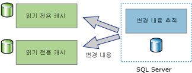
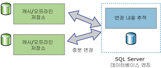

# 변경 내용 추적 정보(SQL Server)
[!INCLUDE [SQL Server SQL Database](../../includes/applies-to-version/sql-asdb.md)]

  변경 내용 추적은 애플리케이션에 대한 효과적인 변경 내용 추적 메커니즘을 제공하는 간단한 솔루션입니다. 일반적으로 애플리케이션에서 데이터베이스의 데이터에 대한 변경 내용을 쿼리하고 이 변경 내용과 관련된 정보에 액세스하도록 하려면 애플리케이션 개발자가 사용자 지정 변경 내용 추적 메커니즘을 구현해야 했습니다. 이러한 메커니즘을 만드는 데는 일반적으로 많은 양의 작업이 필요했으며 트리거, **timestamp** 열, 추적 정보를 저장하기 위한 새 테이블 및 사용자 지정 정리 프로세스의 조합을 사용하는 경우가 많았습니다.  
  
 변경 내용에 대해 필요한 정보의 양과 관련된 요구 사항은 애플리케이션 유형마다 다릅니다. 애플리케이션에서는 변경 내용 추적을 사용하여 사용자 테이블에 수행된 변경에 대한 다음 질문에 답할 수 있습니다.  
  
-   사용자 테이블에 대해 어떤 행이 변경되었는가?  
  
    -   행이 변경되었다는 사실만 필요하며, 행이 변경된 횟수 또는 중간 변경의 값은 필요하지 않습니다.  
  
    -   최신 데이터는 추적되는 테이블에서 직접 얻을 수 있습니다.  
  
-   행이 변경되었는가?  
  
    -   행이 변경되었다는 사실, 그리고 이 변경에 대한 정보가 있어야 하며 동일한 트랜잭션에 변경이 수행된 시점에 이 사항이 기록되어야 합니다.  
  
> [!NOTE]  
>  애플리케이션이 적용된 모든 변경 내용에 대한 정보와 변경된 데이터의 중간 값을 요구하면 변경 내용 추적 대신 변경 데이터 캡처를 사용하는 것이 좋습니다. 자세한 내용은 [변경 데이터 캡처 정보&#40;SQL Server&#41;](../../relational-databases/track-changes/about-change-data-capture-sql-server.md)를 참조하세요.  
  
## 단방향 및 양방향 동기화 애플리케이션  
 [!INCLUDE[ssDEnoversion](../../includes/ssdenoversion-md.md)] 인스턴스와 데이터를 동기화해야 하는 애플리케이션은 변경 내용을 쿼리할 수 있어야 합니다. 변경 내용 추적은 단방향 및 양방향 동기화 애플리케이션 모두에 대한 기반으로 사용될 수 있습니다.  
  
### 단방향 동기화 애플리케이션  
 클라이언트 또는 중간 계층 캐싱 애플리케이션과 같은 단방향 동기화 애플리케이션은 변경 내용 추적을 사용하도록 구축할 수 있습니다. 다음 그림에서 볼 수 있듯이 캐싱 애플리케이션에서는 데이터가 [!INCLUDE[ssDE](../../includes/ssde-md.md)] 에 저장되어야 하고 다른 데이터 저장소에 캐시되어야 합니다. 애플리케이션은 데이터베이스 테이블에 수행된 변경 작업에 대해 캐시를 최신 상태로 유지할 수 있어야 합니다. 변경 내용은 [!INCLUDE[ssDE](../../includes/ssde-md.md)]으로 다시 전달되지 않습니다.  
  
   
  
### 양방향 동기화 애플리케이션  
 양방향 동기화 애플리케이션도 변경 내용 추적을 사용하도록 구축할 수 있습니다. 이 시나리오에서 [!INCLUDE[ssDE](../../includes/ssde-md.md)] 인스턴스의 데이터는 하나 이상의 데이터 저장소와 동기화됩니다. 이러한 저장소의 데이터는 업데이트가 가능하며 변경 내용은 [!INCLUDE[ssDE](../../includes/ssde-md.md)]과 다시 동기화되어야 합니다.  
  
   
  
 양방향 동기화 애플리케이션의 좋은 예는 간헐적으로 연결되는 애플리케이션입니다. 이러한 유형의 애플리케이션에서 클라이언트 애플리케이션은 로컬 저장소를 쿼리 및 업데이트합니다. 클라이언트와 서버 간에 연결을 사용할 수 있는 경우 애플리케이션은 서버와 동기화되고 변경된 데이터는 양방향으로 흐르게 됩니다.  
  
 양방향 동기화 애플리케이션은 충돌을 검색할 수 있어야 합니다. 충돌은 동기화 사이의 시간에 동일한 데이터가 두 데이터 저장소 모두에서 변경된 경우 발생합니다. 충돌 검색 기능을 통해 애플리케이션은 변경 내용이 누락되지 않도록 보장할 수 있습니다.  
  
## 변경 내용 추적 작동 방법  
 변경 내용 추적을 구성하려면 DDL 문 또는 [!INCLUDE[ssManStudioFull](../../includes/ssmanstudiofull-md.md)]를 사용하면 됩니다. 자세한 내용은 [변경 내용 추적 설정 및 해제&#40;SQL Server&#41;](../../relational-databases/track-changes/enable-and-disable-change-tracking-sql-server.md)를 참조하세요. 변경 내용을 추적하려면 먼저 데이터베이스에 변경 내용 추적을 설정한 다음 해당 데이터베이스에 있는 추적할 테이블에 변경 내용 추적을 설정해야 합니다. 테이블 정의는 어떤 식으로든 변경할 필요가 없으며 트리거는 만들어지지 않습니다.  
  
 변경 내용 추적이 테이블에 대해 구성되면 해당 테이블의 행에 영향을 미치는 DML 문이 수정된 각 행에 대한 변경 내용 추적을 기록합니다. 변경된 행을 쿼리하고 변경 내용에 대한 정보를 얻으려면 [변경 내용 추적 함수](../../relational-databases/system-functions/change-tracking-functions-transact-sql.md)를 사용하면 됩니다.  
  
 추적되는 테이블에서 변경 내용 정보와 함께 기록되는 유일한 정보는 기본 키 열의 값입니다. 이러한 값은 변경된 행을 식별합니다. 이러한 행에 대한 최신 데이터를 얻으려면 애플리케이션에서는 기본 키 열 값을 사용하여 원본 테이블을 추적되는 테이블에 조인하면 됩니다.  
  
 각 행에 대해 수행된 변경에 대한 정보도 변경 내용 추적을 사용하여 얻을 수 있습니다. 예를 들어 변경을 일으킨 DML 작업의 유형(삽입, 업데이트 또는 삭제) 또는 업데이트 작업의 일부로 변경된 열이 있습니다. 
 
## 변경 내용 추적 정리
모든 테이블에 대한 변경 내용 추적 정보(변경 내용 추적에 사용됨)는 메모리 내 rowstore에 저장됩니다. 변경 내용 추적에 사용되는 각 테이블과 연결된 변경 내용 추적 데이터는 검사점이 사용될 때마다 메모리 내 rowstore에서 해당 디스크에 있는 내부 테이블로 플러시됩니다. 검사점이 사용되는 동안 행이 디스크에 있는 테이블로 이동한 후 메모리 내 rowstore도 제거됩니다.

변경 내용 추적에 사용되는 각 테이블에는 변경 내용 추적 함수에서 변경 내용 버전 및 특정 버전 이후 변경된 행을 확인하는 데 사용되는 디스크에 있는 내부 테이블이 있습니다. **자동 정리** 스레드는 활성화될 때마다 SQL Server 인스턴스에서 사용자 데이터베이스를 모두 검색하여 변경 내용 추적에 사용되는 데이터베이스를 확인합니다. 데이터베이스의 유지 기간 설정에 따라 만료된 레코드의 각 디스크에 있는 내부 테이블이 제거됩니다.

[!INCLUDE[ssSQL14](../../includes/sssql14-md.md)] 및 [!INCLUDE[ssSQL15](../../includes/sssql15-md.md)]에 대한 서비스 팩에는 내부 변경 내용 추적의 내부 테이블에 대한 수동 정리를 수행하는 데 필요한 저장 프로시저가 추가되었습니다. 저장 프로시저에 대한 자세한 내용은 [KB173157](https://support.microsoft.com/help/3173157/adds-a-stored-procedure-for-the-manual-cleanup-of-the-change-tracking-side-table-in-sql-server-2014-sp2-or-2016-sp1)을 참조하세요. 
  
## 참고 항목  
 [변경 내용 추적 설정 및 해제&#40;SQL Server&#41;](../../relational-databases/track-changes/enable-and-disable-change-tracking-sql-server.md)   
 [변경 내용 추적 사용&#40;SQL Server&#41;](../../relational-databases/track-changes/work-with-change-tracking-sql-server.md)   
 [변경 내용 추적 관리&#40;SQL Server&#41;](../../relational-databases/track-changes/manage-change-tracking-sql-server.md)   
 [데이터 변경 내용 추적&#40;SQL Server&#41;](../../relational-databases/track-changes/track-data-changes-sql-server.md)  
  
  
