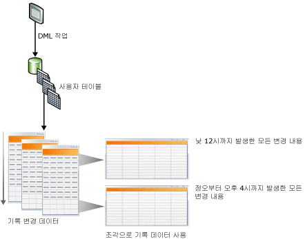
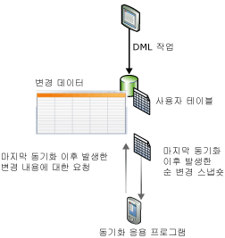

# 데이터 변경 내용 추적(SQL Server)
[!INCLUDE[tsql-appliesto-ss2008-asdb-xxxx-xxx-md](../../includes/tsql-appliesto-ss2008-asdb-xxxx-xxx-md.md)]
  [!INCLUDE[ssCurrent](../../includes/sscurrent-md.md)] 은 데이터베이스에서 데이터에 대한 변경 내용을 추적하는 [변경 데이터 캡처](#Capture) 및 [변경 내용 추적](#Tracking)과 같은 두 가지 기능을 제공합니다. 이러한 기능은 데이터베이스의 사용자 테이블에 적용된 DML 변경 내용(삽입, 업데이트 및 삭제 작업)을 애플리케이션에서 확인할 수 있게 해줍니다. 변경 데이터 캡처 및 변경 추적은 동일한 데이터베이스에서 설정할 수 있으며 특별한 고려 사항은 필요하지 않습니다. 변경 데이터 캡처 및 변경 내용 추적을 지원하는 [!INCLUDE[ssNoVersion](../../includes/ssnoversion-md.md)] 버전에 대한 자세한 내용은 [SQL Server 2016 버전에서 지원하는 기능](~/sql-server/editions-and-supported-features-for-sql-server-2016.md)을 참조하세요. [!INCLUDE[ssSDS_md](../../includes/sssds-md.md)]에서는 변경 내용 추적 기능이 지원됩니다. 변경 데이터 캡처는 SQL Server 및 Azure SQL Database Managed Instance에서만 지원됩니다.
  
## 변경 데이터 캡처 또는 변경 추적 사용의 이점  
 데이터베이스에서 변경된 데이터를 쿼리하는 기능은 일부 애플리케이션의 효율성을 위한 중요한 요구 사항입니다. 일반적으로 애플리케이션 개발자는 데이터 변경을 확인하기 위해 애플리케이션에서 트리거, 타임스탬프, 열 및 추가 테이블의 조합으로 사용자 지정 추적 방법을 구현해야 합니다. 이러한 애플리케이션을 만들기 위해서는 많은 구현 작업과 스키마 업데이트가 필요하며 높은 성능 오버헤드가 수반되는 경우도 많습니다.  
  
 애플리케이션에서 데이터베이스의 변경 내용을 추적하기 위해 사용자 지정 솔루션을 개발하는 대신 변경 데이터 캡처 또는 변경 추적을 사용할 경우 다음과 같은 이점을 얻을 수 있습니다.  
  
-   개발 시간이 단축됩니다. 해당 기능이 [!INCLUDE[ssCurrent](../../includes/sscurrent-md.md)]에서 제공되므로 사용자 지정 솔루션을 개발할 필요가 없습니다.  
  
-   스키마 변경이 필요 없음 열이나 트리거를 추가하거나, 열을 사용자 테이블에 추가할 수 없는 경우 삭제된 행을 추적하거나 변경 추적 정보를 저장할 추가 테이블을 만들 필요가 없습니다.  
  
-   정리 메커니즘이 기본 제공됩니다. 변경 내용 추적에 대한 정리는 백그라운드에서 자동으로 수행됩니다. 추가 테이블에 저장된 데이터에 대한 사용자 지정 정리는 필요 없습니다.  
  
-   변경 정보를 얻기 위한 함수가 제공됩니다.  
  
-   DML 작업에 대한 오버헤드가 낮습니다. 동기 변경 내용 추적에는 항상 어느 정도의 오버헤드가 발생합니다. 그러나 변경 내용 추적을 사용하면 오버헤드를 최소화할 수 있습니다. 이 경우 오버헤드는 대체 솔루션, 특히 트리거를 사용해야 하는 솔루션에 비해 더 낮은 경우가 많습니다.  
  
-   변경 내용 추적이 커밋된 트랜잭션을 기반으로 수행됨 변경 순서는 트랜잭션 커밋 시간을 기반으로 합니다. 이를 통해 장시간 실행되는 겹치는 트랜잭션이 있을 때 신뢰할 수 있는 결과를 얻을 수 있습니다. **timestamp** 값을 사용하는 사용자 지정 솔루션은 이러한 시나리오를 처리하도록 특별히 설계해야 합니다.  
  
-   구성 및 관리를 위해 사용할 수 있는 표준 도구가 제공됩니다. [!INCLUDE[ssCurrent](../../includes/sscurrent-md.md)] 은 표준 DDL 문, [!INCLUDE[ssManStudioFull](../../includes/ssmanstudiofull-md.md)], 카탈로그 뷰 및 보안 권한을 제공합니다.  
  
## 변경 데이터 캡처와 변경 내용 추적 간의 기능 차이점  
 다음 목록에서는 변경 데이터 캡처와 변경 내용 추적 간의 기능 차이점을 보여 줍니다. 변경 데이터 캡처의 추적 메커니즘에는 트랜잭션 로그의 비동기 변경 캡처가 포함되어 있으므로 DML 작업 이후에 변경을 사용할 수 있습니다. 변경 내용 추적의 추적 메커니즘에는 DML 작업과 함께 동기 변경 내용 추적이 포함되어 있으므로 변경 정보를 즉시 사용할 수 있습니다.  
  
|기능|변경 데이터 캡처|변경 내용 추적|  
|-------------|-------------------------|---------------------|  
|**추적된 변경 내용**|||  
|DML 변경|예|예|  
|**추적된 정보**|||  
|기록 데이터|예|아니오|  
|열 변경 여부|예|예|  
|DML 유형|예|예|  
  
##   Change Data Capture  
 변경 데이터 캡처는 DML 변경이 적용되었다는 사실과 변경된 실제 데이터 모두를 캡처하여 사용자 테이블에 대한 기록 변경 정보를 제공합니다. 트랜잭션 로그를 읽고 시스템에 대한 영향이 적은 비동기 프로세스를 사용하여 변경을 캡처합니다.  
  
 다음 그림과 같이 사용자 테이블에 적용된 변경은 해당 변경 테이블에서 캡처됩니다. 이러한 변경 테이블은 시간에 따라 변경을 기록하여 보여 줍니다. [!INCLUDE[ssNoVersion](../../includes/ssnoversion-md.md)]에서 제공하는 [변경 데이터 캡처](../../relational-databases/system-functions/change-data-capture-functions-transact-sql.md) 함수를 사용하면 변경 데이터를 쉽고 체계적으로 사용할 수 있습니다.  
  
   
  
### 보안 모델  
 이 섹션에서는 변경 데이터 캡처 보안 모델에 대해 설명합니다.  
  
 **구성 및 관리**  
 데이터베이스에서 변경 데이터 캡처를 사용하도록 설정하거나 사용하지 않도록 설정하려면 [sys.sp_cdc_enable_db&#40;Transact-SQL&#41;](../../relational-databases/system-stored-procedures/sys-sp-cdc-enable-db-transact-sql.md) 또는 [sys.sp_cdc_disable_db&#40;Transact-SQL&#41;](../../relational-databases/system-stored-procedures/sys-sp-cdc-disable-db-transact-sql.md)의 호출자가 고정 서버 **sysadmin** 역할의 멤버여야 합니다. 테이블에서 변경 데이터 캡처를 사용하도록 설정하거나 사용하지 않도록 설정하는 경우에는 [sys.sp_cdc_enable_table&#40;Transact-SQL&#41;](../../relational-databases/system-stored-procedures/sys-sp-cdc-enable-table-transact-sql.md) 및 [sys.sp_cdc_disable_table&#40;Transact-SQL&#41;](../../relational-databases/system-stored-procedures/sys-sp-cdc-disable-table-transact-sql.md)의 호출자가 sysadmin 역할의 멤버 또는 **database db_owner** 역할의 멤버여야 합니다.  
  
 서버 **sysadmin** 역할의 멤버와 **database db_owner** 역할의 멤버만 저장 프로시저를 사용하여 변경 데이터 캡처 작업의 관리를 지원할 수 있습니다.  
  
 **변경 내용 열거 및 메타데이터 쿼리**  
 캡처 인스턴스와 연결된 변경 데이터에 액세스하려면 연결된 원본 테이블의 캡처된 모든 열에 선택적으로 액세스할 수 있는 권한이 사용자에게 부여되어야 합니다. 또한 캡처 인스턴스를 만들 때 제어 역할을 지정한 경우 호출자도 지정된 제어 역할의 멤버여야 합니다. 메타데이터에 액세스하는 다른 일반적인 변경 데이터 캡처 함수에 모든 데이터베이스 사용자가 public 역할을 통해 액세스할 수 있습니다. 물론 반환된 메타데이터에 대한 액세스는 기본 원본 테이블에 대한 선택적 액세스 권한을 사용하거나 정의된 제어 역할에서의 멤버 자격을 통해 일반적으로 제어됩니다.  
  
 **변경 데이터 캡처를 사용하는 원본 테이블에 대한 DDL 작업**  
 테이블에 변경 데이터 캡처를 사용하도록 설정한 경우 DDL 작업은 고정 서버 역할 **sysadmin**의 멤버, **database role db_owner**의 멤버 또는 **database role db_ddladmin**의 멤버에 의해서만 테이블에 적용될 수 있습니다. 테이블에서 DDL 작업을 수행할 수 있는 명시적 권한을 가진 사용자는 이러한 작업을 시도할 때 오류 22914를 받게 됩니다.  
  
### 변경 데이터 캡처에 대한 데이터 형식 고려 사항  
 변경 데이터 캡처에서는 모든 기본 열 유형이 지원됩니다. 다음 표에서는 여러 열 유형에 대한 동작 및 제한 사항을 나열합니다.  
  
|열 유형|변경 테이블에 변경 내용이 캡처되는지 여부|제한 사항|  
|--------------------|---------------------------------------|-----------------|  
|스파스 열|예|열 집합을 사용할 때는 변경 내용 캡처를 지원하지 않습니다.|  
|계산 열|아니오|계산 열의 변경 내용은 추적할 수 없습니다. 열이 적합한 유형의 변경 테이블에 나타나지만 NULL 값을 갖습니다.|  
|XML|예|개별 XML 요소에 대한 변경 사항은 추적할 수 없습니다.|  
|timestamp|예|변경 테이블의 데이터 형식은 이진으로 변환됩니다.|  
|BLOB 데이터 형식|예|BLOB 열의 이전 이미지는 열 자체가 변경된 경우에만 저장됩니다.|  
  
### 변경 데이터 캡처 및 기타 SQL Server 기능  
 이 섹션에서는 다음 기능으로 변경 데이터 캡처와 상호 작용하는 방법에 대해 설명합니다.  
  
-   데이터베이스 미러링  
  
-   트랜잭션 복제  
  
-   데이터베이스 복원 또는 연결  
  
#### 데이터베이스 미러링  
 변경 데이터 캡처가 설정된 데이터베이스를 미러링할 수 있습니다. 미러에서 캡처 및 정리가 자동으로 발생하도록 하려면 다음 단계를 따릅니다.  
  
1.  [!INCLUDE[ssNoVersion](../../includes/ssnoversion-md.md)] 에이전트가 미러에서 실행 중인지 확인합니다.  
  
2.  보안 주체가 미러로 장애 조치를 수행하면 미러에서 캡처 작업 및 정리 작업을 만듭니다. 작업을 만들려면 저장 프로시저 [sys.sp_cdc_add_job&#40;Transact-SQL&#41;](../../relational-databases/system-stored-procedures/sys-sp-cdc-add-job-transact-sql.md)을 사용합니다.  

[!INCLUDE[freshInclude](../../includes/paragraph-content/fresh-note-steps-feedback.md)]

 데이터베이스 미러링에 대한 자세한 내용은 [데이터베이스 미러링&#40;SQL Server&#41;](../../database-engine/database-mirroring/database-mirroring-sql-server.md)을 참조하세요.  
  
#### 트랜잭션 복제  
 변경 데이터 캡처 및 트랜잭션 복제는 동일한 데이터베이스에 함께 존재할 수 있지만 두 기능이 모두 설정된 경우 변경 테이블 채우기가 다르게 처리됩니다. 변경 데이터 캡처 및 트랜잭션 복제는 항상 동일한 [sp_replcmds](../../relational-databases/system-stored-procedures/sp-replcmds-transact-sql.md)프로시저를 사용하여 트랜잭션 로그에서 변경 내용을 읽습니다. 변경 데이터 캡처가 자체적으로 설정된 경우 [!INCLUDE[ssNoVersion](../../includes/ssnoversion-md.md)] 에이전트 작업은 **sp_replcmds**를 호출합니다. 동일한 데이터베이스에 두 기능이 모두 설정된 경우 로그 판독기 에이전트는 **sp_replcmds**를 호출합니다. 이 에이전트는 변경 테이블과 배포 데이터베이스 테이블을 모두 채웁니다. 자세한 내용은 [Replication Log Reader Agent](../../relational-databases/replication/agents/replication-log-reader-agent.md)을 참조하세요.  
  
 [!INCLUDE[ssSampleDBobject](../../includes/sssampledbobject-md.md)] 데이터베이스에 변경 데이터 캡처가 설정되어 있고 두 테이블에 캡처가 설정된 시나리오를 생각해 보십시오. 변경 테이블을 채우기 위해 캡처 작업은 **sp_replcmds**를 호출합니다. 데이터베이스에 트랜잭션 복제가 설정되고 게시가 만들어집니다. 그런 다음 데이터베이스에 로그 판독기 에이전트가 만들어지고 캡처 작업이 삭제됩니다. 로그 판독기 에이전트는 변경 테이블에 커밋된 마지막 로그 시퀀스 번호에서 로그를 계속 검색합니다. 이렇게 하면 변경 테이블의 데이터 일관성이 보장됩니다. 이 데이터베이스에서 트랜잭션 복제가 해제되면 로그 판독기 에이전트가 제거되고 캡처 작업이 다시 만들어집니다.  
  
> [!NOTE]  
>  변경 데이터 캡처 및 트랜잭션 복제 모두에 로그 판독기 에이전트가 사용된 경우 복제된 변경 사항은 먼저 배포 데이터베이스에 기록됩니다. 그런 다음 캡처된 변경 사항이 변경 테이블에 기록됩니다. 두 작업은 함께 커밋됩니다. 배포 데이터베이스에 대한 쓰기 작업이 지연될 경우 변경 테이블에 변경 내용도 그만큼 늦게 표시됩니다.  
  
#### 변경 데이터 캡처가 설정된 데이터베이스 복원 또는 연결  
 [!INCLUDE[ssNoVersion](../../includes/ssnoversion-md.md)] 에서는 다음과 같은 논리에 따라 데이터베이스가 복원 또는 연결된 후 변경 데이터 캡처가 설정된 상태를 유지하는지 확인합니다.  
  
-   데이터베이스가 동일한 서버에 동일한 데이터베이스 이름으로 복원되는 경우 변경 데이터 캡처는 설정된 상태를 유지합니다.  
  
-   데이터베이스가 다른 서버로 복원되는 경우에는 기본적으로 변경 데이터 캡처가 해제되고 관련된 모든 메타데이터가 삭제됩니다.  
  
     변경 데이터 캡처를 유지하려면 데이터베이스를 복원할 때 **KEEP_CDC** 옵션을 사용합니다. 이 옵션에 대한 자세한 내용은 [RESTORE](../../t-sql/statements/restore-statements-transact-sql.md)를 참조하세요.  
  
-   데이터베이스가 분리된 후 다시 동일한 서버 또는 다른 서버에 연결될 경우 변경 데이터 캡처는 설정된 상태를 유지합니다.  
  
-   데이터베이스가 **KEEP_CDC** 옵션을 사용하여 Enterprise 이외의 다른 버전에 연결 또는 복원된 경우 변경 데이터 캡처에 [!INCLUDE[ssNoVersion](../../includes/ssnoversion-md.md)] Enterprise가 필요하기 때문에 작업이 차단됩니다. 오류 메시지 932가 표시됩니다.  
  
     `SQL Server cannot load database '%.*ls' because change data capture is enabled. The currently installed edition of SQL Server does not support change data capture. Either disable change data capture in the database by using a supported edition of SQL Server, or upgrade the instance to one that supports change data capture.`  
  
 [sys.sp_cdc_disable_db](../../relational-databases/system-stored-procedures/sys-sp-cdc-disable-db-transact-sql.md) 를 사용하여 복원 또는 연결된 데이터베이스에서 변경 데이터 캡처를 제거할 수 있습니다.  
  
##   Change Tracking  
 변경 내용 추적은 테이블 행을 변경했다는 사실을 캡처하지만 변경된 데이터를 캡처하지는 않습니다. 따라서 사용자 테이블에서 직접 가져온 최신 행 데이터를 사용하여 변경한 행을 애플리케이션이 확인할 수 있습니다. 그러므로 변경 내용 추적은 시간에 따른 변경 기록을 표시하는 데 있어서는 변경 데이터 캡처와 비교해 볼 때 보다 제한적입니다. 그러나 기록 정보가 필요 없는 애플리케이션의 경우 변경된 데이터를 캡처하지 않아 스토리지 오버헤드가 훨씬 적습니다. 동기 추적 메커니즘을 사용하여 변경 내용을 추적합니다. 이 메커니즘은 DML 작업에 대한 오버헤드를 최소 수준으로 유지하도록 디자인되었습니다.  
  
 다음 그림에서는 변경 내용 추적을 사용하는 것이 좋은 동기화 시나리오를 보여 줍니다. 이 시나리오에서는 애플리케이션에 마지막으로 테이블이 동기화된 이후 변경된 테이블의 모든 행 및 현재 행 데이터만 포함하는 정보가 필요합니다. 동기화 메커니즘을 사용하여 변경 내용을 추적하기 때문에 애플리케이션에서는 양방향 동기화를 수행하고 발생할 수 있는 모든 충돌을 안정적으로 검색할 수 있습니다.  
  
   
  
### 변경 내용 추적 및 Sync Services for ADO.NET  
 [!INCLUDE[sql_sync_long](../../includes/sql-sync-long-md.md)] 은 데이터베이스 간 동기화를 사용하도록 설정하여 오프라인 및 협업 시나리오를 대상으로 하는 애플리케이션을 작성할 수 있는 직관적이고 유연한 API를 제공합니다. [!INCLUDE[sql_sync_long](../../includes/sql-sync-long-md.md)] 은 변경 내용을 동기화하기 위한 API를 제공하지만 서버 또는 피어 데이터베이스에서 변경 내용을 실제로 추적하지는 않습니다. 사용자 지정 변경 내용 추적 시스템을 만들 수 있지만 일반적으로 이러한 시스템으로 인해 작업이 상당히 복잡해지며 성능 오버헤드가 발생합니다. 서버 또는 피어 데이터베이스의 변경 내용을 추적하려면 구성하기 쉽고 고성능 추적을 제공하는 [!INCLUDE[ssCurrent](../../includes/sscurrent-md.md)] 내 변경 내용 추적을 사용하는 것이 좋습니다.  
  
 변경 내용 추적 및 [!INCLUDE[sql_sync_long](../../includes/sql-sync-long-md.md)]에 대한 자세한 내용을 보려면 다음 링크를 사용하십시오.  
  
-   [변경 내용 추적 정보&#40;SQL Server&#41;](../../relational-databases/track-changes/about-change-tracking-sql-server.md)  
  
     변경 내용 추적에 대해 설명하고, 변경 내용 추적 작동 방법에 대한 높은 수준의 개요를 제공하며, 변경 내용 추적과 다른 [!INCLUDE[ssDEnoversion](../../includes/ssdenoversion-md.md)] 기능의 상호 작용 방식에 대해 설명합니다.  
  
-   [Microsoft Sync Framework 개발자 센터(Microsoft Sync Framework Developer Center)](https://go.microsoft.com/fwlink/?LinkId=108054)  
  
     [!INCLUDE[ssSyncFrameLong](../../includes/sssyncframelong-md.md)] 및 [!INCLUDE[sql_sync_short](../../includes/sql-sync-short-md.md)]의 전체 설명서를 제공합니다. [!INCLUDE[sql_sync_short](../../includes/sql-sync-short-md.md)]의 설명서에 "방법: SQL Server 변경 내용 추적 사용" 항목에 자세한 내용과 코드 예제가 포함되어 있습니다.  
  
## 관련 태스크(필수)  
  
|||  
|-|-|  
|**태스크**|**항목**|  
|변경 데이터 캡처의 개요를 제공합니다.|[변경 데이터 캡처 정보&#40;SQL Server&#41;](../../relational-databases/track-changes/about-change-data-capture-sql-server.md)|  
|데이터베이스 또는 테이블에서 변경 데이터 캡처를 사용하도록 설정하거나 사용하지 않도록 설정하는 방법에 대해 설명합니다.|[변경 데이터 캡처 설정 및 해제&#40;SQL Server&#41;](../../relational-databases/track-changes/enable-and-disable-change-data-capture-sql-server.md)|  
|변경 데이터 캡처를 관리 및 모니터링하는 방법을 설명합니다.|[변경 데이터 캡처 관리 및 모니터링&#40;SQL Server&#41;](../../relational-databases/track-changes/administer-and-monitor-change-data-capture-sql-server.md)|  
|변경 데이터 캡처 소비자에게 제공되는 변경 데이터를 사용하는 방법에 대해 설명합니다. 이 항목에서는 유효성 검사 LSN 경계, 쿼리 함수 및 쿼리 함수 시나리오를 다룹니다.|[변경 데이터 작업&#40;SQL Server&#41;](../../relational-databases/track-changes/work-with-change-data-sql-server.md)|  
|변경 캡처의 개요를 제공합니다.|[변경 내용 추적 정보&#40;SQL Server&#41;](../../relational-databases/track-changes/about-change-tracking-sql-server.md)|  
|데이터베이스 또는 테이블에서 변경 내용 추적을 사용하도록 설정하거나 사용하지 않도록 설정하는 방법에 대해 설명합니다.|[변경 내용 추적 설정 및 해제&#40;SQL Server&#41;](../../relational-databases/track-changes/enable-and-disable-change-tracking-sql-server.md)|  
|변경 추적을 관리하고, 보안을 구성하고 변경 추적이 사용된 경우 스토리지 및 성능에 미치는 영향을 확인하는 방법을 설명합니다.|[변경 내용 추적 관리&#40;SQL Server&#41;](../../relational-databases/track-changes/manage-change-tracking-sql-server.md)|  
|변경 추적을 사용하는 애플리케이션이 추적된 변경 내용을 가져와서 이러한 변경 내용을 다른 데이터 저장소에 적용하고 원본 데이터베이스를 업데이트하는 방법을 설명합니다. 이 항목에서는 장애 조치(failover)가 발생하여 백업에서 데이터베이스를 복원해야 할 때 변경 내용 추적이 수행하는 역할에 대해 설명합니다.|[변경 내용 추적 사용&#40;SQL Server&#41;](../../relational-databases/track-changes/work-with-change-tracking-sql-server.md)|  
  
## 참고 항목  
 [변경 데이터 캡처 함수&#40;Transact-SQL&#41;](../../relational-databases/system-functions/change-data-capture-functions-transact-sql.md)   
 [변경 내용 추적 함수&#40;Transact-SQL&#41;](../../relational-databases/system-functions/change-tracking-functions-transact-sql.md)   
 [변경 데이터 캡처 저장 프로시저&#40;Transact-SQL&#41;](../../relational-databases/system-stored-procedures/change-data-capture-stored-procedures-transact-sql.md)   
 [변경 데이터 캡처 테이블&#40;Transact-SQL&#41;](../../relational-databases/system-tables/change-data-capture-tables-transact-sql.md)   
 [변경 데이터 캡처 관련 동적 관리 뷰&#40;Transact-SQL&#41;](https://msdn.microsoft.com/library/2a771d7d-693a-4f56-9227-02cd00e0e200)  
  
  

