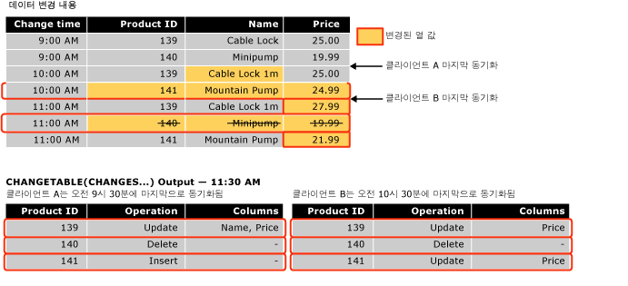

# <a name="work-with-change-tracking-sql-server"></a>변경 내용 추적 사용(SQL Server)
[!INCLUDE[tsql-appliesto-ss2008-asdb-xxxx-xxx-md](../../includes/tsql-appliesto-ss2008-asdb-xxxx-xxx-md.md)]

  변경 내용 추적을 사용하는 응용 프로그램은 추적된 변경 내용을 가져와서 다른 데이터 저장소에 적용하고 원본 데이터베이스를 업데이트할 수 있어야 합니다. 이 항목에서는 이러한 태스크를 수행하는 방법과 장애 조치(Failover)가 발생하여 백업에서 데이터베이스를 복원해야 할 때 변경 내용 추적이 수행하는 역할에 대해 설명합니다.  
  
##  <a name="Obtain"></a> 변경 내용 추적 함수를 사용하여 변경 내용 가져오기  
 변경 내용 추적 함수를 사용하여 변경 내용과 데이터베이스에 수행된 변경에 대한 정보를 가져오는 방법에 대해 설명합니다.  
  
### <a name="about-the-change-tracking-functions"></a>변경 내용 추적 함수 정보  
 응용 프로그램은 다음 함수를 사용하여 데이터베이스에 적용된 변경 내용과 해당 변경 내용에 대한 정보를 가져올 수 있습니다.  
  
 CHANGETABLE(CHANGES …) 함수  
 이 행 집합 함수는 변경 내용 정보를 쿼리하는 데 사용됩니다. 이 함수는 내부 변경 내용 추적 테이블에 저장된 데이터를 쿼리합니다. 또한 이 함수는 작업, 업데이트된 열 및 행의 버전과 같은 다른 변경 내용 정보와 함께, 변경된 행의 기본 키를 포함하는 결과 집합을 반환합니다.  
  
 CHANGETABLE(CHANGES …)는 마지막 동기화 버전을 인수로 사용합니다. 마지막 동기화 버전은 `@last_synchronization_version` 변수를 사용하여 가져옵니다. 마지막 동기화 버전의 의미 체계는 다음과 같습니다.  
  
-   호출 클라이언트가 변경 내용을 가져왔으며 마지막 동기화 버전까지의 모든 변경 내용에 대해 알고 있습니다.  
  
-   따라서 CHANGETABLE(CHANGES …)가 마지막 동기화 버전 이후 발생한 모든 변경 내용을 반환합니다.  
  
     다음 그림에서는 CHANGETABLE(CHANGES …)를 사용하여 변경 내용을 가져오는 방법을 보여 줍니다.  
  
       
  
 CHANGE_TRACKING_CURRENT_VERSION() 함수  
 다음에 변경 내용을 쿼리할 때 사용할 현재 버전을 가져오는 데 사용됩니다. 이 버전은 마지막으로 커밋된 트랜잭션의 버전을 나타냅니다.  
  
 CHANGE_TRACKING_MIN_VALID_VERSION() 함수  
 클라이언트에 포함할 수 있는 올바른 최소 버전을 가져오고 CHANGETABLE()에서 올바른 결과를 가져오는 데 계속 사용됩니다. 클라이언트는 이 함수에서 반환된 값에 대해 마지막 동기화 버전을 검사해야 합니다. 마지막 동기화 버전이 이 함수에서 반환된 버전보다 작은 경우 클라이언트는 CHANGETABLE()에서 올바른 결과를 가져올 수 없으며 다시 초기화되어야 합니다.  
  
### <a name="obtaining-initial-data"></a>초기 데이터 가져오기  
 응용 프로그램에서 처음으로 변경 내용을 가져오려면 먼저 초기 데이터 및 동기화 버전을 가져오는 쿼리를 보내야 합니다. 응용 프로그램은 테이블에서 적합한 데이터를 직접 가져온 다음 CHANGE_TRACKING_CURRENT_VERSION()을 사용하여 초기 버전을 가져와야 합니다. 처음 변경 내용을 가져오면 이 버전이 CHANGETABLE(CHANGES …)에 전달됩니다.  
  
 다음 예에서는 초기 동기화 버전 및 초기 데이터 집합을 가져오는 방법을 보여 줍니다.  
  
```tsql  
    -- Obtain the current synchronization version. This will be used next time that changes are obtained.  
    SET @synchronization_version = CHANGE_TRACKING_CURRENT_VERSION();  
  
    -- Obtain initial data set.  
    SELECT  
        P.ProductID, P.Name, P.ListPrice  
    FROM  
        SalesLT.Product AS P  
```  
  
### <a name="using-the-change-tracking-functions-to-obtain-changes"></a>변경 내용 추적 함수를 사용하여 변경 내용 가져오기  
 테이블에 대해 변경된 행과 해당 변경 내용에 대한 정보를 가져오려면 CHANGETABLE(CHANGES…)를 사용합니다. 예를 들어 다음 쿼리에서는 `SalesLT.Product` 테이블에 대한 변경 내용을 가져옵니다.  
  
```tsql  
SELECT  
    CT.ProductID, CT.SYS_CHANGE_OPERATION,  
    CT.SYS_CHANGE_COLUMNS, CT.SYS_CHANGE_CONTEXT  
FROM  
    CHANGETABLE(CHANGES SalesLT.Product, @last_synchronization_version) AS CT  
  
```  
  
 일반적으로 클라이언트는 행에 대한 기본 키만 가져오는 대신 해당 행에 대한 최신 데이터를 가져오려고 합니다. 따라서 응용 프로그램은 CHANGETABLE(CHANGES …)의 결과를 사용자 테이블의 데이터와 조인합니다. 예를 들어 다음 쿼리에서는 `SalesLT.Product` 테이블과 조인하여 `Name` 및 `ListPrice` 열에 대한 값을 가져옵니다. 여기에서는 `OUTER JOIN`이 사용되었습니다. 이는 사용자 테이블에서 삭제된 행에 대해 변경 내용 정보가 반환되도록 하는 데 필요합니다.  
  
```tsql  
SELECT  
    CT.ProductID, P.Name, P.ListPrice,  
    CT.SYS_CHANGE_OPERATION, CT.SYS_CHANGE_COLUMNS,  
    CT.SYS_CHANGE_CONTEXT  
FROM  
    SalesLT.Product AS P  
RIGHT OUTER JOIN  
    CHANGETABLE(CHANGES SalesLT.Product, @last_synchronization_version) AS CT  
ON  
    P.ProductID = CT.ProductID  
```  
  
 다음 변경 내용 열거에서 사용할 버전을 가져오려면 아래 예와 같이 CHANGE_TRACKING_CURRENT_VERSION()을 사용합니다.  
  
```tsql  
SET @synchronization_version = CHANGE_TRACKING_CURRENT_VERSION()  
```  
  
 변경 내용을 가져올 때 응용 프로그램은 다음 예와 같이 CHANGETABLE(CHANGES…)와 CHANGE_TRACKING_CURRENT_VERSION()을 모두 사용해야 합니다.  
  
```tsql  
-- Obtain the current synchronization version. This will be used the next time CHANGETABLE(CHANGES...) is called.  
SET @synchronization_version = CHANGE_TRACKING_CURRENT_VERSION();  
  
-- Obtain incremental changes by using the synchronization version obtained the last time the data was synchronized.  
SELECT  
    CT.ProductID, P.Name, P.ListPrice,  
    CT.SYS_CHANGE_OPERATION, CT.SYS_CHANGE_COLUMNS,  
    CT.SYS_CHANGE_CONTEXT  
FROM  
    SalesLT.Product AS P  
RIGHT OUTER JOIN  
    CHANGETABLE(CHANGES SalesLT.Product, @last_synchronization_version) AS CT  
ON  
    P.ProductID = CT.ProductID  
```  
  
### <a name="version-numbers"></a>버전 번호  
 변경 내용 추적을 사용하도록 설정된 데이터베이스에는 버전 카운터가 있습니다. 이 카운터는 변경 내용 추적이 설정된 테이블에 변경 내용이 적용될 때마다 증가합니다. 변경된 각 행에는 이와 연관된 버전 번호가 있습니다. 변경 내용을 쿼리하기 위해 요청이 응용 프로그램에 전송되면 버전 번호를 제공하는 함수가 호출됩니다. 이 함수는 해당 버전 이후 적용된 모든 변경 내용에 대한 정보를 반환합니다. 여러 가지 측면에서 변경 내용 추적 버전은 개념상 **rowversion** 데이터 형식과 유사합니다.  
  
### <a name="validating-the-last-synchronized-version"></a>마지막으로 동기화된 버전의 유효성 검사  
 변경 내용에 대한 정보는 제한된 시간 동안 유지 관리됩니다. 시간은 ALTER DATABASE의 일부로 지정할 수 있는 CHANGE_RETENTION 매개 변수로 제어됩니다.  
  
 CHANGE_RETENTION에 대해 지정하는 시간에 따라 모든 응용 프로그램이 데이터베이스에서 변경 내용을 요청해야 하는 빈도가 결정됩니다. 응용 프로그램의 *last_synchronization_version* 값이 테이블에 대해 올바른 최소 동기화 버전보다 작으면 해당 응용 프로그램은 올바른 변경 내용 열거를 수행할 수 없습니다. 이는 일부 변경 내용 정보가 정리되었을 수 있기 때문입니다. 응용 프로그램이 CHANGETABLE(CHANGES …)를 사용하여 변경 내용을 가져오려면 먼저 CHANGETABLE(CHANGES …)에 전달하려고 하는 *last_synchronization_version* 에 대한 값의 유효성을 검사해야 합니다. *last_synchronization_version* 의 값이 잘못된 경우 해당 응용 프로그램은 모든 데이터를 다시 초기화해야 합니다.  
  
 다음 예에서는 각 테이블에 대한 `last_synchronization_version` 값의 유효성을 확인하는 방법을 보여 줍니다.  
  
```tsql  
-- Check individual table.  
IF (@last_synchronization_version < CHANGE_TRACKING_MIN_VALID_VERSION(  
                                   OBJECT_ID('SalesLT.Product')))  
BEGIN  
  -- Handle invalid version and do not enumerate changes.  
  -- Client must be reinitialized.  
END  
```  
  
 다음 예와 같이 데이터베이스의 모든 테이블에 대해 `last_synchronization_version` 값의 유효성을 검사할 수 있습니다.  
  
```tsql  
-- Check all tables with change tracking enabled  
IF EXISTS (  
  SELECT COUNT(*) FROM sys.change_tracking_tables  
  WHERE min_valid_version > @last_synchronization_version )  
BEGIN  
  -- Handle invalid version & do not enumerate changes  
  -- Client must be reinitialized  
END  
```  
  
### <a name="using-column-tracking"></a>열 추적 사용  
 응용 프로그램에서 열 추적을 사용하면 전체 행 대신 변경된 열에 대한 데이터만 가져올 수 있습니다. 예를 들어 테이블에 크지만 거의 변경되지 않는 열이 하나 이상 있고 자주 변경되는 다른 열도 있는 시나리오가 있을 경우 열 추적을 사용하지 않으면 응용 프로그램이 행이 변경되었다는 사실만 확인할 수 있으므로 큰 열 데이터를 포함하는 데이터를 모두 동기화해야 합니다. 그러나 열 추적을 사용하면 응용 프로그램이 큰 열 데이터가 변경되었는지 여부를 확인하여 변경된 데이터만 동기화할 수 있습니다.  
  
 열 추적 정보는 CHANGETABLE(CHANGES …) 함수로 반환되는 SYS_CHANGE_COLUMNS 열에 나타납니다.  
  
 변경되지 않은 열에 대해 NULL이 반환되도록 열 추적을 사용할 수 있습니다. 열이 NULL로 변경될 수 있는 경우 해당 열이 변경되었는지 여부를 나타내기 위해 별도의 열을 반환해야 합니다.  
  
 다음 예에서는 `CT_ThumbnailPhoto` 열이 변경되지 않은 경우 해당 열이 `NULL` 이 됩니다. 또한 이 열은 `NULL` 로 변경되었으므로 `NULL` 이 될 수 있습니다. 응용 프로그램은 `CT_ThumbNailPhoto_Changed` 열을 사용하여 해당 열이 변경되었는지 여부를 확인할 수 있습니다.  
  
```tsql  
DECLARE @PhotoColumnId int = COLUMNPROPERTY(  
    OBJECT_ID('SalesLT.Product'),'ThumbNailPhoto', 'ColumnId')  
  
SELECT  
    CT.ProductID, P.Name, P.ListPrice, -- Always obtain values.  
    CASE  
           WHEN CHANGE_TRACKING_IS_COLUMN_IN_MASK(  
                     @PhotoColumnId, CT.SYS_CHANGE_COLUMNS) = 1  
            THEN ThumbNailPhoto  
            ELSE NULL  
      END AS CT_ThumbNailPhoto,  
      CHANGE_TRACKING_IS_COLUMN_IN_MASK(  
                     @PhotoColumnId, CT.SYS_CHANGE_COLUMNS) AS  
                                   CT_ThumbNailPhoto_Changed  
     CT.SYS_CHANGE_OPERATION, CT.SYS_CHANGE_COLUMNS,  
     CT.SYS_CHANGE_CONTEXT  
FROM  
     SalesLT.Product AS P  
INNER JOIN  
     CHANGETABLE(CHANGES SalesLT.Product, @last_synchronization_version) AS CT  
ON  
     P.ProductID = CT.ProductID AND  
     CT.SYS_CHANGE_OPERATION = 'U'  
```  
  
### <a name="obtaining-consistent-and-correct-results"></a>일관되고 올바른 결과 가져오기  
 테이블에 대해 변경된 데이터를 가져오려면 여러 단계를 수행해야 합니다. 특정 문제를 검토하여 처리하지 않으면 일관되지 않거나 잘못된 결과가 반환될 수 있습니다.  
  
 예를 들어 Sales 테이블과 SalesOrders 테이블에 적용된 변경 내용을 가져오려면 응용 프로그램에서 다음 단계를 수행해야 합니다.  
  
1.  CHANGE_TRACKING_MIN_VALID_VERSION()을 사용하여 마지막으로 동기화된 버전의 유효성을 검사합니다.  
  
2.  CHANGE_TRACKING_CURRENT_VERSION()을 사용하여 다음에 변경 내용을 가져오는 데 사용할 수 있는 버전을 가져옵니다.  
  
3.  CHANGETABLE(CHANGES …)를 사용하여 Sales 테이블에 대한 변경 내용을 가져옵니다.  
  
4.  CHANGETABLE(CHANGES …)를 사용하여 SalesOrders 테이블에 대한 변경 내용을 가져옵니다.  
  
 이전 단계로 반환되는 결과에 영향을 줄 수 있는 다음 두 프로세스가 데이터베이스에서 발생합니다.  
  
-   정리 프로세스가 백그라운드에서 실행되어 지정된 보존 기간보다 오래된 변경 내용 추적 정보가 제거됩니다.  
  
     정리 프로세스는 데이터베이스에 대한 변경 내용 추적을 구성할 때 지정된 보존 기간을 사용하는 별도의 백그라운드 프로세스입니다. 문제는 마지막 동기화 버전의 유효성을 검사한 시점과 CHANGETABLE(CHANGES…)를 호출한 시점 사이에 정리 프로세스가 발생할 수 있다는 것입니다. 방금 유효했던 마지막 동기화 버전이 변경 내용을 가져온 시점에 더 이상 유효하지 않을 수 있습니다. 따라서 잘못된 결과가 반환될 수 있습니다.  
  
-   Sales 테이블과 SalesOrders 테이블에 다음과 같이 진행 중인 DML 작업이 발생합니다.  
  
    -   CHANGE_TRACKING_CURRENT_VERSION()을 사용하여 다음에 사용할 버전을 가져온 후 테이블에 변경 내용이 적용될 수 있습니다. 따라서 예상한 것보다 많은 변경 내용이 반환될 수 있습니다.  
  
    -   Sales 테이블에서 변경 내용을 가져오는 호출과 SalesOrders 테이블에서 변경 내용을 가져오는 호출 사이에 트랜잭션이 커밋될 수 있습니다. 따라서 SalesOrder 테이블에 대한 결과에 Sales 테이블에 없는 외래 키 값이 포함될 수 있습니다.  
  
 앞에서 나열된 문제점을 해결하려면 스냅숏 격리를 사용하는 것이 좋습니다. 스냅숏 격리를 사용하면 변경 내용 정보의 일관성을 유지하고 백그라운드 정리 태스크와 관련된 경합 상태를 방지할 수 있습니다. 스냅숏 트랜잭션을 사용하지 않으면 변경 내용 추적을 사용하는 응용 프로그램을 개발할 때 더 많은 노력이 필요할 수 있습니다.  
  
#### <a name="using-snapshot-isolation"></a>스냅숏 격리 사용  
 변경 내용 추적은 스냅숏 격리와 원활하게 작동하도록 디자인되었습니다. 데이터베이스에 스냅숏 격리를 사용하도록 설정해야 합니다. 또한 변경 내용을 가져오는 데 필요한 모든 단계를 스냅숏 트랜잭션 내에 포함해야 합니다. 이렇게 하면 변경 내용을 가져오는 동안 데이터에 적용된 모든 변경 내용이 스냅숏 트랜잭션 내의 쿼리에 표시되지 않습니다.  
  
 스냅숏 트랜잭션 내의 데이터를 가져오려면 다음 단계를 수행합니다.  
  
1.  트랜잭션 격리 수준을 스냅숏으로 설정하고 트랜잭션을 시작합니다.  
  
2.  CHANGE_TRACKING_MIN_VALID_VERSION()을 사용하여 마지막 동기화 버전의 유효성을 검사합니다.  
  
3.  CHANGE_TRACKING_CURRENT_VERSION()을 사용하여 다음에 사용할 버전을 가져옵니다.  
  
4.  CHANGETABLE(CHANGES …)를 사용하여 Sales 테이블에 대한 변경 내용을 가져옵니다.  
  
5.  CHANGETABLE(CHANGES …)를 사용하여 SalesOrders 테이블에 대한 변경 내용을 가져옵니다.  
  
6.  트랜잭션을 커밋합니다.  
  
 변경 내용을 가져오는 모든 단계가 스냅숏 트랜잭션 내에 있으므로 다음 사항에 유의해야 합니다.  
  
-   마지막 동기화 버전의 유효성을 검사한 후 정리가 발생하면 정리에 의해 수행된 삭제 작업이 트랜잭션 내에 표시되지 않아 CHANGETABLE(CHANGES …)의 결과가 계속 유효합니다.  
  
-   다음 동기화 버전을 가져온 후에 Sales 테이블 또는 SalesOrders 테이블에 적용된 변경 내용은 표시되지 않으며 CHANGETABLE(CHANGES …)에 대한 호출은 CHANGE_TRACKING_CURRENT_VERSION()으로 반환된 버전보다 최신인 버전의 변경 내용을 반환하지 않습니다. CHANGETABLE(CHANGES …) 호출 사이에 커밋된 트랜잭션이 표시되지 않으므로 Sales 테이블과 SalesOrders 테이블 사이의 일관성도 유지됩니다.  
  
 다음 예에서는 데이터베이스에 스냅숏 격리를 사용하도록 설정하는 방법을 보여 줍니다.  
  
```tsql  
-- The database must be configured to enable snapshot isolation.  
ALTER DATABASE AdventureWorksLT  
    SET ALLOW_SNAPSHOT_ISOLATION ON;  
```  
  
 스냅숏 트랜잭션은 다음과 같이 사용됩니다.  
  
```tsql  
SET TRANSACTION ISOLATION LEVEL SNAPSHOT;  
BEGIN TRAN  
  -- Verify that version of the previous synchronization is valid.  
  -- Obtain the version to use next time.  
  -- Obtain changes.  
COMMIT TRAN  
```  
  
 스냅숏 트랜잭션에 대한 자세한 내용은 [SET TRANSACTION ISOLATION LEVEL&#40;Transact-SQL&#41;](../../t-sql/statements/set-transaction-isolation-level-transact-sql.md)을 참조하세요.  
  
#### <a name="alternatives-to-using-snapshot-isolation"></a>스냅숏 격리 사용의 대체 방법  
 스냅숏 격리 사용의 대체 방법이 있지만 이 경우 모든 응용 프로그램 요구 사항이 충족되려면 더 많은 작업이 필요합니다. *last_synchronization_version* 의 유효성을 유지하며 변경 내용을 가져오기 전에 정리 프로세스로 인해 데이터가 제거되지 않도록 하려면 다음을 수행합니다.  
  
1.  CHANGETABLE()을 호출한 후 *last_synchronization_version* 을 확인합니다.  
  
2.  CHANGETABLE()을 사용하여 변경 내용을 가져오는 각 쿼리의 일부로 *last_synchronization_version* 을 확인합니다.  
  
 다음 열거에 대한 동기화 버전을 가져온 후 변경 내용이 발생할 수 있습니다. 이러한 상황은 다음 두 가지 방식으로 처리할 수 있습니다. 사용되는 옵션은 응용 프로그램과 해당 응용 프로그램이 각 접근 방식의 부작용을 처리할 수 있는 방식에 따라 달라집니다.  
  
-   새 동기화 버전보다 큰 버전을 포함하는 변경 내용을 무시합니다.  
  
     이 접근 방식에서는 새 동기화 버전 이전에 만들어지거나 업데이트된 새 행 또는 업데이트된 행의 경우 건너뛴 다음 나중에 업데이트되는 부작용이 있습니다. 새 행의 경우 만들어진 다른 테이블에 건너뛴 행을 참조하는 행이 있으면 참조 무결성 문제가 발생할 수 있습니다. 업데이트된 기존 행의 경우 해당 행을 건너뛰고 다음 번까지 동기화하지 않습니다.  
  
-   새 동기화 버전보다 큰 버전을 포함하는 변경 내용까지 모두 포함합니다.  
  
     새 동기화 버전보다 큰 버전을 포함하는 행은 다음 동기화에서 다시 얻게 됩니다. 이를 예상하여 응용 프로그램에서 처리해야 합니다.  
  
 앞의 두 옵션 외에도 작업에 따라 두 옵션을 결합한 접근 방식을 시도해 볼 수 있습니다. 예를 들어 행이 만들어지거나 삭제된 다음 번 동기화 버전 이후의 변경 내용은 무시하고 업데이트는 무시하지 않는 응용 프로그램을 고안할 수도 있습니다.  
  
> [!NOTE]  
>  변경 내용 추적 또는 사용자 지정 추적 메커니즘을 사용할 때 응용 프로그램에 적합한 접근 방식을 선택하려면 상당한 분석 작업이 필요합니다. 따라서 스냅숏 격리를 사용하는 것이 훨씬 간단합니다.  
  
##  <a name="Handles"></a> 변경 내용 추적에서 데이터베이스에 대한 변경 내용을 처리하는 방법  
 변경 내용 추적을 사용하는 일부 응용 프로그램에서는 다른 데이터 저장소와 양방향 동기화를 수행합니다. 즉, [!INCLUDE[ssNoVersion](../../includes/ssnoversion-md.md)] 데이터베이스에 적용된 변경 내용은 다른 데이터 저장소에서 업데이트되고 다른 저장소에서 적용된 변경 내용은 [!INCLUDE[ssNoVersion](../../includes/ssnoversion-md.md)] 데이터베이스에서 업데이트됩니다.  
  
 응용 프로그램에서 다른 데이터 저장소의 변경 내용으로 로컬 데이터베이스를 업데이트하는 경우에는 다음 작업을 수행해야 합니다.  
  
-   충돌을 확인합니다.  
  
     충돌은 같은 시간에 동일한 데이터가 두 데이터 저장소 모두에서 변경된 경우 발생합니다. 응용 프로그램은 충돌을 확인할 뿐만 아니라 충돌을 해결할 수 있는 정보를 가져올 수 있어야 합니다.  
  
-   응용 프로그램 컨텍스트 정보를 저장합니다.  
  
     응용 프로그램은 변경 내용 추적 정보가 있는 데이터를 저장합니다. 이 정보는 로컬 데이터베이스에서 변경 내용을 가져온 경우 다른 변경 내용 추적 정보와 함께 사용됩니다. 이 컨텍스트 정보에 대한 일반적인 예는 변경 내용의 원본인 데이터 저장소에 대한 식별자입니다.  
  
 이전 작업을 수행하기 위해 동기화 응용 프로그램에서 다음 함수를 사용할 수 있습니다.  
  
-   CHANGETABLE(VERSION )  
  
     응용 프로그램에서 변경 내용을 적용할 때 이 함수를 사용하여 충돌을 확인할 수 있습니다. 이 함수는 변경 내용이 추적된 테이블의 지정된 행에 대한 최신 변경 내용 추적 정보를 가져옵니다. 이 변경 내용 추적 정보에는 행이 마지막으로 변경되었을 때의 버전이 포함되어 있습니다. 응용 프로그램에서는 이 정보를 사용하여 응용 프로그램이 마지막으로 동기화된 후 행이 변경되었는지 여부를 확인할 수 있습니다.  
  
-   WITH CHANGE_TRACKING_CONTEXT  
  
     응용 프로그램에서 이 절을 사용하여 컨텍스트 정보를 저장할 수 있습니다.  
  
### <a name="checking-for-conflicts"></a>충돌 확인  
 양방향 동기화 시나리오에서 클라이언트 응용 프로그램은 응용 프로그램이 마지막으로 변경 내용을 가져온 이후 행이 업데이트되지 않았는지 여부를 확인해야 합니다.  
  
 다음 예에서는 별도의 쿼리 없이 CHANGETABLE(VERSION  ) 함수를 사용하여 가장 효율적인 방법으로 충돌을 확인하는 방법을 보여 줍니다. 이 예에서 `CHANGETABLE(VERSION …)` 은 `SYS_CHANGE_VERSION` 에서 지정한 행에 대한 `@product id`을 확인합니다. `CHANGETABLE(CHANGES …)` 가 동일한 정보를 가져올 수 있지만 효율성이 떨어집니다. 행에 대한 `SYS_CHANGE_VERSION` 값이 `@last_sync_version`값보다 크면 충돌이 발생합니다. 충돌이 발생하는 경우 행이 업데이트되지 않습니다. 행에 사용할 수 있는 변경 정보가 없을 수 있으므로 `ISNULL()` 검사가 필요합니다. 변경 내용 추적을 설정한 이후 또는 변경 내용 정보를 정리한 이후 행이 업데이트되지 않은 경우 변경 내용 정보가 없습니다.  
  
```tsql  
-- Assumption: @last_sync_version has been validated.  
  
UPDATE  
    SalesLT.Product  
SET  
    ListPrice = @new_listprice  
FROM  
    SalesLT.Product AS P  
WHERE  
    ProductID = @product_id AND  
    @last_sync_version >= ISNULL (  
        SELECT CT.SYS_CHANGE_VERSION  
        FROM CHANGETABLE(VERSION SalesLT.Product,  
                        (ProductID), (P.ProductID)) AS CT),  
        0)  
```  
  
 다음 코드는 업데이트된 행 개수를 검사하고 충돌에 대한 자세한 정보를 식별할 수 있습니다.  
  
```tsql  
-- If the change cannot be made, find out more information.  
IF (@@ROWCOUNT = 0)  
BEGIN  
    -- Obtain the complete change information for the row.  
    SELECT  
        CT.SYS_CHANGE_VERSION, CT.SYS_CHANGE_CREATION_VERSION,  
        CT.SYS_CHANGE_OPERATION, CT.SYS_CHANGE_COLUMNS  
    FROM  
        CHANGETABLE(CHANGES SalesLT.Product, @last_sync_version) AS CT  
    WHERE  
        CT.ProductID = @product_id;  
  
    -- Check CT.SYS_CHANGE_VERSION to verify that it really was a conflict.  
    -- Check CT.SYS_CHANGE_OPERATION to determine the type of conflict:  
    -- update-update or update-delete.  
    -- The row that is specified by @product_id might no longer exist   
    -- if it has been deleted.  
END  
```  
  
### <a name="setting-context-information"></a>컨텍스트 정보 설정  
 응용 프로그램은 WITH CHANGE_TRACKING_CONTEXT 절을 사용하여 컨텍스트 정보를 변경 내용 정보와 함께 저장할 수 있습니다. 이 정보는 CHANGETABLE(CHANGES  )에서 반환된 SYS_CHANGE_CONTEXT 열에서 가져올 수 있습니다.  
  
 일반적으로 컨텍스트 정보는 변경 내용의 원본을 식별하는 데 사용됩니다. 변경 내용의 원본을 식별할 수 있는 경우 이 컨텍스트 정보는 데이터 저장소에서 사용되어 데이터 저장소에서 다시 동기화할 때 변경 내용을 가져오지 않도록 할 수 있습니다.  
  
```tsql  
  -- Try to update the row and check for a conflict.  
  WITH CHANGE_TRACKING_CONTEXT (@source_id)  
  UPDATE  
     SalesLT.Product  
  SET  
      ListPrice = @new_listprice  
  FROM  
      SalesLT.Product AS P  
  WHERE  
     ProductID = @product_id AND  
     @last_sync_version >= ISNULL (  
         (SELECT CT.SYS_CHANGE_VERSION FROM CHANGETABLE(VERSION SalesLT.Product,  
         (ProductID), (P.ProductID)) AS CT),  
         0)  
```  
  
### <a name="ensuring-consistent-and-correct-results"></a>일관성 있고 올바른 결과 확인  
 응용 프로그램은 @last_sync_version 값의 유효성을 검사할 때 정리 프로세스를 고려해야 합니다. 그 이유는 CHANGE_TRACKING_MIN_VALID_VERSION()이 호출된 이후 업데이트가 적용되기 전에 데이터가 제거되었을 수도 있기 때문입니다.  
  
> [!IMPORTANT]  
>  스냅숏 격리를 사용하고 스냅숏 트랜잭션 내에서 변경하는 것이 좋습니다.  
  
```tsql  
-- Prerequisite is to ensure ALLOW_SNAPSHOT_ISOLATION is ON for the database.  
  
SET TRANSACTION ISOLATION LEVEL SNAPSHOT;  
BEGIN TRAN  
    -- Verify that last_sync_version is valid.  
    IF (@last_sync_version <  
CHANGE_TRACKING_MIN_VALID_VERSION(OBJECT_ID(‘SalesLT.Product’)))  
    BEGIN  
       RAISERROR (N’Last_sync_version too old’, 16, -1);  
    END  
    ELSE  
    BEGIN  
        -- Try to update the row.  
        -- Check @@ROWCOUNT and check for a conflict.  
    END  
COMMIT TRAN  
```  
  
> [!NOTE]  
>  스냅숏 트랜잭션 내에서 업데이트되는 행이 스냅숏 트랜잭션이 시작된 후 다른 트랜잭션에서 업데이트되었을 수도 있습니다. 이런 경우에 스냅숏 격리 업데이트 충돌이 발생하고 해당 트랜잭션이 종료됩니다. 이러한 경우가 발생하면 업데이트를 다시 시도하세요. 그러면 변경 내용 추적 충돌이 검색되고 행이 변경되지 않습니다.  
  
##  <a name="DataRestore"></a> 변경 내용 추적 및 데이터 복원  
 동기화가 필요한 응용 프로그램에서는 변경 내용 추적이 설정된 데이터베이스를 이전 버전의 데이터로 되돌리는 경우를 고려해야 합니다. 이런 경우는 백업에서 데이터베이스가 복원된 후, 비동기 데이터베이스 미러링에 장애 조치가 있는 경우 또는 로그 전달을 사용할 때 실패한 경우에 발생할 수 있습니다. 다음 시나리오에서는 이러한 문제를 보여 줍니다.  
  
1.  테이블 T1는 변경 내용이 추적되고 테이블의 유효한 최소 버전 50입니다.  
  
2.  클라이언트 응용 프로그램은 버전 100에서 데이터를 동기화하고 버전 50과 100 사이의 모든 변경 사항에 대한 정보를 가져옵니다.  
  
3.  버전 100 이후 추가 변경 내용이 테이블 T1에 적용됩니다.  
  
4.  버전 120에서 오류가 발생하고 데이터베이스 관리자는 데이터베이스를 복원하지만 데이터 손실이 있습니다. 복원 작업 후 테이블에는 버전 70까지 데이터가 포함되고 동기화된 최소 버전은 여전히 50입니다.  
  
     즉, 동기화된 데이터 저장소에는 주 데이터 저장소에 더 이상 존재하지 않는 데이터가 있습니다.  
  
5.  T1은 여러 번 업데이트되어서 현재 버전은 130입니다.  
  
6.  클라이언트 응용 프로그램이 다시 동기화되어 마지막으로 동기화된 버전인 100을 제공합니다. 100은 50보다 크므로 클라이언트는 이 번호의 유효성을 검사할 수 있습니다.  
  
     클라이언트는 버전 100과 130 사이의 변경 내용을 가져옵니다 이 지점에서 클라이언트는 이전과 다른 70과 100 사이의 변경 내용을 인식하지 못합니다. 클라이언트와 서버의 데이터는 동기화되지 않았습니다.  
  
 데이터베이스가 버전 100 이후 지점으로 복구되면 동기화에 아무 문제가 없습니다. 클라이언트와 서버는 다음 동기화 간격 동안 데이터를 올바르게 동기화합니다.  
  
 변경 내용 추적은 데이터 손실의 복구를 지원하지 않지만 이러한 세 가지 유형의 동기화 문제를 감지할 수 있는 다음 두 가지 옵션을 가지고 있습니다.  
  
-   데이터베이스 버전 ID를 서버에 저장하고 데이터베이스가 복구될 때마다 이 값을 업데이트합니다. 그렇지 않으면 데이터가 손실됩니다. 데이터를 동기화할 때 각 클라이언트 응용 프로그램은 ID를 저장하고 각 클라이언트는 이 ID의 유효성을 검사해야 합니다. 데이터 손실이 발생하면 ID가 일치하지 않고 클라이언트가 다시 초기화됩니다. 한 가지 단점은 데이터 손실이 마지막으로 동기화된 경계에 교차되지 않은 경우에 클라이언트가 불필요하게 다시 초기화해야 할 수도 있다는 점입니다.  
  
-   클라이언트가 변경 내용에 대해 쿼리할 때 서버의 각 클라이언트에 대한 마지막 동기화 버전을 기록합니다. 데이터에 문제가 있으면 마지막으로 동기화된 버전 번호가 일치하지 않습니다. 이것은 다시 동기화해야 한다는 것을 나타냅니다.  
  
## <a name="see-also"></a>참고 항목  
 [데이터 변경 내용 추적&#40;SQL Server&#41;](../../relational-databases/track-changes/track-data-changes-sql-server.md)   
 [변경 내용 추적 정보&#40;SQL Server&#41;](../../relational-databases/track-changes/about-change-tracking-sql-server.md)   
 [변경 내용 추적 관리&#40;SQL Server&#41;](../../relational-databases/track-changes/manage-change-tracking-sql-server.md)   
 [변경 내용 추적 설정 및 해제&#40;SQL Server&#41;](../../relational-databases/track-changes/enable-and-disable-change-tracking-sql-server.md)   
 [CHANGETABLE&#40;Transact-SQL&#41;](../../relational-databases/system-functions/changetable-transact-sql.md)   
 [CHANGE_TRACKING_MIN_VALID_VERSION&#40;Transact-SQL&#41;](../../relational-databases/system-functions/change-tracking-min-valid-version-transact-sql.md)   
 [CHANGE_TRACKING_CURRENT_VERSION&#40;Transact-SQL&#41;](../../relational-databases/system-functions/change-tracking-current-version-transact-sql.md)   
 [WITH CHANGE_TRACKING_CONTEXT&#40;Transact-SQL&#41;](../../relational-databases/system-functions/with-change-tracking-context-transact-sql.md)  
  
  
