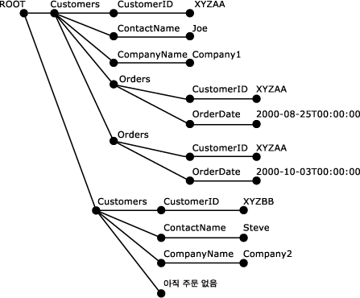

# OPENXML(SQL Server)
  [!INCLUDE[tsql](../../includes/tsql-md.md)] 키워드인 OPENXML은 테이블 또는 뷰와 비슷한 메모리 내 XML 문서에 대한 행 집합을 제공합니다. OPENXML은 관계형 행 집합인 것처럼 XML 데이터에 대한 액세스를 허용합니다. 이러한 기능은 XML 문서의 내부 표현에 대한 행 집합 뷰를 제공함으로써 제공됩니다. 행 집합의 레코드는 데이터베이스 테이블에 저장할 수 있습니다.  
  
 OPENXML은 행 집합 공급자, 뷰 또는 OPENROWSET이 원본으로 표시될 수 있는 경우 SELECT 및 SELECT INTO에서 사용할 수 있습니다. OPENXML 구문에 대한 자세한 내용은 [OPENXML&#40;Transact-SQL&#41;](../../t-sql/functions/openxml-transact-sql.md)을 참조하세요.  
  
 OPENXML을 사용하여 XML 문서에 대해 쿼리를 작성하려면 먼저 **sp_xml_preparedocument**를 호출해야 합니다. 이 메서드는 XML 문서를 구문 분석하고 사용할 준비가 된 구문 분석된 문서에 핸들을 반환합니다. 구문 분석된 문서는 XML 문서의 여러 노드를 DOM(문서 개체 모델) 트리로 표시합니다. 문서 핸들은 OPENXML에 전달됩니다. 그런 다음 OPENXML은 전달된 매개 변수에 따라 문서의 행 집합 뷰를 제공합니다.  
  
> [!NOTE]  
>  **sp_xml_preparedocument**에서는 MSXML 파서가 SQL로 업데이트된 버전인 Msxmlsql.dll을 사용합니다. 이 버전의 MSXML 파서는 [!INCLUDE[ssNoVersion](../../includes/ssnoversion-md.md)]를 지원하고 MSXML 버전 2.6에 대한 이전 버전과의 호환성을 유지하도록 디자인되었습니다.  
  
 메모리를 확보하기 위해서는 **sp_xml_removedocument** 시스템 저장 프로시저를 호출하여 메모리에서 XML 문서의 내부 표현을 제거해야 합니다.  
  
 다음 그림은 이 프로세스를 보여 줍니다.  
  
   
  
 OPENXML을 이해하려면 XPath 쿼리에 익숙해야 하며 XML을 이해해야 합니다. SQL Server의 XPath 지원에 대한 자세한 내용은 [SQLXML 4.0의 XPath 쿼리 사용](../../relational-databases/sqlxml-annotated-xsd-schemas-xpath-queries/using-xpath-queries-in-sqlxml-4-0.md)을 참조하세요.  
  
> [!NOTE]  
>  OpenXML을 사용하면 행 및 열의 XPath 패턴을 변수로 매개 변수화할 수 있습니다. 프로그래머가 매개 변수화를 외부 사용자에게 제공하는 경우(예를 들어 외부적으로 호출된 저장 프로시저를 통해 매개 변수가 제공되는 경우) 이러한 매개 변수화를 수행하면 XPath 식이 삽입될 수 있습니다. 이러한 잠재적 보안 문제를 방지하려면 XPath 매개 변수를 외부 호출자에게 제공하지 않는 것이 좋습니다.  
  
## 예제  
 다음 예에서는 `OPENXML` 및 `INSERT` 문에서 `SELECT` 을 사용하는 방법을 보여 줍니다. 예제 XML 문서에 `<Customers>` 및 `<Orders>` 요소가 들어 있습니다.  
  
 우선 `sp_xml_preparedocument` 저장 프로시저가 XML 문서를 구문 분석합니다. 구문 분석된 문서는 XML 문서의 노드(요소, 특성, 텍스트 및 주석)를 트리로 나타낸 것입니다. `OPENXML` 은 이 구문 분석된 XML 문서를 참조하여 해당 XML 문서의 일부 또는 전체에 대한 행 집합 뷰를 제공합니다. `INSERT` 을 사용하는 `OPENXML` 문은 그러한 행 집합의 데이터를 데이터베이스 테이블에 삽입할 수 있습니다. `OPENXML` 을 여러 번 호출하면 XML 문서의 여러 부분에 대한 행 집합 뷰를 제공하고, XML 문서의 여러 부분을 다른 테이블에 삽입하는 등 다양하게 처리할 수 있습니다. 이 프로세스는 XML을 테이블로 조각화한다라고도 합니다.  
  
 다음 예에서는 두 개의 `<Customers>` 문을 사용하여 `Customers` 요소를 `<Orders>` 테이블에 저장하고 `Orders` 요소를 `INSERT` 테이블에 저장하는 방식으로 XML 문서가 조각화됩니다. 또한 XML 문서에서 `SELECT` 및 `OPENXML` 를 검색하는 `CustomerID` 이 포함된 `OrderDate` 문을 보여 줍니다. 이 과정의 마지막 단계에서 `sp_xml_removedocument`를 호출합니다. 이 작업은 구문 분석 단계 중에 생성된 내부 XML 트리를 표시하는 데 할당된 메모리를 해제하기 위해 수행합니다.  
  
```  
-- Create tables for later population using OPENXML.  
CREATE TABLE Customers (CustomerID varchar(20) primary key,  
                ContactName varchar(20),   
                CompanyName varchar(20));  
GO  
CREATE TABLE Orders( CustomerID varchar(20), OrderDate datetime;)  
GO  
DECLARE @docHandle int;  
DECLARE @xmlDocument nvarchar(max); -- or xml type  
SET @xmlDocument = N'<ROOT>  
<Customers CustomerID="XYZAA" ContactName="Joe" CompanyName="Company1">  
<Orders CustomerID="XYZAA" OrderDate="2000-08-25T00:00:00"/>  
<Orders CustomerID="XYZAA" OrderDate="2000-10-03T00:00:00"/>  
</Customers>  
<Customers CustomerID="XYZBB" ContactName="Steve"  
CompanyName="Company2">No Orders yet!  
</Customers>  
</ROOT>';  
EXEC sp_xml_preparedocument @docHandle OUTPUT, @xmlDocument;  
-- Use OPENXML to provide rowset consisting of customer data.  
INSERT Customers   
SELECT *   
FROM OPENXML(@docHandle, N'/ROOT/Customers')   
  WITH Customers;  
-- Use OPENXML to provide rowset consisting of order data.  
INSERT Orders   
SELECT *   
FROM OPENXML(@docHandle, N'//Orders')   
  WITH Orders;  
-- Using OPENXML in a SELECT statement.  
SELECT * FROM OPENXML(@docHandle, N'/ROOT/Customers/Orders') WITH (CustomerID nchar(5) '../@CustomerID', OrderDate datetime);  
-- Remove the internal representation of the XML document.  
EXEC sp_xml_removedocument @docHandle;   
```  
  
 다음 그림에서는 sp_xml_preparedocument에 의해 생성된 이전 XML 문서의 구문 분석된 XML 트리를 보여 줍니다.  
  
   
  
## OPENXML 매개 변수  
 OPENXML에 대한 매개 변수는 다음과 같습니다.  
  
-   XML 문서 핸들(*idoc*)  
  
-   행에 매핑될 노드를 식별하기 위한 XPath 식(*rowpattern*)  
  
-   생성될 행 집합에 대한 설명  
  
-   행 집합 열과 XML 노드 간의 매핑  
  
### XML 문서 핸들(idoc)  
 이 문서 핸들은 **sp_xml_preparedocument** 저장 프로시저에서 반환됩니다.  
  
### 처리될 노드를 식별하는 XPath 식(rowpattern)  
 *rowpattern* 으로 지정된 XPath 식은 XML 문서의 노드 집합을 식별합니다. *rowpattern* 에 의해 식별되는 노드는 각각 OPENXML에 의해 생성되는 행 집합의 단일 행에 해당됩니다.  
  
 XPath 식에 의해 식별되는 노드는 XML 문서의 모든 XML 노드일 수 있습니다. *rowpattern* 이 XML 문서의 요소 집합을 식별하는 경우 식별되는 각 요소 노드에 대한 행 집합에는 한 개의 행이 있게 됩니다. 예를 들어 *rowpattern* 이 특성으로 끝나면 *rowpattern*에 의해 선택되는 각 특성 노드에 대해 한 개의 행이 만들어집니다.  
  
### 생성될 행 집합에 대한 설명  
 행 집합 스키마는 결과 행 집합을 생성하기 위해 OPENXML에 의해 사용됩니다. 행 집합 스키마를 지정할 때 다음 옵션을 사용할 수 있습니다.  
  
#### Edge 테이블 형식 사용  
 행 집합 스키마를 지정하려면 Edge 테이블 형식을 사용해야 합니다. WITH 절을 사용하지 마십시오.  
  
 WITH 절을 사용하면 OPENXML이 행 집합을 Edge 테이블 형식으로 반환합니다. 이 테이블은 구문 분석된 XML 문서 트리의 가장 자리에 있는 모든 노드가 행 집합의 행으로 매핑되기 때문에 Edge 테이블이라고 부릅니다.  
  
 Edge 테이블은 단일 테이블 내에 세부적인 XML 문서 구조를 나타냅니다. 이 구조에는 요소 및 특성 이름, 문서 계층, 네임스페이스 및 처리 명령이 포함됩니다. Edge 테이블 형식을 사용하면 메타 속성을 통해 제공되지 않은 정보를 추가로 얻을 수 있습니다. 메타 속성에 대한 자세한 내용은 [Specify Metaproperties in OPENXML](../../relational-databases/xml/specify-metaproperties-in-openxml.md)을 참조하십시오.  
  
 Edge 테이블에서 제공되는 추가 정보를 사용하면 요소 및 특성의 데이터 형식과 노드 유형을 저장 및 쿼리할 수 있으며 XML 문서 구조에 대한 정보를 저장 및 쿼리할 수도 있습니다. 이 추가 정보를 사용하면 자체 XML 문서 관리 시스템을 구축할 수도 있습니다.  
  
 Edge 테이블을 사용하면 XML 문서를 BLOB(Binary Large Object) 입력으로 사용하고 Edge 테이블을 생성한 다음 보다 세부적인 수준에서 문서를 추출 및 분석하는 저장 프로시저를 작성할 수 있습니다. 이러한 세부적인 수준에는 문서 계층, 요소 및 특성 이름, 네임스페이스 및 처리 명령 검색이 포함됩니다.  
  
 또한 Edge 테이블은 다른 관계형 형식에 대한 매핑이 논리적이지 않은 경우와 ntext 필드가 구조 정보를 충분히 제공하지 않는 경우, XML 문서에 대한 저장소 형식으로 사용할 수 있습니다.  
  
 XML 파서를 사용하여 XML 문서를 검사할 수 있는 경우 Edge 테이블을 대신 사용해도 동일한 정보를 가져올 수 있습니다.  
  
 다음 표에서는 Edge 테이블의 구조에 대해 설명합니다.  
  
|열 이름|데이터 형식|설명|  
|-----------------|---------------|-----------------|  
|**id**|**bigint**|문서 노드의 고유 ID입니다.<br /><br /> 루트 요소의 ID 값은 0입니다. 음수 ID 값은 예약된 값입니다.|  
|**parentid**|**bigint**|노드의 부모를 나타냅니다. 이 ID로 식별된 부모는 부모 요소가 아닐 수도 있습니다. 하지만 부모 요소인지 여부는 부모가 이 ID에 의해 식별되는 노드의 NodeType에 따라 달라집니다. 예를 들어 노드가 텍스트 노드인 경우 해당 부모는 특성 노드일 수 있습니다.<br /><br /> 노드가 XML 문서의 최상위 수준에 있으면 해당 **ParentID** 는 NULL입니다.|  
|**node type**|**int**|노드 유형을 식별하며 XML 개체 모델(DOM) 노드 유형의 지정 번호에 해당하는 정수입니다.<br /><br /> 다음은 이 열에 표시될 수 있는 노드 유형을 나타내는 값입니다.<br /><br /> **1** = 요소 노드<br /><br /> **2** = 특성 노드<br /><br /> **3** = 텍스트 노드<br /><br /> **4** = CDATA 섹션 노드<br /><br /> **5** = 엔터티 참조 노드<br /><br /> **6** = 엔터티 노드<br /><br /> **7** = 처리 명령 노드<br /><br /> **8** = 주석 노드<br /><br /> **9** = 문서 노드<br /><br /> **10** = 문서 유형 노드<br /><br /> **11** = 문서 조각 노드<br /><br /> **12** = 표기법 노드<br /><br /> 자세한 내용은 MSXML(Microsoft XML) SDK의 "nodeType Property" 항목을 참조하십시오.|  
|**localname**|**nvarchar(max)**|요소 또는 특성의 로컬 이름을 지정합니다. DOM 개체에 이름이 없는 경우에는 NULL입니다.|  
|**prefix**|**nvarchar(max)**|노드 이름의 네임스페이스 접두사입니다.|  
|**namespaceuri**|**nvarchar(max)**|노드의 네임스페이스 URI입니다. 값이 NULL이면 네임스페이스가 없는 것입니다.|  
|**datatype**|**nvarchar(max)**|요소 또는 특성 행의 실제 데이터 형식이며, 그렇지 않은 경우에는 NULL입니다. 데이터 형식은 인라인 DTD 또는 인라인 스키마로부터 추정할 수 있습니다.|  
|**prev**|**bigint**|이전의 형제 요소에 대한 XML ID입니다. 바로 이전의 형제가 없으면 NULL입니다.|  
|**text**|**ntext**|특성 값 또는 텍스트 형식의 요소 내용이 포함됩니다. 또는 Edge 테이블 항목에 값이 필요하지 않은 경우 NULL입니다.|  
  
#### WITH 절을 사용하여 기존 테이블 지정  
 WITH 절을 사용하여 기존 테이블의 이름을 지정할 수 있습니다. 이렇게 하려면 행 집합을 생성하기 위해 OPENXML이 사용할 수 있는 스키마의 기존 테이블 이름만 지정하면 됩니다.  
  
#### WITH 절을 사용하여 스키마 지정  
 WITH 절을 사용하여 완전한 스키마를 지정할 수 있습니다. 행 집합 스키마를 지정할 때 열 이름과 그에 해당되는 데이터 형식 및 XML 문서에 대한 매핑을 지정합니다.  
  
 SchemaDeclaration에서 ColPattern 매개 변수를 사용하여 열 패턴을 지정할 수 있습니다. 지정된 열 패턴은 행 집합 열을 rowpattern에 의해 식별되는 XML 노드에 매핑할 뿐 아니라 매핑 유형을 결정하기 위해서도 사용됩니다.  
  
 열에 대해 ColPattern이 지정되지 않은 경우에는 *flags* 매개 변수로 지정된 매핑을 기준으로 동일한 이름을 갖는 XML 노드에 행 집합 열이 매핑됩니다. 그러나 ColPattern이 WITH 절에서 스키마 지정의 일부로 지정된 경우에는 *flags* 매개 변수에 지정된 매핑을 덮어씁니다.  
  
### 행 집합 열과 XML 노드 간의 매핑  
 OPENXML 문에서는 행 집합 열과 *rowpattern*에 의해 식별된 XML 노드 간에 매핑 유형(특성 중심, 요소 중심)을 지정할 수도 있습니다. 이 정보는 XML 노드와 행 집합 열 간의 변환에 사용됩니다.  
  
 매핑은 다음 두 가지 방식으로 지정할 수 있으며 두 방식을 모두 지정할 수도 있습니다.  
  
-   *flags* 매개 변수 사용  
  
     *flags* 매개 변수로 지정되는 매핑은 XML 노드가 동일한 이름을 가진 해당 행 집합 열에 매핑되는 이름 일치를 전제로 합니다.  
  
-   *ColPattern* 매개 변수 사용  
  
     XPath 식인*ColPattern*은 WITH 절에서 *SchemaDeclaration* 의 일부로 지정됩니다. *ColPattern* 에 지정된 매핑은 *flags* 매개 변수로 지정된 매핑에 우선합니다.  
  
     *ColPattern*을 사용하면 *flags*로 표시된 기본 매핑을 덮어쓰거나 향상시키는 특성 중심이나 요소 중심과 같은 매핑 유형을 지정할 수 있습니다.  
  
     *ColPattern* 은 다음 상황에서 지정됩니다.  
  
    -   행 집합의 열 이름이 매핑될 요소 또는 특성 이름과 다릅니다. 이 경우 *ColPattern* 을 사용하여 행 집합 열이 매핑될 XML 요소와 특성 이름을 식별합니다.  
  
    -   메타 속성 특성을 열에 매핑하려는 경우 이 경우 *ColPattern* 을 사용하여 행 집합 열이 매핑될 메타 속성을 식별합니다. 메타 속성을 사용하는 방법에 대한 자세한 내용은 [OPENXML에 메타 속성 지정](../../relational-databases/xml/specify-metaproperties-in-openxml.md)을 참조하세요.  
  
 *flags* 와 *ColPattern* 매개 변수는 모두 선택 사항입니다. 매핑을 지정하지 않으면 특성 중심 매핑으로 간주됩니다. 특성 중심 매핑은 *flags* 매개 변수의 기본값입니다.  
  
#### 특성 중심 매핑  
 OPENXML의 *flags* 매개 변수를 1(XML_ATTRIBUTES)로 설정하면 **특성 중심** 매핑이 지정됩니다. *flags*에 XML_ATTRIBUTES가 포함된 경우 제공된 행 집합은 각 XML 요소가 하나의 행으로 표시되는 행을 제공하거나 소비합니다. XML 특성은 이름 일치 여부에 따라 SchemaDeclaration에 정의되어 있거나 WITH 절의 Tablename으로 제공되는 특성에 매핑됩니다. 이름 일치란 특정 이름의 XML 특성이 동일한 이름의 행 집합의 열로 저장되는 것을 의미합니다.  
  
 열 이름이 매핑될 특성 이름과 다른 경우에는 *ColPattern* 을 지정해야 합니다.  
  
 XML 특성에 네임스페이스 한정자가 있으면 행 집합의 열 이름에도 한정자가 있어야 합니다.  
  
#### 요소 중심 매핑  
 OPENXML의 *flags* 매개 변수를 2(XML_ELEMENTS)로 설정하면 **요소 중심** 매핑이 지정됩니다. 요소 중심 매핑은 다음 사항을 제외하고 **특성 중심** 매핑과 비슷합니다.  
  
-   열 수준 패턴이 지정되지 않은 경우, 매핑 예의 이름 일치(동일한 이름의 XML 요소에 대한 열 매핑)는 복잡하지 않은 하위 요소를 선택합니다. 검색 프로세스에서 하위 요소가 복잡하면(하위 요소가 더 있는 경우) 해당 열이 NULL로 설정됩니다. 하위 요소의 특성 값은 무시됩니다.  
  
-   동일 이름의 하위 요소가 여러 개 있는 경우 첫 번째 노드가 반환됩니다.  
  
## 참고 항목  
 [sp_xml_preparedocument&#40;Transact-SQL&#41;](../../relational-databases/system-stored-procedures/sp-xml-preparedocument-transact-sql.md)   
 [sp_xml_removedocument&#40;Transact-SQL&#41;](../../relational-databases/system-stored-procedures/sp-xml-removedocument-transact-sql.md)   
 [OPENXML&#40;Transact-SQL&#41;](../../t-sql/functions/openxml-transact-sql.md)   
 [XML 데이터&#40;SQL Server&#41;](../../relational-databases/xml/xml-data-sql-server.md)  
  
  