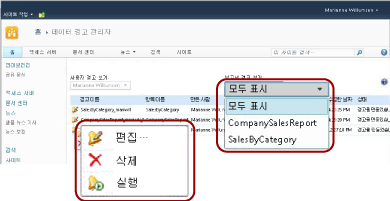
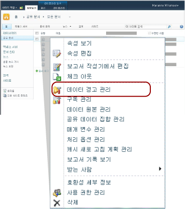

# SharePoint 사용자용 데이터 경고 관리자

[!INCLUDE [ssrs-appliesto](../includes/ssrs-appliesto.md)] [!INCLUDE [ssrs-appliesto-2016](../includes/ssrs-appliesto-2016.md)] [!INCLUDE [ssrs-appliesto-not-2017](../includes/ssrs-appliesto-not-2017.md)] [!INCLUDE[ssrs-appliesto-sharepoint-2013-2016i](../includes/ssrs-appliesto-sharepoint-2013-2016.md)] [!INCLUDE [ssrs-appliesto-not-pbirs](../includes/ssrs-appliesto-not-pbirs.md)]

[!INCLUDE [ssrs-previous-versions](../includes/ssrs-previous-versions.md)]

[!INCLUDE[ssRSnoversion](../includes/ssrsnoversion-md.md)] 에는 데이터 경고를 관리할 수 있도록 SharePoint 정보 근로자를 위한 데이터 경고 관리자가 제공됩니다. SharePoint 정보 근로자는 자신이 만든 경고에 대한 정보를 보고, 경고를 삭제하고, 경고 정의를 열어서 편집하고, 요청 시 경고를 실행할 수 있습니다. 또한 단일 보고서에 대한 경고만 보거나 모든 보고서에 대한 경고를 보도록 선택할 수 있습니다. 다음 그림에서는 데이터 경고 관리자에서 정보 근로자에게 제공되는 기능들을 보여 줍니다.

  

> [!NOTE]
> SQL Server 2016 이후부터 SharePoint와의 Reporting Services 통합을 사용할 수 없습니다.

SharePoint 사이트가 데이터 경고 기능을 사용하도록 설정된 경우 MyDataAlerts.aspx 및 SiteDataAlerts.aspx라는 두 SharePoint 페이지가 만들어지고 SharePoint 사이트에 추가됩니다. MyDataAlerts.aspx는 SharePoint 정보 근로자를 위한 데이터 경고 관리자입니다. 정보 근로자는 자신이 경고를 만든 보고서에서 오른쪽 클릭 메뉴를 사용하여 데이터 경고 관리자를 열 수 있습니다.  

 URL을 사용하여 데이터 경고 관리자를 직접 열 수도 있습니다. 다음은 URL의 구문을 보여 줍니다.  
  
 `http://<site name>/_layouts/ReportServer/MyDataAlerts.aspx`  
  
> [!NOTE]  
>  [!INCLUDE[ssRSnoversion](../includes/ssrsnoversion-md.md)] 경고 기능을 사용하려면 관리자가 먼저 권한을 부여해야 합니다. 필요한 사용 권한에 대한 자세한 내용은 [Reporting Services 데이터 경고](../reporting-services/reporting-services-data-alerts.md)를 참조하세요.  
  
##   데이터 경고 정보 보기  
 데이터 경고 디자이너에서 자신이 만든 데이터 경고 목록을 볼 수 있습니다. 데이터 경고 관리자를 열려면 SharePoint 라이브러리에 게시된 보고서를 마우스 오른쪽 단추로 클릭합니다. 다음 그림에서는 보고서 오른쪽 클릭 메뉴의 **데이터 경고 관리** 옵션을 보여 줍니다.  
  
   
  
 데이터 경고 관리자에는 경고 이름, 보고서 이름, 경고 정의를 만든 자신의 사용자 이름, 경고 메시지를 보낸 횟수, 경고가 마지막으로 실행된 시간, 경고 정의가 마지막으로 수정된 시간 및 최신 경고 메시지 상태를 나열하는 테이블이 포함되어 있습니다. 경고 메시지를 생성하거나 보낼 수 없으면 상태 열에 오류에 대한 정보가 포함되어 경고 문제를 해결하도록 돕습니다. 자세한 내용은 [데이터 경고 관리자에서 내 데이터 경고 관리](../reporting-services/manage-my-data-alerts-in-data-alert-manager.md)를 참조하세요.  
  
 다음 표에서는 데이터 경고 관리자에 있는 테이블의 예제 데이터를 보여 줍니다. 오류가 발생한 경우 오류 메시지와 로그의 항목 식별자(GUID)가 테이블의 **상태** 필드에 포함되어 있습니다.  
  
|경고 이름|보고서 이름|만든 사람|보낸 경고|마지막 실행|마지막으로 수정한 날짜|상태|  
|----------------|-----------------|----------------|-----------------|--------------|-------------------|------------|  
|SalesQTR|SalesByTerritoryAndQTR|Lauren Johnson|4|6/12/2011|6/1/2011|마지막 경고가 성공적으로 실행되고 경고가 전송되었습니다.|  
|UnitsSold|ProductsSalesByQTR|Lauren Johnson|2|7/1/2011|6/28/2011|마지막 경고가 성공적으로 실행되었지만 데이터가 변경되지 않아서 경고를 보내지 않았습니다.|  
|TopPromotion|PromotionTracking|Lauren Johnson|0||5/23/2011|경고를 만들었습니다.|  
  
  
##   데이터 경고 삭제  
 데이터 경고 관리자에서 경고 정의를 삭제합니다. 정보 근로자는 자신이 만든 경고 정의를 삭제할 수 있습니다. 다른 사용자가 만든 경고 정의는 삭제할 수 없습니다. 자세한 내용은 [데이터 경고 관리자에서 내 데이터 경고 관리](../reporting-services/manage-my-data-alerts-in-data-alert-manager.md)를 참조하세요.  
  
 경고 정의를 삭제하면 영구적으로 삭제됩니다. 경고 메시지를 일시 중지하려면 경고 정의에서 되풀이 패턴, 시작 날짜 또는 종료 날짜를 변경해야 합니다. 자세한 내용은 [경고 디자이너에서 데이터 경고 편집](../reporting-services/edit-a-data-alert-in-alert-designer.md)을 참조하세요.  
  
  
##   데이터 경고 편집  
 정보 근로자는 데이터 경고 관리자에서 편집할 경고 정의를 열 수 있습니다. 자신이 만든 경고 정의만 편집할 수 있고 다른 사용자가 만든 경고 정의는 편집할 수 없습니다. 경고 정의를 마우스 오른쪽 단추로 클릭하고 **편집** 을 클릭하면 경고 정의가 표시된 데이터 경고 디자이너가 열립니다. 자세한 내용은 [데이터 경고 디자이너](../reporting-services/data-alert-designer.md) 및 [경고 디자이너에서 데이터 경고 편집](../reporting-services/edit-a-data-alert-in-alert-designer.md)을 참조하세요.  
  
  
##   데이터 경고 실행  
 데이터 경고 관리자에는 경고 서비스에서 데이터 경고 정의를 마지막으로 처리한 시간 및 데이터 경고 메시지를 보낸 횟수에 대한 정보가 포함되어 있습니다. 예약된 시간까지 기다리지 않고 경고 메시지를 즉시 실행하여 보낼 수 있습니다. 데이터 경고 관리자에서 경고를 실행하면 경고 일정을 덮어쓰며 보고서를 실행하는 데 필요한 시간과 경고를 실행하도록 선택한 시간의 보고서 서버 사용량에 따라 1-5분 이내에 경고 정의를 처리하기 시작합니다. 결과가 변경된 경우에만 메시지를 보내도록 지정했지만 결과가 변경되지 않은 경우에는 메시지를 만들거나 보내지 않습니다. 자세한 내용은 [데이터 경고 관리자에서 내 데이터 경고 관리](../reporting-services/manage-my-data-alerts-in-data-alert-manager.md)를 참조하세요.  
  
> [!NOTE]  
>  **실행**  옵션을 클릭하면 몇 초 후에 **상태** 열의 값이 업데이트되어 경고가 처리 중임을 나타냅니다. **실행**  옵션을 여러 번 클릭하면 경고가 여러 번 처리됩니다. 그러면 보고서 서버의 리소스가 불필요하게 소비되어 보고서 서버의 성능에 영향을 줄 수 있습니다. 경고에 대해 업데이트된 정보를 보려면 웹 브라우저의 새로 고침 단추를 클릭하여 상태 업데이트와 경고에 대한 다른 정보를 확인합니다.  
  
  
##   관련 작업  
 이 섹션에는 경고를 관리하고 경고 정의를 편집하는 방법을 보여 주는 절차가 나열되어 있습니다.  
  
-   [데이터 경고 관리자에서 내 데이터 경고 관리](../reporting-services/manage-my-data-alerts-in-data-alert-manager.md)  
  
-   [경고 디자이너에서 데이터 경고 편집](../reporting-services/edit-a-data-alert-in-alert-designer.md)  

## 관련 항목:

[데이터 경고 디자이너](../reporting-services/data-alert-designer.md)   
[데이터 경고 디자이너에서 데이터 경고 만들기](../reporting-services/create-a-data-alert-in-data-alert-designer.md)   
[Reporting Services 데이터 경고](../reporting-services/reporting-services-data-alerts.md)  

추가 질문이 있으신가요? [Reporting Services 포럼에서 질문하기](http://go.microsoft.com/fwlink/?LinkId=620231)
