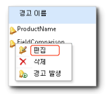

# 경고 디자이너에서 데이터 경고 편집

[!INCLUDE [ssrs-appliesto](../includes/ssrs-appliesto.md)] [!INCLUDE [ssrs-appliesto-2016](../includes/ssrs-appliesto-2016.md)] [!INCLUDE [ssrs-appliesto-not-2017](../includes/ssrs-appliesto-not-2017.md)] [!INCLUDE[ssrs-appliesto-sharepoint-2013-2016i](../includes/ssrs-appliesto-sharepoint-2013-2016.md)] [!INCLUDE [ssrs-appliesto-not-pbirs](../includes/ssrs-appliesto-not-pbirs.md)]

[!INCLUDE [ssrs-previous-versions](../includes/ssrs-previous-versions.md)]

데이터 경고 관리자에서 편집할 데이터 경고 정의를 엽니다. 경고 정의를 만든 사용자만 해당 정의를 편집할 수 있습니다. 데이터 경고 관리자를 여는 방법은 [데이터 경고 관리자에서 내 데이터 경고 관리](../reporting-services/manage-my-data-alerts-in-data-alert-manager.md)를 참조하세요.

> [!NOTE]
> SQL Server 2016 이후부터 SharePoint와의 Reporting Services 통합을 사용할 수 없습니다.

 다음 그림은 데이터 경고 관리자에 있는 데이터 경고의 상황에 맞는 메뉴를 보여 줍니다.  
  
   
  
 다음 절차에는 데이터 경고 디자이너에서 편집할 경고 정의를 데이터 경고 관리자에서 열기 위한 단계가 포함되어 있습니다.  
  
### 데이터 경고 디자이너에서 데이터 경고 정의를 편집하려면  
  
1.  데이터 경고 관리자에서 편집할 데이터 경고 정의를 마우스 오른쪽 단추로 클릭하고 **편집**을 클릭합니다.  
  
     경고 정의가 데이터 경고 디자이너에서 열립니다.  
  
2.  규칙, 일정 설정 및 전자 메일 설정을 업데이트합니다. 자세한 내용은 [데이터 경고 디자이너](../reporting-services/data-alert-designer.md) 및 [데이터 경고 디자이너에서 데이터 경고 만들기](../reporting-services/create-a-data-alert-in-data-alert-designer.md)를 참조하세요.  
  
    > [!NOTE]  
    >  다른 데이터 피드를 선택할 수는 없습니다. 다른 데이터 피드를 사용하려면 새 데이터 경고 정의를 만들어야 합니다.  
  
3.  **저장**을 클릭합니다.  
  
    > [!NOTE]  
    >  보고서가 변경되고 보고서에서 생성된 데이터 피드가 변경된 경우 경고 정의가 더 이상 유효하지 않을 수 있습니다. 이러한 예로는 해당 규칙에서 경고 정의가 참조하는 열이 보고서에서 삭제되었거나 데이터 형식을 변경하는 경우 또는 보고서가 삭제 또는 이동되는 경우를 들 수 있습니다. 유효하지 않은 경고 정의를 열 수는 있지만 정의를 작성할 때 사용한 보고서 데이터 피드의 현재 버전을 기준으로 유효한 경고 정의만 다시 저장할 수 있습니다. 보고서에서 데이터 피드를 생성하는 방법은 [보고서에서 데이터 피드 생성&#40;보고서 작성기 및 SSRS&#41;](../reporting-services/report-builder/generating-data-feeds-from-reports-report-builder-and-ssrs.md)을 참조하세요.  

## 참고 항목

[경고 담당자를 위한 데이터 경고 관리자](../reporting-services/data-alert-manager-for-alerting-administrators.md)   
[Reporting Services 데이터 경고](../reporting-services/reporting-services-data-alerts.md)  

추가 질문이 있으신가요? [Reporting Services 포럼에서 질문하기](http://go.microsoft.com/fwlink/?LinkId=620231)
