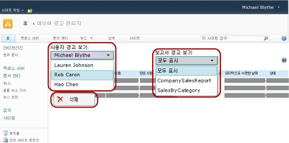

# 데이터 경고 관리자에서 SharePoint 사이트의 모든 데이터 경고 관리

[!INCLUDE[ssrs-appliesto](../includes/ssrs-appliesto.md)] [!INCLUDE[ssrs-appliesto-2016](../includes/ssrs-appliesto-2016.md)] [!INCLUDE[ssrs-appliesto-not-pbirsi](../includes/ssrs-appliesto-not-pbirs.md)] [!INCLUDE[ssrs-appliesto-sharepoint-2013-2016i](../includes/ssrs-appliesto-sharepoint-2013-2016.md)]

SharePoint 경고 관리자는 사이트 사용자가 만든 데이터 경고 목록과 경고에 대한 정보를 볼 수 있습니다. 경고 관리자는 경고를 삭제할 수도 있습니다. 다음 그림에서는 데이터 경고 관리자에서 경고 담당자가 사용할 수 있는 기능을 보여 줍니다.

 

> [!NOTE]
> SQL Server 2016 이후부터 SharePoint와의 Reporting Services 통합을 사용할 수 없습니다.

## 사이트 사용자가 만든 경고 목록 보기  
  
1.  데이터 경고 정의가 저장된 SharePoint 사이트로 이동합니다.  
  
2.  홈 페이지에서 **사이트 작업**을 클릭합니다.  
  
3.  목록 아래로 스크롤하고 **사이트 설정**을 클릭합니다.  
  
4.  **Reporting Services**아래에서 **데이터 경고 관리**를 클릭합니다.  
  
5.  **사용자 경고 보기** 목록 옆에서 아래쪽 화살표를 클릭하고 보려는 경고를 소유하는 사용자를 선택합니다.  
  
6.  **보고서 경고 보기** 목록 옆에서 아래쪽 화살표를 클릭하고 보려는 특정 경고를 선택하거나 **모두 표시** 를 클릭하여 선택한 사용자가 만든 모든 경고를 나열합니다.  
  
     테이블에 이름, 보고서 이름, 데이터 경고를 만든 사용자 이름, 데이터 경고를 보낸 횟수, 데이터 경고 정의가 마지막으로 수정된 시간 및 데이터 경고 상태가 나열됩니다. 데이터 경고를 생성하거나 보낼 수 없으면 상태 열에 오류에 대한 정보가 포함되어 문제를 해결하도록 돕습니다.  
  
## 경고 정의 삭제  
  
-   삭제할 데이터 경고를 마우스 오른쪽 단추로 클릭하고 **삭제**를 클릭합니다.  
  
    > [!NOTE]  
    >  경고를 삭제하면 더 이상 경고 메시지가 전송되지 않습니다. 하지만 경고 데이터베이스를 쿼리하면 경고 정의가 계속 존재하는 것을 확인할 수 있습니다. 경고 서비스는 예약에 따라 정리를 수행하며 다음 정리 작업 시 경고 정의가 영구적으로 삭제됩니다. 기본 정리 간격은 20분입니다. 이러한 정리 간격은 구성할 수 있습니다. 자세한 내용은 [Reporting Services 데이터 경고](../reporting-services/reporting-services-data-alerts.md)를 참조하세요.  

## 참고 항목

[경고 담당자를 위한 데이터 경고 관리자](../reporting-services/data-alert-manager-for-alerting-administrators.md)   
[Reporting Services 데이터 경고](../reporting-services/reporting-services-data-alerts.md)  

추가 질문이 있으신가요? [Reporting Services 포럼에서 질문하기](http://go.microsoft.com/fwlink/?LinkId=620231)
