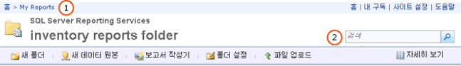

# 웹 포털에서 보고서 찾기 및 보기(보고서 작성기 및 SSRS)
  보고서 관리자는 보고서 보기 및 관리 기능을 제공하는 웹 기반 도구입니다. 이 도구는 보고서 서버를 설치할 때 함께 설치됩니다. 보고서 관리자를 열려면 브라우저 창에 보고서 관리자 URL을 입력하십시오. 브라우저 요구 사항에 대한 내용은 [Reporting Services 및 파워 뷰에 대한 브라우저 지원](../../reporting-services/browser-support-for-reporting-services-and-power-view.md)을 참조하세요. 보고서 서버에서 보고서 관리자 URL을 구성하는 방법에 대한 자세한 내용은 시스템 관리자에게 문의하십시오. 자세한 내용은 [보고서 관리자 구성&#40;기본 모드&#41;](../../reporting-services/report-server/configure-report-manager-native-mode.md)을 참조하세요.  
  
 시스템 관리자가 보고서 서버에서 설정한 사용 권한에 따라 사용자가 보고서 관리자를 사용할 때 표시되는 기능이 달라집니다. 사용 권한은 역할 할당을 통해 부여됩니다. 보고서를 찾고 볼 수 있으려면 역할 할당에 보고서 보기 태스크가 포함되어 있어야 합니다. 보고서 서버에서 보고서를 찾으려면 이름 또는 설명을 기준으로 보고서를 검색하거나 보고서 서버 폴더를 탐색해야 합니다. 보고서 서버에 게시 또는 업로드된 보고서만 검색하거나 찾아볼 수 있습니다. 보고서를 검색하는 방법에 대한 자세한 내용은 [보고서 및 기타 항목 검색&#40;보고서 작성기 및 SSRS&#41;](../../reporting-services/report-builder/searching-for-reports-and-other-items-report-builder-and-ssrs.md)을 참조하세요.  
  
> [!NOTE]  
>  [!INCLUDE[ssRBRDDup](../../includes/ssrbrddup-md.md)]  
  
## 보고서 관리자에서 폴더 계층 구조 탐색  
 보고서 관리자를 시작하고 폴더 계층 구조에서 임의의 폴더를 열 때 자동으로 표시되는 홈 페이지를 사용하면 실행할 보고서를 쉽게 찾을 수 있습니다. 홈 페이지에는 사용자가 보기 권한을 갖고 있는 항목만 표시됩니다. 폴더 경로는 홈 페이지 위쪽에 링크 행으로 표시됩니다. 폴더 이름은 루트 폴더(홈)부터 순서대로 나열됩니다. 추가 폴더를 열 때마다 해당 폴더 이름이 페이지 위쪽의 폴더 경로에 추가됩니다. 아래 이미지의 **(1)** 입니다. 또한 보고서를 열면 해당 보고서 이름이 폴더 경로에 추가됩니다.  
  
   
보고서 관리자 리본  
  
 다음과 같은 방법으로 폴더 계층을 탐색할 수 있습니다.  
  
-   폴더의 내용을 보려면 홈 페이지에서 폴더 이름을 클릭합니다. 폴더 페이지가 열리고 폴더의 내용이 표시됩니다.  
  
-   폴더 계층에서 하위 수준을 탐색하려면 현재 폴더의 하위 폴더를 엽니다. 폴더에는 보고서, 리소스, 공유 데이터 원본 항목 및 기타 폴더가 들어 있습니다. 폴더 아이콘을 클릭하면 폴더가 열리고 한 수준 아래 계층의 내용이 표시됩니다.  
  
-   폴더 계층에서 상위 수준을 탐색하려면 페이지 위쪽의 링크 행에서 내용을 보려는 폴더 이름을 클릭합니다. 위 이미지의 **(1)** 입니다.  
  
## 보고서 열기  
 보고서를 찾은 다음 보고서 이름을 클릭하면 해당 보고서가 열립니다. 보고서는 HTML로 렌더링되고 보고서 관리자의 내용 페이지에 표시됩니다. 보고서는 항상 브라우저 세션에서 캐시되기 때문에 보고서를 연 경우 **뒤로** 단추를 클릭하여 보고서로 되돌아갈 수 있습니다. 보고서 실행을 위해 사용자 이름과 암호를 입력해야 하는 경우에도 마찬가지입니다. 렌더링된 보고서를 완전히 닫으려면 브라우저를 닫아야 합니다.  
  
 폴더 계층 구조에 표시되는 보고서 중 일부에는 곧바로 액세스하지 못할 수도 있습니다. 보고서의 데이터 원본에 대한 액세스 권한이 있는지 확인하기 위해 사용자 이름과 암호를 입력해야 하는 경우도 있습니다. 보고서 관리자에서 보고서 열기에 대한 자세한 내용은 [보고서 열기 및 닫기&#40;보고서 관리자&#41;](../../reporting-services/reports/open-and-close-a-report-report-manager.md)를 참조하세요.  
  
 보고서 작성기에서 직접 보고서 서버의 보고서를 탐색하거나 열 수도 있습니다. 자세한 내용은 [보고서 및 기타 항목 검색&#40;보고서 작성기 및 SSRS&#41;](../../reporting-services/report-builder/searching-for-reports-and-other-items-report-builder-and-ssrs.md)을 참조하세요.  
  
## 항목을 검색하려면  
  
-   보고서 관리자에서 항목을 검색하려면 페이지 위쪽의 **검색** 입력란에 검색 문자열을 입력합니다. 위 이미지의 **(2)** 입니다. 검색은 폴더 계층의 최상위 노드에서 시작되어 모든 분기를 따라 진행됩니다. 특정 분기에 대한 액세스 권한이 없는 경우 해당 분기는 건너뜁니다. 다른 사용자에게 속한 내 보고서 폴더와 일반적으로 사용할 수 없는 다른 폴더도 같은 방식으로 검색을 진행합니다. 보기 권한이 있는 보고서와 항목만 검색 결과에 포함됩니다.  
  
-   이름이나 설명을 기준으로 항목을 검색하려면 검색할 텍스트 전부 또는 일부를 지정합니다. 검색 문자열은 대/소문자를 구분하지 않습니다. 검색 조건을 포함하거나 제외하기 위해 더하기(+) 또는 빼기(-) 기호와 같은 검색 연산자를 사용할 수 없습니다.  
  
-   보고서에서 특정 텍스트를 검색하려면 보고서 위쪽의 도구 모음을 사용합니다.  
  
## 참고 항목  
 [보고서 및 기타 항목 검색&#40;보고서 작성기 및 SSRS&#41;](../../reporting-services/report-builder/searching-for-reports-and-other-items-report-builder-and-ssrs.md)   
 [보고서 찾기, 보기 및 관리&#40;보고서 작성기 및 SSRS&#41;](../../reporting-services/report-builder/finding-viewing-and-managing-reports-report-builder-and-ssrs.md)  
  
  
