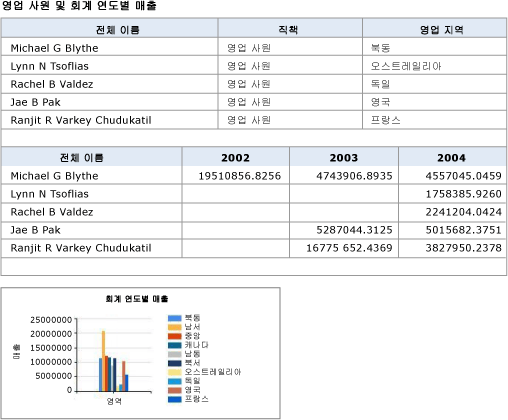
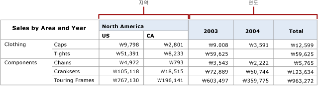
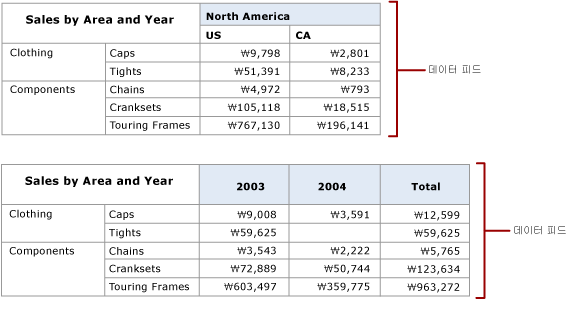

# 보고서에서 데이터 피드 만들기(보고서 작성기 및 SSRS)

  [!INCLUDE[ssRSnoversion](../../includes/ssrsnoversion-md.md)] Atom 렌더링 확장 프로그램은 페이지가 매겨진 보고서에서 사용할 수 있는 데이터 피드와 보고서의 데이터 영역에서 사용할 수 있는 데이터 피드를 나열하는 Atom 서비스 문서를 생성합니다. 이 확장 프로그램을 사용하면 보고서에서 생성된 데이터 피드를 사용할 수 있는 애플리케이션을 사용하여 읽을 수 있고 교환할 수 있는 Atom 규격 데이터 피드를 생성할 수 있습니다. 예를 들어 Atom 렌더링 확장 프로그램을 사용하여 파워 피벗 또는 Power BI에서 사용할 수 있는 데이터 피드를 생성할 수 있습니다.  
  
 Atom 서비스 문서는 보고서의 각 데이터 영역에 대해 데이터 피드를 하나 이상 나열합니다. 데이터 영역의 유형과 데이터 영역에 표시되는 데이터에 따라 [!INCLUDE[ssRSnoversion](../../includes/ssrsnoversion-md.md)] 는 데이터 영역에서 여러 데이터 피드를 생성할 수 있습니다. 예를 들어 행렬이나 차트는 여러 데이터 피드를 제공할 수 있습니다. Atom 렌더링 확장 프로그램이 Atom 서비스 문서를 만드는 경우 고유 식별자가 각 데이터 피드에 대해 만들어지며 URL에서 이 식별자를 사용하여 데이터 피드의 내용에 액세스할 수 있습니다.  
  
 Atom 렌더링 확장 프로그램이 데이터 피드에 대한 데이터를 생성하는 방식은 CSV(쉼표로 구분된 값) 렌더링 확장이 CSV 파일에 데이터를 렌더링하는 방식과 유사합니다. CSV 파일과 마찬가지로 데이터 피드는 보고서 데이터의 일반 표현입니다. 예를 들어 그룹 내의 판매량 합계를 계산하는 행 그룹이 있는 테이블은 각 데이터 행에서 합계를 계산하는 작업을 반복하며 별도의 행에 합계만 포함되지는 않습니다.  
  
 [!INCLUDE[ssRSnoversion](../../includes/ssrsnoversion-md.md)] , 보고서 서버 또는 [!INCLUDE[ssRSnoversion](../../includes/ssrsnoversion-md.md)]와 통합된 SharePoint 사이트를 사용하여 Atom 서비스 문서와 데이터 피드를 생성할 수 있습니다.  
  
 Atom은 관련 표준의 쌍에 적용됩니다. Atom 서비스 문서는 RFC 5023 Atom 게시 프로토콜 사양을 따르며 데이터 피드는 RFC 4287 Atom 배포 형식 프로토콜 사양을 따릅니다.  
  
 다음 섹션에서는 Atom 렌더링 확장 프로그램을 사용하는 방법에 대해 자세히 설명합니다.  
  
 [!INCLUDE[ssRBRDDup](../../includes/ssrbrddup-md.md)]  
  
##   데이터 피드로 보고서 사용  
 프로덕션 보고서를 데이터 피드로 내보내거나 기본 목적이 애플리케이션에 데이터를 제공하는 것인 보고서를 데이터 피드 형태로 만들 수 있습니다. 보고서를 데이터 피드로 사용하는 것은 클라이언트 데이터 공급자를 통해 데이터에 액세스하기가 쉽지 않은 경우나 데이터 원본의 복잡성을 숨기고 데이터를 더 간단하게 사용하게 하려는 경우 애플리케이션에 데이터를 제공하는 또 다른 방법입니다. 보고서 데이터를 데이터 피드로 사용하는 경우 보안, 예약 및 보고서 스냅샷과 같은 [!INCLUDE[ssRSnoversion](../../includes/ssrsnoversion-md.md)] 기능을 사용하여 데이터 피드를 제공하는 보고서를 관리할 수 있다는 추가적인 이점이 있습니다.  
  
 Atom 렌더링 확장 프로그램을 최대한 활용하려면 보고서가 데이터 피드로 렌더링되는 방식을 이해해야 합니다. 기존 보고서를 사용하는 경우 보고서에서 생성할 데이터 피드를 예측할 수 있으면 유용합니다. 데이터 피드로 특별히 사용하기 위해 보고서를 작성하는 경우에는 데이터 피드의 유용성을 최대화하기 위해 데이터를 포함하고 보고서 레이아웃을 조정할 수 있으면 크게 도움이 됩니다.  
  
 자세한 내용은 [보고서에서 데이터 피드 생성&#40;보고서 작성기 및 SSRS&#41;](../../reporting-services/report-builder/generate-data-feeds-from-a-report-report-builder-and-ssrs.md)을 참조하세요.  
  
  
##   Atom 서비스 문서(.atomsvc 파일)  
 Atom 서비스 문서는 하나 이상의 데이터 피드에 대한 연결을 지정합니다. 최소한 연결은 피드를 생성하는 데이터 서비스에 대한 간단한 URL입니다.  
  
 Atom 렌더링 확장 프로그램을 사용하여 보고서 데이터를 렌더링하는 경우 Atom 서비스 문서는 보고서에 사용할 수 있는 데이터 피드를 나열합니다. 이 문서는 보고서의 각 데이터 영역에 대한 데이터 피드를 하나 이상 나열합니다. 테이블과 계기는 각각 데이터 피드를 하나만 생성하지만 행렬, 목록 및 차트는 표시하는 데이터에 따라 여러 데이터 피드를 생성할 수 있습니다.  
  
 다음 다이어그램에서는 테이블 두 개와 차트 한 개를 사용하는 보고서를 보여 줍니다.  
  
   
  
 이 보고서에서 생성된 Atom 서비스 문서는 세 가지 데이터 피드(각 테이블에 대한 데이터 피드와 차트에 대한 데이터 피드)를 포함합니다.  
  
 행렬 데이터 영역에는 행렬의 구조에 따라 데이터 피드가 두 개 이상 있을 수 있습니다. 다음 다이어그램에서는 두 가지 데이터 피드를 생성하는 행렬을 사용하는 보고서를 보여 줍니다.  
  
   
  
 이 보고서에서 생성된 Atom 서비스 문서는 두 가지 데이터 피드(각 동적 피어 열에 대한 데이터 피드)인 Territory 및 Year를 포함합니다. 다음 다이어그램에서는 각 데이터 피드의 내용을 보여 줍니다.  
  
   
  
  
##   데이터 피드  
 데이터 피드는 보고서가 실행될 때마다 다를 수 있는 변수 데이터와 시간이 흐름에 따라 변경되지 않는 일관성 있는 표 형식이 있는 XML 파일입니다. [!INCLUDE[ssRSnoversion](../../includes/ssrsnoversion-md.md)] 에서 생성하는 데이터 피드는 ADO.NET Data Services에서 생성하는 데이터 피드와 동일한 형식으로 되어 있습니다.  
  
 데이터 피드에는 헤더 섹션과 데이터 섹션이 포함되어 있습니다. Atom 사양은 각 섹션에서 요소를 정의합니다. 헤더에는 데이터 피드에서 사용할 문자 인코딩 스키마와 같은 정보가 포함됩니다.  
  
### 헤더 섹션  
 다음 XML 코드에서는 데이터 피드의 헤더 섹션을 보여 줍니다.  
  
 `<?xml version="1.0" encoding="utf-8" standalone="yes"?><feed xmlns:d="https://schemas.microsoft.com/ado/2007/08/dataservices" xmlns:m="https://schemas.microsoft.com/ado/2007/08/dataservices/metadata" xmlns="http://www.w3.org/2005/Atom">`  
  
 `<title type="text"></title>`  
  
 `<id>uuid:1795992c-a6f3-40ec-9243-fbfd0b1a5be3;id=166321</id>`  
  
 `<updated>2009-05-08T23:09:58Z</updated>`  
  
### 데이터 섹션  
 데이터 피드의 데이터 섹션에는 Atom 렌더링 확장 프로그램에서 생성하는 일반 행 집합의 각 행에 대한 \<**entry**> 요소가 하나 포함되어 있습니다.  
  
 다음 다이어그램에서는 그룹과 합계를 사용하는 보고서를 보여 줍니다.  
  
   
  
 다음 XML에서는 데이터 피드에 있는 해당 보고서의 \<**entry**> 요소를 보여 줍니다. \<**entry**> 요소에는 그룹의 판매량 및 주문량 합계와 모든 그룹의 판매량 및 주문량 합계가 포함되어 있습니다. \<**entry**> 요소에는 보고서의 모든 값이 포함되어 있습니다.  
  
 `<entry><id>uuid:1795992c-a6f3-40ec-9243-fbfd0b1a5be3;id=166322</id><title type="text"></title><updated>2009-05-08T23:09:58Z</updated><author /><content type="application/xml"><m:properties>`  
  
 `<d:ProductCategory_Value>Accessories</d:ProductCategory_Value>`  
  
 `<d:OrderYear_Value m:type="Edm.Int32">2001</d:OrderYear_Value>`  
  
 `<d:SumLineTotal_Value m:type="Edm.Decimal">20235.364608</d:SumLineTotal_Value>`  
  
 `<d:SumOrderQty_Value m:type="Edm.Int32">1003</d:SumOrderQty_Value>`  
  
 `<d:SumLineTotal_Total_2_1 m:type="Edm.Decimal">1272072.883926</d:SumLineTotal_Total_2_1>`  
  
 `<d:SumOrderQty_Total_2_1 m:type="Edm.Double">61932</d:SumOrderQty_Total_2_1>`  
  
 `<d:SumLineTotal_Total_2_2 m:type="Edm.Decimal">109846381.399888</d:SumLineTotal_Total_2_2>`  
  
 `<d:SumOrderQty_Total_2_2 m:type="Edm.Double">274914</d:SumOrderQty_Total_2_2></m:properties></content>`  
  
 `</entry>`  
  
### 데이터 피드 작업  
 보고서에서 생성하는 모든 데이터 피드에는 데이터 피드를 생성하는 데이터 영역의 부모 범위에 있는 보고서 항목이 포함되어 있습니다. . 예를 들어 몇 가지 테이블과 차트가 있는 보고서의 경우 보고서 본문의 입력란에서는 각 데이터 영역을 설명하는 텍스트를 제공하고, 보고서에서 생성하는 모든 데이터 피드의 각 항목에는 이 입력란 값이 포함됩니다. 예를 들어 텍스트가 "Chart displays monthly sales averages by sales region"인 경우 세 데이터 피드는 모두 각 행에서 이 텍스트를 포함합니다.  
  
 보고서 레이아웃에 중첩 데이터 영역과 같은 계층적 데이터 관계가 포함된 경우 해당 관계가 보고서 데이터의 일반화된 행 집합에 포함됩니다.  
  
 일반적으로 중첩 데이터 영역의 데이터 행은 특히 중첩 테이블과 행렬에 그룹 및 합계가 포함되는 경우 너비가 넓습니다. 보고서를 데이터 피드로 내보내고 데이터 피드를 검토하여 생성된 데이터가 기대한 것인지 확인하는 것이 유용할 수 있습니다.  
  
 Atom 렌더링 확장 프로그램이 Atom 서비스 문서를 만드는 경우 고유 식별자가 데이터 피드에 대해 만들어지며 URL에서 이 식별자를 사용하여 데이터 피드의 내용을 볼 수 있습니다. 위에서 보여 준 샘플 Atom 서비스 문서에는 URL `https://ServerName/ReportServer?%2fProduct+Sales+Summary&rs%3aCommand=Render&rs%3aFormat=ATOM&rc%3aDataFeed=xAx0x1`이 포함되어 있습니다. 이 URL은 보고서(Product Sales Summary), Atom 렌더링 형식(ATOM) 및 데이터 피드의 이름(xAx0x1)을 식별합니다.  
  
 보고서 항목 이름은 기본적으로 보고서 항목의 RDL(Report Definition Language) 요소 이름으로 설정되며 간단하지 않거나 기억하기 쉽지 않은 경우가 많습니다. 예를 들어 보고서에 배치된 첫 번째 행렬의 기본 이름은 Tablix 1입니다. 데이터 피드는 이러한 이름을 사용합니다.  
  
 데이터 피드를 사용하기 쉽게 만들려면 데이터 영역의 DataElementName 속성을 사용하여 친숙한 이름을 제공할 수 있습니다. DataElementName의 값을 제공하는 경우 데이터 피드 하위 요소 \<**d**>는 기본 데이터 영역 이름 대신 이 값을 사용합니다. 예를 들어 데이터 영역의 기본 이름이 Tablix1인 경우 DataElementName이 SalesByTerritoryYear로 설정되면 데이터 피드의 \<**d**>는 SalesByTerritoryYear를 사용합니다. 데이터 영역에 위에서 설명한 행렬 보고서와 같은 두 가지 데이터 피드가 있는 경우 데이터 피드에서 사용되는 이름은 SalesByTerritoryYear _Territory 및 SalesByTerritoryYear _Year입니다.  
  
 보고서에 표시된 데이터와 데이터 피드의 데이터를 비교하는 경우 몇 가지 차이점을 확인할 수 있습니다. 보고서에는 형식이 지정된 숫자 및 시간/날짜 데이터가 표시되는 경우가 많지만 데이터 피드에는 형식이 지정되지 않은 데이터가 포함됩니다.  
  
 데이터 피드는 .atom 파일 이름 확장명으로 저장됩니다. 메모장 또는 XML 편집기와 같은 텍스트 또는 XML 편집기를 사용하여 파일 구조와 내용을 볼 수 있습니다.  
  
  
##   보고서 데이터 일반화  
 Atom 렌더러는 XML 형식의 일반화된 행 집합으로 보고서 데이터를 제공합니다. 데이터 테이블을 일반화하기 위한 규칙은 몇 가지 예외를 제외하고 CSV 렌더러의 규칙과 동일합니다.  
  
-   범위의 항목은 세부 수준으로 일반화됩니다. CSV 렌더러와 달리 최상위 수준의 입력란은 데이터 피드에 작성된 각 항목에 나타납니다.  
  
-   보고서 매개 변수 값은 출력의 각 행에서 렌더링됩니다.  
  
 계층적 데이터와 그룹화된 데이터를 Atom 규격 형식으로 표현하려면 일반화해야 합니다. 렌더링 확장 프로그램은 보고서를 데이터 영역 내부의 중첩된 그룹을 표현하는 트리 구조로 결합합니다. 보고서는 다음과 같이 결합됩니다.  
  
-   행 계층 구조가 열 계층 구조보다 먼저 결합됩니다.  
  
-   행 계층 구조의 멤버가 열 계층 구조의 멤버보다 먼저 데이터 피드로 렌더링됩니다.  
  
-   열은 본문의 입력란이 왼쪽에서 오른쪽, 위쪽에서 아래쪽으로 정렬되고 그 다음에 데이터 영역이 왼쪽에서 오른쪽, 위쪽에서 아래쪽으로 정렬되는 방식으로 정렬됩니다.  
  
-   데이터 영역 내에서 열은 모퉁이 멤버, 행 계층 구조 멤버, 열 계층 구조 멤버, 셀 순으로 정렬됩니다.  
  
-   피어 데이터 영역은 공통 데이터 영역 또는 동적 상위 항목을 공유하는 데이터 영역 또는 동적 그룹입니다. 피어 데이터는 결합된 트리의 분기에 의해 식별됩니다.  
  
 자세한 내용은 [테이블, 행렬 및 목록&#40;보고서 작성기 및 SSRS&#41;](../../reporting-services/report-design/tables-matrices-and-lists-report-builder-and-ssrs.md)를 참조하세요.  
  
  
##   Atom 렌더링 규칙  
 Atom 렌더링 확장 프로그램은 데이터 피드를 렌더링할 때 다음 정보를 무시합니다.  
  
-   서식 및 레이아웃  
  
-   페이지 머리글  
  
-   페이지 바닥글  
  
-   사용자 지정 보고서 항목  
  
-   사각형  
  
-   선  
  
-   이미지  
  
-   자동 부분합  
  
 나머지 보고서 항목은 위쪽에서 아래쪽으로 정렬된 다음 왼쪽에서 오른쪽으로 정렬됩니다. 그런 다음 각 항목이 열로 렌더링됩니다. 보고서에 목록이나 테이블과 같은 중첩된 데이터 항목이 있는 경우 부모 항목이 각 행에서 반복됩니다.  
  
 다음 표는 보고서 항목이 렌더링될 때의 모양을 보여 줍니다.  
  
|항목|렌더링 동작|  
|----------|------------------------|  
|테이블|테이블을 확장하고 최하위 수준에서 각 행과 열에 대한 행과 열을 만들어 렌더링합니다. 부분합 행과 열에는 열 머리글이나 행 머리글이 없습니다. 드릴스루 보고서는 지원되지 않습니다.|  
|행렬|행렬을 확장하고 최하위 수준에서 각 행과 열에 행과 열을 만들어 렌더링합니다. 부분합 행과 열에는 열 머리글이나 행 머리글이 없습니다.|  
|목록|목록의 각 정보 행이나 인스턴스에 대해 레코드를 렌더링합니다.|  
|하위 보고서|내용의 각 인스턴스에 대해 부모 항목이 반복됩니다.|  
|차트|각 차트 값에 대한 모든 차트 레이블을 사용하여 레코드를 렌더링합니다. 계층 구조에서 계열 및 범주의 레이블은 결합되어 차트 값에 대한 행에 포함됩니다.|  
|데이터 막대|차트와 같이 렌더링하며 대개 계층이나 레이블을 포함하지 않습니다.|  
|스파크라인|차트와 같이 렌더링하며 대개 계층이나 레이블을 포함하지 않습니다.|  
|계기|선형 눈금의 최소값과 최대값, 범위의 시작 값과 끝 값, 포인터의 값을 사용하여 한 레코드로 렌더링합니다.|  
|표시기|활성 상태 이름, 사용 가능한 상태 및 데이터 값을 포함하는 단일 레코드로 렌더링합니다.|  
|지도|각 지도 데이터 영역에 대한 데이터 피드를 생성합니다. 여러 지도 계층에서 동일한 데이터 영역을 사용하는 경우 데이터 피드에는 모든 지도 계층이 포함됩니다. 데이터 피드에는 지도 계층의 각 지도 멤버에 대한 레이블과 값이 있는 레코드가 포함됩니다.|  
  
  
##   디바이스 정보 설정  
 사용할 인코딩 스키마를 비롯하여 이 렌더러의 기본 설정을 일부 변경할 수 있습니다. 자세한 내용은 [ATOM Device Information Settings](../../reporting-services/atom-device-information-settings.md)을 참조하세요.  

## 다음 단계

[CSV 파일로 내보내기](../../reporting-services/report-builder/exporting-to-a-csv-file-report-builder-and-ssrs.md)   
[보고서 내보내기](../../reporting-services/report-builder/export-reports-report-builder-and-ssrs.md)  

추가 질문이 있으신가요? [Reporting Services 포럼에서 질문하기](https://go.microsoft.com/fwlink/?LinkId=620231)
