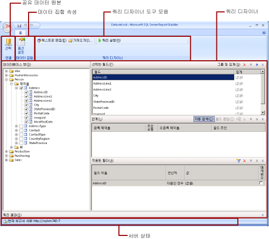

# 공유 데이터 집합 디자인 뷰 (보고서 작성기)
  보고서에서 데이터 집합은 외부 데이터 원본에 대해 쿼리를 실행할 때 반환되는 보고서 데이터를 나타냅니다. 공유 데이터 집합은 보고서 서버에 게시되며 여러 보고서에서 사용할 수 있습니다. 다른 사용자와 공유할 데이터 집합을 만들 수 있습니다. 공유 데이터 집합 디자인 창에서 공유 데이터 원본을 선택하고, 공유 데이터 집합에 대한 속성을 지정하고, 쿼리 디자이너를 통해 쿼리를 만듭니다.  
  
   
  
 보고서에서 데이터 작업에 대한 자세한 내용은 [보고서 데이터 집합&#40;SSRS&#41;](../../reporting-services/report-data/report-datasets-ssrs.md)을 참조하세요.  
  
##   리본  
 리본은 태스크를 완료하는 데 필요한 명령을 빠르게 찾을 수 있도록 도와줍니다. 명령은 연결, 데이터 집합, 쿼리 디자이너 같은 논리 그룹에 구성됩니다.  
  
### 연결  
 연결 그룹의 **선택** 단추를 사용하여 보고서에서 공유 데이터 원본을 선택하거나 보고서 서버에서 공유 데이터 원본을 찾습니다.  
  
> [!NOTE]  
>  공유 데이터 집합은 공유 데이터 원본을 기반으로 해야 합니다. 필요한 데이터 원본을 사용할 수 없는 경우 보고서 서버에서 만들어야 합니다. 자세한 내용은 [공유 데이터 원본 만들기, 수정 및 삭제&#40;SSRS&#41;](../../reporting-services/report-data/create-modify-and-delete-shared-data-sources-ssrs.md)를 참조하세요.  
  
 자세한 내용은 [Data Connections, Data Sources, and Connection Strings in Report Builder](../Topic/Data%20Connections,%20Data%20Sources,%20and%20Connection%20Strings%20in%20Report%20Builder.md)을 참조하세요.  
  
### 데이터 집합  
 **옵션 설정** 단추를 사용하여 공유 데이터 집합 속성을 설정할 수 있습니다. 여기에는 다음과 같은 옵션이 포함됩니다.  
  
-   필드. 필드 컬렉션에 필드를 추가하거나 편집할 수 있습니다.  
  
-   데이터 옵션. 대/소문자 구분 및 데이터 정렬처럼 일치 조건과 데이터 정렬 순서에 영향을 주는 옵션을 설정할 수 있습니다.  
  
-   필터. 데이터 연결에서 검색된 보고서 데이터를 제한하는 필터를 정의할 수 있습니다.  
  
-   매개 변수. 매개 변수를 추가하거나 매개 변수 옵션을 편집할 수 있습니다. 예를 들어 보고서 서버에서 이 공유 데이터 집합에 대한 캐시 새로 고침 계획을 만들 수 있도록 각 매개 변수에 대한 기본값을 지정할 수 있습니다.  
  
 설정한 값이 보고서 서버에서 공유 데이터 집합 정의의 일부가 됩니다. 보고서 작성자가 이 공유 데이터 집합을 보고서에 포함시키면 지정한 옵션이 해당 데이터 집합 인스턴스에 적용됩니다.  
  
 공유 데이터 집합이 보고서에 추가되면 보고서 작성자가 데이터 정렬, 대/소문자 구분, 악센트 구분, 일본어 가나 구분, 전자/반자 구분, 부분합 옵션을 재정의할 수 있습니다. 또한 데이터 집합 필터를 추가로 만들어 보고서에서 데이터를 제한할 수도 있습니다.  
  
 자세한 내용은 [보고서 포함된 데이터 집합 및 공유 데이터 집합&#40;보고서 작성기 및 SSRS&#41;](../../reporting-services/report-data/report-embedded-datasets-and-shared-datasets-report-builder-and-ssrs.md)을 참조하세요.  
  
 캐시 새로 고침 계획에 대한 자세한 내용은 [공유 데이터 집합 캐시&#40;SSRS&#41;](../../reporting-services/report-server/cache-shared-datasets-ssrs.md)를 참조하세요.  
  
### 쿼리 디자이너  
 쿼리 디자이너 도구 모음을 사용하면 데이터 연결에서 검색할 데이터를 지정하는 쿼리를 작성할 수 있습니다. 표시되는 도구 모음은 데이터 연결의 데이터 원본 유형과 연결된 쿼리 디자이너에 따라 다릅니다.  
  
 자세한 내용은 [외부 데이터 원본의 데이터 추가&#40;SSRS&#41;](../../reporting-services/report-data/add-data-from-external-data-sources-ssrs.md)에서 데이터 원본 유형에 해당하는 항목을 참조하세요.  
  
  [맨 위로 이동](#BackToTop)  
  
##   쿼리 디자이너 화면  
 쿼리 디자이너를 사용하면 외부 데이터 원본에 필요한 구문으로 쿼리를 작성할 수 있습니다.  
  
 일부 데이터 원본 유형은 외부 데이터 원본의 메타데이터를 탐색하는 데 사용할 수 있는 그래픽 쿼리 디자이너를 제공합니다. 메타데이터 창에서 이름을 쿼리 디자인 화면으로 대화형으로 끌어 오거나 사용할 이름을 대화형으로 선택할 수 있습니다.  
  
 일부 데이터 원본 유형은 [!INCLUDE[ssManStudioFull](../../includes/ssmanstudiofull-md.md)] 등의 다른 도구에서 만든 쿼리에 붙여넣는 데 사용할 수 있는 텍스트 기반 쿼리 디자이너를 지원합니다.  
  
 각 데이터 원본 유형은 외부 데이터 원본에서 작동하는 쿼리에 대한 특정 요구 사항이 있습니다. 자세한 내용은 [외부 데이터 원본의 데이터 추가&#40;SSRS&#41;](../../reporting-services/report-data/add-data-from-external-data-sources-ssrs.md) 및 [Reporting Services&#40;SSRS&#41;에서 지원하는 데이터 원본](../../reporting-services/report-data/data-sources-supported-by-reporting-services-ssrs.md)에서 데이터 원본 유형에 해당하는 항목을 참조하세요.  
  
  [맨 위로 이동](#BackToTop)  
  
##   쿼리 결과 보기  
 보고서가 처리될 때 데이터 연결에서 데이터를 검색하는 쿼리를 공유 데이터 집합 디자인 뷰에서 작성합니다.  
  
 쿼리를 실행하여 데이터 연결의 예제 데이터를 검토하여 쿼리가 예상되는 데이터 형식을 반환하는지 확인합니다. 결과 집합의 열은 데이터 연결의 데이터 스키마에 대한 메타데이터에서 가져온 것입니다. 열 이름은 데이터 집합 필드 컬렉션이 됩니다. 쿼리 결과 집합에 표시되는 데이터 값은 디자인 타임 데이터입니다. 공유 데이터 집합을 보고서 서버에 공유 데이터 집합 정의로 저장하면 쿼리 텍스트만 저장됩니다. 쿼리 결과 집합의 데이터는 저장되지 않습니다.  
  
 보고서 작성자가 이 공유 데이터 집합을 보고서에 추가하면 보고서 서버의 데이터 집합 정의에 대한 포인터가 추가됩니다. 보고서에서 데이터 집합 필드 컬렉션은 보고서 데이터 창에 표시됩니다. 쿼리 텍스트는 사용할 수 없습니다.  
  
 쿼리를 실행하기 위해 사용한 자격 증명은 보고서 서버에서 보고서를 미리 보거나 보고서를 실행할 때 사용한 자격 증명과 구분됩니다. 자세한 내용은 [Specify Credential and Connection Information for Report Data Sources](../../reporting-services/report-data/specify-credential-and-connection-information-for-report-data-sources.md)을 참조하세요.  
  
### 매개 변수가 있는 보고서 실행  
 쿼리에 쿼리 변수가 포함되는 경우 데이터 집합 매개 변수가 자동으로 만들어집니다. 또한 데이터 집합 쿼리 작성을 마치면 데이터 집합 매개 변수로 설정된 보고서 매개 변수가 자동으로 만들어집니다.  
  
 보고서에 매개 변수가 있는 경우 모든 매개 변수에 기본값이 있어야 보고서를 자동으로 실행할 수 있습니다. 매개 변수에 기본값이 없는 경우 보고서를 실행할 때에는 매개 변수 값을 선택한 후 **실행** 탭에서 **보고서 보기** 를 클릭해야 합니다.  
  
 자세한 내용은 [보고서 매개 변수&#40;보고서 작성기 및 보고서 디자이너&#41;](../../reporting-services/report-design/report-parameters-report-builder-and-report-designer.md)를 참조하세요.  
  
  [맨 위로 이동](#BackToTop)  
  
##   공유 데이터 집합 저장  
 작성한 쿼리를 저장하려면 **보고서 작성기** 단추에서 **저장** 또는 **다른 이름으로 저장**을 클릭합니다. 보고서 서버에서 해당 폴더로 이동하고 공유 데이터 집합 정의를 저장합니다. 공유 데이터 집합은 보고서 서버에 저장할 때까지 다른 사용자가 사용할 수 없습니다.  
  
  [맨 위로 이동](#BackToTop)  
  
## 관련 항목:  
 [보고서 데이터 집합&#40;SSRS&#41;](../../reporting-services/report-data/report-datasets-ssrs.md)   
 [데이터 필터링, 그룹화 및 정렬&#40;보고서 작성기 및 SSRS&#41;](../../reporting-services/report-design/filter-group-and-sort-data-report-builder-and-ssrs.md)   
 [보고서 매개 변수&#40;보고서 작성기 및 보고서 디자이너&#41;](../../reporting-services/report-design/report-parameters-report-builder-and-report-designer.md)  
  
  