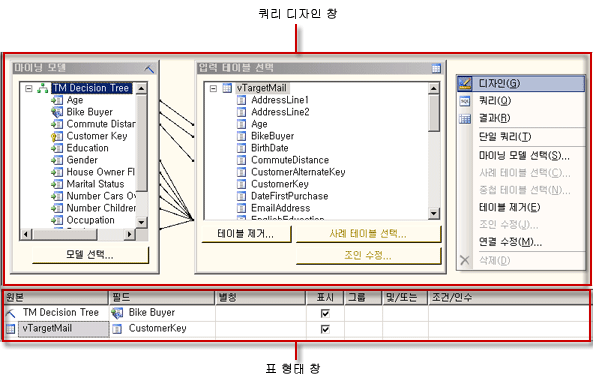
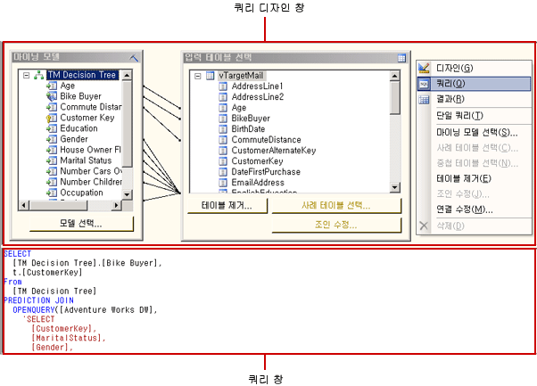
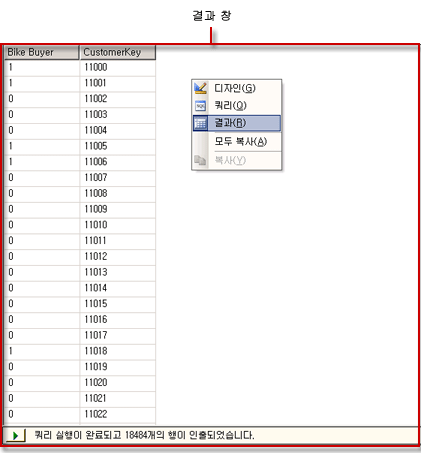

# Analysis Services DMX 쿼리 디자이너 사용자 인터페이스
  [!INCLUDE[ssRSnoversion](../../includes/ssrsnoversion-md.md)][!INCLUDE[ssASnoversion](../../includes/ssasnoversion-md.md)] 데이터 원본에 대한 DMX(Data Mining Expressions) 쿼리 및 MDX(Multidimensional Expressions) 쿼리를 작성하기 위한 그래픽 쿼리 디자이너를 제공합니다. 이 항목에서는 DMX 쿼리 디자이너에 대해 설명합니다. MDX 쿼리 디자이너에 대한 자세한 내용은 [Analysis Services MDX Query Designer User Interface](../../reporting-services/report-data/analysis-services-mdx-query-designer-user-interface.md)를 참조하십시오.  
  
 DMX 그래픽 쿼리 디자이너에는 디자인, 쿼리 및 결과의 3가지 모드가 있습니다. 모드를 전환하려면 쿼리 디자인 창을 마우스 오른쪽 단추로 클릭하고 모드를 선택합니다. 각 모드는 메타데이터 창을 제공하며 이 창에서는 선택한 큐브에서 멤버를 끌어서 보고서 처리 시 데이터 세트의 데이터를 검색하는 DMX 쿼리를 작성할 수 있습니다.  
  
## 그래픽 DMX 쿼리 디자이너 도구 모음  
 쿼리 디자이너 도구 모음은 그래픽 인터페이스를 사용하여 DMX 쿼리를 디자인하는 데 도움이 되는 단추를 제공합니다. 다음 표에서는 단추와 해당 기능을 설명합니다.  
  
|단추|Description|  
|------------|-----------------|  
|**텍스트로 편집**|이 데이터 원본 유형에 대해서는 사용할 수 없습니다.|  
|**가져오기**|파일 시스템의 보고서 정의 파일(.rdl)에서 기존 쿼리를 가져옵니다. 자세한 내용은 [보고서 포함된 데이터 세트 및 공유 데이터 세트&#40;보고서 작성기 및 SSRS&#41;](../../reporting-services/report-data/report-embedded-datasets-and-shared-datasets-report-builder-and-ssrs.md)을 참조하세요.|  
||MDX 쿼리 디자이너 모드로 전환합니다.|  
||DMX 쿼리 디자이너 모드로 전환합니다.|  
||데이터 원본의 메타데이터를 새로 고칩니다.|  
||데이터 창의 선택된 열을 쿼리에서 삭제합니다.|  
||**쿼리 매개 변수** 대화 상자를 표시합니다. 기본값을 변수에 할당할 경우 보고서 디자이너에서 레이아웃 뷰로 전환할 때 해당 보고서 매개 변수가 만들어집니다.|  
||쿼리를 준비합니다.|  
||디자인 모드와 쿼리 모드 사이를 전환합니다. 결과 뷰로 변경하려면 디자인 창을 마우스 오른쪽 단추로 클릭하고 **결과**를 선택합니다.|  
  
## 디자인 모드의 그래픽 DMX 쿼리 디자이너  
 올바른 큐브는 없지만 올바른 마이닝 모델이 있는 [!INCLUDE[ssASnoversion](../../includes/ssasnoversion-md.md)] 데이터 원본을 사용하는 데이터 세트를 편집하는 경우 그래픽 쿼리 디자이너가 디자인 모드에서 열립니다. 다음 그림에서는 디자인 모드에서 표시되는 창을 해당 레이블과 함께 보여 줍니다.  
  
   
  
 다음 표에서는 각 창의 기능을 설명합니다.  
  
|창|함수|  
|----------|--------------|  
|쿼리 디자인 창|**마이닝 모델** 및 **입력 테이블 선택** 대화 상자를 사용하여 DMX 쿼리를 작성할 수 있습니다.|  
|표 형태 창|표의 각 행에 대해 **원본** 드롭다운 목록을 사용하여 함수나 식을 선택하고 DMX 쿼리에서 사용할 필드, 그룹 및 조건이나 인수를 선택합니다. 선택 항목에 따라 생성되는 DMX 쿼리 텍스트를 보려면 도구 모음에서 **디자인 모드** 단추를 클릭합니다.|  
  
 DMX 쿼리를 실행하고 결과 창에 결과를 표시하려면 쿼리 디자인 창을 마우스 오른쪽 단추로 클릭하고 **결과**를 선택합니다.  
  
## 쿼리 모드의 그래픽 DMX 쿼리 디자이너  
 그래픽 쿼리 디자이너를 쿼리 모드로 변경하려면 도구 모음에서 **디자인 모드** 단추를 클릭하거나 쿼리 디자인 화면을 마우스 오른쪽 단추로 클릭하고 바로 가기 메뉴에서 **쿼리** 를 선택합니다. 이 모드를 사용하여 DMX 텍스트를 쿼리 창에 직접 입력할 수 있습니다.  
  
 다음 그림에서는 레이블과 함께 쿼리 모드에 표시되는 창을 보여 줍니다.  
  
   
  
 다음 표에서는 각 창의 기능을 설명합니다.  
  
|창|함수|  
|----------|--------------|  
|쿼리 디자인 창|**마이닝 모델** 및 **입력 테이블 선택** 대화 상자를 사용하여 DMX 쿼리를 작성할 수 있습니다.|  
|쿼리 창|이 창에서 DMX 쿼리 텍스트를 보고 직접 편집할 수 있습니다. **디자인** 모드로 다시 전환하면 DMX 쿼리 텍스트의 변경 내용이 지속되지 않습니다.|  
  
 DMX 쿼리를 실행하고 결과 창에 결과를 표시하려면 쿼리 디자인 창을 마우스 오른쪽 단추로 클릭하고 **결과**를 선택합니다.  
  
## 결과 모드의 그래픽 DMX 쿼리 디자이너  
 결과 모드를 표시하려면 쿼리 디자인 화면을 마우스 오른쪽 단추로 클릭하고 바로 가기 메뉴에서 **결과** 를 선택합니다. 결과 모드로 전환하면 DMX 쿼리가 자동으로 실행됩니다.  
  
 다음 그림에서는 결과 모드의 쿼리 디자이너를 보여 줍니다.  
  
   
  
 디자인 모드나 쿼리 모드로 다시 전환하려면 결과 창을 마우스 오른쪽 단추로 클릭하고 **디자인** 또는 **쿼리**를 선택합니다.  
  
## 참고 항목  
 [Analysis Services용 MDX 쿼리 디자이너에서 매개 변수 정의&#40;보고서 작성기 및 SSRS&#41;](../../reporting-services/report-data/define-parameters-in-the-mdx-query-designer-for-analysis-services.md)   
 [공유 데이터 세트 또는 포함된 데이터 세트 만들기&#40;보고서 작성기 및 SSRS&#41;](../../reporting-services/report-data/create-a-shared-dataset-or-embedded-dataset-report-builder-and-ssrs.md)   
 [DMX용 Analysis Services 연결 형식&#40;SSRS&#41;](../../reporting-services/report-data/analysis-services-connection-type-for-dmx-ssrs.md)   
 [데이터 마이닝 모델에서 데이터 검색&#40;DMX&#41;&#40;SSRS&#41;](../../reporting-services/report-data/retrieve-data-from-a-data-mining-model-dmx-ssrs.md)   
 [RSReportDesigner 구성 파일](../../reporting-services/report-server/rsreportdesigner-configuration-file.md)   
 [MDX용 Analysis Services 연결 형식&#40;SSRS&#41;](../../reporting-services/report-data/analysis-services-connection-type-for-mdx-ssrs.md)   
 [DMX용 Analysis Services 연결 형식&#40;SSRS&#41;](../../reporting-services/report-data/analysis-services-connection-type-for-dmx-ssrs.md)  
  
  
