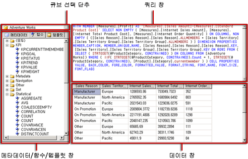

# Analysis Services MDX 쿼리 디자이너 사용자 인터페이스
  [!INCLUDE[ssRSnoversion](../../includes/ssrsnoversion-md.md)] 는 [!INCLUDE[ssASnoversion](../../includes/ssasnoversion-md.md)] 데이터 원본에 대한 MDX(Multidimensional Expression) 쿼리 및 DMX(Data Mining Expression) 쿼리를 작성하기 위한 그래픽 쿼리 디자이너를 제공합니다. 이 항목에서는 MDX 쿼리 디자이너에 대해 설명합니다. DMX 쿼리 디자이너에 대한 자세한 내용은 [DMX용 Analysis Services 연결 형식&#40;SSRS&#41;](../../reporting-services/report-data/analysis-services-connection-type-for-dmx-ssrs.md)을 참조하세요.  
  
 MDX 그래픽 쿼리 디자이너에는 디자인 모드와 쿼리 모드의 두 가지 모드가 있습니다. 각 모드는 메타데이터 창을 제공합니다. 이 창에서는 선택한 큐브에서 멤버를 끌어서 보고서 처리 시에 데이터를 검색하는 MDX 쿼리를 작성할 수 있습니다.  
  
> [!IMPORTANT]  
>  사용자는 쿼리를 작성하고 실행할 때 데이터 원본에 액세스합니다. 데이터 원본에 대해서는 읽기 전용 권한과 같이 최소한의 사용 권한을 부여해야 합니다.  
  
> [!NOTE]  
>  파일에서 .mdx 쿼리를 가져올 수는 없습니다.  
  
## 디자인 모드의 그래픽 MDX 쿼리 디자이너  
 보고서 데이터 집합에 대한 MDX 쿼리를 편집할 경우 그래픽 MDX 쿼리 디자이너가 디자인 모드에서 열립니다.  
  
 다음 그림에서는 디자인 모드에서 표시되는 창을 해당 레이블과 함께 보여 줍니다.  
  
   
  
 다음 표에서는 이 모드의 창을 나열합니다.  
  
|창|함수|  
|----------|--------------|  
|큐브 선택 단추(**...**)|현재 선택한 큐브를 표시합니다.|  
|메타데이터 창|선택한 큐브에 정의된 측정값, KPI(핵심 성과 지표) 및 차원의 계층 목록을 표시합니다.|  
|계산 멤버 창|쿼리에 사용할 수 있는 현재 정의된 계산 멤버를 표시합니다.|  
|필터 창|원본의 데이터를 필터링하고 보고서에 반환되는 데이터를 제한하기 위해 차원과 관련 계층을 선택하려면 사용합니다.|  
|데이터 창|메타데이터 창 및 계산 멤버 창에서 항목을 끌 때 결과 집합에 대한 열 머리글을 표시합니다. **자동 실행** 단추가 선택된 경우 결과 집합을 자동으로 업데이트합니다. 을 참조하세요.|  
  
 메타데이터 창의 차원, 측정값 및 KPI와 계산 멤버 창의 계산 멤버를 데이터 창으로 끌 수 있습니다. 필터 창에서 차원 및 관련 계층을 선택하고 필터 식을 설정하여 쿼리에 사용할 수 있는 데이터를 제한할 수 있습니다. 경우는 **자동** () 토글 단추를 도구 모음을 선택 하면 쿼리 디자이너를 데이터 창으로 메타 데이터 개체를 삭제 될 때마다 쿼리를 실행 합니다. 사용 하 여 쿼리를 수동으로 실행할 수 있습니다는 **실행** () 도구 모음 단추입니다.  
  
 이 모드에서 MDX 쿼리를 만들면 다음 추가 속성이 자동으로 쿼리에 포함됩니다.  
  
 **멤버 속성** MEMBER_CAPTION, MEMBER_UNIQUE_NAME  
  
 **셀 속성** VALUE, BACK_COLOR, FORE_COLOR, FORMATTED_VALUE, FORMAT_STRING, FONT_NAME, FONT_SIZE, FONT_FLAGS  
  
 사용자 고유의 추가 속성을 지정하려면 쿼리 모드에서 MDX 쿼리를 직접 편집해야 합니다.  
  
### 디자인 모드의 그래픽 MDX 쿼리 디자이너 도구 모음  
 쿼리 디자이너 도구 모음은 그래픽 인터페이스를 사용하여 MDX 쿼리를 디자인하는 데 도움이 되는 단추를 제공합니다. 다음 표에서는 단추와 해당 기능을 나열합니다.  
  
|단추|Description|  
|------------|-----------------|  
|**텍스트로 편집**|이 데이터 원본 유형에 대해서는 사용할 수 없습니다.|  
|**가져오기**|파일 시스템의 보고서 정의 파일(.rdl)에서 기존 쿼리를 가져옵니다. 자세한 내용은 [보고서 포함된 데이터 집합 및 공유 데이터 집합&#40;보고서 작성기 및 SSRS&#41;](../../reporting-services/report-data/report-embedded-datasets-and-shared-datasets-report-builder-and-ssrs.md)을 참조하세요.|  
||MDX 명령 유형으로 전환합니다.|  
||DMX 명령 유형으로 전환합니다.|  
||데이터 원본의 메타데이터를 새로 고칩니다.|  
||**계산 멤버 작성기** 대화 상자를 표시합니다.|  
||데이터 창에서 빈 셀을 표시하거나 표시하지 않는 기능 사이를 전환합니다. 이것은 MDX에 NON EMPTY 절을 사용하는 것과 동일합니다.|  
||변경이 수행될 때마다 쿼리를 자동으로 실행하고 결과를 표시합니다. 결과는 데이터 창에 표시됩니다.|  
||데이터 창에서 집계를 표시합니다.|  
||데이터 창의 선택된 열을 쿼리에서 삭제합니다.|  
||**쿼리 매개 변수** 대화 상자를 표시합니다. 쿼리 매개 변수의 값을 지정하면 같은 이름의 보고서 매개 변수가 자동으로 만들어집니다. 쿼리 매개 변수의 값은 보고서 매개 변수를 참조하는 식으로 설정됩니다.|  
||쿼리를 준비합니다.|  
||쿼리를 실행하고 데이터 창에 결과를 표시합니다.|  
||쿼리를 취소합니다.|  
||디자인 모드와 쿼리 모드 사이를 전환합니다.|  
  
## 쿼리 모드의 그래픽 MDX 쿼리 디자이너  
 그래픽 쿼리 디자이너를 **쿼리** 모드로 변경하려면 도구 모음에서 **디자인 모드** 단추를 클릭합니다.  
  
 다음 그림에서는 레이블과 함께 쿼리 모드에 표시되는 창을 보여 줍니다.  
  
   
  
 다음 표에서는 이 모드의 창을 나열합니다.  
  
|창|함수|  
|----------|--------------|  
|큐브 선택 단추(**...**)|현재 선택한 큐브를 표시합니다.|  
|메타데이터/함수/템플릿 창|선택한 큐브에 정의된 측정값, KPI 및 차원의 계층 목록을 표시합니다.|  
|쿼리 창|쿼리 텍스트를 표시합니다.|  
|결과 창|쿼리의 실행 결과를 표시합니다.|  
  
 메타데이터 창에는 **메타데이터**, **함수**및 **템플릿**탭이 표시됩니다. **메타데이터** 탭에서는 차원, 계층, KPI 및 측정값을 MDX 쿼리 창으로 끌 수 있습니다. **함수** 탭에서는 함수를 MDX 쿼리 창으로 끌 수 있습니다. **템플릿** 탭에서는 MDX 템플릿을 MDX 쿼리 창에 추가할 수 있습니다. 쿼리를 실행하면 현재 MDX 쿼리의 결과가 결과 창에 표시됩니다.  
  
 디자인 모드에서 생성된 기본 MDX 쿼리를 확장하여 추가 멤버 속성 및 셀 속성을 포함할 수 있습니다. 쿼리를 실행할 때 이러한 값은 결과 집합에 나타나지 않습니다. 그러나 이러한 값은 [!INCLUDE[ssRSnoversion](../../includes/ssrsnoversion-md.md)] 에 다시 전달되므로 보고서에 해당 값을 사용할 수 있습니다. 자세한 내용은 [Analysis Services 데이터베이스에 대한 확장 필드 속성&#40;SSRS&#41;](../../reporting-services/report-data/extended-field-properties-for-an-analysis-services-database-ssrs.md)을 참조하세요.  
  
### 쿼리 모드의 그래픽 쿼리 디자이너 도구 모음  
 쿼리 디자이너 도구 모음은 그래픽 인터페이스를 사용하여 MDX 쿼리를 디자인하는 데 도움이 되는 단추를 제공합니다.  
  
 디자인 모드와 쿼리 모드의 도구 모음 단추가 동일하지만 쿼리 모드의 경우 다음 단추를 사용할 수 없습니다.  
  
-   **텍스트로 편집**  
  
-   **계산 멤버 추가** ()  
  
-   **빈 셀 표시** ()  
  
-   **자동 실행** ()  
  
-   **집계 표시** ()  
  
## 관련 항목:  
 [Analysis Services &#40;에 대 한 MDX 쿼리 디자이너에서 매개 변수 정의 보고서 작성기 및 SSRS &#41;](../../reporting-services/report-data/define-parameters-in-the-mdx-query-designer-for-analysis-services.md)   
 [공유 데이터 집합 또는 포함 된 데이터 집합 &#40; 만들기 보고서 작성기 및 SSRS &#41;](../../reporting-services/report-data/create-a-shared-dataset-or-embedded-dataset-report-builder-and-ssrs.md)   
 [DMX &#40; analysis Services 연결 유형 Ssrs&#41;](../../reporting-services/report-data/analysis-services-connection-type-for-dmx-ssrs.md)   
 [RSReportDesigner 구성 파일](../../reporting-services/report-server/rsreportdesigner-configuration-file.md)   
 [MDX &#40; analysis Services 연결 유형 Ssrs&#41;](../../reporting-services/report-data/analysis-services-connection-type-for-mdx-ssrs.md)  
  
  

