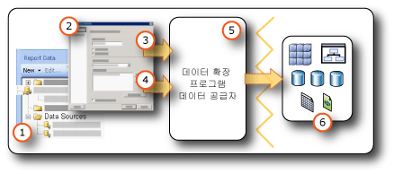

# <a name="data-connections-data-sources-and-connection-strings-report-builder-and-ssrs"></a>데이터 연결, 데이터 원본 및 연결 문자열(보고서 작성기 및 SSRS)

[!INCLUDE [ssrs-appliesto](../../includes/ssrs-appliesto.md)] [!INCLUDE [ssrs-appliesto-2016-and-later](../../includes/ssrs-appliesto-2016-and-later.md)] [!INCLUDE[ssrs-appliesto-pbirsi](../../includes/ssrs-appliesto-pbirs.md)] [!INCLUDE[ssrs-appliesto-sharepoint-2013-2016i](../../includes/ssrs-appliesto-sharepoint-2013-2016.md)]

[!INCLUDE [ssrs-previous-versions](../../includes/ssrs-previous-versions.md)]

  [!INCLUDE[ssRBnoversion](../../includes/ssrbnoversion.md)] 및  [!INCLUDE[ssRSnoversion](../../includes/ssrsnoversion-md.md)] 페이지가 매겨진 보고서에 데이터를 포함하려면 먼저 *데이터 원본* 및 *데이터 집합*을 만들어야 합니다. 이 항목에서는 데이터 원본의 유형, 데이터 원본을 만드는 방법 및 데이터 원본 자격 증명과 관련된 중요 정보를 설명합니다. 데이터 원본에는 데이터 원본 유형, 연결 정보 및 사용할 자격 증명의 유형이 포함됩니다. 데이터 원본에는 포함된 데이터 원본과 공유 데이터 원본의 두 가지 유형이 있습니다. 포함된 데이터 원본은 보고서에서 정의되고 해당 보고서에서만 사용됩니다. 공유 데이터 원본은 보고서와 독립적으로 정의되며 여러 보고서에서 사용될 수 있습니다. 자세한 내용은 [포함된 데이터 집합 및 공유 데이터 집합&#40;보고서 작성기 및 SSRS&#41;](../../reporting-services/report-data/embedded-and-shared-datasets-report-builder-and-ssrs.md)을 참조하세요.  

## <a name="data-in-includessrbnoversionincludesssrbnoversionmd"></a>다음의 데이터 [!INCLUDE[ssRBnoversion](../../includes/ssrbnoversion.md)]  
   
  
1.  **보고서 데이터 창의 데이터 원본** 포함된 데이터 원본을 만들거나 공유 데이터 원본을 추가하면 데이터 원본이 보고서 데이터 창에 표시됩니다.  
  
2.  **연결 대화 상자** 연결 대화 상자를 사용하여 연결 문자열을 작성하거나 붙여 넣습니다.  
  
3.  **데이터 연결 정보** 연결 문자열은 데이터 확장 프로그램에 전달됩니다.  
  
4.  **자격 증명** 자격 증명은 연결 문자열과 별도로 관리됩니다.  
  
5.  **데이터 확장 프로그램/데이터 공급자** 여러 데이터 액세스 계층을 통해 데이터에 연결할 수 있습니다.  
  
6.  **외부 데이터 원본** 관계형 데이터베이스,  다차원 데이터베이스,  SharePoint  목록,  웹 서비스 또는 보고서 모델에서 데이터를 검색합니다.  

##  <a name="bkmk_data_sources"></a> 포함된 데이터 원본 또는 공유 데이터 원본  
 공유 데이터 원본은 자주 사용하는 데이터 원본이 있는 경우에 유용합니다. 가능한 한 공유 데이터 원본을 사용하는 것이 좋습니다. 공유 데이터 원본을 사용하면 보고서 및 보고서 액세스 관리가 더 쉬울 뿐만 아니라 보고서 및 보고서에서 액세스하는 데이터 원본을 보다 안전하게 유지할 수 있습니다. 공유 데이터 원본이 필요한 경우에는 공유 데이터 원본을 만들어 주도록 시스템 관리자에게 요청하세요.  
  
 포함된 데이터 원본은 보고서 정의에 저장되는 데이터 연결입니다. 포함된 데이터 원본 연결 정보는 해당 정보가 포함된 보고서에서만 사용될 수 있습니다. 포함된 데이터 원본을 정의하고 관리하려면 보고서의 **데이터 원본 속성** 대화 상자를 사용합니다.  
  
 포함된 데이터 원본과 공유 데이터 원본은 작성,  저장 및 관리되는 방법이 다릅니다.  
  
-   보고서 디자이너에서 [!INCLUDE[ssBIDevStudioFull](../../includes/ssbidevstudiofull-md.md)] 프로젝트의 일부분으로 포함된 데이터 원본 또는 공유 데이터 원본을 만듭니다. 이러한 데이터 원본을 미리 보기용으로 로컬에서 사용할지 아니면 프로젝트의 일부분으로 보고서 서버 또는 SharePoint 사이트에 배포할지를 제어할 수 있습니다. 보고서를 배포하는 보고서 서버 또는 SharePoint 사이트와 사용 중인 컴퓨터에 설치한 사용자 지정 데이터 확장 프로그램을 사용할 수 있습니다.  
  
     시스템 관리자는 추가적인 데이터 처리 확장 프로그램 및 .NET Framework 데이터 공급자를 설치하고 구성할 수 있습니다. 자세한 내용은 [데이터 처리 확장 프로그램과 .NET Framework 데이터 공급자&#40;SSRS&#41;](../../reporting-services/report-data/data-processing-extensions-and-net-framework-data-providers-ssrs.md)를 참조하세요.  
  
     개발자는 <xref:Microsoft.ReportingServices.DataProcessing> API를 사용하여 다른 유형의 데이터 원본을 지원하는 데이터 처리 확장을 만들 수 있습니다.  
  
-   [!INCLUDE[ssRBnoversion](../../includes/ssrbnoversion.md)]에서 보고서 서버 또는 SharePoint 사이트를 찾은 다음 보고서에서 포함된 데이터 원본을 만들거나 공유 데이터 원본을 선택합니다. [!INCLUDE[ssRBnoversion](../../includes/ssrbnoversion.md)]에서는 공유 데이터 원본을 만들 수 없습니다. 또한 [!INCLUDE[ssRBnoversion](../../includes/ssrbnoversion.md)]에서는 사용자 지정 데이터 확장 프로그램을 사용할 수 없습니다.  
  
 다음 표에는 포함된 데이터 원본과 공유 데이터 원본의 차이점이 요약되어 있습니다.  
  
|설명|포함된<br /><br /> 데이터 원본|Shared<br /><br /> 데이터 원본|  
|-----------------|------------------------------|----------------------------|  
|데이터 연결이 보고서 정의에 포함되어 있습니다.|||  
|보고서 서버의 데이터 연결에 대한 포인터가 보고서 정의에 포함되어 있습니다.|||  
|보고서 서버에서 관리됩니다.|||  
|공유 데이터 집합에 필요합니다.|||  
|구성 요소에 필요합니다.|||  
  
##  <a name="bkmk_DataConnections"></a> 기본 제공 데이터 확장  
 [!INCLUDE[ssRSnoversion](../../includes/ssrsnoversion-md.md)] 의 기본 데이터 확장에는 다음과 같은 데이터 연결 형식이 포함됩니다.  
  
-   Microsoft SQL Server 및 Microsoft Azure SQL Database
  
-   Microsoft SQL Server Analysis Services  
  
-   Microsoft SharePoint 목록  
  
-   [!INCLUDE[ssSDSFull](../../includes/sssdsfull-md.md)]  
  
-   Microsoft SQL Server 병렬 데이터 웨어하우스  
  
-   OLE DB  
  
-   Oracle  
  
-   SAP NetWeaver BI  
  
-   Hyperion Essbase  
  
-   Teradata  
  
-   XML  
  
-   ODBC  
  
-   파워 뷰용 Microsoft BI 의미 체계 모델: [!INCLUDE[ssGemini](../../includes/ssgemini-md.md)] 갤러리 및 [!INCLUDE[ssCrescent](../../includes/sscrescent-md.md)]용으로 구성된 SharePoint 사이트에서는 이 데이터 원본 유형을 사용할 수 있습니다. 이 데이터 원본 유형은 [!INCLUDE[ssCrescent](../../includes/sscrescent-md.md)] 프레젠테이션에 대해서만 사용됩니다. 자세한 내용은 [파워 뷰용의 완벽한 표 형식 BI 의미 체계 모델 구성](http://technet.microsoft.com/video/building-the-perfect-bi-semantic-tabular-models-for-power-view.aspx)(영문)을 참조하세요.  
  
 [!INCLUDE[ssRSnoversion](../../includes/ssrsnoversion-md.md)]에서 지원하는 데이터 원본 및 버전의 전체 목록은 [Reporting Services&#40;SSRS&#41;에서 지원하는 데이터 원본](../../reporting-services/report-data/data-sources-supported-by-reporting-services-ssrs.md)을 참조하세요.  
  
##  <a name="bkmk_connection_examples"></a> 자주 사용하는 연결 문자열 예  
 연결 문자열은 데이터 공급자에 대한 연결 속성의 텍스트 표현입니다. 다음 표에서는 다양한 데이터 연결 형식에 대한 연결 문자열의 예를 보여 줍니다.  
 
 > [!NOTE]  
>  [Connectionstrings.com](http://www.connectionstrings.com/) 은 연결 문자열에 대한 예제를 가져올 수 있는 다른 리소스입니다. 
  
|**Data source**|**예제**|**설명**|  
|---------------------|-----------------|---------------------|  
|로컬 서버의 SQL Server 데이터베이스|`data source="(local)";initial catalog=AdventureWorks`|데이터 원본 유형을 **Microsoft SQL Server**로 설정합니다. 자세한 내용은 [SQL Server 연결 형식&#40;SSRS&#41;](../../reporting-services/report-data/sql-server-connection-type-ssrs.md)을 참조하세요.|  
|SQL Server 인스턴스<br /><br /> database|`Data Source=localhost\MSSQL13.<InstanceName>; Initial Catalog=AdventureWorks`|데이터 원본 유형을 **Microsoft SQL Server**로 설정합니다.|  
|SQL Server Express 데이터베이스|`Data Source=localhost\MSSQL13.SQLEXPRESS; Initial Catalog=AdventureWorks`|데이터 원본 유형을 **Microsoft SQL Server**로 설정합니다.|  
|Azure SQL 데이터베이스|`Data Source=<host>;Initial Catalog=AdventureWorks; Encrypt=True`|데이터 원본 유형을 **Microsoft Azure SQL Database**로 설정합니다. 자세한 내용은 [SQL Azure 연결 형식&#40;SSRS&#41;](../../reporting-services/report-data/sql-azure-connection-type-ssrs.md)을 참조하세요.|  
|SQL Server 병렬 데이터 웨어하우스|`HOST=<IP address>;database= AdventureWorks; port=<port>`|데이터 원본 유형을 **Microsoft SQL Server Parallel Data Warehouse**로 설정합니다. 자세한 내용은 [SQL Server 병렬 데이터 웨어하우스 연결 형식&#40;SSRS&#41;](../../reporting-services/report-data/sql-server-parallel-data-warehouse-connection-type-ssrs.md)을 참조하세요.|  
|로컬 서버의 Analysis Services 데이터베이스|`data source=localhost;initial catalog=Adventure Works DW`|데이터 원본 유형을 **Microsoft SQL Server Analysis Services**로 설정합니다. 자세한 내용은 [MDX용 Analysis Services 연결 형식&#40;SSRS&#41;](../../reporting-services/report-data/analysis-services-connection-type-for-mdx-ssrs.md) 또는 [DMX용 Analysis Services 연결 형식&#40;SSRS&#41;](../../reporting-services/report-data/analysis-services-connection-type-for-dmx-ssrs.md)을 참조하세요.|  
|Sales 큐브 뷰가 있는 Analysis Services 테이블 형식 model 데이터베이스|`Data source=<servername>;initial catalog= Adventure Works DW;cube='Sales’`|데이터 원본 유형을 **Microsoft SQL Server Analysis Services**로 설정합니다. cube= 설정에 큐브 뷰 이름을 지정합니다. 자세한 내용은 [큐브 뷰&#40;SSAS 테이블 형식&#41;](../../analysis-services/tabular-models/perspectives-ssas-tabular.md)를 참조하세요.|  
|기본 모드에서 구성된 보고서 서버의 보고서 모델 데이터 원본|`Server=http://myreportservername/reportserver; datasource=/models/Adventure Works`|보고서 서버 또는 문서 라이브러리 URL과 보고서 서버 폴더 또는 문서 라이브러리 폴더 네임스페이스에 게시된 모델의 경로를 지정합니다. 자세한 내용은 [보고서 모델 연결&#40;SSRS&#41;](../../reporting-services/report-data/report-model-connection-ssrs.md)을 참조하세요.|  
|SharePoint 통합 모드에서 구성된 보고서 서버의 보고서 모델 데이터 원본|`Server=http://server; datasource=http://server/site/documents/models/Adventure Works.smdl`|보고서 서버 또는 문서 라이브러리 URL과 보고서 서버 폴더 또는 문서 라이브러리 폴더 네임스페이스에 게시된 모델의 경로를 지정합니다.|  
|[!INCLUDE[ssNoVersion](../../includes/ssnoversion-md.md)] 2000 [!INCLUDE[ssASnoversion](../../includes/ssasnoversion-md.md)] 서버|`provider=MSOLAP.2;data source=<remote server name>;initial catalog=FoodMart 2000`|데이터 원본 유형으로 **OLE DB Provider for OLAP Services 8.0**을 설정합니다.<br /><br /> [!INCLUDE[ssNoVersion](../../includes/ssnoversion-md.md)] ConnectTo [!INCLUDE[ssASnoversion](../../includes/ssasnoversion-md.md)] 속성을 **8.0** 으로 설정하면 **2000**데이터 원본에 보다 빠르게 연결할 수 있습니다. 이 속성을 설정하려면 **연결 속성** 대화 상자의 **고급 속성** 탭을 사용합니다.|  
|Oracle 서버|`data source=myserver`|데이터 원본 유형을 **Oracle**로 설정합니다. Oracle 클라이언트 도구는 보고서 디자이너 컴퓨터와 보고서 서버에 설치해야 합니다. 자세한 내용은 [Oracle 연결 형식&#40;SSRS&#41;](../../reporting-services/report-data/oracle-connection-type-ssrs.md)을 참조하세요.|  
|SAP NetWeaver BI 데이터 원본|`DataSource=http://mySAPNetWeaverBIServer:8000/sap/bw/xml/soap/xmla`|데이터 원본 유형을 **SAP NetWeaver BI**로 설정합니다. 자세한 내용은 [SAP NetWeaver BI 연결 형식&#40;SSRS&#41;](../../reporting-services/report-data/sap-netweaver-bi-connection-type-ssrs.md)을 참조하세요.|  
|Hyperion Essbase 데이터 원본|`Data Source=http://localhost:13080/aps/XMLA; Initial Catalog=Sample`|데이터 원본 유형을 **Hyperion Essbase**로 설정합니다. 자세한 내용은 [Hyperion Essbase 연결 형식&#40;SSRS&#41;](../../reporting-services/report-data/hyperion-essbase-connection-type-ssrs.md)을 참조하세요.|  
|Teradata 데이터 원본|`data source=`\<NNN>.\<NNN>.\<NNN>.\<NNN>`;`|데이터 원본 유형을 **Teradata**로 설정합니다. 연결 문자열은 1자리부터 3자리 숫자까지 허용되는 필드 네 개로 구성된 형식의 IP(인터넷 프로토콜) 주소입니다. 자세한 내용은 [Teradata 연결 형식&#40;SSRS&#41;](../../reporting-services/report-data/teradata-connection-type-ssrs.md)을 참조하세요.|  
|Teradata 데이터 원본|`Database=` *\<데이터베이스 이름>* `; data source=` *\<NN*N *>.\<NNN>.\<NNN>.\<N*NN*>*`;Use X Views=False;Restrict to Default Database=True`|앞의 예와 마찬가지로 데이터 원본 유형을 **Teradata**로 설정합니다. Database 태그에 지정된 기본 데이터베이스만 사용하고 데이터 관계를 자동으로 검색하지 마십시오.|  
|XML 데이터 원본, 웹 서비스|`data source=http://adventure-works.com/results.aspx`|데이터 원본 유형을 **XML**로 설정합니다. 연결 문자열은 WSDL(Web Services Definition Language)을 지원하는 웹 서비스의 URL입니다. 자세한 내용은 [XML 연결 형식&#40;SSRS&#41;](../../reporting-services/report-data/xml-connection-type-ssrs.md)을 참조하세요.|  
|XML 데이터 원본, XML 문서|`http://localhost/XML/Customers.xml`|데이터 원본 유형을 **XML**로 설정합니다. 연결 문자열은 XML 문서의 URL입니다.|  
|XML 데이터 원본, 포함된 XML 문서|*비어 있음*|데이터 원본 유형을 **XML**로 설정합니다. XML 데이터는 보고서 정의에 포함됩니다.|  
|SharePoint 목록|`data source=http://MySharePointWeb/MySharePointSite/`|데이터 원본 유형을 **SharePoint List**로 설정합니다.|  
  
 **localhost**를 사용하여 보고서 서버에 연결하지 못하는 경우 TCP/IP 프로토콜에 대한 네트워크 프로토콜이 설정되어 있는지 확인합니다. 자세한 내용은 [Configure Client Protocols](../../database-engine/configure-windows/configure-client-protocols.md)을 참조하세요.  
  
 각각의 데이터 원본 유형에 연결하는 데 필요한 구성에 대한 자세한 내용은 [외부 데이터 원본의 데이터 추가&#40;SSRS&#41;](../../reporting-services/report-data/add-data-from-external-data-sources-ssrs.md) 또는 [Reporting Services&#40;SSRS&#41;에서 지원하는 데이터 원본](../../reporting-services/report-data/data-sources-supported-by-reporting-services-ssrs.md)의 해당 데이터 연결 항목을 참조하세요.  
  
##  <a name="bkmk_special_password_characters"></a> 암호의 특수 문자  
 암호를 입력하라는 메시지를 표시하거나 연결 문자열에 암호를 포함하도록 ODBC 또는 SQL 데이터 원본을 구성한 경우 사용자가 문장 부호와 같은 특수 문자가 포함된 암호를 입력하면 일부 기본 데이터 원본 드라이버가 해당 특수 문자의 유효성을 검사할 수 없습니다. 보고서 처리 시 "올바른 암호가 아닙니다" 메시지가 나타나면 이 문제 때문일 수 있습니다. 암호를 변경하는 것이 불가능한 경우 데이터베이스 관리자와 협력하여 서버에서 해당 자격 증명을 시스템 ODBC DSN(데이터 원본 이름)의 일부로 저장합니다. 자세한 내용은 [!INCLUDE[dnprdnshort](../../includes/dnprdnshort-md.md)] SDK 설명서의 "OdbcConnection.ConnectionString"을 참조하세요.  
  
##  <a name="bkmk_Expressions_in_connection_strings"></a> 식 기반 연결 문자열  
 식 기반 연결 문자열은 런타임에 평가됩니다. 예를 들어 데이터 원본을 매개 변수로 지정하고 연결 문자열에 매개 변수 참조를 포함하여 사용자가 보고서의 데이터 원본을 선택할 수 있도록 할 수 있습니다. 예를 들어 여러 국가에 데이터 서버를 보유하고 있는 다국적 기업의 경우 식 기반 연결 문자열을 사용하면 판매 보고서를 실행하는 사용자가 보고서를 실행하기 전에 특정 국가의 데이터 원본을 선택할 수 있습니다.  
  
 다음 예에서는 [!INCLUDE[ssNoVersion](../../includes/ssnoversion-md.md)] 연결 문자열에 데이터 원본 식을 사용하는 작업을 보여 줍니다. 이 예에서는 `ServerName`이라는 보고서 매개 변수를 만들었다고 가정합니다.  
  
```  
="data source=" & Parameters!ServerName.Value & ";initial catalog=AdventureWorks"  
```  
  
 데이터 원본 식은 런타임에 또는 보고서를 미리 볼 때 처리됩니다. 식은 [!INCLUDE[vbprvb](../../includes/vbprvb-md.md)]으로 작성해야 합니다. 다음 지침에 따라 데이터 원본 식을 정의합니다.  
  
-   정적 연결 문자열을 사용하여 보고서를 디자인합니다. 정적 연결 문자열이란 식을 통해 설정되지 않은 연결 문자열을 말합니다. 예를 들어 보고서별 데이터 원본 또는 공유 데이터 원본을 만드는 단계를 따르는 경우 정적 연결 문자열을 정의하게 됩니다. 정적 연결 문자열을 사용하면 보고서를 만드는 데 필요한 쿼리 결과를 가져올 수 있도록 보고서 디자이너의 데이터 원본에 연결할 수 있습니다.  
  
-   데이터 원본 연결을 정의할 때는 공유 데이터 원본을 사용하지 마세요. 공유 데이터 원본에서는 데이터 원본 식을 사용할 수 없습니다. 보고서에 대한 포함된 데이터 원본을 정의해야 합니다.  
  
-   연결 문자열과 별도로 자격 증명을 지정합니다. 저장된 자격 증명, 입력 정보를 요청하는 자격 증명 또는 통합 보안을 사용할 수 있습니다.  
  
-   보고서 매개 변수를 추가하여 데이터 원본을 지정합니다. 매개 변수 값으로는 사용 가능한 값(이 경우 사용 가능한 값은 보고서에 사용할 수 있는 데이터 원본이어야 함)의 정적 목록을 제공하거나 런타임에 데이터 원본 목록을 검색하는 쿼리를 정의할 수 있습니다.  
  
-   데이터 원본 목록에서 동일한 데이터베이스 스키마를 공유하는지 확인합니다. 모든 보고서 디자인은 스키마 정보로 시작됩니다. 보고서 정의에 사용되는 스키마와 런타임 시 보고서에 사용되는 실제 스키마가 일치하지 않으면 보고서가 실행되지 않을 수 있습니다.  
  
-   보고서를 게시하기 전에 정적 연결 문자열을 식으로 바꿉니다. 이때 정적 연결 문자열은 보고서 디자인을 완료한 다음에 식으로 바꿔야 합니다. 식을 사용한 다음에는 보고서 디자이너에서 쿼리를 실행할 수 없습니다. 또한 보고서 데이터 창의 필드 목록과 매개 변수 목록이 자동으로 업데이트되지 않습니다.  

## <a name="next-steps"></a>다음 단계

[공유 데이터 원본 만들기, 수정 및 삭제](../../reporting-services/report-data/create-modify-and-delete-shared-data-sources-ssrs.md)   
[포함된 데이터 원본 만들기 및 수정](../../reporting-services/report-data/create-and-modify-embedded-data-sources.md)   
[배포 속성 설정](../../reporting-services/tools/set-deployment-properties-reporting-services.md)   
[보고서 데이터 원본에 대한 자격 증명 및 연결 정보 지정](../../reporting-services/report-data/specify-credential-and-connection-information-for-report-data-sources.md)  

추가 질문이 있으신가요? [Reporting Services 포럼에서 질문하기](http://go.microsoft.com/fwlink/?LinkId=620231)
