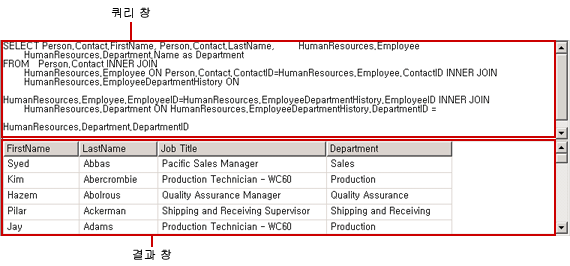
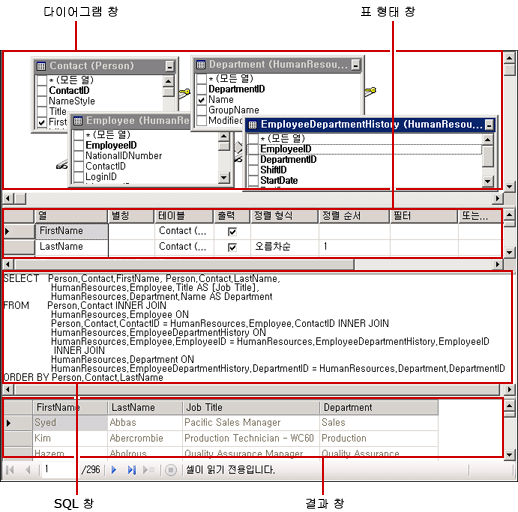
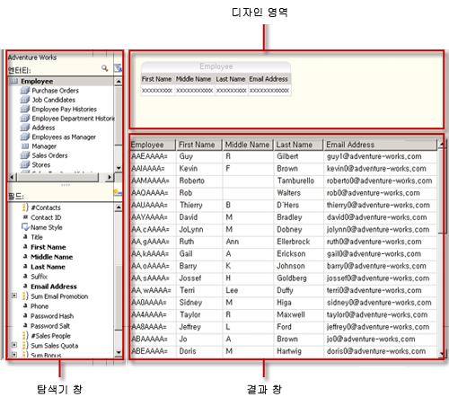
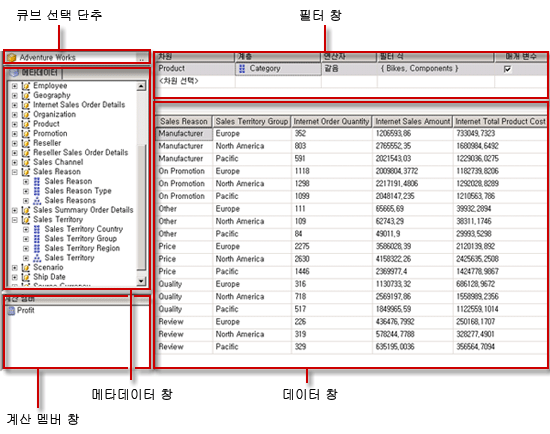
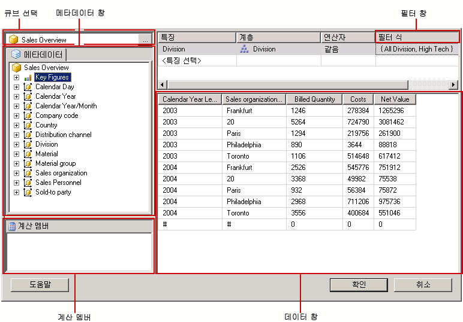
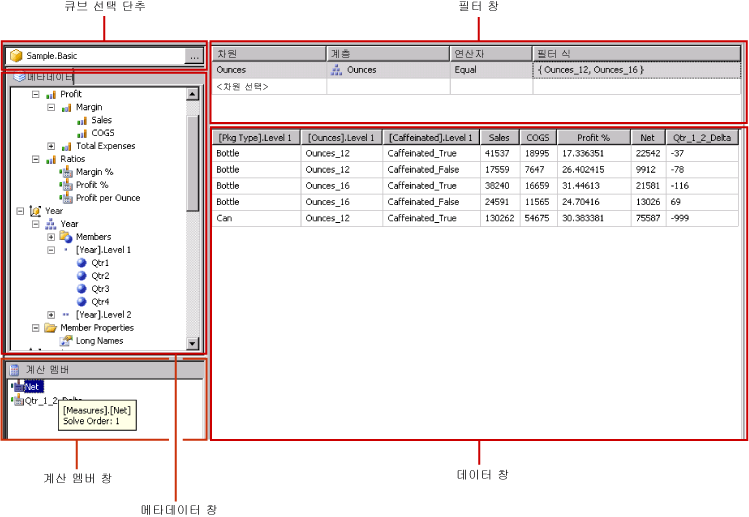

# 쿼리 디자인 도구(SSRS)
  [!INCLUDE[ssRSnoversion](../../includes/ssrsnoversion-md.md)]에서는 보고서 디자이너에서 데이터 세트 쿼리를 만드는 데 사용할 수 있는 다양한 쿼리 디자인 도구를 제공합니다. 일부 쿼리 디자이너에서는 비주얼 모드로 작업할지 쿼리 언어로 직접 작업할지 선택할 수 있도록 대체 모드를 제공합니다. 이 항목에서는 각 도구를 소개하고 각 도구가 지원하는 데이터 원본 유형에 대해 설명합니다. 이 항목에서 설명하는 도구는 다음과 같습니다.  
  
-   [텍스트 기반 쿼리 디자이너](#Textbased)  
  
-   [그래픽 쿼리 디자이너](#Graphical)  
  
-   [보고서 모델 쿼리 디자이너](#Model)  
  
-   [MDX 쿼리 디자이너](#MDX)  
  
-   [DMX 쿼리 디자이너](#DMX)  
  
-   [SapNetWeaver BI 쿼리 디자이너](#SAPBW)  
  
-   [Hyperion Essbase 쿼리 디자이너](#Hyperion)  
  
 모든 쿼리 디자인 도구는 사용자가 보고서 서버 프로젝트 템플릿이나 보고서 서버 마법사 프로젝트 템플릿으로 작업할 경우 [!INCLUDE[ssBIDevStudioFull](../../includes/ssbidevstudiofull-md.md)] 의 데이터 디자인 환경에서 실행됩니다. 쿼리 디자이너 작업에 대한 자세한 내용은 [Reporting Services Query Designers](https://msdn.microsoft.com/library/07efd3f1-804f-45f7-b62a-3e727a3d9835)를 참조하십시오.  
  
 작업하는 데이터 원본의 유형에 따라 특정 쿼리 디자이너를 사용할 수 있는지 여부가 결정됩니다.  
  
 보고서에 사용할 수 있는 데이터 원본 유형은 클라이언트 또는 보고서 서버에 설치된 [!INCLUDE[ssRSnoversion](../../includes/ssrsnoversion-md.md)] 데이터 확장 프로그램에 따라 다릅니다. 자세한 내용은 [RSReportDesigner 구성 파일](../../reporting-services/report-server/rsreportdesigner-configuration-file.md) 및 [RsReportServer.config 구성 파일](../../reporting-services/report-server/rsreportserver-config-configuration-file.md)을 참조하세요.  
  
 데이터 처리 확장 프로그램 및 연결된 쿼리 디자이너는 데이터 원본에 대한 지원이 다음과 같이 서로 다를 수 있습니다.  
  
-   **쿼리 디자이너 유형별.** 예를 들어 [!INCLUDE[ssNoVersion](../../includes/ssnoversion-md.md)] 데이터 원본은 그래픽 기반 쿼리 디자이너와 텍스트 기반 쿼리 디자이너를 모두 지원합니다.  
  
-   **쿼리 언어 변형별.** 예를 들어 [!INCLUDE[tsql](../../includes/tsql-md.md)] 과 같은 쿼리 언어는 데이터 원본 유형에 따라 구문이 달라질 수 있습니다. [!INCLUDE[msCoName](../../includes/msconame-md.md)] [!INCLUDE[tsql](../../includes/tsql-md.md)] 언어 및 Oracle SQL 언어의 경우 쿼리 명령에 대해 구문이 약간 달라질 수 있습니다.  
  
-   **데이터베이스 개체 이름의 스키마 부분 지원별.** 데이터 원본에서 스키마를 데이터베이스 개체 식별자의 일부로 사용하는 경우 기본 스키마를 사용하지 않는 모든 이름에 대해 스키마 이름을 쿼리의 일부로 제공해야 합니다. `SELECT FirstName, LastName FROM [Person].[Person]`)을 입력합니다.  
  
-   **쿼리 매개 변수 지원별.** 데이터 공급자에 따라 매개 변수 지원이 다릅니다. 일부 데이터 공급자는 명명된 매개 변수(예: `SELECT Col1, Col2 FROM Table WHERE <parameter identifier><parameter name> = <value>`)를 지원합니다. 다른 데이터 공급자는 명명되지 않은 매개 변수(예: `SELECT Col1, Col2 FROM Table WHERE <column name> = ?`)를 지원합니다. 데이터 공급자에 따라 매개 변수 식별자가 달라질 수 있습니다. 예를 들어 [!INCLUDE[ssNoVersion](../../includes/ssnoversion-md.md)] 는 @ 기호를 사용하고 Oracle은 콜론(:)을 사용합니다. 매개 변수를 지원하지 않는 데이터 공급자도 있습니다.  
  
-   **쿼리 가져오기 기능별.** 예를 들어 [!INCLUDE[ssNoVersion](../../includes/ssnoversion-md.md)] 데이터 원본의 경우 보고서 정의 파일(.rdl) 또는 .sql 파일에서 쿼리를 가져올 수 있습니다.  
  
##   텍스트 기반 쿼리 디자이너  
 텍스트 기반 쿼리 디자이너는 [!INCLUDE[msCoName](../../includes/msconame-md.md)] [!INCLUDE[ssNoVersion](../../includes/ssnoversion-md.md)], Oracle, Teradata, OLE DB, XML 및 ODBC를 비롯하여 지원되는 대부분의 관계형 데이터 원본에 대한 기본 쿼리 작성 도구입니다. 그래픽 쿼리 디자이너와 달리 이 쿼리 디자인 도구는 쿼리를 디자인하는 동안 쿼리 구문의 유효성을 검사하지 않습니다. 다음 이미지는 텍스트 기반 쿼리 디자이너를 보여 줍니다.  
  
   
  
 복잡한 쿼리를 만들거나 저장 프로시저를 사용하거나 XML 데이터를 쿼리하거나 동적 쿼리를 작성하는 데는 텍스트 기반 쿼리 디자이너를 사용하는 것이 좋습니다. 데이터 원본에 따라 도구 모음의 **텍스트로 편집** 단추를 토글하여 그래픽 쿼리 디자이너와 텍스트 기반 쿼리 디자이너를 전환할 수 있습니다. 자세한 내용은 [텍스트 기반 쿼리 디자이너 사용자 인터페이스](https://msdn.microsoft.com/library/44b7c664-03aa-494e-a484-052b318e810c)를 참조하세요.  
  
##   그래픽 쿼리 디자이너  
 그래픽 쿼리 디자이너는 관계형 데이터베이스에 대해 실행되는 [!INCLUDE[tsql](../../includes/tsql-md.md)] 쿼리를 만들거나 수정하는 데 사용됩니다. 이 쿼리 디자인 도구는 몇 가지 [!INCLUDE[msCoName](../../includes/msconame-md.md)] 제품 및 기타 [!INCLUDE[ssNoVersion](../../includes/ssnoversion-md.md)] 구성 요소에서 사용됩니다. 데이터 원본 유형에 따라 Text, StoredProcedure 및 TableDirect 모드가 지원됩니다. 다음 이미지는 그래픽 쿼리 디자이너를 보여 줍니다.  
  
   
  
 도구 모음의 **텍스트로 편집** 단추를 토글하여 그래픽 쿼리 디자이너와 텍스트 기반 쿼리 디자이너를 전환할 수 있습니다. 자세한 내용은 [Graphical Query Designer User Interface](../../reporting-services/report-data/graphical-query-designer-user-interface.md)을 참조하세요.  
  
##   보고서 모델 쿼리 디자이너  
 보고서 모델 쿼리 디자이너는 보고서 서버에 게시된 SMDL 보고서 모델에 대해 실행하는 쿼리를 만들고 수정하는 데 사용됩니다. 모델에 대해 실행되는 보고서는 클릭 광고 데이터 탐색을 지원합니다. 쿼리는 런타임 시 데이터 탐색 경로를 결정합니다. 다음 이미지는 보고서 모델 쿼리 디자이너를 보여 줍니다.  
  
   
  
 보고서 모델 쿼리 디자이너를 사용하려면 게시된 모델을 가리키는 데이터 원본을 정의해야 합니다. 데이터 원본에 대한 데이터 세트를 정의할 때 보고서 모델 쿼리 디자이너에서 데이터 세트 쿼리를 열 수 있습니다. 그래픽 모드 또는 텍스트 기반 모드로 보고서 모델 쿼리 디자이너를 사용할 수 있습니다. 도구 모음의 **텍스트로 편집** 단추를 토글하여 그래픽 쿼리 디자이너와 텍스트 기반 쿼리 디자이너를 전환할 수 있습니다. 자세한 내용은 [Report Model Query Designer User Interface](../../reporting-services/report-data/report-model-query-designer-user-interface.md)을 참조하세요.  
  
##   MDX 쿼리 디자이너  
 MDX(Multidimensional Expression) 쿼리 디자이너는 다차원 큐브가 있는 [!INCLUDE[ssASnoversion](../../includes/ssasnoversion-md.md)] 데이터 원본에 대해 실행되는 쿼리를 만들거나 수정하는 데 사용됩니다. 다음 이미지는 쿼리와 필터가 정의된 후의 MDX 쿼리 디자이너를 보여 줍니다.  
  
   
  
 MDX 쿼리 디자이너를 사용하려면 이미 처리된 유효한 Analysis Services 큐브가 있는 데이터 원본을 정의해야 합니다. 데이터 원본에 대한 데이터 세트를 정의할 때 MDX 쿼리 디자이너에서 쿼리를 열 수 있습니다. 필요한 경우 도구 모음의 MDX 및 DMX 단추를 사용하여 MDX와 DMX 모드 사이에서 전환할 수 있습니다. 자세한 내용은 [Analysis Services MDX Query Designer User Interface](../../reporting-services/report-data/analysis-services-mdx-query-designer-user-interface.md)을 참조하세요.  
  
##   DMX 쿼리 디자이너  
 DMX(Data Mining Prediction Expression) 쿼리 디자이너는 마이닝 모델이 있는 [!INCLUDE[ssASnoversion](../../includes/ssasnoversion-md.md)] 데이터 원본에 대해 실행되는 쿼리를 만들거나 수정하는 데 사용됩니다. 다음 이미지는 모델과 입력 테이블을 선택한 후의 DMX 쿼리 디자이너를 보여 줍니다.  
  
   
  
 DMX 쿼리 디자이너를 사용하려면 유효한 데이터 마이닝 모델이 있는 데이터 원본을 정의해야 합니다. 데이터 원본에 대한 데이터 세트를 정의할 때 DMX 쿼리 디자이너에서 쿼리를 열 수 있습니다. 필요한 경우 도구 모음의 MDX 및 DMX 단추를 사용하여 MDX와 DMX 모드 사이에서 전환할 수 있습니다. 모델을 선택하고 나면 보고서에 데이터를 제공하는 데이터 마이닝 예측 쿼리를 만들 수 있습니다. 자세한 내용은 [Analysis Services DMX 쿼리 디자이너 사용자 인터페이스](../../reporting-services/report-data/analysis-services-dmx-query-designer-user-interface.md)를 참조하세요.  
  
##   Sap NetWeaver BI 쿼리 디자이너  
 [!INCLUDE[SAP_DPE_BW_1](../../includes/sap-dpe-bw-1-md.md)] 쿼리 디자이너는 [!INCLUDE[SAP_DPE_BW_1](../../includes/sap-dpe-bw-1-md.md)] 데이터베이스에서 데이터를 검색하는 데 사용됩니다. 이 쿼리 디자이너를 사용하려면 하나 이상의 InfoCube, MultiProvider 또는 웹 가능 쿼리가 정의되어 있는 [!INCLUDE[SAP_DPE_BW_1](../../includes/sap-dpe-bw-1-md.md)] 데이터 원본이 있어야 합니다. 다음 이미지는 [!INCLUDE[SAP_DPE_BW_1](../../includes/sap-dpe-bw-1-md.md)] 쿼리 디자이너를 보여줍니다. 자세한 내용은 [SAP NetWeaver BI Query Designer User Interface](../../reporting-services/report-data/sap-netweaver-bi-query-designer-user-interface.md)을 참조하세요.  
  
   
  
##   Hyperion Essbase 쿼리 디자이너  
 [!INCLUDE[extEssbase](../../includes/extessbase-md.md)] 쿼리 디자이너는 [!INCLUDE[extEssbase](../../includes/extessbase-md.md)] 데이터베이스 및 애플리케이션에서 데이터를 검색하는 데 사용됩니다. 다음 이미지는 [!INCLUDE[extEssbase](../../includes/extessbase-md.md)] 쿼리 디자이너를 보여줍니다.  
  
   
  
 이 쿼리 디자이너를 사용하려면 최소한 하나 이상의 데이터베이스가 있는 [!INCLUDE[extEssbase](../../includes/extessbase-md.md)] 데이터 원본이 있어야 합니다.  
  
 자세한 내용은 [Hyperion Essbase Query Designer User Interface](../../reporting-services/report-data/hyperion-essbase-query-designer-user-interface.md)을 참조하세요.  
  
## 참고 항목  
 [Reporting Services 도구](../../reporting-services/tools/reporting-services-tools.md)   
 [보고서 데이터 세트&#40;SSRS&#41;](../../reporting-services/report-data/report-datasets-ssrs.md)   
 [데이터 연결 문자열 만들기 - 보고서 작성기 및 SSRS](../../reporting-services/report-data/data-connections-data-sources-and-connection-strings-report-builder-and-ssrs.md)   
 [Reporting Services 자습서 &#40;SSRS&#41;](../../reporting-services/reporting-services-tutorials-ssrs.md)   
 [Reporting Services&#40;SSRS&#41;에서 지원하는 데이터 원본](../../reporting-services/report-data/data-sources-supported-by-reporting-services-ssrs.md)   
 [포함된 데이터 원본 또는 공유 데이터 원본 만들기&#40;SSRS&#41;](https://msdn.microsoft.com/library/b111a8d0-a60d-4c8b-b00a-51644b19c34b)  
  
  
