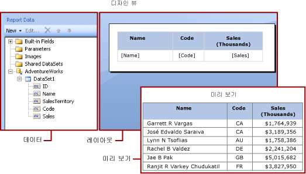

# 보고서 데이터 집합(SSRS)
  보고서에 데이터를 추가하려면 데이터 집합을 만듭니다. 각 데이터 집합은 데이터 원본에 대해 쿼리 명령을 실행하여 얻은 결과 집합을 나타냅니다. 결과 집합의 열은 필드 컬렉션이고, 결과 집합의 행은 데이터입니다. 데이터 집합에는 실제 데이터가 포함되는 것이 아니라 데이터 원본에서 특정 데이터의 집합을 검색하는 데 필요한 정보가 포함됩니다.  
  
 데이터 집합에는  포함된 데이터 집합과 공유 데이터 집합의 두 가지 유형이 있습니다. 포함된 데이터 집합은 보고서에서 정의되고 해당 보고서에서만 사용됩니다. 공유 데이터 집합은 보고서 서버 또는 SharePoint 사이트에서 정의되고 여러 보고서에서 사용될 수 있습니다. 보고서 작성기에서는 공유 데이터 집합 모드로 공유 데이터 집합을 만들거나, 보고서 디자이너 모드로 포함된 데이터 집합을 만들 수 있습니다. [!INCLUDE[ssBIDevStudioFull](../../includes/ssbidevstudiofull-md.md)]의 보고서 디자이너에서는 프로젝트의 일부로 공유 데이터 집합을 만들거나, 보고서의 일부로 포함된 데이터 집합을 만들 수 있습니다.  
  
-   **포함된 데이터 집합** 워크시트에서 직접 데이터에 대해 작업을 수행하는 [!INCLUDE[msCoName](../../includes/msconame-md.md)] Office Excel 등의 응용 프로그램과 달리 보고서 작성기나 보고서 디자이너에서는 보고서가 처리될 때 검색될 데이터를 나타내는 메타데이터에 대해 작업을 수행합니다. 포함된 데이터 집합을 만들려면 데이터 원본을 선택하고 쿼리를 지정합니다. 데이터 집합을 만든 후에는 보고서 데이터 창을 사용하여 필드 컬렉션을 봅니다. 데이터 집합의 데이터를 테이블 또는 차트와 같은 데이터 영역에 표시할 수 있습니다. 또한 각 데이터 영역에서 데이터를 그룹화, 필터링 및 정렬하여 데이터를 구성할 수 있습니다. 보고서 레이아웃을 디자인한 후에 보고서를 실행하여 실제 데이터를 확인합니다.  
  
     다음 그림의 보고서 데이터 창에는 [!INCLUDE[ssSampleDBUserInputNonLocal](../../includes/sssampledbuserinputnonlocal-md.md)]라는 데이터 원본, DataSet1이라는 데이터 집합 및 데이터 집합 필드 컬렉션의 필드 다섯 개가 표시되어 있습니다. 레이아웃 창에 표시되는 테이블에서 위쪽 행에는 열 제목이 있고 아래쪽 행에는 텍스트가 포함된 테이블 셀이 있습니다. 자리 표시자 텍스트인 [Name]은 Name 필드의 메타데이터입니다. 보고서를 실행하면 자리 표시자 텍스트가 실제 데이터 값으로 바뀝니다. 필요에 따라 테이블을 확장하여 모드 데이터를 표시할 수 있습니다.  
  
       
  
-   **공유 데이터 집합** 둘 이상의 보고서에서 데이터 집합을 사용하려면 공유 데이터 집합을 만듭니다. 공유 데이터 집합을 만들어 보고서 서버나 SharePoint 사이트에 저장하려면 보고서 작성기를 공유 데이터 집합 디자인 뷰 상태에서 사용합니다. 공유 데이터 집합을 서버나 사이트에 배포할 수 있는 프로젝트의 일부로 만들려면 보고서 디자이너를 사용합니다.  
  
     다음 그림에서는 보고서 작성기의 공유 데이터 집합 디자인 뷰를 보여 줍니다. 데이터 연결, 데이터 집합 속성, 쿼리 및 필터를 선택하거나 수정하고 원하는 경우 필터를 매개 변수로 표시하고 쿼리 결과를 확인할 수 있습니다. 그런 후에 변경 내용을 서버나 사이트에 다시 저장합니다.  
  
       
  
 자세한 내용은 [포함된 데이터 집합 및 공유 데이터 집합&#40;보고서 작성기 및 SSRS&#41;](../../reporting-services/report-data/embedded-and-shared-datasets-report-builder-and-ssrs.md) 및 [포함된 데이터 연결 및 공유 데이터 연결 또는 데이터 원본&#40;보고서 작성기 및 SSRS&#41;](http://msdn.microsoft.com/library/f417782c-b85a-4c4d-8a40-839176daba56)을 참조하세요.  
  
 종속되는 데이터 집합을 포함하는 보고서 파트를 추가하여 보고서에 데이터 집합을 추가할 수도 있습니다. [!INCLUDE[ssRBrptparts](../../includes/ssrbrptparts-md.md)]  
  
 [!INCLUDE[ssNoVersion](../../includes/ssnoversion-md.md)] 데이터베이스에서 데이터를 표시하는 보고서를 만드는 방법은 [자습서: 기본 테이블 보고서 만들기&#40;보고서 작성기&#41;](../../reporting-services/tutorial-creating-a-basic-table-report-report-builder.md)를 참조하세요. 자체 데이터를 포함하는 보고서를 작성하려면 [자습서: 오프라인에서 빠른 차트 보고서 만들기&#40;보고서 작성기&#41;](../../reporting-services/report-builder/tutorial-create-a-quick-chart-report-offline-report-builder.md)를 참조하세요.  
  
> [!NOTE]  
>  [!INCLUDE[ssRBRDDup](../../includes/ssrbrddup-md.md)]  
  
##   보고서 데이터 추가  
 보고서 작성기에서 다음과 같은 방법으로 보고서 데이터를 추가할 수 있습니다.  
  
-   보고서 서버의 보고서 파트를 보고서에 추가합니다. 각 보고서 파트에는 필요한 내용이 자체 포함되어 있으며 종속 데이터 집합도 포함됩니다. 데이터 집합은 미리 정의됩니다.  
  
-   테이블/행렬, 차트 및 지도 마법사를 사용합니다. 마법사에서 공유 데이터 원본 및 공유 데이터 집합을 선택하거나 새 데이터 집합을 만든 다음 보고서 디자인을 계속할 수 있습니다.  
  
-   보고서 서버의 공유 데이터 집합을 추가합니다. 공유 데이터 집합은 미리 정의되며, 미리 정의된 데이터 원본에서 사용할 데이터를 지정합니다. 공유 데이터 집합을 보고서에 추가하면 공유 데이터 집합 정의를 가리키는 데이터 집합 참조가 추가됩니다.  
  
 보고서 작성기나 보고서 디자이너에서 다음과 같은 방법으로 데이터를 추가할 수 있습니다.  
  
-   공유 데이터 원본을 기반으로 하는 포함된 데이터 집합을 추가합니다.  
  
-   포함된 데이터 원본을 기반으로 하는 포함된 데이터 집합을 추가합니다.  
  
> [!NOTE]  
>  보고서 서버에서 공유 항목은 개별적으로 또는 해당 항목이 게시된 폴더의 사용 권한을 상속하여 보호됩니다. 자신이 저장하는 공유 데이터 집합에 다른 사용자가 액세스할 수 있도록 설정하려면 사용 권한이 부여되는 방식을 이해해야 합니다. 자세한 내용은 [보안&#40;보고서 작성기&#41;](../../reporting-services/report-builder/security-report-builder.md) 또는 [공유 데이터 집합 항목 보안 설정](../../reporting-services/security/secure-shared-dataset-items.md)을 참조하세요.  
  
 보고서에 데이터를 추가한 후에는 데이터 영역을 사용해 보고서 페이지에서 데이터를 구성하고, 보고서 파트를 수정한 다음 해당 변경 내용을 다른 사람과 공유하고, 사용자가 보고서에 표시되는 데이터를 제한 또는 정렬할 수 있도록 설정할 수 있습니다. 자세한 내용은 다음 관련 항목을 참조하십시오.  
  
-   [테이블, 행렬 및 목록&#40;보고서 작성기 및 SSRS&#41;](../../reporting-services/report-design/tables-matrices-and-lists-report-builder-and-ssrs.md)  
  
-   [차트&#40;보고서 작성기 및 SSRS&#41;](../../reporting-services/report-design/charts-report-builder-and-ssrs.md)  
  
-   [스파크라인 및 데이터 막대&#40;보고서 작성기 및 SSRS&#41;](../../reporting-services/report-design/sparklines-and-data-bars-report-builder-and-ssrs.md)  
  
-   [표시기&#40;보고서 작성기 및 SSRS&#41;](../../reporting-services/report-design/indicators-report-builder-and-ssrs.md)  
  
-   [보고서 매개 변수&#40;보고서 작성기 및 보고서 디자이너&#41;](../../reporting-services/report-design/report-parameters-report-builder-and-report-designer.md)  
  
-   [보고서 파트&#40;보고서 작성기 및 SSRS&#41;](../../reporting-services/report-design/report-parts-report-builder-and-ssrs.md)  
  
-   [데이터 필터링, 그룹화 및 정렬&#40;보고서 작성기 및 SSRS&#41;](../../reporting-services/report-design/filter-group-and-sort-data-report-builder-and-ssrs.md)  
  
  
##   보고서 파트와 함께 데이터 추가  
 보고서 파트에는 해당 보고서 파트가 종속되는 데이터 집합이 포함됩니다. 이러한 데이터 집합은 보고서 서버에서 사용 가능한 공유 데이터 원본을 기반으로 작성됩니다. 보고서 작성기에서 보고서에 보고서 파트를 추가하면 종속 데이터 집합도 수동으로 추가한 것처럼 보고서에 추가됩니다. 예를 들어 미리 정의된 차트에 데이터 집합이 포함되어 있을 수 있습니다. 해당 데이터를 보려면 보고서를 미리 보면 됩니다.  
  
> [!NOTE]  
>  [!INCLUDE[ssRBrptparts](../../includes/ssrbrptparts-md.md)]  
  
 보고서 파트, 공유 데이터 원본 및 공유 데이터 집합은 미리 정의되며 보고서 서버에 저장됩니다. 이들 항목에 액세스하려면 보고서 서버에 연결하여 보고서 작성기를 서버 모드로 열어야 합니다. 보고서 서버에 대한 쓰기 권한이 있는 경우에는 이들 항목을 사용하여 새로운 고유 버전을 만들 수 있습니다.  
  
-   자세한 내용은 [보고서 파트&#40;보고서 작성기 및 SSRS&#41;](../../reporting-services/report-design/report-parts-report-builder-and-ssrs.md) 및 [보고서 디자이너의 보고서 파트&#40;SSRS&#41;](../../reporting-services/report-design/report-parts-in-report-designer-ssrs.md)를 참조하세요.  
  
  
##   쿼리 및 쿼리 디자이너  
 데이터 원본에서 가져올 데이터를 지정하려면 쿼리 명령을 작성합니다. 각 데이터 원본 유형에는 쿼리를 쉽게 작성할 수 있도록 관련된 *쿼리 디자이너* 가 제공됩니다. 쿼리 디자이너는 그래픽 기반이거나 텍스트 기반일 수 있습니다. 그래픽 쿼리 디자이너에서는 외부 데이터 원본의 데이터를 나타내는 메타데이터를 표시한 다음 필드나 엔터티를 쿼리 디자인 화면으로 끌어 대화형으로 쿼리를 작성합니다. 텍스트 기반 쿼리 디자이너에서는 외부 데이터 원본에서 지원하는 쿼리 구문으로 쿼리를 작성하거나 가져옵니다.  
  
 쿼리 디자이너에서는 쿼리를 실행해 예제 데이터를 보고 쿼리 명령 구문의 유효성을 검사할 수 있습니다. 결과 집합의 열 이름이 보고서 데이터 창에 표시되는 필드 이름이 됩니다. 결과 집합은 단일 행 및 열 집합이어야 하며 각 데이터 행에는 같은 수의 값이 있어야 합니다. 단일 쿼리에 여러 결과 집합이 있을 수는 없습니다. 열 수가 일정하지 않으며 각 행에 대해 생성되는 데이터 값 수가 다를 수 있는 비정형 계층은 지원되지 않습니다.  
  
 쿼리를 실행하려면 디자인 타임 자격 증명이 있어야 합니다. 자세한 내용은 [보고서 작성기에 자격 증명 지정](http://msdn.microsoft.com/library/7412ce68-aece-41c0-8c37-76a0e54b6b53) 및 [데이터 연결, 데이터 원본 및 연결 문자열&#40;보고서 작성기 및 SSRS&#41;](../../reporting-services/report-data/data-connections-data-sources-and-connection-strings-report-builder-and-ssrs.md)을 참조하세요.  
  
 데이터 확장 프로그램과 외부 데이터 원본 간의 통신은 데이터 공급자가 처리합니다. 쿼리 명령 구문, 쿼리 매개 변수 및 결과 집합에 있는 값의 데이터 형식에 대한 지원 여부는 각 데이터 공급자가 결정합니다. 자세한 내용은 특정 데이터 확장 프로그램 유형에 대한 항목과 [쿼리 디자이너&#40;보고서 작성기&#41;](http://msdn.microsoft.com/library/553f0d4e-8b1d-4148-9321-8b41a1e8e1b9)를 참조하세요.  
  
  
##   방법 도움말 항목  
 [데이터 연결 추가 및 확인&#40;보고서 작성기 및 SSRS&#41;](../../reporting-services/report-data/add-and-verify-a-data-connection-report-builder-and-ssrs.md)  
  
 [공유 데이터 집합 또는 포함된 데이터 집합 만들기&#40;보고서 작성기 및 SSRS&#41;](../../reporting-services/report-data/create-a-shared-dataset-or-embedded-dataset-report-builder-and-ssrs.md)  
  
 [보고서 데이터 창에서 필드 추가, 편집, 새로 고침&#40;보고서 작성기 및 SSRS&#41;](../../reporting-services/report-data/add-edit-refresh-fields-in-the-report-data-pane-report-builder-and-ssrs.md)  
  
 [관계형 쿼리 디자이너에서 쿼리 작성&#40;보고서 작성기 및 SSRS&#41;](../../reporting-services/report-data/build-a-query-in-the-relational-query-designer-report-builder-and-ssrs.md)  
  
 [다차원 데이터의 매개 변수 값에 대해 숨겨진 데이터 집합 표시&#40;보고서 작성기 및 SSRS&#41;](../../reporting-services/report-data/show-hidden-datasets-for-parameter-values-multidimensional-data.md)  
  
 [데이터 집합에 필터 추가&#40;보고서 작성기 및 SSRS&#41;](../../reporting-services/report-data/add-a-filter-to-a-dataset-report-builder-and-ssrs.md)  
  
 [데이터 영역에 대한 데이터 없음 메시지 설정&#40;보고서 작성기 및 SSRS&#41;](../../reporting-services/report-data/set-a-no-data-message-for-a-data-region-report-builder-and-ssrs.md)  
  
 [보고서 매개 변수와 쿼리 매개 변수 연결&#40;보고서 작성기 및 SSRS&#41;](../../reporting-services/report-data/associate-a-query-parameter-with-a-report-parameter-report-builder-and-ssrs.md)  
  
 [Analysis Services용 MDX 쿼리 디자이너에서 매개 변수 정의&#40;보고서 작성기 및 SSRS&#41;](../../reporting-services/report-data/define-parameters-in-the-mdx-query-designer-for-analysis-services.md)  
  
  
##   섹션 내용  
 [보고서 작성기의 보고서 파트 및 데이터 집합](../../reporting-services/report-data/report-parts-and-datasets-in-report-builder.md)  
  
 [보고서 작성기의 데이터 연결, 데이터 원본 및 연결 문자열](http://msdn.microsoft.com/library/7e103637-4371-43d7-821c-d269c2cc1b34)  
  
 [보고서 작성기에 자격 증명 지정](http://msdn.microsoft.com/library/7412ce68-aece-41c0-8c37-76a0e54b6b53)  
  
 [보고서 포함된 데이터 집합 및 공유 데이터 집합&#40;보고서 작성기 및 SSRS&#41;](../../reporting-services/report-data/report-embedded-datasets-and-shared-datasets-report-builder-and-ssrs.md)  
  
 [데이터 집합 필드 컬렉션&#40;보고서 작성기 및 SSRS&#41;](../../reporting-services/report-data/dataset-fields-collection-report-builder-and-ssrs.md)  
  
  
## 관련 항목:  
 [보고서 디자인 뷰&#40;보고서 작성기&#41;](../../reporting-services/report-builder/report-design-view-report-builder.md)   
 [보고서 제작 개념&#40;보고서 작성기 및 SSRS&#41;](../../reporting-services/report-design/report-authoring-concepts-report-builder-and-ssrs.md)  
  
  
