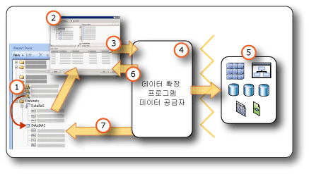

# <a name="report-embedded-datasets-and-shared-datasets-report-builder-and-ssrs"></a>보고서 포함된 데이터 세트 및 공유 데이터 세트(보고서 작성기 및 SSRS)
  데이터 세트는 데이터 연결에서 사용할 데이터를 지정합니다. 데이터 세트는 포함된 데이터 원본 또는 보고서 서버의 공유 데이터 원본에 대한 참조로 보고서에 저장된 데이터 연결을 기반으로 합니다. 데이터 세트는 필드 집합을 지정하는 쿼리를 포함합니다. 이러한 필드를 디자인 화면으로 끌면 보고서를 실행할 때 실제 데이터를 계산하는 식이 만들어집니다.  
  
 데이터 세트에는 두 가지 유형이 있습니다.  
  
-   **공유 데이터 세트.** 공유 데이터 세트는 보고서 서버에서 정의됩니다. 서버로 이동하여 공유 데이터 세트를 만들거나 미리 정의된 데이터 세트를 선택해 보고서에 추가할 수 있습니다. 공유 데이터 세트를 사용하여 둘 이상의 보고서에서 사용할 수 있는 쿼리를 제공할 수 있습니다. 공유 데이터 세트는 보고서 서버에 저장되며 보고서나 공유 데이터 원본과는 별도로 관리됩니다. 예를 들어 보고서 서버 관리자가 향상된 인덱싱이나 기타 쿼리 성능 최적화를 사용하도록 쿼리를 업데이트할 수 있습니다.  
  
-   **포함된 데이터 세트.** 포함된 데이터 세트는 해당 데이터 세트를 포함하는 보고서에서만 정의되고 사용됩니다. 외부 데이터 원본에서 하나의 보고서에서만 사용할 데이터를 가져오려는 경우 포함된 데이터 세트를 사용합니다. 포함된 데이터 세트는 다른 종속성이 없고 여러 보고서에 사용할 필요가 없는 쿼리를 만들려는 경우에 유용합니다.  
  
 데이터 세트에는 매개 변수, 필터 및 문자 구분을 지정하는 데이터 옵션(예: 대/소문자, 일본어 가나, 전자, 악센트, 데이터 정렬 정보)도 포함됩니다.  
  
   
  
1.  **보고서 데이터 창의 데이터 세트** 포함된 데이터 세트를 만들거나 공유 데이터 세트를 추가한 후 보고서 데이터 창에 데이터 세트가 표시됩니다. 데이터 세트는 데이터 원본을 기반으로 합니다.  
  
2.  **쿼리 디자이너** 데이터 세트 쿼리를 디자인할 때 데이터 원본 유형과 연결된 쿼리 디자이너가 열립니다.  
  
3.  **쿼리 명령** 쿼리 디자이너에서는 쿼리 명령을 손쉽게 작성할 수 있습니다. 명령 구문은 데이터 공급자에 의해 결정됩니다.  
  
4.  **데이터 확장 프로그램/데이터 공급자** 여러 데이터 액세스 계층을 통해 데이터에 연결할 수 있습니다.  
  
5.  **외부 데이터 원본** 관계형 데이터베이스,  다차원 데이터베이스,  SharePoint  목록,  웹 서비스 또는 보고서 모델에서 데이터를 검색합니다.  
  
6.  **쿼리 결과** 쿼리를 실행하고 결과 집합 예를 볼 수 있습니다. 쿼리를 실행하려면 디자인 타임 자격 증명이 있어야 합니다.  
  
7.  **스키마의 메타데이터** 데이터 공급자는 쿼리와 별도로 스키마 쿼리 명령을 실행하여 데이터 세트 필드 컬렉션에 대한 메타데이터를 검색합니다. 예를 들어 [!INCLUDE[tsql](../../includes/tsql-md.md)] **SELECT** 문은 데이터베이스 테이블의 열 이름을 반환합니다. 데이터 세트 필드 컬렉션을 보려면 보고서 데이터 창을 사용하여 데이터 세트를 확장합니다.  
  
 데이터는 미리 정의된 공유 데이터 세트 및 보고서 파트를 사용하여 보고서에 포함될 수도 있습니다. 이러한 항목에는 이미 필요한 데이터 연결 정보가 있습니다. 자세한 내용은 [보고서 데이터 세트&#40;SSRS&#41;](../../reporting-services/report-data/report-datasets-ssrs.md) 및 [보고서 파트&#40;보고서 작성기 및 SSRS&#41;](../../reporting-services/report-design/report-parts-report-builder-and-ssrs.md)을 참조하세요.  
  
 기본 제공 데이터 원본 유형 및 데이터 확장 프로그램에 대한 자세한 내용은 [외부 데이터 원본의 데이터 추가&#40;SSRS&#41;](../../reporting-services/report-data/add-data-from-external-data-sources-ssrs.md)를 참조하세요.  
  
> [!NOTE]  
>  [!INCLUDE[ssRBRDDup](../../includes/ssrbrddup-md.md)]  
  
##  <a name="Overview"></a> 보고서 데이터 세트 및 쿼리 이해  
 보고서 데이터 세트에는 외부 데이터 원본에 대해 실행되며 검색할 데이터를 지정하는 쿼리 명령이 들어 있습니다. 쿼리 명령을 작성하려면 외부 데이터 원본용 데이터 확장 프로그램에 연결된 쿼리 디자이너를 사용합니다. 쿼리 디자이너에서 쿼리 명령을 실행하고 결과 집합을 확인할 수 있습니다. 결과 집합은 열 이름이 있으며 각 행에 같은 수의 값이 포함된 사각형 행 집합입니다. *비정형 계층*이라고도 하는 계층적 데이터는 지원되지 않습니다. 열 이름은 데이터 세트 필드 목록으로 보고서 정의에 저장됩니다.  
  
 보고서에 데이터 세트를 추가한 후 보고서 데이터 창의 필드 컬렉션에 있는 필드를 끌어 보고서 레이아웃을 디자인하는 데 사용하는 테이블, 차트 및 기타 보고서 항목에 놓을 수 있습니다. 필드 작업에 대한 자세한 내용은 [데이터 세트 필드 컬렉션&#40;보고서 작성기 및 SSRS&#41;](../../reporting-services/report-data/dataset-fields-collection-report-builder-and-ssrs.md)을 참조하세요.  
  
### <a name="understanding-data-from-a-report-dataset"></a>보고서 데이터 세트의 데이터 이해  
 데이터 확장 프로그램에 따라 보고서 데이터 세트는 다음 데이터 형식으로 구성될 수 있습니다.  
  
-   데이터베이스 명령, 저장 프로시저 또는 사용자 정의 함수를 실행한 결과로 얻어지는 관계형 데이터베이스의 결과 집합. 단일 쿼리를 통해 여러 결과 집합이 검색된 경우 최초의 결과 집합만 처리되며 다른 모든 결과 집합은 무시됩니다. 예를 들어 텍스트 기반 쿼리 디자이너에서 다음 쿼리를 실행하면 `Production.Product` 에 대한 결과 집합만 결과 창에 나타납니다.  
  
    ```  
    SELECT ProductID FROM Production.Product  
    GO  
    SELECT ContactID FROM Person.Contact  
    ```  
  
-   XMLA(XML for Analysis) 프로토콜을 사용하는 다차원 데이터 원본의 일반 행 집합. 일부 데이터 공급자는 결과 집합에는 표시되지 않지만 보고서에서는 사용할 수 있는 데이터 원본의 추가 셀 및 차원 속성을 제공합니다.  
  
-   XML  요소,  해당 특성 및 자식 요소를 포함하는 XML  데이터 원본의 일반 결과 집합  
  
-   등록 및 구성된 [!INCLUDE[dnprdnshort](../../includes/dnprdnshort-md.md)] 데이터 공급자의 결과 집합  
  
-   미리 정의된 엔터티,  엔터티 관계 및 필드를 포함하여 특정 데이터 원본에 대해 디자인된 보고서 모델의 데이터. 자세한 내용은 [Reporting Services 설명서](../../reporting-services/create-deploy-and-manage-mobile-and-paginated-reports.md)의 “보고서 데이터 세트”를 참조하세요.  
  
 런타임에 보고서가 처리되면 쿼리에 대해 반환된 실제 결과 집합에는 0개 이상의 행이 있을 수 있습니다. 또한 데이터 원본에 쿼리에서 정의한 열이 없을 수도 있습니다. 데이터 원본의 Null 값은 [!INCLUDE[dnprdnshort](../../includes/dnprdnshort-md.md)] 값 **System.DBNull.Value**로 매핑됩니다.  
  
 데이터 세트 필드에 대한 자세한 내용은 [데이터 세트 필드 컬렉션&#40;보고서 작성기 및 SSRS&#41;](../../reporting-services/report-data/dataset-fields-collection-report-builder-and-ssrs.md)을 참조하세요.  
  
### <a name="dataset-query"></a>데이터 세트 쿼리  
 디자인 타임에 쿼리 디자이너에서 데이터 세트 쿼리를 실행하면 예제 데이터를 보여 주는 데이터 원본의 행 집합이 표시됩니다. 런타임에는 데이터 원본의 데이터가 변경되었으므로 사용자가 보고서를 볼 때 데이터 세트 쿼리에서 다른 값이 생성될 수 있습니다. 보고서가 처리될 때마다 새 데이터가 나타날 수 있습니다.  
  
 각 데이터 세트를 정의할 때 보고서 작성기는 쿼리를 쉽게 디자인할 수 있도록 데이터 원본 유형에 해당하는 쿼리 디자이너를 엽니다. 예를 들어 SQL Server 관계형 데이터베이스의 데이터에 대해 쿼리를 정의하려는 경우 테이블/행렬, 차트 및 지도 마법사가 쿼리를 쉽게 빌드할 수 있도록 하는 간단한 그래픽 인터페이스를 열기 때문에 사용자는 데이터 세트에 사용할 필드만 선택하면 됩니다.  
  
 쿼리 디자이너에서는 다음과 같은 작업을 할 수 있습니다.  
  
-   텍스트 기반 쿼리 뷰와 그래픽 기반 쿼리 뷰 사이를 전환합니다. 그래픽 기반 뷰에서는 데이터 원본에 대한 스키마, 테이블, 뷰 및 저장 프로시저를 살펴볼 수 있습니다. 텍스트 기반 뷰에서는 기존 쿼리를 입력하거나 붙여넣거나 표시할 수 있습니다.  이 뷰는 보통 그래픽 쿼리 디자이너에서는 표시할 수 없는 복잡한 쿼리에 사용됩니다. 예를 들어 [!INCLUDE[tsql](../../includes/tsql-md.md)] 파일(.sql),  보고서 서버의 다른 보고서 또는 파일 공유의 보고서 정의 파일(.rdl)에서 쿼리를 가져올 수 있습니다.  
  
-   쿼리를 실행하여 데이터를 봅니다. 쿼리는 결과 집합을 반환합니다. 결과 집합의 쿼리는 데이터 세트의 필드 컬렉션이 됩니다. 결과의 행은 데이터 세트에 대한 데이터가 됩니다. 원하는 열을 모두 가져올 때까지 쿼리로 작업할 수 있습니다.  
  
-   보고서에 필요한 데이터만 검색하기 위해 쿼리 매개 변수를 추가합니다. 쿼리 매개 변수는 일치하는 보고서 매개 변수를 자동으로 생성합니다. 보고서 모델 데이터 원본의 경우에는 사용자가 지정하는 필터가 일치하는 보고서 매개 변수를 자동으로 생성합니다. 보고서 매개 변수를 사용하면 보고서를 실행할 때 보고자 하는 보고서 데이터를 지정할 수 있습니다. 예를 들어 데이터를 보려는 제품 범주를 선택하면 보고서를 실행할 때 해당 제품 범주의 데이터만 보고서에 표시됩니다.  
  
-   다른 보고서에서 기존 쿼리를 가져옵니다.  
  
 쿼리 디자이너는 데이터 원본 유형에 따라 그래픽 모드 또는 텍스트 모드를 제공할 수 있습니다. 텍스트 모드를 선택하는 경우에는 데이터 원본에 적합한 쿼리 구문을 사용해야 합니다.  
  
 보고서 데이터 세트를 정의할 때 쿼리에 데이터 속성을 설정하거나 데이터 공급자가 설정한 기본값을 사용할 수 있습니다. 다음 전략 중 하나를 사용하여 이러한 데이터 형식을 변경할 수 있습니다.  
  
-   데이터 세트 쿼리를 다시 작성하여 필드를 다른 데이터 형식으로 특별히 변환합니다.  
  
-   데이터 세트의 필드를 편집하고 사용자 지정 형식을 제공합니다.  
  
-   데이터베이스 필드를 기반으로 새 사용자 지정 필드를 만들고 사용자 지정 형식을 제공합니다.  
  
 자세한 내용은 [데이터 세트 필드 컬렉션&#40;보고서 작성기 및 SSRS&#41;](../../reporting-services/report-data/dataset-fields-collection-report-builder-and-ssrs.md)을 참조하세요.  
  
### <a name="importing-existing-queries-for-a-dataset"></a>데이터 세트에 대한 기존 쿼리 가져오기  
 데이터 세트를 만드는 경우 새로운 쿼리를 만들거나 파일 또는 다른 보고서에서 기존 쿼리를 가져올 수 있습니다. 다른 보고서에서 쿼리를 가져오는 경우 보고서의 데이터 세트 목록에서 가져올 쿼리를 선택할 수 있습니다.  
  
 .sql  및 .rdl  파일 유형만 지원됩니다. MDX(Multidimensional  Expression)  쿼리,  DMX(데이터 마이닝 예측)  쿼리 및 모델 쿼리(SMQL)는 연결된 쿼리 디자이너에서만 생성할 수 있습니다.  
  
##  <a name="Compare"></a> 공유 데이터 세트와 포함된 데이터 세트 비교 및 만들기  
 포함된 데이터 세트는 보고서 또는 게시된 보고서 파트에서 정의됩니다. 포함된 데이터 세트를 변경하면 해당 보고서 또는 보고서 파트에만 영향을 줍니다.  
  
 공유 데이터 세트는 보고서 서버 또는 SharePoint 사이트에서 정의되고, 공유 데이터 원본을 기반으로 하며, 여러 보고서 및 보고서 파트에서 사용할 수 있습니다. 공유 데이터 세트 정의를 변경하면 해당 데이터 세트를 사용하는 모든 보고서 및 보고서 파트에 영향을 줍니다.  
  
 공유 데이터 세트를 보고서에 추가하면 데이터 세트 필드 컬렉션이 보고서 서버의 현재 정의로 업데이트됩니다. 보고서 서버에서 정의가 변경되어도 업데이트 알림은 받지 않습니다. 필드 컬렉션의 로컬 복사본을 보고서 서버에서 공유 데이터 세트 정의에 적용된 변경 내용과 동기화하려면 로컬 필드 컬렉션을 새로 고쳐야 합니다. 자세한 내용은 [보고서 데이터 창에서 필드 추가, 편집, 새로 고침&#40;보고서 작성기 및 SSRS&#41;](../../reporting-services/report-data/add-edit-refresh-fields-in-the-report-data-pane-report-builder-and-ssrs.md)을 참조하세요.  
  
 게시된 보고서 항목에는 해당 항목이 종속되는 포함된 데이터 세트 및 공유 데이터 세트가 포함됩니다. 자세한 내용은 [보고서 작성기의 보고서 파트 및 데이터 세트](../../reporting-services/report-data/report-parts-and-datasets-in-report-builder.md)를 참조하세요.  
  
 포함된 데이터 원본과 공유 데이터 원본은 작성,  저장 및 관리되는 방법이 다릅니다. 다음 표에는 포함된 데이터 원본과 공유 데이터 원본의 차이점이 요약되어 있습니다.  
  
|Description|포함된<br /><br /> 데이터 원본|공유됨<br /><br /> 데이터 원본|  
|-----------------|------------------------------|----------------------------|  
|데이터 연결이 보고서 정의에 포함되어 있습니다.|||  
|보고서 서버의 데이터 연결에 대한 포인터가 보고서 정의에 포함되어 있습니다.|||  
|보고서 서버에서 관리됩니다.|||  
|공유 데이터 세트에 필요합니다.|||  
|구성 요소에 필요합니다.|||  
  
 보고서 디자이너에서는 보고서 프로젝트의 일부로 공유 데이터 세트를 만들고 이를 보고서 서버에 배포할지 여부를 제어할 수 있습니다. 보고서 서버를 찾을 수 없으며 공유 데이터 세트를 선택하여 보고서에 추가할 수 없습니다.  
  
 보고서 작성기에서 다음을 수행할 수 있습니다.  
  
-   공유 데이터 세트를 만들려면 공유 데이터 세트 디자인 뷰를 사용합니다. 이 뷰를 보고서 서버나 SharePoint  사이트에 저장하여 다른 보고서와 공유할 수 있습니다. 보고서 서버를 찾아 기존의 공유 데이터 세트를 편집할 수도 있습니다. 이 뷰에서는 쿼리를 작성하고 모든 데이터 세트 옵션을 설정할 수 있습니다. 자세한 내용은 [공유 데이터 세트 디자인 뷰&#40;보고서 작성기&#41;](../../reporting-services/report-builder/shared-dataset-design-view-report-builder.md)를 참조하세요.  
  
-   보고서에 공유 데이터 세트를 추가하려면 보고서 디자인 뷰에서 보고서 작성기를 엽니다. 마법사나 보고서 데이터 창에서 보고서 서버로 이동하고 보고서에 추가할 공유 데이터 세트를 선택합니다. 이 뷰에서는 필드를 추가하는 것을 제외하고는 쿼리를 변경할 수 없습니다. 다른 데이터 옵션을 무시하고 필터를 추가할 수도 있지만 필터를 제거할 수는 없습니다.  
  
 다음 표에서는 보고서 서버의 공유 데이터 세트 정의에 대해 구성할 수 있는 속성과 보고서 정의의 공유 데이터 세트 인스턴스에 대해 구성할 수 있는 속성을 비교합니다.  
  
|속성|정의에 대한 구성 정보|인스턴스에 대한 구성 정보|  
|--------------|--------------------------------------------|------------------------------------------|  
|쿼리 텍스트|쿼리 구성(쿼리를 식으로 정의하는 작업 포함)|쿼리를 변경할 수 없음|  
|쿼리 매개 변수|보고서 매개 변수를 참조할 수 없음<br /><br /> 기본값을 포함함<br /><br /> 읽기 전용 플래그를 포함함|정의에서 읽기 전용으로 표시되지 않은 매개 변수 구성|  
|필터|필터 정의|정의의 일부인 데이터 세트 필터를 보거나 변경할 수 없음<br /><br /> 추가 필터를 만들 수 없음|  
|데이터 원본|공유 데이터 원본이어야 함|공유 데이터 원본을 변경할 수 없음|  
|필드|쿼리 명령의 필드<br /><br /> 데이터 세트 정의의 일부가 아닌 계산 필드|필드를 볼 수 있지만 변경할 수는 없음<br /><br /> 필드 컬렉션은 보고서에 공유 데이터 세트를 추가할 때의 쿼리를 기반으로 정적입니다. 업데이트하려면 **데이터 세트 속성** 대화 상자에서 **필드 새로 고침**을 클릭합니다. 실제 필드 컬렉션은 정의의 현재 쿼리가 반환하는 필드 컬렉션입니다.<br /><br /> 계산 필드 추가|  
|데이터 세트|대/소문자 구분과 같은 데이터 옵션|인스턴스의 데이터 옵션 무시|  
  
 데이터 세트를 만드는 방법은 [Reporting Services 설명서](../../reporting-services/create-deploy-and-manage-mobile-and-paginated-reports.md)에서 [공유 데이터 세트 또는 포함된 데이터 세트 만들기&#40;보고서 작성기 및 SSRS&#41;](../../reporting-services/report-data/create-a-shared-dataset-or-embedded-dataset-report-builder-and-ssrs.md) 및 [Reporting Services 도구](../../reporting-services/tools/reporting-services-tools.md)를 참조하세요.  
  
##  <a name="SortGroupFilter"></a> 데이터 세트의 데이터 필터링,  정렬 및 그룹화  
 데이터 세트의 데이터는 외부 데이터 원본에 대해 쿼리 명령을 실행한 결과로 반환되는 생성됩니다. 데이터 확장 프로그램의 쿼리 명령 구문에 따라 데이터 정렬 또는 그룹화 가능 여부가 결정됩니다. 보고서에서 데이터를 검색하기 전에 쿼리에서 정렬 및 그룹화가 수행됩니다. 필터링은 보고서에서 데이터를 검색한 후에 수행됩니다.  
  
 자세한 내용은 [데이터 필터링, 그룹화 및 정렬&#40;보고서 작성기 및 SSRS&#41;](../../reporting-services/report-design/filter-group-and-sort-data-report-builder-and-ssrs.md)를 참조하세요.  
  
### <a name="filtering-data-in-a-dataset"></a>데이터 세트에서 데이터 필터링  
 필터는 보고서에서 데이터 세트 정의의 일부입니다. 데이터 세트 필터를 사용해 데이터 세트에서 보고서에 포함할 데이터를 지정합니다. 데이터 세트에 대해 필터를 지정하면 해당 데이터 세트를 기반으로 하는 모든 데이터 영역에 데이터 세트 필터로 걸러진 데이터만 표시됩니다.  
  
 필터는 공유 데이터 세트 정의의 일부입니다. 공유 데이터 세트 필터는 공유 데이터 세트가 포함된 모든 보고서에 적용됩니다. 공유 데이터 세트를 보고서에 추가한 후에 또는 종속 공유 데이터 세트가 있는 구성 요소를 추가한 후에 데이터 세트 필터를 추가로 더 만들 수 있습니다. 사용자가 만드는 필터는 자신의 보고서에만 사용되며 보고서 서버에 있는 공유 데이터 세트 정의에는 포함되지 않습니다.  
  
 데이터 영역 또는 데이터 영역 그룹에 대한 필터를 더 설정할 수 있습니다. 또한 사용자가 보고서에 표시할 데이터를 선택할 수 있도록 매개 변수 및 필터 조합을 사용할 수도 있습니다. 자세한 내용은 [보고서 매개 변수&#40;보고서 작성기 및 보고서 디자이너&#41;](../../reporting-services/report-design/report-parameters-report-builder-and-report-designer.md)에 대해 자세히 알아봅니다.  
  
### <a name="sorting-data-in-a-dataset"></a>데이터 세트에서 데이터 정렬  
 데이터 세트에서 데이터의 순서는 외부 데이터 원본에서 검색되는 순서입니다. 이 순서는 쿼리 디자이너에서 쿼리를 실행할 때 표시되는 순서와도 같습니다. 쿼리 명령 구문에서 정렬을 지원하는 경우 쿼리를 편집하여 데이터가 보고서 데이터로 반환되기 전에 원본에서 데이터를 정렬할 수 있습니다. 예를 들어 [!INCLUDE[tsql](../../includes/tsql-md.md)] 쿼리의 경우 ORDER  BY  문이 정렬 순서를 제어합니다.  
  
 데이터가 보고서로 반환된 후에 정렬하려면 데이터 영역 및 데이터 영역 그룹에 대해 정렬 식을 정의합니다. 자세한 내용은 특정 데이터 영역 유형에 대한 항목(예: [테이블, 행렬 및 목록&#40;보고서 작성기 및 SSRS&#41;](../../reporting-services/report-design/tables-matrices-and-lists-report-builder-and-ssrs.md))을 참조하세요.  
  
 또한 사용자가 보고서의 데이터 정렬 순서를 선택할 수 있도록 매개 변수 및 정렬 식 조합을 사용할 수도 있습니다. 자세한 내용은 [보고서 매개 변수&#40;보고서 작성기 및 보고서 디자이너&#41;](../../reporting-services/report-design/report-parameters-report-builder-and-report-designer.md)에 대해 자세히 알아봅니다.  
  
### <a name="grouping-data-in-a-dataset"></a>데이터 세트의 데이터 그룹화  
 데이터 세트의 데이터는 그룹화할 수 없습니다. 데이터 세트의 데이터를 집계하려면 데이터가 보고서에 대해 반환되기 전에 집계를 계산하도록 쿼리 명령을 편집할 수 있습니다. 이를 *서버 집계*라고 합니다. 식에서 이러한 값을 미리 계산된 집계로 식별하려면 Aggregate  함수를 사용합니다. 자세한 내용은 [집계 함수&#40;보고서 작성기 및 SSRS&#41;](../../reporting-services/report-design/report-builder-functions-aggregate-function.md)를 참조하세요.  
  
##  <a name="Parameters"></a> 매개 변수 및 데이터 세트 사용  
 쿼리 변수가 들어 있는 포함된 데이터 세트 쿼리의 경우 쿼리 매개 변수 및 그에 해당하는 보고서 매개 변수가 자동으로 만들어집니다. 보고서를 실행하면 보고서 매개 변수의 값이 데이터 세트 쿼리 매개 변수에 연결됩니다. 이러한 방식으로 외부 데이터 원본에 대해 실행되는 쿼리 명령은 보고서 매개 변수에 대해 지정되는 값을 포함합니다. 보고서 매개 변수를 사용하면 보고서에 표시할 데이터를 선택할 수 있습니다. 쿼리 매개 변수와 보고서 매개 변수를 연결하는 방법은 데이터 세트 속성 대화 상자, 매개 변수 페이지에서 볼 수 있습니다.  
  
 공유 데이터 세트의 경우 쿼리 매개 변수는 보고서 서버에서 보고서와 독립적으로 관리할 수 있는 공유 데이터 세트 정의의 일부분입니다. 다음 목록에서는 쿼리 매개 변수 값 지원에 대해 설명합니다.  
  
-   식을 기반으로 할 수 있습니다.  
  
-   기본값을 포함할 수 있습니다.  
  
-   읽기 전용으로 설정할 수 있습니다. 읽기 전용 매개 변수는 보고서의 공유 데이터 세트 인스턴스에서 변경할 수 없습니다.  
  
-   보고서 매개 변수를 나타내는 기본 제공 컬렉션 매개 변수에 대한 참조는 포함할 수 없습니다.  
  
 공유 데이터 세트에 대한 쿼리 매개 변수 값을 구성하려면 데이터 세트 디자인 모드에서 보고서 서버의 공유 데이터 세트를 찾아 열고 데이터 세트 속성 대화 상자, 매개 변수 페이지에서 옵션을 설정합니다. 자세한 내용은 [공유 데이터 세트 또는 포함된 데이터 세트 만들기&#40;보고서 작성기 및 SSRS&#41;](../../reporting-services/report-data/create-a-shared-dataset-or-embedded-dataset-report-builder-and-ssrs.md)을 참조하세요.  
  
 [!INCLUDE[ssASnoversion](../../includes/ssasnoversion-md.md)]같은 다차원 데이터 원본의 경우에는 그래픽 쿼리 디자이너를 사용하면 쿼리 필터를 지정하고 해당하는 쿼리 매개 변수를 만드는 옵션을 선택할 수 있습니다. 매개 변수 옵션을 선택하면 데이터 확장 프로그램이 별도의 보고서 데이터 세트를 자동으로 만들어 해당 매개 변수의 드롭다운 목록에 사용 가능한 값을 제공합니다. 기본적으로 이러한 숨겨진 데이터 세트는 보고서 데이터 창에 나타나지 않습니다.  
  
 쿼리 매개 변수에 연결된 보고서 매개 변수를 사용하면 데이터가 외부 데이터 원본에서 반환되기 전에 데이터를 필터링할 수 있습니다. 또한 보고서 정의의 일부분인 필터를 만들어 보고서에서 데이터를 필터링할 수도 있습니다. 자세한 내용은 [데이터 필터링, 그룹화 및 정렬&#40;보고서 작성기 및 SSRS&#41;](../../reporting-services/report-design/filter-group-and-sort-data-report-builder-and-ssrs.md)를 참조하세요.  
  
### <a name="displaying-hidden-datasets"></a>숨겨진 데이터 세트 표시  
 일부 다차원 데이터 원본에 대해 매개 변수가 있는 쿼리를 작성할 때 해당 매개 변수에 대해 올바른 값을 제공하는 데이터 세트가 자동으로 만들어집니다. 일부 쿼리 디자이너에서는 필터를 지정한 다음 매개 변수 만들기 옵션을 선택하여 이 작업을 수행합니다. 기본적으로 이러한 데이터 세트는 보고서 데이터 창에 나타나지 않지만 표시할 수는 있습니다. 자세한 내용은 [다차원 데이터의 매개 변수 값에 대해 숨겨진 데이터 세트 표시&#40;보고서 작성기 및 SSRS&#41;](../../reporting-services/report-data/show-hidden-datasets-for-parameter-values-multidimensional-data.md)을 참조하세요.  
  
##  <a name="Maps"></a> 지도 및 데이터 세트 사용  
 보고서에 지도를 포함하는 경우에는 공간 데이터를 제공해야 합니다. 공간 데이터는 보고서 데이터 세트, 지도 갤러리의 지도 또는 ESRI 셰이프 파일에서 가져올 수 있습니다. 보고서 또는 ESRI 셰이프 파일에서 가져온 공간 데이터는 보고서 데이터 창에 데이터 세트로 표시되지 않습니다. 자세한 내용은 [지도&#40;보고서 작성기 및 SSRS&#41;](../../reporting-services/report-design/maps-report-builder-and-ssrs.md)를 참조하세요.  
  
##  <a name="Multiple"></a> 여러 데이터 세트의 데이터 표시  
 보고서에는 일반적으로 두 개 이상의 데이터 세트가 포함되어 있습니다. 다음 목록에서는 보고서에서 데이터 세트를 사용하는 방법을 설명합니다.  
  
-   별도의 데이터 영역을 사용하여 각 데이터 세트의 데이터를 표시합니다. 자세한 내용은 [데이터 영역 및 지도&#40;보고서 작성기 및 SSRS&#41;](../../reporting-services/report-design/data-regions-and-maps-report-builder-and-ssrs.md)를 참조하세요.  
  
-   데이터 세트에 둘 이상의 데이터 영역을 연결하여 동일한 데이터에 대한 다양한 뷰를 제공할 수 있습니다. 자세한 내용은 [동일한 데이터 세트에 여러 데이터 영역 연결&#40;보고서 작성기 및 SSRS&#41;](../../reporting-services/report-design/linking-multiple-data-regions-to-the-same-dataset-report-builder-and-ssrs.md)을 참조하세요.  
  
-   데이터 세트를 사용하여 사용 가능한 값이나 보고서 매개 변수 기본값에 대한 드롭다운 목록을 제공할 수 있습니다. 자세한 내용은 [보고서 매개 변수&#40;보고서 작성기 및 보고서 디자이너&#41;](../../reporting-services/report-design/report-parameters-report-builder-and-report-designer.md)에 대해 자세히 알아봅니다.  
  
-   드릴스루 보고서 또는 하위 보고서의 매개 변수를 사용하면 여러 데이터 세트의 관련 데이터를 연결할 수 있습니다. 예를 들어 판매 보고서에는 모든 상점에 대한 요약 데이터가 표시되고 드릴스루 링크는 지정된 상점의 개별 판매량을 검색하는 데이터 세트 쿼리를 사용하여 상점 식별자를 보고서의 매개 변수로 지정할 수 있습니다. 자세한 내용은 [드릴스루, 드릴다운, 하위 보고서 및 중첩 데이터 영역&#40;보고서 작성기 및 SSRS&#41;](../../reporting-services/report-design/drillthrough-drilldown-subreports-and-nested-data-regions.md) 및 [하위 보고서&#40;보고서 작성기 및 SSRS&#41;](../../reporting-services/report-design/subreports-report-builder-and-ssrs.md)를 참조하세요.  
  
-   여러 데이터 세트의 정보 데이터를 단일 데이터 영역에 표시할 수 없습니다. 그러나 여러 데이터 세트에 대한 집계 또는 기본 제공 함수 값은 데이터 영역 내에 표시할 수 있습니다. 자세한 내용은 [집계 함수 참조&#40;보고서 작성기 및 SSRS&#41;](../../reporting-services/report-design/report-builder-functions-aggregate-functions-reference.md)를 참조하세요. 여러 데이터 세트의 정보 데이터를 하나의 데이터 영역에 결합해야 하는 경우 데이터를 단일 데이터 세트로 검색하도록 쿼리를 다시 작성해야 합니다.  
  
##  <a name="NoRows"></a> 데이터 행을 사용할 수 없을 때 메시지 표시  
 보고서를 처리하는 동안 데이터 세트에 대한 쿼리를 실행하면 결과 집합에 행이 없을 수 있습니다. 렌더링된 보고서에서 빈 데이터 세트에 연결된 데이터 영역은 빈 데이터 영역으로 표시됩니다. 렌더링된 보고서에서 빈 데이터 영역을 표시하는 대신 텍스트를 지정하여 표시할 수 있습니다. 모든 데이터 세트에 대한 쿼리에서 런타임에 생성된 데이터가 없는 경우 하위 보고서에 사용할 메시지도 지정할 수 있습니다. 자세한 내용은 [데이터 영역에 대한 데이터 없음 메시지 설정&#40;보고서 작성기 및 SSRS&#41;](../../reporting-services/report-data/set-a-no-data-message-for-a-data-region-report-builder-and-ssrs.md)을 참조하세요.  
  
##  <a name="Options"></a> 데이터 세트 옵션 설정  
 국가별 데이터를 지원하는 데이터 원본의 경우 정렬 순서, 국가별 문자 속성 및 대/소문자 구분에 영향을 주는 데이터 세트의 속성을 조정해야 할 수 있습니다. 이러한 속성에는 대/소문자,  일본어 가나,  전자,  악센트,  데이터 정렬 등이 있습니다. 이러한 속성을 설정하는 방법은 [데이터 세트 속성 대화 상자, 옵션&#40;보고서 작성기&#41;](../../reporting-services/report-data/dataset-properties-dialog-box-options-report-builder.md)을 참조하세요.  
  
## <a name="see-also"></a>참고 항목  
 [데이터 세트 필드 컬렉션&#40;보고서 작성기 및 SSRS&#41;](../../reporting-services/report-data/dataset-fields-collection-report-builder-and-ssrs.md)   
 [데이터 연결 문자열 만들기 - 보고서 작성기 및 SSRS](../../reporting-services/report-data/data-connections-data-sources-and-connection-strings-report-builder-and-ssrs.md)   
 [보고서 데이터 세트&#40;SSRS&#41;](../../reporting-services/report-data/report-datasets-ssrs.md)  
  
  
