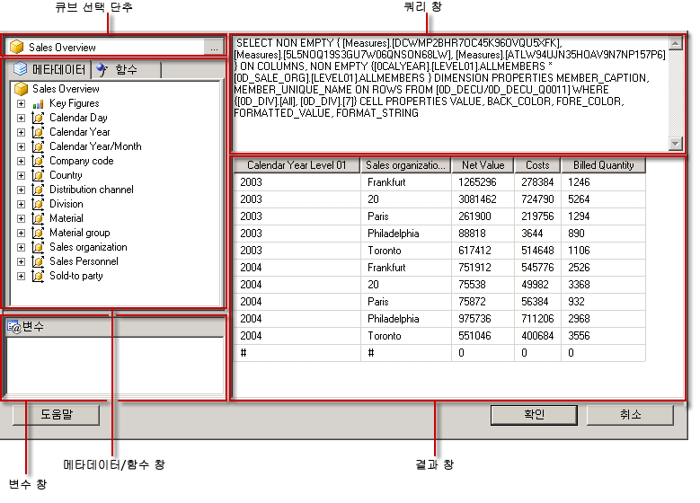

# SAP NetWeaver BI 쿼리 디자이너 사용자 인터페이스
  [!INCLUDE[ssRSnoversion](../../includes/ssrsnoversion-md.md)] 는 SAP NetWeaver Business Intelligence 데이터 원본을 위한 MDX(Multidimensional Expression) 쿼리를 작성할 수 있는 그래픽 쿼리 디자이너를 제공합니다. MDX 그래픽 쿼리 디자이너에는 디자인 모드와 쿼리 모드의 두 가지 모드가 있습니다. 각 모드는 메타데이터 창을 제공하며 이 창에서는 데이터 원본에 정의된 InfoCube, MultiProvider 또는 웹 사용이 가능한 쿼리에서 멤버를 끌어서 보고서 처리 시 데이터를 검색하는 MDX 쿼리를 작성할 수 있습니다.  
  
> [!IMPORTANT]  
>  사용자는 쿼리를 작성하고 실행할 때 데이터 원본에 액세스합니다. 데이터 원본에 대해서는 읽기 전용 권한과 같이 최소한의 사용 권한을 부여해야 합니다.  
  
 SAP 다차원 데이터 원본 작업 방법에 대한 자세한 내용은 [SAP NetWeaver BI 연결 형식&#40;SSRS&#41;](../../reporting-services/report-data/sap-netweaver-bi-connection-type-ssrs.md)을 참조하세요.  
  
 이 섹션에서는 그래픽 쿼리 디자이너의 각 모드에 있는 도구 모음 단추와 쿼리 디자이너 창에 대해 설명합니다.  
  
## 디자인 모드의 그래픽 쿼리 디자이너  
 [!INCLUDE[SAP_DPE_BW_1](../../includes/sap-dpe-bw-1-md.md)] 데이터 원본을 사용하는 데이터 집합 쿼리를 편집할 경우 그래픽 쿼리 디자이너가 디자인 모드에서 열립니다. 다음 그림에서는 디자인 모드에서 표시되는 창을 해당 레이블과 함께 보여 줍니다.  
  
   
  
 다음 표에서는 이 모드의 창을 나열합니다.  
  
|창|함수|  
|----------|--------------|  
|큐브 선택 단추|현재 선택한 InfoCube, MultiProvider 또는 웹 사용이 가능한 쿼리를 표시합니다.|  
|메타데이터 창|InfoCube, MultiProvider 및 쿼리의 계층 목록을 표시합니다. 데이터 원본에서 만들어진 쿼리가 해당 큐브 아래에 표시될 수 있습니다.|  
|계산 멤버 창|쿼리에 사용할 수 있는 현재 정의된 계산 멤버를 표시합니다.|  
|데이터 창|쿼리의 실행 결과를 표시합니다.|  
  
 메타데이터 창의 차원 및 주요 그림과 계산 멤버 창의 계산 멤버를 데이터 창으로 끌 수 있습니다. 도구 모음의 **자동 실행** 토글 단추가 설정된 경우 개체를 데이터 창에 놓을 때마다 쿼리 디자이너에서 쿼리를 실행합니다. **자동 실행** 이 해제된 경우에는 데이터 창을 변경할 때 쿼리 디자이너에서 쿼리를 실행하지 않습니다. 도구 모음의 **실행** 단추를 사용하여 쿼리를 수동으로 실행할 수 있습니다.  
  
### 디자인 모드의 그래픽 쿼리 디자이너를 위한 도구 모음  
 쿼리 디자이너 도구 모음은 그래픽 인터페이스를 사용하여 MDX 쿼리를 디자인하는 데 도움이 되는 단추를 제공합니다. 다음 표에서는 단추와 해당 기능을 설명합니다.  
  
|단추|Description|  
|------------|-----------------|  
|**텍스트로 편집**|텍스트 기반 쿼리 디자이너와 그래픽 쿼리 디자이너 사이를 전환합니다. 이 데이터 원본 유형에는 사용할 수 없습니다.|  
|**가져오기**|파일 시스템의 보고서 정의 파일(.rdl)에서 기존 쿼리를 가져옵니다. 자세한 내용은 [보고서 포함된 데이터 집합 및 공유 데이터 집합&#40;보고서 작성기 및 SSRS&#41;](../../reporting-services/report-data/report-embedded-datasets-and-shared-datasets-report-builder-and-ssrs.md)을 참조하세요.|  
||데이터 원본의 메타데이터를 새로 고칩니다.|  
||**계산 멤버 작성기** 대화 상자를 표시합니다.|  
||데이터 창에서 빈 셀을 표시하거나 표시하지 않는 기능 사이를 전환합니다. 이것은 MDX에 NON EMPTY 절을 사용하는 것과 동일합니다.|  
||데이터 창에서 열을 삭제하는 경우와 같이 변경 내용이 있을 때마다 쿼리를 자동으로 실행하고 결과를 표시합니다. 결과는 데이터 창에 표시됩니다.|  
||데이터 창의 선택된 열을 쿼리에서 삭제합니다.|  
||**변수** 대화 상자를 표시합니다. 쿼리 큐브만 변수를 지원하기 때문에 이 단추는 선택한 큐브가 쿼리 큐브인 경우에만 사용할 수 있습니다. 기본값을 변수에 할당할 경우 해당 보고서 매개 변수가 만들어집니다.|  
||쿼리를 실행하고 데이터 창에 결과를 표시합니다.|  
||쿼리를 취소합니다.|  
||디자인 모드와 쿼리 모드 사이를 전환합니다.|  
  
## 쿼리 모드의 그래픽 쿼리 디자이너  
 그래픽 쿼리 디자이너를 쿼리 모드로 변경하려면 도구 모음에서 **디자인 모드** 토글 단추를 클릭합니다.  
  
 다음 그림에서는 쿼리 모드에 표시되는 쿼리 디자이너의 각 부분을 보여 줍니다.  
  
   
  
 다음 표에서는 각 창의 기능을 설명합니다.  
  
|창|함수|  
|----------|--------------|  
|큐브 선택 단추|현재 선택한 InfoCube, MultiProvider 또는 기타 큐브를 표시합니다.|  
|메타데이터/함수 창|쿼리 텍스트를 작성하는 데 사용할 수 있는 메타데이터 또는 함수의 목록을 보여 주는 탭 창을 표시합니다.|  
|변수 창|쿼리에서 사용할 수 있는 현재 정의된 변수를 표시합니다.|  
|쿼리 창|현재 쿼리 텍스트를 표시합니다.|  
|결과 창|쿼리 결과를 표시합니다.|  
  
 메타데이터 창에서는 주요 그림 및 차원을 **메타데이터** 탭에서 MDX 쿼리 창으로 끌 수 있습니다. 메타데이터의 기술적 이름이 커서에 삽입됩니다. 함수는 **함수** 탭에서 MDX 쿼리 창으로 끌 수 있습니다. 쿼리를 실행하면 현재 MDX 쿼리의 결과가 결과 창에 표시됩니다.  
  
 선택한 큐브가 웹 사용이 가능한 쿼리인 경우 기존 변수의 정적 기본값을 설정하라는 메시지가 표시됩니다. 그런 다음 변수를 MDX 쿼리 창으로 끌 수 있습니다.  
  
 메타데이터 및 변수 창에는 익숙한 이름이 표시됩니다. 개체를 MDX 쿼리 창에 놓을 경우 MDX 쿼리에 입력된 데이터 원본에 필요한 기술적 이름이 표시됩니다.  
  
### 쿼리 모드의 그래픽 쿼리 디자이너를 위한 도구 모음  
 쿼리 디자이너 도구 모음은 그래픽 인터페이스를 사용하여 MDX 쿼리를 디자인하는 데 도움이 되는 단추를 제공합니다. 디자인 모드와 쿼리 모드의 도구 모음 단추가 동일하지만 쿼리 모드의 경우 다음 단추를 사용할 수 없습니다.  
  
-   **텍스트로 편집**  
  
-   **계산 멤버 추가**()  
  
-   **빈 셀 표시**()  
  
-   **자동 실행**()  
  
-   **삭제**()  
  
## 관련 항목:  
 [공유 데이터 집합 또는 포함된 데이터 집합 만들기&#40;보고서 작성기 및 SSRS&#41;](../../reporting-services/report-data/create-a-shared-dataset-or-embedded-dataset-report-builder-and-ssrs.md)   
 [RSReportDesigner 구성 파일](../../reporting-services/report-server/rsreportdesigner-configuration-file.md)  
  
  