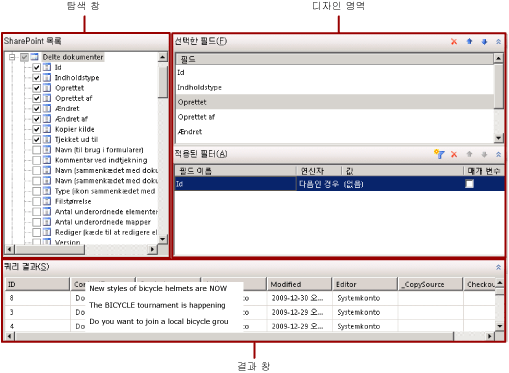

# SharePoint 목록 쿼리 디자이너(보고서 작성기)
  보고서 작성기 및 보고서 디자이너는 SharePoint 사이트에서 보고서 데이터 집합에서 검색할 데이터를 지정하는 쿼리를 만들 수 있도록 그래픽 쿼리 디자이너와 텍스트 기반 쿼리 디자이너를 모두 제공합니다. 그래픽 쿼리 디자이너를 사용하면 SharePoint 목록 메타데이터를 탐색하고, 쿼리를 대화형으로 작성하고, 쿼리 결과를 볼 수 있습니다. 텍스트 기반 쿼리 디자이너를 사용하면 그래픽 쿼리 디자이너로 만든 쿼리를 보거나 쿼리를 수정하거나 쿼리 명령을 입력할 수 있습니다. 파일 또는 보고서에서 기존 쿼리를 가져올 수도 있습니다.  
  
> [!IMPORTANT]  
>  사용자는 쿼리를 작성하고 실행할 때 데이터 원본에 액세스합니다. 데이터 원본에 대해서는 읽기 전용 권한과 같이 최소한의 사용 권한을 부여해야 합니다.  
  
## 그래픽 쿼리 디자이너  
 그래픽 쿼리 디자이너에서는 SharePoint 사이트를 탐색하고 데이터 집합에 대한 SharePoint 목록 데이터를 검색하는 명령을 대화형으로 작성할 수 있습니다. 데이터 집합에 포함할 필드를 선택하고 필요에 따라 데이터 집합의 데이터를 제한할 필터를 지정합니다. 필터를 매개 변수로 사용하여 런타임에 필터의 값을 제공하도록 지정할 수 있습니다.  
  
 SharePoint 목록에는 보고서에 별로 필요하지 않을 수 있는 SharePoint 관련 필드가 많이 포함되어 있습니다. 쿼리 디자이너에서는 사용할 필드를 더 쉽고 빠르게 확인할 수 있도록 이러한 필드를 숨길 수 있는 옵션을 제공합니다.  
  
 그래픽 쿼리 디자이너는 다음 세 영역으로 구분됩니다.  
  
-   사용할 목록 항목과 필드를 선택하는 탐색 창  
  
-   쿼리를 작성하는 디자인 영역  
  
-   쿼리 결과가 표시되는 결과 창  
  
 다음 그림에서는 SharePoint 목록과 함께 사용할 때의 그래픽 쿼리 디자이너를 보여 줍니다.  
  
   
  
 다음 표에서는 각 창의 기능을 설명합니다.  
  
 [SharePoint 목록](#DatabaseView)  
 SharePoint 목록과 해당 목록에 있는 각 항목 내의 필드를 표시합니다.  
  
 [선택한 필드](#SelectedFields)  
 SharePoint 목록 창에서 선택된 항목의 SharePoint 목록 필드 이름 목록을 표시합니다. 이러한 필드는 보고서 데이터 집합에 대한 필드 컬렉션이 됩니다.  
  
 [적용된 필터](#AppliedFilters)  
 데이터베이스 뷰의 테이블 또는 뷰에 대한 필드 및 필터 조건 목록을 표시합니다.  
  
 [쿼리 결과](#QueryResults)  
 자동으로 생성된 쿼리의 결과 집합에 대한 예제 데이터를 표시합니다.  
  
###   SharePoint 목록 창  
 SharePoint 목록 창에는 데이터 원본 연결 및 자격 증명에 따라 사용자가 볼 수 있는 권한이 있는 데이터베이스 개체에 대한 메타데이터가 표시됩니다. 데이터베이스 스키마별로 구성된 데이터베이스 개체가 계층 뷰에 표시됩니다. 각 스키마 노드를 확장하여 테이블,  뷰,  저장 프로시저 및 테이블 반환 함수를 볼 수 있습니다. 열을 표시하려면 테이블이나 뷰를 확장합니다.  
  
###   선택한 필드 창  
 선택한 필드 창에는 SharePoint 목록 항목에 대해 선택한 목록 항목 필드가 표시됩니다. 이 창에 표시되는 필드는 보고서 데이터 집합의 필드 컬렉션이 됩니다. 데이터 집합과 쿼리를 만든 후 보고서 데이터 창에서 보고서 데이터 집합의 필드 컬렉션을 볼 수 있습니다. 이러한 필드는 보고서를 볼 때 테이블,  차트 및 기타 보고서 항목에 표시할 수 있는 데이터를 나타냅니다.  
  
 선택한 필드 창에 필드를 추가하거나 제거하려면 SharePoint 목록 창에서 해당 테이블 또는 뷰 필드의 확인란을 선택하거나 선택 취소합니다.  
  
###   적용된 필터 창  
 적용된 필터 창에는 런타임에 검색되는 데이터 행 수를 제한하는 데 사용되는 조건이 표시됩니다. 이 창에 지정된 조건을 사용하여 [!INCLUDE[tsql](../../includes/tsql-md.md)] WHERE 절이 생성됩니다. 매개 변수 옵션을 선택하면 보고서 매개 변수가 자동으로 생성됩니다. 쿼리 매개 변수에 기반을 둔 보고서 매개 변수를 사용하면 사용자가 쿼리 값을 지정하여 보고서의 데이터를 제어할 수 있습니다.  
  
 표시되는 열은 다음과 같습니다.  
  
-   **필드 이름** 조건을 적용할 필드 이름이 표시됩니다.  
  
-   **연산자** 필터 식에서 사용할 연산자가 표시됩니다.  
  
-   **값** 필터 식에 사용할 값이 표시됩니다.  
  
-   **매개 변수** 쿼리 매개 변수를 쿼리에 추가하기 위한 옵션이 표시됩니다. 쿼리 매개 변수와 보고서 매개 변수 간의 관계를 보려면 데이터 집합 속성을 사용합니다.  
  
###   쿼리 결과 창  
 쿼리 결과 창에는 다른 창의 선택 내용에 따라 지정되어 자동으로 생성된 쿼리에 대한 결과가 표시됩니다. 결과 집합의 열은 선택한 필드 창에서 지정한 필드이며 행 데이터는 적용된 필터 창에서 지정한 필터에 따라 제한됩니다.  
  
 이 데이터는 쿼리를 실행할 때의 데이터 원본의 값을 나타냅니다. 이 데이터는 보고서 정의에 저장되지 않습니다.  보고서의 실제 데이터는 보고서를 처리할 때 검색됩니다.  
  
 결과 집합의 정렬 순서는 데이터 원본에서 데이터가 검색되는 순서에 따라 결정됩니다. 보고서 데이터를 검색한 후 쿼리를 수정하여 정렬 순서를 변경할 수 있습니다.  
  
### 그래픽 쿼리 디자이너 도구 모음  
 관계형 쿼리 디자이너 도구 모음은 쿼리 결과를 지정하거나 보는 데 사용할 수 있는 다음 단추를 제공합니다.  
  
|단추|Description|  
|------------|-----------------|  
|**텍스트로 편집**|자동으로 생성된 쿼리를 보거나 쿼리를 수정할 수 있도록 텍스트 기반 쿼리 디자이너로 전환합니다.|  
|**가져오기**|파일 또는 보고서에서 기존 쿼리를 가져옵니다. .sql  및 .rdl  파일 형식이 지원됩니다.|  
|**쿼리 실행**|쿼리를 실행합니다. 쿼리 결과 창에 결과 집합이 표시됩니다.|  
|**숨겨진 필드 표시**|SharePoint에 의해 자동으로 생성되지만 일반적으로 보고서에서 사용되지 않는 필드(예: SharePoint 연결 항목의 ProgId 및 Level)를 표시하거나 숨깁니다. 이러한 필드를 숨기면 필드 목록이 간단해져서 사용하기가 쉽습니다.|  
  
## 참고 항목  
 [쿼리 디자이너&#40;보고서 작성기&#41;](http://msdn.microsoft.com/library/553f0d4e-8b1d-4148-9321-8b41a1e8e1b9)  
  
  
