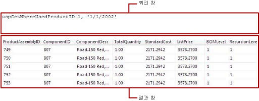

# <a name="text-based-query-designer-user-interface-report-builder"></a>텍스트 기반 쿼리 디자이너 사용자 인터페이스(보고서 작성기)
  텍스트 기반 쿼리 디자이너에서 데이터 원본에서 지원하는 쿼리 언어를 사용하여 쿼리를 지정하고, 쿼리를 실행하고, 디자인 타임에 결과를 볼 수 있습니다. 여러 개의 [!INCLUDE[tsql](../../includes/tsql-md.md)] 문, 사용자 지정 데이터 처리 확장 프로그램에 대한 쿼리 또는 명령 구문, 식으로 지정된 쿼리를 지정할 수 있습니다. 텍스트 기반 쿼리 디자이너는 쿼리를 전처리하지 않고 모든 종류의 쿼리 구문을 포함할 수 있으므로 많은 데이터 원본 유형에 대한 기본 쿼리 디자이너 도구입니다.  
  
> [!IMPORTANT]  
>  사용자는 쿼리를 작성하고 실행할 때 데이터 원본에 액세스합니다. 데이터 원본에 대해서는 읽기 전용 권한과 같이 최소한의 사용 권한을 부여해야 합니다.  
  
 텍스트 기반 쿼리 디자이너에서는 도구 모음과 다음과 같은 두 개의 창이 표시됩니다.  
  
-   **쿼리** 쿼리 유형에 따라 쿼리 텍스트, 테이블 이름 또는 저장 프로시저 이름을 표시합니다. 모든 데이터 원본 유형에서 모든 쿼리 유형을 사용할 수 있는 것은 아닙니다. 예를 들어 테이블 이름은 OLE DB와 같은 데이터 원본 유형에만 지원됩니다.  
  
-   **결과** 디자인 타임에 쿼리 실행 결과를 표시합니다.  
  
## <a name="text-based-query-designer-toolbar"></a>텍스트 기반 쿼리 디자이너 도구 모음  
 텍스트 쿼리 디자이너는 모든 명령 유형을 위한 단일 도구 모음을 제공합니다. 다음 표에서는 도구 모음에 있는 각 단추와 해당 기능을 나열합니다.  
  
|단추|설명|  
|------------|-----------------|  
|**텍스트로 편집**|텍스트 기반 쿼리 디자이너와 그래픽 쿼리 디자이너 사이를 전환합니다. 모든 데이터 원본 유형에서 그래픽 쿼리 디자이너를 지원하는 것은 아닙니다.|  
|**가져오기**|파일 또는 보고서에서 기존 쿼리를 가져옵니다. sql 및 rdl 파일 형식만 지원됩니다.|  
||쿼리를 실행하고 결과 창에 결과 집합을 표시합니다.|  
|**명령 유형**|**Text**, **StoredProcedure**또는 **TableDirect**를 선택합니다. 저장 프로시저에 매개 변수가 있을 경우 도구 모음에서 **실행** 을 클릭하면 **쿼리 매개 변수 정의** 대화 상자가 표시되며 필요에 따라 값을 입력할 수 있습니다. 명령 유형에 대한 지원은 데이터 원본 유형에 따라 달라집니다. 예를 들어 OLE DB 및 ODBC의 경우에만 **TableDirect**를 지원합니다.<br /><br /> 참고: 저장 프로시저에서 둘 이상의 결과 집합을 반환할 경우 첫 번째 결과 집합만 데이터 세트를 채우는 데 사용됩니다.|  
  
### <a name="command-type-text"></a>Text 명령 유형  
 [!INCLUDE[ssNoVersion](../../includes/ssnoversion-md.md)] 데이터 집합을 만들 때 기본적으로 관계형 쿼리 디자이너가 열립니다. 텍스트 기반 쿼리 디자이너로 전환하려면 도구 모음에서 **텍스트로 편집** 토글 단추를 클릭합니다. 텍스트 기반 쿼리 디자이너에는 쿼리 창 및 결과 창이 제공됩니다. 다음 그림에서는 레이블과 함께 각 창을 보여 줍니다.  
  
   
  
 다음 표에서는 각 창의 기능을 설명합니다.  
  
|창|함수|  
|----------|--------------|  
|쿼리|[!INCLUDE[tsql](../../includes/tsql-md.md)] 쿼리 텍스트를 표시합니다. 이 창을 사용하여 [!INCLUDE[tsql](../../includes/tsql-md.md)] 쿼리를 작성하거나 편집할 수 있습니다.|  
|결과|쿼리 결과를 표시합니다. 쿼리를 실행하려면 아무 창이나 마우스 오른쪽 단추로 클릭한 다음 **실행**을 클릭하거나 도구 모음에서 **실행** 단추를 클릭합니다.|  
  
#### <a name="example"></a>예제  
 다음 쿼리는 AdventureWorks2014 데이터베이스 **ContactType** 테이블에서 **Person** 스키마에 대한 이름 목록을 반환합니다.  
  
```  
SELECT Name FROM Person.ContactType  
```  
  
 도구 모음에서 **실행** 을 클릭할 경우 **쿼리** 창의 명령이 실행되고 **결과** 창에 결과가 표시됩니다. 결과 집합에 소유자 또는 영업 담당자 등의 20가지 연락처 유형이 있는 목록이 표시됩니다.  
  
### <a name="command-type-storedprocedure"></a>StoredProcedure 명령 유형  
 **명령 typeStoredProcedure**를 선택하면 텍스트 기반 쿼리 디자이너에 쿼리 창 및 결과 창이 제공됩니다. 쿼리 창에 저장 프로시저 이름을 입력하고 도구 모음에서 **실행** 을 클릭합니다. 저장 프로시저에서 매개 변수를 사용하는 경우 **쿼리 매개 변수 정의** 대화 상자가 열립니다. 저장 프로시저에 대한 매개 변수 값을 입력합니다. 모든 저장 프로시저 입력 매개 변수에 대해 보고서 매개 변수가 생성됩니다.  
  
 다음 그림에서는 저장 프로시저를 실행할 때 쿼리 및 결과 창을 보여 줍니다. 이 경우 입력 매개 변수는 상수입니다.  
  
   
  
 다음 표에서는 각 창의 기능을 설명합니다.  
  
|창|함수|  
|----------|--------------|  
|쿼리|저장 프로시저의 이름 및 입력 매개 변수(있는 경우)를 표시합니다.|  
|결과|쿼리 결과를 표시합니다. 쿼리를 실행하려면 아무 창이나 마우스 오른쪽 단추로 클릭한 다음 **실행**을 클릭하거나 도구 모음에서 **실행** 단추를 클릭합니다.|  
  
#### <a name="example"></a>예제  
 다음 쿼리는 AdventureWorks2014 저장 프로시저 **uspGetWhereUsedProductID**을 호출합니다. 쿼리를 실행할 때 제품 ID 번호 매개 변수에 대한 값을 입력해야 합니다.  
  
```  
uspGetWhereUsedProductID  
```  
  
 **실행** (**!**) 단추를 클릭합니다. 쿼리 매개 변수를 입력하라는 메시지가 표시되면 다음 표를 사용하여 값을 입력합니다.  
  
|||  
|-|-|  
|*@StartProductID*|820|  
|*@CheckDate*|20010115|  
  
 지정된 날짜에 대해 지정된 구성 요소 번호가 사용된 13개 제품 ID가 있는 목록이 결과 집합에 표시됩니다.  
  
### <a name="command-type-tabledirect"></a>TableDirect 명령 유형  
 **명령 typeTableDirect**를 선택하면 텍스트 기반 쿼리 디자이너에 쿼리 창 및 결과 창이 제공됩니다. 테이블을 입력하고 **실행** 단추를 클릭할 경우 해당 테이블의 모든 열이 반환됩니다.  
  
#### <a name="example"></a>예제  
 OLE DB 데이터 원본 유형의 경우 다음 데이터 세트 쿼리는 AdventureWorks2014 데이터베이스에 있는 모든 연락처 유형에 대한 결과 집합을 반환합니다.  
  
 `Person.ContactType`  
  
 테이블 이름 Person.ContactType을 입력하면 [!INCLUDE[tsql](../../includes/tsql-md.md)] 문 `SELECT * FROM Person.ContactType`을 만드는 것과 동일합니다.  
  
## <a name="see-also"></a>참고 항목  
 [관계형 쿼리 디자이너 사용자 인터페이스&#40;보고서 작성기&#41;](../../reporting-services/report-data/relational-query-designer-user-interface-report-builder.md)   
 [쿼리 디자이너&#40;보고서 작성기&#41;](https://msdn.microsoft.com/library/553f0d4e-8b1d-4148-9321-8b41a1e8e1b9)  
  
  
