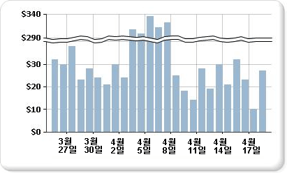

# 차트에 배율 구분선 추가(보고서 작성기 및 SSRS)

  배율 구분선은 값 축(일반적으로 세로 또는 Y축)에서 높은 값과 낮은 값 사이의 연속성을 구분하기 위해 차트의 그리기 영역에 표시되는 줄무늬입니다. 배율 구분선을 사용하여 동일한 차트 영역에 두 개의 서로 다른 범위를 표시할 수 있습니다.  
  
   
  
> [!NOTE]  
>  차트에서 배율 구분선의 배치 위치는 지정할 수 없습니다. 차트는 데이터 집합의 값을 기반으로 자체 계산을 사용하여 런타임에 값 축(y축)에 배율 구분선을 그릴 수 있을 만큼 데이터 범위가 충분히 분리되어 있는지 여부를 확인합니다.  
  
 배율 구분선이 있는 차트의 예는 예제 보고서로 제공됩니다. 이 샘플 보고서 및 기타 보고서를 다운로드하는 방법은 [보고서 작성기 및 보고서 디자이너 샘플 보고서](https://go.microsoft.com/fwlink/?LinkId=198283).  
  
> [!NOTE]  
>  [!INCLUDE[ssRBRDDup](../../includes/ssrbrddup-md.md)]  
  
### 차트에서 배율 구분선을 사용하려면  
  
1.  세로 축을 마우스 오른쪽 단추로 클릭한 다음 **축 속성**을 클릭합니다. **세로 축 속성** 대화 상자가 열립니다.  
  
2.  **배율 구분선 사용** 확인란을 선택합니다.  
  
### 배율 구분선 스타일을 변경하려면  
  
1.  속성 창을 엽니다.  
  
2.  디자인 화면에서 차트의 y축을 마우스 오른쪽 단추로 클릭합니다. y축 개체(기본 이름은 Chart Axis)에 대한 속성이 속성 창에 표시됩니다.  
  
3.  **배율** 섹션에서 ScaleBreakStyle 속성을 확장합니다.  
  
4.  BreakLineType 및 간격과 같은 ScaleBreakStyle 속성에 대한 값을 변경합니다. 배율 구분선 속성에 대한 자세한 내용은 [차트에 데이터 범위가 여러 개 있는 계열 표시&#40;보고서 작성기 및 SSRS&#41;](../../reporting-services/report-design/displaying-a-series-with-multiple-data-ranges-on-a-chart.md)를 참조하세요.  

## 다음 단계

[차트](../../reporting-services/report-design/charts-report-builder-and-ssrs.md)   
[차트 서식 지정](../../reporting-services/report-design/formatting-a-chart-report-builder-and-ssrs.md)   
[축 속성 대화 상자, 축 옵션](https://msdn.microsoft.com/library/b276e210-7a12-48ae-971b-7dabae51df11)  

추가 질문이 있으신가요? [Reporting Services 포럼에서 질문하기](https://go.microsoft.com/fwlink/?LinkId=620231)
