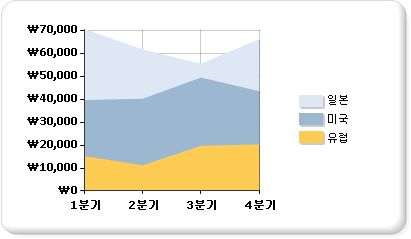

# 영역형 차트(보고서 작성기 및 SSRS)
  영역형 차트에서 계열은 선으로 연결된 일련의 점(선 아래 영역이 모두 채워짐)으로 표시됩니다. 영역형 차트에 데이터를 추가하는 방법에 대한 자세한 내용은 [차트&#40;보고서 작성기 및 SSRS&#41;](../../reporting-services/report-design/charts-report-builder-and-ssrs.md)를 참조하세요.  
  
 다음 그림에서는 누적 영역형 차트의 예를 보여 줍니다. 누적 영역형 차트에서는 모든 계열의 합계를 비롯하여 각 계열이 합계에서 차지하는 비율을 표시할 수 있으므로 이 차트에는 이 예에서와 같은 데이터를 표시하는 것이 적합합니다.  
  
   
  
> [!NOTE]  
>  [!INCLUDE[ssRBRDDup](../../includes/ssrbrddup-md.md)]  
  
## 변형  
  
-   **누적 영역형**. 여러 계열이 세로로 누적되는 영역형 차트입니다. 차트의 계열이 한 개뿐이면 누적 영역형 차트가 영역형 차트와 같은 모양으로 표시됩니다.  
  
-   **100% 기준 누적 영역형**. 전체 차트 영역에 꼭 맞도록 여러 계열을 세로로 누적하여 표시하는 영역형 차트입니다. 차트의 계열이 한 개뿐이면 누적 영역형 차트가 영역형 차트와 같은 모양으로 표시됩니다.  
  
-   **곡선 영역형**. 일반적인 직선 대신 매끄러운 곡선을 사용하여 데이터 요소를 연결하는 영역형 차트입니다. 개별 데이터 요소의 값을 표시하는 것보다 추세를 표시하는 것이 더 중요한 경우 영역형 차트 대신 곡선 영역형 차트를 사용합니다.  
  
## 영역형 차트의 데이터 고려 사항  
  
-   꺾은선형 차트 이외에 데이터를 연속적으로 표시할 수 있는 유일한 차트 종류는 영역형 차트입니다. 따라서 영역형 차트는 연속적인 기간 동안 발생하는 데이터를 나타내는 데 주로 사용됩니다.  
  
-   100% 기준 누적 영역형 차트는 일정 기간 동안 발생하는 데이터의 비율을 표시하는 데 적합합니다.  
  
-   계열이 한 개뿐이면 누적 영역형 차트가 영역형 차트와 같은 모양으로 표시됩니다.  
  
-   일반 영역형 차트에서는 여러 계열의 값이 유사한 경우 영역이 겹쳐 표시되어 중요한 데이터 요소 값을 식별하기가 쉽지 않을 수 있습니다. 영역형 차트에 여러 계열을 표시하도록 디자인된 누적 영역형 차트로 차트 종류를 변경하면 이 문제를 해결할 수 있습니다.  
  
-   누적 영역형 차트에 간격이 포함되어 있으면 데이터 집합에 빈 값이 포함되었음을 의미하는 것일 수 있습니다. 빈 값은 누적 영역형 차트에서 빈 섹션으로 표시됩니다. 데이터 집합에 빈 값이 포함되어 있으면 차트에 빈 요소를 삽입하는 것이 좋습니다. 빈 요소를 추가하면 차트의 빈 영역을 다른 색으로 채워 Null 값이나 0인 값을 쉽게 구별할 수 있습니다. 자세한 내용은 [차트에 빈 요소 추가&#40;보고서 작성기 및 SSRS&#41;](../../reporting-services/report-design/add-empty-points-to-a-chart-report-builder-and-ssrs.md)를 참조하세요.  
  
-   영역형 차트 종류의 동작 방식은 세로 막대형 및 꺾은선형 차트와 매우 비슷합니다. 여러 계열을 서로 비교하려는 경우에는 세로 막대형 차트를 대신 사용하는 것이 좋습니다. 일정 기간 동안의 추세를 분석하려는 경우에는 꺾은선형 차트를 사용하는 것이 좋습니다.  
  
## 참고 항목  
 [차트&#40;보고서 작성기 및 SSRS&#41;](../../reporting-services/report-design/charts-report-builder-and-ssrs.md)   
 [차트 종류&#40;보고서 작성기 및 SSRS&#41;](../../reporting-services/report-design/chart-types-report-builder-and-ssrs.md)   
 [꺾은선형 차트&#40;보고서 작성기 및 SSRS&#41;](../../reporting-services/report-design/line-charts-report-builder-and-ssrs.md)   
 [차트 종류 변경&#40;보고서 작성기 및 SSRS&#41;](../../reporting-services/report-design/change-a-chart-type-report-builder-and-ssrs.md)   
 [차트의 빈 데이터 요소 및 Null 데이터 요소&#40;보고서 작성기 및 SSRS&#41;](../../reporting-services/report-design/empty-and-null-data-points-in-charts-report-builder-and-ssrs.md)  
  
  
