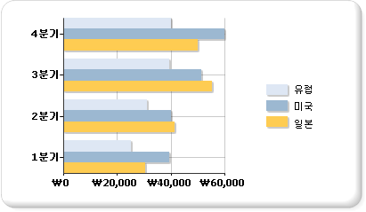

# 가로 막대형 차트(보고서 작성기 및 SSRS)
  가로 막대형 차트는 계열을 가로 막대 집합으로 표시합니다. 일반 가로 막대형 차트는 세로 막대 집합으로 계열을 표시하는 세로 막대형 차트 및 시작점과 끝점이 다양한 가로 막대 집합으로 계열을 표시하는 범위형 가로 막대 차트와 밀접하게 연관되어 있습니다.  
  
 가로 막대형 차트는 데이터를 가로로 표시하는 유일한 차트 종류입니다. 따라서 이 차트는 시작 및 끝 날짜가 명시된 일정한 기간 동안 발생하는 데이터를 나타내는 데 주로 사용됩니다. 범주를 가로로 표시할 수 있으므로 이 차트는 범주 정보를 표시하는 데도 자주 사용됩니다. 막대형 차트에 데이터를 추가하는 방법은 [차트&#40;보고서 작성기 및 SSRS&#41;](../../reporting-services/report-design/charts-report-builder-and-ssrs.md)를 참조하세요.  
  
 다음 그림에서는 가로 막대형 차트를 보여 줍니다. 세 계열이 모두 공통 기간을 공유하여 각 계열을 서로 비교하는 것이 가능하므로 이 데이터에는 가로 막대형 차트가 적합합니다.  
  
   
  
> [!NOTE]  
>  [!INCLUDE[ssRBRDDup](../../includes/ssrbrddup-md.md)]  
  
## 가로 막대형 차트의 변형  
  
-   **누적 가로 막대형**. 여러 계열이 세로로 누적되는 가로 막대형 차트입니다. 차트의 계열이 한 개뿐이면 누적 가로 막대형 차트가 가로 막대형 차트와 같은 모양으로 표시됩니다.  
  
-   **100% 기준 누적 가로 막대형**. 차트 영역 전체에 꼭 맞도록 여러 계열을 세로로 누적하여 표시하는 가로 막대형 차트입니다. 차트의 계열이 한 개뿐이면 모든 막대가 차트 영역 전체에 맞게 표시됩니다.  
  
-   **3D 묶은 가로 막대형**. 3차원 차트의 각 행에 개별 계열을 표시하는 가로 막대형 차트입니다.  
  
-   **3D 원통형**. 3차원 차트에서 원통형으로 막대 모양을 표시하는 가로 막대형 차트입니다.  
  
## 가로 막대형 차트의 데이터 고려 사항  
  
-   가로 막대형 차트에서는 축의 위치가 서로 바뀌어 범주 축이 세로 축("y 축")이 되고 값 축이 가로 축("x 축")이 됩니다. 목록을 읽는 방향이 위에서 아래이므로 가로 막대형 차트에서는 y 축을 따라 범주 레이블을 표시하는 데 사용할 공간을 더 많이 확보할 수 있습니다.  
  
-   가로 막대형 및 세로 막대형 차트는 그룹 간의 비교에 매우 일반적으로 사용됩니다. 네 개 이상의 계열을 차트에 표시해야 하는 경우에는 누적 가로 막대형 또는 세로 막대형 차트를 사용하는 것이 좋습니다. 차트에 표시할 계열이 여러 개인 경우 누적 가로 막대형 또는 세로 막대형 차트를 여러 개의 그룹으로 묶을 수도 있습니다.  
  
-   가로 막대형 차트는 값을 왼쪽에서 오른쪽으로 표시하므로 기간과 관련된 데이터를 표시하는 데 더 적합합니다.  
  
-   보고서 내의 테이블이나 행렬에 막대를 추가하려는 경우에는 가로 막대형 차트 대신 선형 계기를 사용하는 것이 좋습니다. 선형 계기는 여러 그룹 대신 한 개의 값만 표시하도록 디자인되었으므로 목록이나 테이블 데이터 영역 내에서 더 유연성 있게 사용할 수 있습니다. 자세한 내용은 [계기&#40;보고서 작성기 및 SSRS&#41;](../../reporting-services/report-design/gauges-report-builder-and-ssrs.md)를 참조하세요.  
  
-   가로 막대형 차트의 개별 막대에 특별한 그리기 스타일을 추가하여 시각적 효과를 더욱 높일 수 있습니다. 그리기 스타일에는 쐐기형, 볼록, 원통형 및 그라데이션 효과 등이 있습니다. 이러한 효과는 2D 차트의 모양을 향상시킬 목적으로 디자인되었습니다. 3D 차트를 사용할 때도 그리기 스타일을 적용할 수는 있지만 그 효과는 다를 수 있습니다. 막대형 차트에 그리기 스타일을 추가하는 방법에 대한 자세한 내용은 [차트에 빗면 효과, 볼록 효과 및 질감 스타일 추가&#40;보고서 작성기 및 SSRS&#41;](../../reporting-services/report-design/chart-effects-add-bevel-emboss-or-texture-report-builder.md)를 참조하세요.  
  
-   누적 가로 막대형 차트는 계열을 각 막대의 맨 위에 배치하여 누적되는 형태로 막대를 표시합니다. 누적 가로 막대형 차트를 범주별로 여러 스택 집합으로 구분하는 옵션이 제공됩니다. 그러면 그룹화된 누적 가로 막대형 차트가 나란히 표시됩니다. 차트에는 원하는 수의 그룹화된 계열을 누적할 수 있습니다.  
  
-   가로 막대형 차트에서 데이터 요소 레이블이 표시될 때 레이블은 각 막대의 바깥쪽에 배치됩니다. 이로 인해 차트 영역에 할당된 공간이 모두 차면 레이블이 겹칠 수 있습니다. 속성 창에서 **BarLabelStyle** 속성을 설정하여 각 막대에 대해 표시되는 데이터 요소 레이블의 위치를 변경할 수 있습니다.  
  
-   차트의 크기에 비해 데이터 세트에 데이터 요소가 많은 경우 열 또는 막대의 크기와 항목 사이의 공백이 감소됩니다. 차트에서 열 너비를 수동으로 설정하려면 **PointWidth** 속성을 수정하여 너비(픽셀)를 수정합니다. 기본적으로 이 속성 값은 0.8입니다. 차트에서 열 또는 막대의 너비를 늘리면 각 열 또는 막대 사이의 공백이 줄어듭니다.  
  
## 참고 항목  
 [차트&#40;보고서 작성기 및 SSRS&#41;](../../reporting-services/report-design/charts-report-builder-and-ssrs.md)   
 [차트 종류&#40;보고서 작성기 및 SSRS&#41;](../../reporting-services/report-design/chart-types-report-builder-and-ssrs.md)   
 [차트의 빈 데이터 요소 및 Null 데이터 요소&#40;보고서 작성기 및 SSRS&#41;](../../reporting-services/report-design/empty-and-null-data-points-in-charts-report-builder-and-ssrs.md)   
 [세로 막대형 차트&#40;보고서 작성기 및 SSRS&#41;](../../reporting-services/report-design/column-charts-report-builder-and-ssrs.md)   
 [범위형 차트&#40;보고서 작성기 및 SSRS&#41;](../../reporting-services/report-design/range-charts-report-builder-and-ssrs.md)   
 [차트에서 계열 색 서식 지정&#40;보고서 작성기 및 SSRS&#41;](../../reporting-services/report-design/formatting-series-colors-on-a-chart-report-builder-and-ssrs.md)   
 [차트의 축 레이블 서식 지정&#40;보고서 작성기 및 SSRS&#41;](../../reporting-services/report-design/formatting-axis-labels-on-a-chart-report-builder-and-ssrs.md)   
 [차트의 범례 서식 지정&#40;보고서 작성기 및 SSRS&#41;](../../reporting-services/report-design/chart-legend-formatting-report-builder.md)   
 [차트에 3D 가장자리, 볼록 및 질감 스타일 추가&#40;보고서 작성기 및 SSRS&#41;](../../reporting-services/report-design/chart-effects-add-bevel-emboss-or-texture-report-builder.md)   
 [자습서: 보고서에 가로 막대형 차트 추가(보고서 작성기)](https://go.microsoft.com/fwlink/?LinkId=198052)   
 [자습서: 보고서에 가로 막대형 차트 추가](https://go.microsoft.com/fwlink/?LinkId=198042)  
  
  
