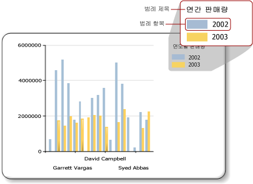

# 차트 범례 - 서식 지정(보고서 작성기)
  차트 범례에는 차트의 각 범주에 대한 설명이 포함됩니다. 범례는 항상 하나 이상의 범례 항목을 포함합니다. 각 범례 항목은 다음 그림에 표시된 대로 계열을 나타내는 색 지정된 상자 및 계열을 설명하는 텍스트 문자열로 구성되어 있습니다.  
  
   
  
 범례 항목은 범례가 개별 데이터 요소에 연결되는 셰이프 차트는 제외하고 차트의 개별 계열에 연결됩니다. 차트는 데이터에 대해 생성된 계열을 기반으로 범례에 항목을 자동으로 추가합니다.  
  
 **범례 속성** 대화 상자를 사용하거나 속성 창을 사용하여 범례의 서식을 지정할 수 있습니다. 범례를 마우스 오른쪽 단추로 클릭하고 **범례 속성** 을 클릭하여 범례 텍스트, 배경색, 테두리 및 3D 효과에 대한 값을 변경할 수 있습니다. 범례 제목의 값을 변경하려면 범례를 선택하고, 범례 제목을 마우스 오른쪽 단추로 클릭하고, **범례 제목 속성**을 클릭합니다.  
  
 범례에 이미지, 추가 열 또는 기타 보충 항목을 추가할 수 없습니다.  
  
> [!NOTE]  
>  [!INCLUDE[ssRBRDDup](../../includes/ssrbrddup-md.md)]  
  
## 범례에서 범례 항목 순서 지정  
 계열은 [!INCLUDE[ssRSnoversion](../../includes/ssrsnoversion-md.md)] 처리 엔진에서 처리하는 순서에 따라 범례에서 순서가 지정됩니다. 데이터 필드 끌어 놓기 영역에서 필드 순서를 변경하여 순서를 변경할 수 있습니다. 계열 그룹화를 사용하는 경우 계열 데이터는 처리될 때까지 알려지지 않으므로 이러한 항목의 순서를 다시 지정할 방법이 없습니다. 변경 내용을 미리 보기에서 볼 수 있습니다. 계열 그룹화에 대한 자세한 내용은 [차트&#40;보고서 작성기 및 SSRS&#41;](../../reporting-services/report-design/charts-report-builder-and-ssrs.md)을 클릭합니다.  
  
 계열을 범례에서 숨길 수 있습니다. 계열 그룹화를 사용하는 경우 데이터 필드와 관련된 모든 계열이 숨겨집니다. 자세한 내용은 [차트에서 범례 항목 숨기기&#40;보고서 작성기 및 SSRS&#41;](../../reporting-services/report-design/chart-legend-hide-items-report-builder.md)을 클릭합니다.  
  
## 범례에서 범례 항목의 텍스트 또는 색 변경  
 차트의 데이터 필드 끌어 놓기 영역에 필드를 배치하면 해당 필드의 이름이 들어 있는 범례 항목이 자동으로 생성됩니다. 기본적으로 각 범례 항목의 텍스트는 데이터 필드 이름에서 가져옵니다. 모든 범례 항목은 차트의 개별 계열에 연결됩니다. 단, 셰이프 차트의 경우 범례는 개별 계열 대신 개별 데이터 요소에 연결됩니다. 셰이프 차트에 범주 그룹이 정의된 경우 각 범례 항목의 텍스트는 범주 그룹의 문자열 표현에서 가져옵니다. 원형, 도넛형 및 깔때기형 차트에 사용자 지정 레이블 텍스트를 지정하여 범례의 각 개별 데이터 요소와 관련된 범주 그룹 레이블 이외의 정보를 표시할 수 있습니다. 이렇게 하려면 범례를 선택하고 **계열 속성** 대화 상자나 속성 창의 **LegendText** 속성에서 범례 텍스트를 지정합니다. 자세한 내용은 [범례 항목의 텍스트 변경&#40;보고서 작성기 및 SSRS&#41;](../../reporting-services/report-design/chart-legend-change-item-text-report-builder.md)을 클릭합니다.  
  
 **LegendText** 속성이나 **계열 속성** 대화 상자에서 일반적으로 참조되는 특성에 대해 대/소문자를 구분하는 차트 관련 키워드를 지정할 수도 있습니다. 차트 컨트롤은 이러한 키워드를 런타임에 해당 데이터 표현으로 대체합니다. 이 방법을 사용하면 특정 데이터 요소와 관련된 정보를 표시할 수 있으므로 셰이프 차트에 유용합니다. 자세한 내용은 [차트의 데이터 요소에 서식 지정&#40;보고서 작성기 및 SSRS&#41;](../../reporting-services/report-design/formatting-data-points-on-a-chart-report-builder-and-ssrs.md)을 클릭합니다.  
  
 각 범례 항목에 대해 표시되는 색 지정된 상자는 해당 계열의 채우기 색에서 상속됩니다. 따라서 범례 항목에 표시되는 색을 변경하려면 해당 계열 색을 변경해야 합니다. 자세한 내용은 [차트에서 계열 색 서식 지정&#40;보고서 작성기 및 SSRS&#41;](../../reporting-services/report-design/formatting-series-colors-on-a-chart-report-builder-and-ssrs.md)을 클릭합니다.  
  
## 범례에서 불필요한 범례 항목 제거  
 범례는 항상 계열에 연결됩니다. 범례 항목이 범례에 나타나지만 해당 계열이 차트에 표시되지 않는 경우 계열에 값이 없는 경우일 가능성이 가장 큽니다. 범례에서 범례 항목을 제거하려면 이 계열을 제거해야 합니다. 차트에서 계열을 제거하려면 지정된 계열을 마우스 오른쪽 단추로 클릭하고 계열 삭제 옵션을 선택합니다.  
  
## 범례 위치 변경  
 차트 영역은 축 레이블 및 그리기 영역을 포함하는 사각형 영역입니다. 범례가 차트 영역 밖에 배치되어 있는 경우 범례를 12개의 서로 다른 위치 중 하나로 끌 수 있습니다. 기본적으로 범례는 차트 영역 밖에 표시됩니다. 또한 **범례 속성** 대화 상자에서 위치를 설정할 수 있습니다.  
  
 차트 영역 내부 또는 외부로 범례를 끌 수 없습니다. 차트 영역 내부에 범례를 배치하려면 **범례 속성** 대화 상자의 **도킹**아래에 있는 드롭다운 목록에서 **기본값** 을 선택하고 **차트 영역 외부에 범례 표시** 옵션의 선택을 취소합니다. 차트 영역 내부에 범례를 배치하여 차트의 데이터 요소에 대한 공간을 최대화할 수 있습니다. 그러나 데이터 세트에 따라 범례가 데이터 영역의 일부 데이터 요소를 겹쳐 차트의 가독성을 저하시킬 수 있습니다.  
  
## 범례 항목 가로로 표시  
 기본적으로 범례의 서식은 각각 하나의 범례 항목을 포함하는 하나 이상의 행 목록으로 지정됩니다. 범례 영역은 범례 항목 수에 맞게 확장됩니다. 범례를 확장할 수 없는 경우 줄임표(...)가 표시됩니다. 지정된 범례 스타일에 따라 범례는 가로 또는 세로로 확장할 수 있습니다. **범례 속성** 대화 상자에서 레이아웃 스타일을 변경하거나 할당된 공간을 변경하여 모든 범례 항목을 표시할 수 있습니다.  
  
 범례를 가로로 표시하려면 범례를 차트의 맨 위 또는 맨 아래에서 도킹합니다. 이렇게 하면 범례가 가로로 확장됩니다. 또한 Layout 속성을 **행** 또는 **넓은 테이블**로 설정할 수 있습니다. 속성 창의 MaxAutoSize 속성을 설정하여 범례가 차트 영역의 맨 위 또는 맨 아래에서 도킹될 때 범례에 할당된 세로 공간을 제어할 수 있습니다.  
  
## 범례 텍스트 서식 지정  
 **범례 속성** 대화 상자의 **글꼴** 페이지에서 범례 텍스트의 글꼴, 크기, 스타일 및 색을 변경할 수 있습니다.  
  
 기본적으로 범례 텍스트는 범례 영역에 맞게 최적화되지 않습니다. 할당된 공간에 범례 텍스트를 자동으로 맞추려면 AutoFitTextDisabled 속성을 **False** 로 설정하고 MinFontSize 속성에 대한 최소 글꼴 크기를 표시 가능하면서도 범례를 최적화하는 데 적당한 가장 작은 글꼴 크기로 설정합니다.  
  
## 참고 항목  
 [범례 속성 대화 상자, 일반&#40;보고서 작성기 및 SSRS&#41;](https://msdn.microsoft.com/library/db718f8f-f185-422f-871c-96f0749e5893)   
 [범례 항목의 텍스트 변경&#40;보고서 작성기 및 SSRS&#41;](../../reporting-services/report-design/chart-legend-change-item-text-report-builder.md)   
 [차트 서식 지정&#40;보고서 작성기 및 SSRS&#41;](../../reporting-services/report-design/formatting-a-chart-report-builder-and-ssrs.md)   
 [차트에서 계열 색 서식 지정&#40;보고서 작성기 및 SSRS&#41;](../../reporting-services/report-design/formatting-series-colors-on-a-chart-report-builder-and-ssrs.md)   
 [차트&#40;보고서 작성기 및 SSRS&#41;](../../reporting-services/report-design/charts-report-builder-and-ssrs.md)   
 [차트에서 범례 항목 숨기기&#40;보고서 작성기 및 SSRS&#41;](../../reporting-services/report-design/chart-legend-hide-items-report-builder.md)   
 [색상표를 사용하여 차트에 대한 색 정의&#40;보고서 작성기 및 SSRS&#41;](../../reporting-services/report-design/define-colors-on-a-chart-using-a-palette-report-builder-and-ssrs.md)  
  
  
