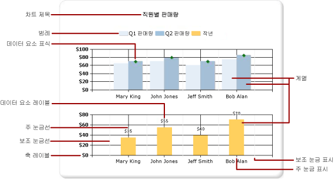
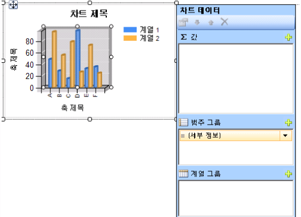
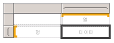

# 차트(보고서 작성기 및 SSRS)
차트 데이터 영역을 사용하는 방법에 대해 읽고 페이지를 매긴 [!INCLUDE[ssRSnoversion_md](../../includes/ssrsnoversion-md.md)] 보고서를 읽는 사용자가 한 눈에 집계된 많은 양의 데이터를 이해할 수 있도록 합니다.  

차트를 만들기 전에 데이터를 신중하게 준비하고 이해하는 데 더 많은 시간을 보낼수록 차트를 더 빠르고 효율적으로 디자인할 수 있습니다. 사용할 차트를 선택하는 도움말은 [차트 형식](../../reporting-services/report-design/chart-types-report-builder-and-ssrs.md)을 참조하세요. 즉시 차트를 사용해 보려면 [보고서 작성기 자습서](../../reporting-services/report-builder-tutorials.md)에서 막대, 열, 스파크 라인 및 원형 차트 자습서를 참조하세요.  
  
 다음 그림에서는 차트에 사용되는 다양한 요소를 보여 줍니다.  
  
   
  
 차트를 보고서와는 별도로 *보고서 파트*로 게시할 수 있습니다. 자세한 내용은 [보고서 파트](../../reporting-services/report-design/report-parts-report-builder-and-ssrs.md)를 참조하세요.
  
 
##   차트 디자인  
 디자인 화면에 차트 데이터 영역을 추가한 후에는 숫자 데이터 및 숫자가 아닌 데이터에 대한 보고서 데이터 집합 필드를 차트의 차트 데이터 창으로 끌 수 있습니다. 디자인 화면에서 차트를 클릭하면 범주 그룹, 계열 그룹 및 값의 세 영역이 포함된 차트 데이터 창이 나타납니다. 보고서에 공유 데이터 집합이나 포함된 데이터 집합이 있는 경우 데이터 집합의 필드가 보고서 데이터 창에 나타납니다. 필드를 데이터 집합에서 차트 데이터 창의 적절한 영역으로 끕니다. 기본적으로 차트의 영역 중 하나에 필드를 추가하면 [!INCLUDE[ssRSnoversion](../../includes/ssrsnoversion-md.md)] 에서 필드에 대한 집계를 계산합니다. 계열 그룹화를 사용하여 계열을 동적으로 생성할 수도 있습니다. 차트는 [행렬처럼 구성](#SimilarMatrix)됩니다.  
  
   
  
> [!NOTE]  
>  디자인 타임의 차트 데이터는 보고서를 처리할 때의 차트 데이터와 다릅니다. 즉, 디자인 타임의 데이터는 실제 데이터가 아니며, 차트의 모양을 예측하면서 차트를 디자인할 수 있도록 추가되는 생성된 데이터입니다.  
  
##  행렬같은 차트 방식  
 차트 작동 방식을 설명하는 방법 중 하나는 행렬과 비교하는 것입니다.  
  
   
  
 개념상 차트와 행렬의 구성은 동일합니다.  
  
-   행렬의 열 그룹은 차트의 범주 그룹 영역과 비슷합니다.  
  
-   행렬의 열 그룹은 차트의 범주 그룹 영역과 비슷합니다.  
  
-   행렬의 데이터 영역은 차트의 값 영역과 비슷합니다.  
  
 
##   차트에 데이터 추가  
 이름별 판매량(Sales by Name)을 표시하는 보고서가 있다고 가정해 보십시오. Full Name 필드를 범주 그룹 영역으로 끌어 놓고 Sales 필드를 값 영역으로 끌어 놓습니다.  
  
 값 영역에 Sales 필드를 추가하면 데이터 필드의 텍스트가 범례에 나타나고 이 숫자 필드의 데이터가 하나의 값으로 집계됩니다. 기본적으로 값은 기본 제공 함수 Sum을 사용하여 집계됩니다. 차트 데이터 창에는 필드에 대한 단순 식이 포함됩니다. 이 예제에서는 필드 식 `[Sum(Sales)]` 에 대해 `=Sum(Fields!Sales.Value)`가 나타납니다. 지정된 그룹이 없으면 차트에는 하나의 데이터 요소만 표시됩니다. 여러 데이터 요소를 표시하려면 그룹화 필드를 추가하여 데이터를 그룹화해야 합니다. 범주 그룹 영역에 Name 필드를 추가하면 필드와 이름이 같은 그룹화 필드가 자동으로 차트에 추가됩니다. x축과 y축을 따라 값을 정의하는 필드를 추가하면 차트에서 데이터를 올바르게 표시할 수 있도록 충분한 정보가 준비됩니다.  
  
   
  
 계열 그룹 영역을 비워 두면 계열의 수는 디자인 타임에 고정됩니다. 이 예제에서는 차트에 Sales 계열만 나타납니다.  
  
 
##   차트의 범주 및 계열 그룹  
 차트는 중첩된 범주 및 계열 그룹을 지원합니다. 차트에는 세부 데이터가 표시되지 않습니다. 데이터 집합 필드를 선택한 차트의 범주 및 계열 끌어 놓기 영역으로 끌어 차트에 그룹을 추가합니다  
  
 원형 차트와 같은 셰이프 차트는 범주 그룹 및 중첩 범주 그룹을 지원합니다. 가로 막대형 차트 등의 기타 차트는 범주 그룹 및 계열 그룹을 지원합니다. 그룹을 중첩할 수는 있지만 범주 또는 계열 수가 차트의 정보를 가리지 않도록 해야 합니다.  
  
### 차트에 계열 그룹화 추가  
 계열 그룹 영역에 필드를 추가한 경우 계열 수는 해당 필드에 포함된 데이터에 따라 달라집니다. 이전 예제에서 계열 그룹 영역에 Year 필드를 추가한다고 가정해 보겠습니다. Year 필드의 값 수에 따라 차트에 나타날 계열 수가 결정됩니다. Year 필드에 2004년, 2005년 및 2006년이 포함된 경우 차트에는 값 영역의 모든 필드에 대해 세 개의 계열이 표시됩니다.  
  
##   차트를 만들기 전의 데이터 집합 고려 사항  
 차트는 데이터에 대한 요약 보기를 제공합니다. 그러나 데이터 집합이 큰 경우에는 차트의 정보가 가려지거나 알아볼 수 없게 표시될 수 있습니다. 누락된 또는 Null 데이터 요소, 차트 종류에 맞지 않는 데이터 형식, 차트와 테이블을 조합하는 등의 고급 응용 프로그램은 모두 차트의 가독성에 영향을 미칠 수 있습니다. 차트를 신속하고 효과적으로 디자인하려면 차트를 디자인하기 전에 신중하게 데이터를 준비하고 이해해야 합니다.  
  
 보고서에 포함할 수 있는 차트의 수에는 제한이 없습니다. 차트는 행렬 또는 테이블 등의 다른 데이터 영역과 마찬가지로 단일 데이터 집합에 바인딩됩니다. 여러 데이터 집합을 같은 차트에 표시하려면 차트에 데이터를 추가하기 전에 SQL 쿼리에서 JOIN 또는 UNION 문을 사용하는 추가 데이터 집합을 만듭니다. JOIN 및 UNION 문에 대한 자세한 내용은 온라인 설명서나 다른 SQL 참조를 참조하십시오.  
  
 세부 데이터가 필요 없거나 유용하지 않은 경우에는 데이터 집합 쿼리에서 데이터를 사전 집계하는 것을 고려하십시오. 각 데이터 요소를 보다 명확하게 표시하려면 데이터 집합에서 범주의 수를 줄입니다. 데이터 집합을 필터링하거나 반환되는 행의 수를 줄이는 조건을 쿼리에 추가할 수 있습니다. 
  
##   차트에 데이터를 표시하기 위한 최상의 방법  
 차트는 기본 정보에 대한 명확한 이미지를 제공할 수 있을 만큼의 요소 수가 표시될 때 가장 효과적입니다. 분산형 그래프와 같은 일부 차트는 데이터 요소가 많을수록 좋지만 원형 차트와 같은 다른 차트는 데이터 요소가 적을수록 더 효과적입니다. 데이터 집합의 값과 정보를 표시할 방법에 따라 신중하게 차트 종류를 선택해야 합니다. 자세한 내용은 [차트 종류&#40;보고서 작성기 및 SSRS&#41;](../../reporting-services/report-design/chart-types-report-builder-and-ssrs.md)를 참조하세요.  
  
 차트에 데이터를 통합하는 데는 여러 가지 방법이 있습니다.  
  
-   원형 차트를 사용할 경우 작은 조각을 "기타"라는 한 조각으로 수집합니다. 이렇게 하면 원형 차트 조각의 수가 줄어듭니다. 자세한 내용은 [원형 차트에서 작은 조각 수집&#40;보고서 작성기 및 SSRS&#41;](../../reporting-services/report-design/collect-small-slices-on-a-pie-chart-report-builder-and-ssrs.md)를 참조하세요.  
  
-   데이터 요소가 많은 경우에는 데이터 요소 레이블을 사용하지 않는 것이 좋습니다. 데이터 요소 레이블은 차트에 요소의 수가 적을 때 가장 효과적입니다.  
  
-   원하지 않거나 관계없는 데이터를 필터링합니다. 이렇게 하면 차트에서 보여 주려는 핵심 데이터를 강조하는 데 도움이 됩니다. 차트에서 데이터 요소를 필터링하려면 범주 그룹이나 계열 그룹에 대해 필터를 설정합니다. 기본적으로 차트에서는 기본 제공 함수 Sum을 사용하여 동일한 그룹에 속하는 값을 계열의 개별 데이터 요소로 집계합니다. 계열의 집계 함수를 변경할 경우에는 필터 식의 집계 함수도 변경해야 합니다. 자세한 내용은 [데이터 필터링, 그룹화 및 정렬&#40;보고서 작성기 및 SSRS&#41;](../../reporting-services/report-design/filter-group-and-sort-data-report-builder-and-ssrs.md)를 참조하세요.  
  
-   테이블 또는 행렬 템플릿의 비율 데이터를 표시하려면 막대 그래프 대신 선형 계기를 사용해 보십시오. 계기는 셀 내의 단일 값을 보여 주는 데 더 적합합니다. 자세한 내용은 [중첩된 데이터 영역&#40;보고서 작성기 및 SSRS&#41;](../../reporting-services/report-design/nested-data-regions-report-builder-and-ssrs.md)를 참조하세요.  
   
##   차트에서 데이터 필드의 값 집계  
 기본적으로 차트의 값 영역에 필드를 추가하면 [!INCLUDE[ssRSnoversion](../../includes/ssrsnoversion-md.md)] 에서 필드에 대한 집계를 계산합니다. 필드를 특정 영역에 끌어다 놓지 않고 차트로 끌면 차트는 필드의 데이터 형식에 기반하여 이 필드가 범주(x) 축에 속하는지 값(y) 축에 속하는지 결정합니다. 값 영역에 끌어다 놓은 숫자 필드는 SUM 함수를 사용하여 집계됩니다. 값 필드의 데이터 형식이 값 영역에서 문자열인 경우 차트는 필드에 숫자가 있더라도 숫자 값을 표시할 수 없으므로 차트는 COUNT 함수를 표시합니다. 이러한 현상을 방지하려면 필드에 서식 지정된 숫자가 포함된 문자열이 아니라 숫자 데이터 형식이 지정되어야 합니다. Visual Basic 식을 사용하여 **CDbl** 또는 **CInt** 상수로 문자열 값을 숫자 데이터 형식으로 변환할 수 있습니다. 예를 들어 다음의 복잡한 식은 문자열 형식으로 지정된 숫자 값이 포함된 `MyField` 라는 필드를 변환합니다.  
  
 `=Sum(CDbl(Fields!MyField.Value))`  
  
 집계 식에 대한 자세한 내용은 [집계 함수 참조&#40;보고서 작성기 및 SSRS&#41;](../../reporting-services/report-design/report-builder-functions-aggregate-functions-reference.md)를 참조하세요.  
   
##   섹션 내용  
 [보고서에 차트 추가&#40;보고서 작성기 및 SSRS&#41;](../../reporting-services/report-design/add-a-chart-to-a-report-report-builder-and-ssrs.md)  
 보고서에 차트를 추가할 때 첫 번째로 수행하는 단계에 대해 설명합니다.  
  
 [차트 종류&#40;보고서 작성기 및 SSRS&#41;](../../reporting-services/report-design/chart-types-report-builder-and-ssrs.md)  
 다양한 차트 종류를 사용할 때의 고려 사항 및 최선의 방법을 포함하여 [!INCLUDE[ssRSnoversion](../../includes/ssrsnoversion-md.md)]에서 사용할 수 있는 모든 차트 종류 및 하위 종류에 대해 설명합니다.  
  
 [차트 서식 지정&#40;보고서 작성기 및 SSRS&#41;](../../reporting-services/report-design/formatting-a-chart-report-builder-and-ssrs.md)  
 서식을 사용하여 전반적인 차트 모양을 향상시키고 중요한 데이터 요소를 강조 표시합니다.  
  
 [차트의 빈 데이터 요소 및 Null 데이터 요소&#40;보고서 작성기 및 SSRS&#41;](../../reporting-services/report-design/empty-and-null-data-points-in-charts-report-builder-and-ssrs.md)  
 비어 있거나 null인 값이 포함된 필드를 기반으로 하는 차트를 사용할 때의 고려 사항에 대해 설명합니다.  
  
 [차트에 데이터 범위가 여러 개 있는 계열 표시&#40;보고서 작성기 및 SSRS&#41;](../../reporting-services/report-design/displaying-a-series-with-multiple-data-ranges-on-a-chart.md)  
 둘 이상의 데이터 범위가 포함된 계열에 배율 구분선을 추가하는 방법을 설명합니다.  
  
 [차트의 여러 계열&#40;보고서 작성기 및 SSRS&#41;](../../reporting-services/report-design/multiple-series-on-a-chart-report-builder-and-ssrs.md)  
 차트 종류 결합, 보조 축 사용, 여러 차트 종류 지정, 여러 차트 영역 사용 등 동일한 차트에 여러 계열을 표시하는 방법을 다양하게 소개합니다.  
  
 [동일한 데이터 집합에 여러 데이터 영역 연결&#40;보고서 작성기 및 SSRS&#41;](../../reporting-services/report-design/linking-multiple-data-regions-to-the-same-dataset-report-builder-and-ssrs.md)  
 동일한 보고서 데이터 집합의 여러 데이터 보기를 제공합니다.  
  
 [차트에서 그룹 추가 또는 삭제&#40;보고서 작성기 및 SSRS&#41;](../../reporting-services/report-design/add-or-delete-a-group-in-a-chart-report-builder-and-ssrs.md)  
 차트에 그룹 및 중첩된 그룹을 추가하는 방법에 대해 설명합니다.  
  
 [차트에 이동 평균 추가&#40;보고서 작성기 및 SSRS&#41;](../../reporting-services/report-design/add-a-moving-average-to-a-chart-report-builder-and-ssrs.md)  
 이동 평균 수식을 사용하여 계열의 데이터 평균을 계산하는 방법에 대해 설명합니다.  
  
 [차트 문제 해결&#40;보고서 작성기 및 SSRS&#41;](../../reporting-services/report-design/troubleshoot-charts-report-builder-and-ssrs.md)  
 차트 사용 관련 팁에 대해 설명합니다.  
  
## 참고 항목  
 [이미지, 입력란, 사각형 및 선&#40;보고서 작성기 및 SSRS&#41;](../../reporting-services/report-design/images-text-boxes-rectangles-and-lines-report-builder-and-ssrs.md)   
 [대화형 정렬, 문서 구조 및 링크&#40;보고서 작성기 및 SSRS&#41;](../../reporting-services/report-design/interactive-sort-document-maps-and-links-report-builder-and-ssrs.md)   
 [중첩된 데이터 영역&#40;보고서 작성기 및 SSRS&#41;](../../reporting-services/report-design/nested-data-regions-report-builder-and-ssrs.md)   
 [자습서: 보고서에 세로 막대형 차트 추가&#40;보고서 작성기&#41;](../../reporting-services/tutorial-add-a-column-chart-to-your-report-report-builder.md)   
 [자습서: 보고서에 원형 차트 추가&#40;보고서 작성기&#41;](../../reporting-services/tutorial-add-a-pie-chart-to-your-report-report-builder.md)   
 [자습서: 보고서에 막대형 차트 추가&#40;보고서 작성기&#41;](../../reporting-services/tutorial-add-a-bar-chart-to-your-report-report-builder.md)  
  
  
