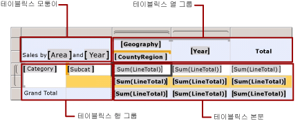

# 보고서 페이지에서 테이블릭스 데이터 영역 표시 제어
보고서를 볼 때 나타나는 방식을 변경하려면 테이블, 행렬 또는 목록 데이터 영역에 대해 [!INCLUDE[ssRSnoversion_md](../../includes/ssrsnoversion-md.md)] 페이지를 매긴 보고서에서 설정할 수 있는 속성을 참조하세요.  
   
## 데이터 모양 제어  
테이블, 행렬 및 목록 데이터 영역은 모두 일종의 *테이블릭스* 데이터 영역입니다. 다음 기능을 사용하여 테이블릭스 데이터 영역의 모양을 제어할 수 있습니다.  
  
-   **데이터 서식 지정.** 테이블, 행렬 또는 목록에서 데이터 형식을 지정하려면 셀에서 입력란의 형식 속성을 설정합니다. 동시에 여러 셀의 속성을 설정할 수 있습니다. 차트의 데이터 형식을 지정하려면 계열에서 형식 속성을 설정합니다. 자세한 내용은 [보고서 항목 서식 지정&#40;보고서 작성기 및 SSRS&#41;](../../reporting-services/report-design/formatting-report-items-report-builder-and-ssrs.md) 및 [차트 서식 지정&#40;보고서 작성기 및 SSRS&#41;](../../reporting-services/report-design/formatting-a-chart-report-builder-and-ssrs.md)를 참조하세요.  
  
-   **식 작성**. 자세한 내용은 [보고서에 사용되는 식&#40;보고서 작성기 및 SSRS&#41;](../../reporting-services/report-design/expression-uses-in-reports-report-builder-and-ssrs.md) 및 [식 예&#40;보고서 작성기 및 SSRS&#41;](../../reporting-services/report-design/expression-examples-report-builder-and-ssrs.md)를 참조하세요.  
  
-   **정렬 순서 제어**. 정렬 순서를 제어하려면 데이터 영역에서 정렬 식을 정의합니다. 그룹에 연결된 행 및 열에 대한 정렬 순서를 제어하려면 세부 정보 그룹을 포함한 그룹에서 정렬 식을 정의합니다. 대화형 정렬 단추를 추가하면 사용자가 테이블릭스 데이터 영역이나 해당 그룹을 정렬할 수 있습니다. 자세한 내용은 [데이터 영역의 데이터 정렬&#40;보고서 작성기 및 SSRS&#41;](../../reporting-services/report-design/sort-data-in-a-data-region-report-builder-and-ssrs.md)을 참조하세요.  
  
-   **데이터가 없을 때 메시지 표시**. 런타임에 보고서 데이터 세트에 대한 데이터가 없을 때 데이터 영역에 표시할 고유의 메시지를 작성할 수 있습니다. 자세한 내용은 [데이터 영역에 대한 데이터 없음 메시지 설정&#40;보고서 작성기 및 SSRS&#41;](../../reporting-services/report-data/set-a-no-data-message-for-a-data-region-report-builder-and-ssrs.md)을 참조하세요.  
  
-   **조건에 따라 데이터 숨기기**. 데이터 영역이나 데이터 영역의 일부를 표시할지 여부를 조건부로 제어하려면 Hidden 속성을 **True** 또는 식으로 설정합니다. 식에는 보고서 매개 변수에 대한 참조를 포함할 수 있습니다. 토글 항목을 지정하면 사용자가 정보 데이터를 표시할지를 결정할 수도 있습니다. 자세한 내용은 [드릴다운 동작&#40;보고서 작성기 및 SSRS&#41;](../../reporting-services/report-design/drilldown-action-report-builder-and-ssrs.md)을 참조하세요.  
  
-   **셀 병합.** 테이블 내의 여러 연속 셀을 하나의 셀로 병합할 수 있습니다. 이를 열 확장 또는 셀 병합이라고 합니다. 셀은 가로 또는 세로로만 결합할 수 있습니다. 셀을 병합하면 첫 번째 셀의 데이터만 유지됩니다. 다른 셀의 데이터는 제거됩니다. 병합된 셀은 원래 열로 나눌 수 있습니다. 자세한 내용은 [데이터 영역의 셀 병합&#40;보고서 작성기 및 SSRS&#41;](../../reporting-services/report-design/merge-cells-in-a-data-region-report-builder-and-ssrs.md)을 참조하세요.  
  
## 페이지에서 테이블릭스 데이터 영역 위치 및 확장 제어  
 다음 기능을 사용하여 테이블릭스 데이터 영역이 렌더링된 보고서에 표시되는 방법을 제어할 수 있습니다.  
  
-   **다른 보고서 항목을 기준으로 테이블릭스 데이터 영역의 위치 제어**. 테이블릭스 데이터 영역은 보고서 디자인 화면에서 다른 보고서 항목의 위, 옆 또는 아래에 배치될 수 있습니다. [!INCLUDE[ssRSnoversion](../../includes/ssrsnoversion-md.md)] 는 런타임에 피어 보고서 항목을 필요에 따라 이동하면서 연결된 데이터 집합에서 검색된 데이터에 맞게 테이블릭스 데이터 영역을 확장합니다. 다른 보고서 항목 옆에 테이블릭스를 고정시키려면 보고서 항목을 피어로 만들고 상대적 위치를 조정합니다. 자세한 내용은 [렌더링 동작&#40;보고서 작성기 및 SSRS&#41;](../../reporting-services/report-design/rendering-behaviors-report-builder-and-ssrs.md)을 참조하세요.  
  
-   **확장 방향 변경**. 페이지에서 테이블릭스 데이터 영역을 LTR(왼쪽에서 오른쪽) 또는 RTL(오른쪽에서 왼쪽)로 확장할지 여부를 제어하려면 속성 창을 통해 액세스할 수 있는 Direction 속성을 사용합니다. 자세한 내용은 [데이터 영역 렌더링&#40;보고서 작성기 및 SSRS&#41;](../../reporting-services/report-design/rendering-data-regions-report-builder-and-ssrs.md)를 참조하세요.  
  
## 페이지에서 테이블릭스 데이터 영역 렌더링 방법 제어  
 다음 목록에서는 보고서에 테이블릭스 데이터 영역이 표시되는 방법을 제어하는 방식에 대해 설명합니다.  
  
-   **페이지 나누기 제어**. 각 보고서 페이지에 표시되는 데이터 양을 제어하려면 데이터 영역에서 페이지 나누기를 설정합니다. 그룹에서 페이지 나누기를 설정할 수도 있습니다. 페이지 나누기는 각 페이지에서 처리해야 하는 데이터 양을 줄여 요청 시 렌더링 성능에 영향을 줄 수 있습니다. 자세한 내용은 [Reporting Services의 페이지 매김&#40;보고서 작성기 및 SSRS&#41;](../../reporting-services/report-design/pagination-in-reporting-services-report-builder-and-ssrs.md) 및 [페이지 나누기 추가&#40;보고서 작성기 및 SSRS&#41;](../../reporting-services/report-design/add-a-page-break-report-builder-and-ssrs.md)를 참조하세요.  
  
-   **행 머리글 양쪽에 데이터 표시**. 테이블릭스 데이터 영역의 어느 쪽에나 행 머리글을 표시할 수 있습니다. 행 머리글을 다른 열로 이동하여 데이터 열이 행 머리글 앞에 표시되도록 할 수 있습니다. 이렇게 하려면 행렬에 대한 GroupsBeforeRowHeaders 속성을 수정합니다. 속성 창을 통해 이 속성에 액세스할 수 있습니다. 이 속성 값은 정수입니다. 예를 들어 값이 2이면 행 머리글이 포함된 열을 표시하기 전에 데이터 영역 열 데이터의 그룹 두 개를 표시합니다.  
  
## 테이블릭스 행과 열 그룹의 렌더링 방법 제어  
 테이블릭스 데이터 영역 그룹이 렌더링되는 방식을 제어하려면 그룹 구조를 고려해야 합니다. 테이블릭스 데이터 영역은 그림과 같이 네 가지 영역으로 구성될 수 있습니다.  
  
   
  
 행 그룹 영역과 열 그룹 영역에는 그룹 머리글이 들어 있습니다. 테이블릭스 데이터 영역에 그룹 머리글이 있는 경우에는 **테이블릭스 속성** 대화 상자의 **일반** 페이지에 있는 속성을 설정하여 행과 열이 반복되는 방식을 제어합니다.  
  
 테이블릭스 데이터 영역에 테이블릭스 본문 영역만 있으면 그룹 머리글이 없고 정적 및 동적 테이블릭스 멤버만 있습니다. 정적 멤버는 테이블릭스 행 또는 열 그룹을 기준으로 한 번만 표시되고 동적 멤버는 고유한 각 그룹 값에 대해 한 번씩 반복됩니다. 예를 들어 판매 주문이 표시되는 테이블릭스 데이터 영역의 경우 판매 주문의 열 이름을 정적 행 멤버에 표시할 수 있습니다. 판매 주문의 각 줄은 동적 행 멤버에 표시됩니다.  
  
 속성 창의 속성을 설정하여 테이블릭스 멤버가 렌더링되는 방법을 제어할 수 있습니다. 자세한 내용은 [그룹화 창&#40;보고서 작성기&#41;](../../reporting-services/report-design/grouping-pane-report-builder.md)에서 "고급 모드"를 참조하세요.  
  
 다음 목록에서는 보고서에 테이블릭스 데이터 영역이 표시되는 방법을 제어하는 방식에 대해 설명합니다.  
  
-   **여러 페이지에 행 및 열 머리글 반복**. 테이블릭스 데이터 영역이 걸쳐 있는 페이지마다 행 및 열 머리글을 표시할 수 있습니다. 자세한 내용은 [여러 페이지에 행 및 열 머리글 표시&#40;보고서 작성기 및 SSRS&#41;](../../reporting-services/report-design/display-row-and-column-headers-on-multiple-pages-report-builder-and-ssrs.md)를 참조하세요.  
  
-   **스크롤할 때 행 및 열 머리글 표시 유지**. 브라우저를 사용하여 보고서를 스크롤할 때 행 및 열 머리글이 표시되도록 유지할지 여부를 제어할 수 있습니다. 자세한 내용은 [보고서를 스크롤할 때 헤더 계속 표시&#40;보고서 작성기 및 SSRS&#41;](../../reporting-services/report-design/keep-headers-visible-when-scrolling-through-a-report-report-builder-and-ssrs.md)를 참조하세요.  
  
 보고서를 다른 형식으로 내보내는 경우 페이지에서 테이블릭스 데이터 영역이 렌더링되는 방식에 미치는 영향은 [렌더링 동작&#40;보고서 작성기 및 SSRS&#41;](../../reporting-services/report-design/rendering-behaviors-report-builder-and-ssrs.md)를 참조하세요.  
  
## 참고 항목  
 [동일한 데이터 집합에 여러 데이터 영역 연결&#40;보고서 작성기 및 SSRS&#41;](../../reporting-services/report-design/linking-multiple-data-regions-to-the-same-dataset-report-builder-and-ssrs.md)   
 [중첩된 데이터 영역&#40;보고서 작성기 및 SSRS&#41;](../../reporting-services/report-design/nested-data-regions-report-builder-and-ssrs.md)   
 [합계, 집계 및 기본 제공 컬렉션의 식 범위&#40;보고서 작성기 및 SSRS&#41;](../../reporting-services/report-design/expression-scope-for-totals-aggregates-and-built-in-collections.md)   
 [페이지 나누기, 머리글, 열 및 행 제어&#40;보고서 작성기 및 SSRS&#41;](../../reporting-services/report-design/controlling-page-breaks-headings-columns-and-rows-report-builder-and-ssrs.md)   
 [테이블릭스 데이터 영역&#40;보고서 작성기 및 SSRS&#41;](../../reporting-services/report-design/tablix-data-region-report-builder-and-ssrs.md)   
 [테이블&#40;보고서 작성기 및 SSRS&#41;](../../reporting-services/report-design/tables-report-builder-and-ssrs.md)   
 [행렬 만들기](../../reporting-services/report-design/create-a-matrix-report-builder-and-ssrs.md)   
 [목록을 사용하여 송장 및 양식 만들기](../../reporting-services/report-design/create-invoices-and-forms-with-lists-report-builder-and-ssrs.md)   
 [테이블, 행렬 및 목록&#40;보고서 작성기 및 SSRS&#41;](../../reporting-services/report-design/tables-matrices-and-lists-report-builder-and-ssrs.md)  
  
  
