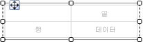
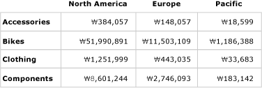
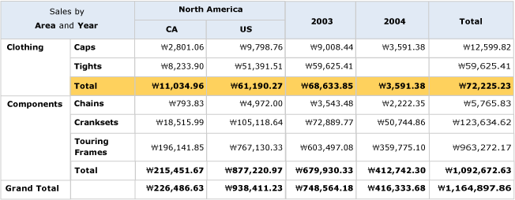
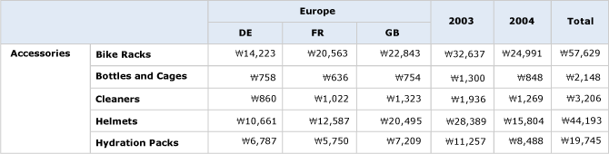

# 행렬 만들기(보고서 작성기 및 SSRS)
  행렬을 사용하여 그룹화된 데이터 및 요약 정보를 표시할 수 있습니다. 행 및 열 그룹의 여러 필드나 식으로 데이터를 그룹화할 수 있습니다. 행렬은 크로스탭 및 피벗 테이블과 비슷한 기능을 제공합니다. 런타임에 보고서 데이터 및 데이터 영역이 결합되면서 페이지에서 행렬이 가로와 세로 방향으로 확장됩니다. 행렬 셀의 값으로는 셀이 속한 행 및 열 그룹의 교차점으로 한정된 집계 값이 표시됩니다. 행 및 열의 서식을 지정하여 강조하려는 데이터를 강조 표시할 수 있습니다. 또한 처음에 정보 데이터를 숨기는 드릴다운 토글을 포함할 수도 있습니다. 사용자는 필요한 경우 이 토글을 클릭하여 내용을 자세히 또는 간략히 볼 수 있습니다.  
  
 최초 디자인 후에도 사용자의 보기 환경을 개선하기 위해 계속해서 행렬을 개발할 수 있습니다. 자세한 내용은 [보고서 페이지에서 테이블릭스 데이터 영역 표시 제어&#40;보고서 작성기 및 SSRS&#41;](../../reporting-services/report-design/controlling-the-tablix-data-region-display-on-a-report-page.md)를 참조하세요.  
  
 행렬을 빠르게 시작하려면 [자습서: 행렬 보고서 만들기&#40;보고서 작성기&#41;](../../reporting-services/tutorial-creating-a-matrix-report-report-builder.md)를 참조하세요.  
  
> [!NOTE]  
>  목록을 보고서와는 별도로 보고서 파트로 게시할 수 있습니다. [보고서 파트(보고서 작성기 및 SSRS)](../../reporting-services/report-design/report-parts-report-builder-and-ssrs.md)에 대해 자세히 알아봅니다.  
  
##   보고서에 행렬 추가  
 리본 메뉴의 삽입 탭에서 디자인 화면에 행렬을 추가합니다. 테이블 또는 행렬 마법사를 사용하여 행렬을 추가할 수 있습니다. 이 마법사에서는 데이터 원본 연결 및 데이터 집합을 만들고 행렬을 구성하거나 행렬 템플릿을 기반으로 행렬을 추가할 수 있습니다.  
  
> [!NOTE]  
>  이 마법사는 [!INCLUDE[ssRBDenali](../../includes/ssrbdenali-md.md)]에서만 사용할 수 있습니다.  
  
 이 항목에서는 행렬 템플릿을 사용하여 테이블을 구성하는 전체 방법을 설명합니다.  최초 행렬에는 다음 그림과 같이 행 그룹, 열 그룹, 모퉁이 셀 및 데이터 셀이 포함되어 있습니다.  
  
   
  
 디자인 화면에서 행렬을 선택하면 다음 그림과 같이 행 및 열 핸들이 나타납니다.  
  
   
  
 데이터 집합 필드를 그룹화 창의 행 그룹 및 열 그룹 영역으로 끌어 그룹을 추가합니다. 행 그룹 또는 열 그룹 창으로 끌어 놓은 첫 번째 필드는 최초의 비어 있는 기본 그룹을 대체합니다. 그런 다음 데이터에 따라 각 셀에 대한 서식을 적용할 수 있습니다.  
  
   
  
 미리 보기에서 행렬은 행 그룹 및 열 그룹 값을 표시하도록 확장됩니다. 다음 그림과 같이 셀에는 요약 값이 표시됩니다.  
  
   
  
 시작 행렬은 테이블릭스 데이터 영역을 기반으로 하는 템플릿입니다. 중첩/인접 행 그룹 또는 열 그룹, 심지어는 정보 행까지 추가하여 끊임없이 행렬 디자인을 개발할 수 있습니다. 자세한 내용은 [테이블릭스 데이터 영역의 유연성 살펴보기&#40;보고서 작성기 및 SSRS&#41;](../../reporting-services/report-design/exploring-the-flexibility-of-a-tablix-data-region-report-builder-and-ssrs.md)를 참조하세요.  
  
  
##   행렬에 부모 그룹 또는 자식 그룹 추가  
 단일 데이터 집합 필드를 기반으로 하는 그룹을 추가하려면 보고서 데이터 창의 필드를 그룹화 창의 해당 행 그룹 또는 열 그룹 영역으로 끌어옵니다. 그룹 계층에 필드를 놓아 기존 그룹과의 관계를 설정합니다. 기존 그룹 위에 놓으면 부모 그룹이 만들어지고 기존 그룹 아래에 놓으면 자식 그룹이 만들어집니다.  
  
 필드를 **그룹화** 창에 놓으면 다음과 같은 여러 가지 동작이 발생합니다.  
  
-   필드 이름을 기반으로 고유 이름을 가진 새 그룹이 자동으로 만들어집니다. 그룹 식이 `[Category]`와 같은 단순 필드 이름 참조로 설정됩니다.  
  
-   해당 행 또는 열 그룹 영역에 새로운 행 또는 열이 나타납니다.  
  
-   새 열에서 보고서 데이터 집합의 기본 데이터 행에 대해 행 그룹 셀이 표시됩니다. 이 행에 대한 테이블릭스 본문의 셀은 행 그룹의 멤버입니다. 열 그룹이 정의되어 있는 경우 이 열에 있는 셀은 해당 열 그룹의 멤버입니다. 그룹 표시기는 각 셀의 그룹 멤버 자격에 대한 시각적 표시를 제공합니다.  
  
 그룹을 만든 후 사용자 지정하려면 **테이블릭스 그룹** 대화 상자를 사용합니다. 그룹 이름을 변경하고 그룹 정의에서 추가 식을 편집 또는 추가할 수 있습니다. 테이블에서 행을 추가하거나 제거하려면 [행 삽입 또는 삭제&#40;보고서 작성기 및 SSRS&#41;](../../reporting-services/report-design/insert-or-delete-a-row-report-builder-and-ssrs.md)를 참조하세요.  
  
 보고서를 실행하면 동적 열 머리글이 오른쪽(행렬의 Direction 속성이 RTL로 설정되어 있으면 왼쪽)으로 고유한 그룹 값이 있는 열 수만큼 확장됩니다. 동적 행은 페이지 아래쪽으로 확장됩니다. 테이블릭스 본문 셀에 나타나는 데이터는 다음 그림과 같이 행 및 열 그룹의 교차점을 기준으로 하는 집계입니다.  
  
   
  
 미리 보기에서 다음 그림과 같이 보고서가 표시됩니다.  
  
   
  
 기본 범위가 아닌 범위를 지정하는 식을 작성하려면 데이터 집합, 데이터 영역 또는 모든 집계 함수 내 그룹의 이름을 지정해야 합니다. 각 하위 범주가 Clothing 범주 그룹 값에 미치는 영향에 대한 백분율을 계산하려면 다음 예와 같이 Total 열 옆의 Category 그룹 안에 열을 추가하고, 백분율을 표시할 입력란의 서식을 지정하고, 분자에는 기본 범위를 사용하고 분모에는 Category 그룹 범위를 사용하는 식을 추가합니다.  
  
 `=SUM(Fields!Linetotal.Value)/SUM(Fields! Linetotal.Value,"Category")`  
  
 자세한 내용은 [합계, 집계 및 기본 제공 컬렉션의 식 범위&#40;보고서 작성기 및 SSRS&#41;](../../reporting-services/report-design/expression-scope-for-totals-aggregates-and-built-in-collections.md)를 나타냅니다.  
  
  
##   행렬에 인접 그룹 추가  
 단일 데이터 집합 필드를 기반으로 인접 그룹을 추가하려면 그룹화 창의 바로 가기 메뉴를 사용합니다. 자세한 내용은 [데이터 영역에서 그룹 추가 또는 삭제&#40;보고서 작성기 및 SSRS&#41;](../../reporting-services/report-design/add-or-delete-a-group-in-a-data-region-report-builder-and-ssrs.md)를 참조하세요. 다음 그림에서는 지리 기반의 그룹과 연도 기반의 인접 그룹을 보여 줍니다.  
  
   
  
 이 예에서 쿼리는 2003년 및 2004년의 Europe에 대한 값만 포함하도록 데이터 값을 필터링하지만 각 그룹별로 독립적으로 필터를 설정할 수 있습니다. 미리 보기에서 다음 그림과 같이 보고서가 표시됩니다.  
  
   
  
 인접 열 그룹에 대해 합계 열을 추가하려면 열 그룹 정의 셀을 클릭하고 **합계 추가** 명령을 사용합니다. 기존 행의 모든 숫자 필드에 대한 기본 집계 합이 들어 있는 새로운 정적 열이 열 그룹 옆에 추가됩니다. 식을 변경하려면 `Avg([Sales])`와 같이 기본 집계 함수를 수동으로 편집합니다. 자세한 내용은 [그룹 또는 테이블릭스 데이터 영역에 합계 추가&#40;보고서 작성기 및 SSRS&#41;](../../reporting-services/report-design/add-a-total-to-a-group-or-tablix-data-region-report-builder-and-ssrs.md)를 참조하세요.  
  
  
## 관련 항목:  
 [집계 함수 참조&#40;보고서 작성기 및 SSRS&#41;](../../reporting-services/report-design/report-builder-functions-aggregate-functions-reference.md)   
 [식 예&#40;보고서 작성기 및 SSRS&#41;](../../reporting-services/report-design/expression-examples-report-builder-and-ssrs.md)  
  
  
