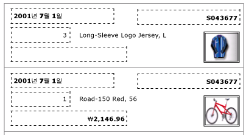
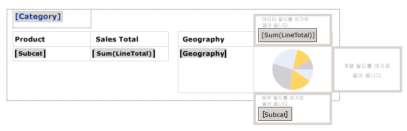
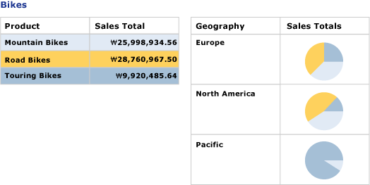

# 목록을 사용하여 송장 및 양식 만들기(보고서 작성기 및 SSRS)
  목록 데이터 영역은 [!INCLUDE[ssRSnoversion](../../includes/ssrsnoversion-md.md)] 페이지를 매긴 보고서 데이터 집합의 각 그룹 또는 행에서 반복됩니다. 목록은 자유 형식 보고서나 송장 등의 양식을 만드는 데 사용하거나 다른 데이터 영역과 함께 사용할 수 있습니다. 여러 보고서 항목을 포함하는 목록을 정의할 수 있습니다. 목록은 중첩된 wit일 수 있습니다.  
  
 목록을 사용하여 빠르게 시작하려면 [자습서: 자유 형식 보고서 만들기&#40;보고서 작성기&#41;](../../reporting-services/tutorial-creating-a-free-form-report-report-builder.md)를 참조하세요.  
  
> [!NOTE]  
>  목록을 보고서와는 별도로 보고서 파트로 게시할 수 있습니다. [보고서 파트(보고서 작성기 및 SSRS)](../../reporting-services/report-design/report-parts-report-builder-and-ssrs.md)에 대해 자세히 알아봅니다.  
  
##   보고서에 목록 추가  
 리본 메뉴의 삽입 탭에서 디자인 화면에 목록을 추가합니다. 기본적으로 초기 목록에는 세부 정보 그룹과 연결된 행의 단일 셀이 포함되어 있습니다.  
  
   
  
 디자인 화면에서 목록을 선택하면 다음 그림과 같이 행 및 열 핸들이 나타납니다.  
  
   
  
 시작 목록은 테이블릭스 데이터 영역을 기반으로 하는 템플릿입니다. 목록을 추가한 후 필터, 정렬 또는 그룹 식을 지정하거나 목록이 보고서 페이지에 표시되는 방법을 변경하여 목록의 콘텐츠나 모양을 변경하는 등 디자인을 계속 향상시킬 수 있습니다. 자세한 내용은 [보고서 페이지에서 테이블릭스 데이터 영역 표시 제어&#40;보고서 작성기 및 SSRS&#41;](../../reporting-services/report-design/controlling-the-tablix-data-region-display-on-a-report-page.md)를 참조하세요. 목록이 단일 행 및 열로 시작하는 경우에도 중첩 또는 인접 행 그룹이나 열 그룹을 추가하거나 정보 행을 더 추가하여 끊임없이 목록 디자인을 개발할 수 있습니다. 자세한 내용은 [테이블릭스 데이터 영역의 유연성 살펴보기&#40;보고서 작성기 및 SSRS&#41;](../../reporting-services/report-design/exploring-the-flexibility-of-a-tablix-data-region-report-builder-and-ssrs.md)를 참조하세요.  
  
  
##   자유 형식 레이아웃으로 데이터 표시  
 보고서 데이터를 표 대신 자유 형식 레이아웃으로 구성하려면 디자인 화면에 목록을 추가합니다. 보고서 데이터 창의 필드를 셀로 끌어옵니다. 기본적으로 셀에는 컨테이너 역할을 수행하는 사각형이 포함되어 있습니다. 원하는 디자인이 될 때까지 컨테이너의 각 필드를 이동합니다. 사각형 컨테이너의 입력란을 끌 때 표시되는 맞춤선을 사용하면 가로 및 세로로 가장자리를 맞추는 데 도움이 됩니다. 셀의 크기를 조정하여 불필요한 공백을 제거합니다 자세한 내용은 [행 높이 또는 열 너비 변경&#40;보고서 작성기 및 SSRS&#41;](../../reporting-services/report-design/change-row-height-or-column-width-report-builder-and-ssrs.md)을 참조하세요.  
  
 다음 그림에서는 Date, Order, Qty, Product, LineTotal 및 이미지 필드를 포함한 주문에 대한 정보를 보여 줍니다.  
  
   
  
 다음 그림과 같이 미리 보기에서 목록에 자유 형식으로 필드 데이터가 반복되어 표시됩니다.  
  
   
  
> [!NOTE]  
>  이 그림에서는 각 필드 값에 대한 자유 형식 레이아웃을 보여 주는 점선이 포함되어 있습니다. 일반적으로 프로덕션 보고서에는 점선을 사용하지 않습니다.  
  
  
##   한 가지 수준의 그룹화를 이용하여 데이터 표시  
 목록에서 컨테이너를 자동으로 제공하므로 목록을 사용하여 그룹화된 데이터를 여러 뷰로 표시할 수 있습니다. 기본 목록을 변경하여 그룹을 지정하려면 세부 정보 그룹을 편집하고, 새 이름을 지정하고, 그룹 식을 지정합니다.  
  
 예를 들어 동일한 데이터 집합에 대해 다양한 뷰를 보여 주는 테이블과 차트를 포함할 수 있습니다. 목록에 그룹을 추가하여 중첩된 보고서 항목이 그룹 값마다 한 번씩 반복되도록 할 수도 있습니다. 다음 그림에서는 제품 범주별로 그룹화된 목록을 보여 줍니다. 정보 행이 없음을 주목하십시오. 목록에서 두 개의 테이블이 함께 중첩되어 있습니다. 첫 번째 테이블에는 총 판매액과 함께 하위 범주가 표시됩니다. 두 번째 테이블에는 하위 범주의 배포를 보여 주는 차트와 함께 지리적 영역을 기준으로 그룹화된 범주가 표시됩니다.  
  
   
  
 미리 보기에서는 테이블에 자전거의 모든 하위 범주에 대한 총 판매액이 표시되며 중첩 테이블에 지리적 영역별 매출액 명세가 표시됩니다. 테이블에 대한 배경색 및 차트에 대한 사용자 지정 색상표를 지정하는 식을 사용하여 첫 번째 테이블에서 차트 색에 대한 범례를 제공할 수도 있습니다.  
  
   
  
  
## 관련 항목:  
 [집계 함수 참조 &#40; 보고서 작성기 및 SSRS &#41;](../../reporting-services/report-design/report-builder-functions-aggregate-functions-reference.md)   
 [식 예 &#40; 보고서 작성기 및 SSRS &#41;](../../reporting-services/report-design/expression-examples-report-builder-and-ssrs.md)  
  
  
